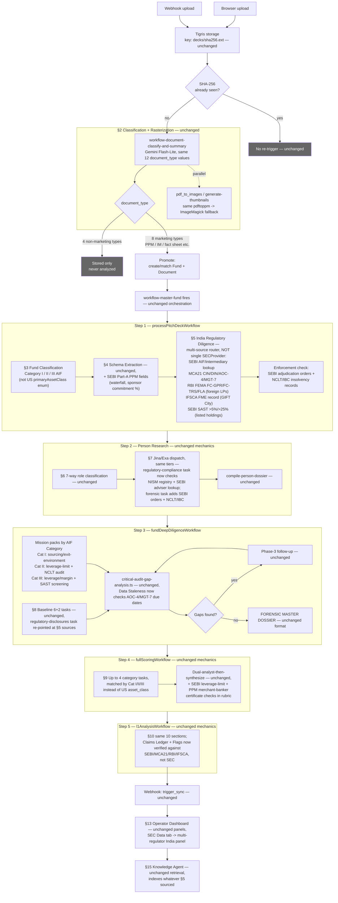
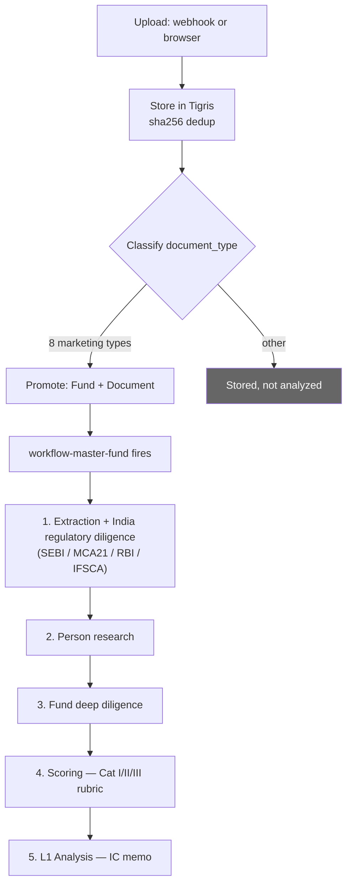
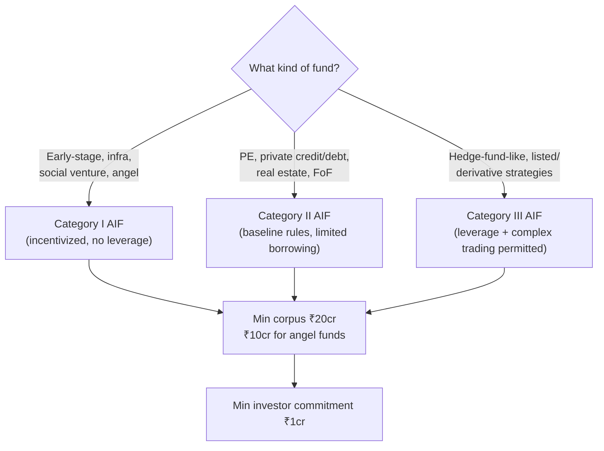
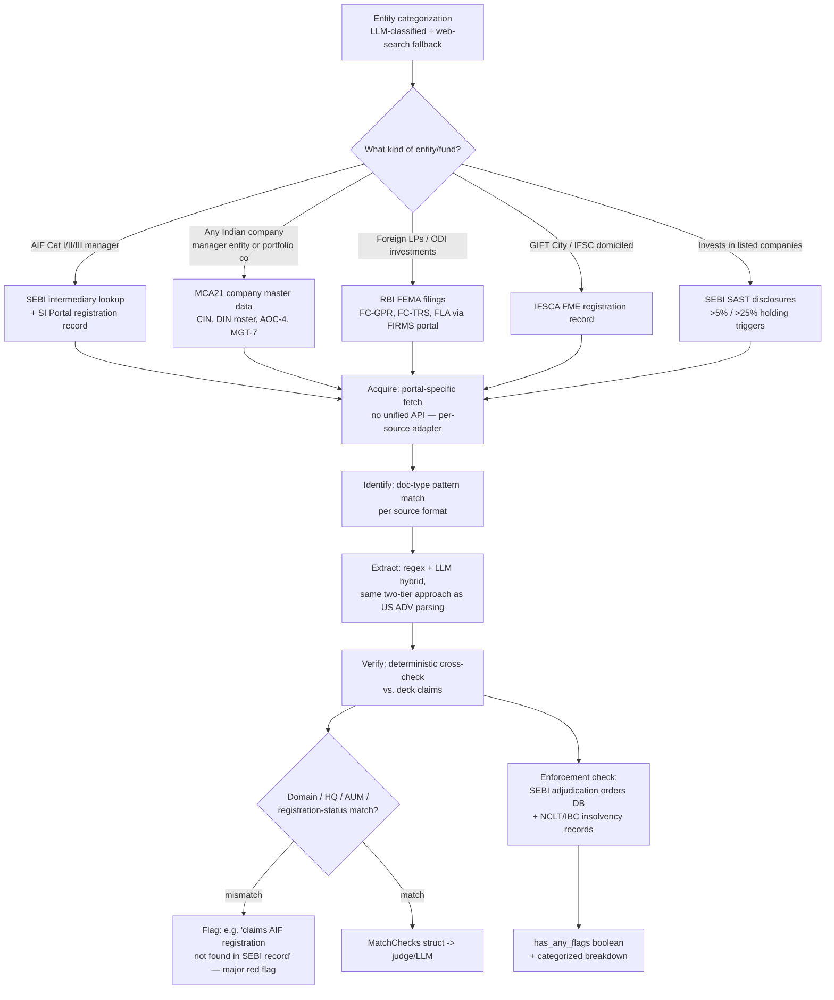
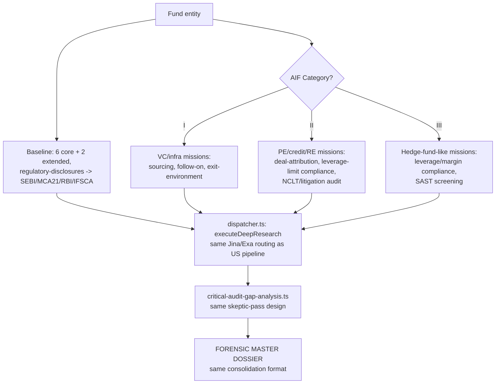
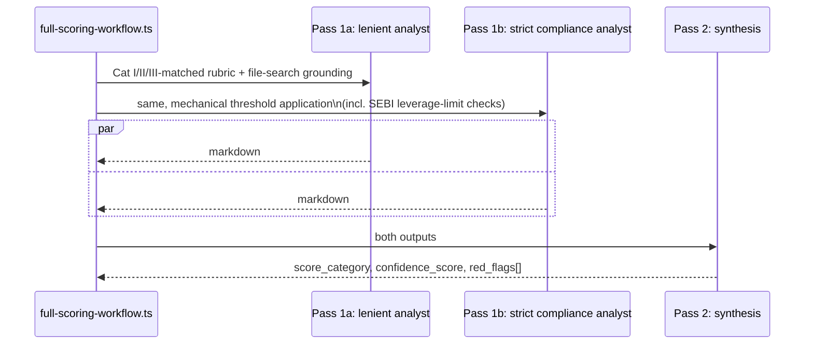
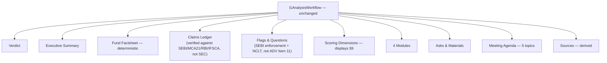
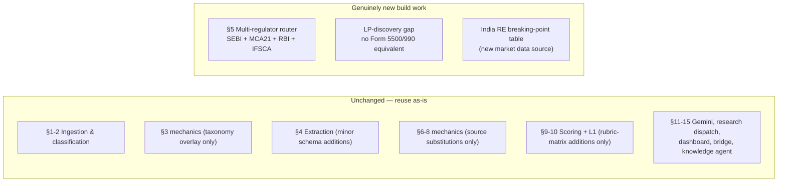

# Deal Analysis Pipeline — India Market Variant (Business Logic Reference)

Companion to [`pipeline-architecture.md`](./pipeline-architecture.md). Same engineering stack (Elixir/Phoenix orchestration, Trigger.dev TypeScript workers, Gemini structured extraction/synthesis, Jina/Exa web research, Tigris storage) and the same decision-logic shape (classify → extract → verify-against-official-record → research → score → memo). The part that genuinely changes for an India-market build is **§5 (regulatory diligence)** and the **public-data sources feeding personnel/LP research (§6-8)** — the US pipeline is built around SEC EDGAR as a single federal filing repository; India has no equivalent single portal. Regulatory truth is fragmented across SEBI, the Ministry of Corporate Affairs (MCA21), RBI/FEMA, and — for GIFT City-domiciled offshore-facing funds — IFSCA. This doc marks every place that fragmentation forces a different acquisition/identification strategy than the US pipeline's single-provider `SECProvider`.

Stack: unchanged from the US variant — Elixir/Phoenix for state and UI, Trigger.dev for the pipeline, Gemini for extraction/synthesis, Jina/Exa for research, Tigris for storage. A `market: "IN" | "US"` flag would gate which regulatory-source adapter and which scoring/mission packs load; everything else (rasterization, extraction schemas, dual-analyst scoring, L1 memo generation) is market-agnostic and reused as-is.

---

## Core Decision Logic — What Changes for India, What Doesn't

**1. Document classification & promotion gate (§1-2)** — **unchanged.** The same 12 `document_type` values and 8-type promotion allowlist apply; an Indian PPM, tear sheet, or fund fact sheet classifies the same way a US one does.

**2. Fund classification (§3)** — **unchanged mechanically**, but the asset-class taxonomy needs an India-specific overlay: SEBI's own fund taxonomy is **Category I / II / III AIF** (Alternative Investment Fund) under the SEBI (AIF) Regulations, 2012, not the US "PE / Hedge Fund / VC / Real Estate / Private Credit" split. A mapping layer is needed: Category I ≈ VC/infra/social-impact/angel funds; Category II ≈ PE, private credit/debt, real estate, funds-of-funds (the "everything else, no leverage beyond limited borrowing" bucket); Category III ≈ hedge-fund-like, listed/derivative strategies, leverage permitted.

**3. Does the deck's story match the official record? (§5 — the section that changes most)**
No single filing plays the role Form ADV plays in the US. Deterministic comparison logic instead cross-checks against **whichever of these applies to the fund's structure**:
- SEBI AIF registration record (category, registration number, sponsor/manager, PPM-on-file) via the SEBI intermediary/recognised-entity lookup
- MCA21 company master data (CIN, registered office, director/DIN roster, incorporation date) for the manager entity and/or portfolio companies
- RBI FEMA filings (FC-GPR/FC-TRS/FLA) if the fund has foreign LPs or makes ODI investments
- IFSCA Fund Management Entity (FME) record if GIFT City-domiciled
- SEBI SAST (Substantial Acquisition of Shares and Takeovers) disclosures for >5%/>25% holdings if the fund invests in listed companies

Mismatch logic mirrors the US pattern conceptually (website/HQ mismatch, AUM tolerance band, "claims private funds but no matching AIF registration found" as a major red flag) but each check now hits a different source depending on structure — see §5 below for the full acquisition strategy.

**4. Disciplinary history** — the single highest-signal US red flag (Form ADV Item 11) maps to **SEBI's public Enforcement/Adjudication Orders database** (`sebi.gov.in/enforcement/orders`) plus, for the manager entity or its promoters, **NCLT/IBC insolvency-proceeding records**. Same design intent (boolean + categorized breakdown), different acquisition path — see §5.

**5. How much scrutiny does each person get? (§6)** — **unchanged mechanically** (7-tier classification, fail-open defaults). The *sources* feeding forensic/regulatory research differ: NISM certification registry and SEBI's own adviser/intermediary lookup substitute for FINRA/CFA-style US credential checks; forensic search adds NCLT/IBC and SEBI adjudication-order search alongside media/litigation search.

**6. What's missing or suspicious? (§8)** — **unchanged design**, skeptic-pass structure identical; "Data Staleness" and "Regulatory/Compliance Nuance" gap categories now check freshness/completeness against MCA21 filing due dates (AOC-4/MGT-7 annual cycle) rather than SEC quarterly cadences.

**7. Score & verdict (§9-10)** — **unchanged.** The 4-category / ~20-criteria rubric, 5-tier scale, VETO conditions, dual-analyst-then-synthesize pattern, and L1 memo structure all carry over untouched. Only the asset-class dimension of the rubric matrix needs Category I/II/III variants alongside (or replacing) the US PE/HF/VC/RE/Credit variants.

## Full Process / Workflow Diagram (Every Stage, End to End)

Same numbered sections as the US doc; boxes marked "unchanged" reuse the existing engineering as-is, boxes marked with a source name are where India-specific acquisition logic replaces the US SEC-only path.

---

## 1. Document Upload & Ingestion

**Unchanged from the US pipeline.** Webhook or browser upload → Tigris storage keyed by SHA-256 → same `ClientUpload` state machine → same promotion gate on the same 8 marketing `document_type` values. India-market decks (PPMs, information memoranda, fund fact sheets) classify identically; nothing about ingestion mechanics is market-specific.

---

## 2. Page Conversion & Document Classification

**Unchanged.** Same two-implementation rasterization (`pdftoppm` → ImageMagick fallback), same two-phase priority rendering, same `workflow-master-fund` orchestration sequence and try/catch-per-step design. No India-specific behavior here — a pitch deck's physical rendering doesn't depend on jurisdiction.

---

## 3. Fund Classification

**Mechanically unchanged** — same mandatory Pass-1 extraction pattern (dedicated schema, high-thinking model, run before other extraction), same forced chain-of-thought reasoning field.

**Taxonomy overlay for India.** In addition to (or instead of) the US `primaryAssetClass` enum, the classification schema should capture SEBI's own category system:

**Corpus/registration parameters** (SEBI AIF Regulations, 2012, as amended): minimum fund corpus ₹20 crore across all categories (₹10 crore for angel funds), minimum per-investor commitment ₹1 crore, SEBI registration fee ₹5 lakh (Cat I) to ₹15 lakh (Cat III) via the SI Portal, registration timeline 4-8 months. The 2026 AIF Amendment Regulations reduced the "large value fund" accredited-investor threshold and introduced the Accredited Investors Only Fund (AIOF) scheme. This taxonomy governs the same downstream gating role the US `primaryAssetClass` plays: which extraction schema fires, which scoring rubric variant applies, which research mission pack runs. [Sources: SEBI AIF Regulations 2012 as amended](https://www.sebi.gov.in/legal/regulations/apr-2026/securities-and-exchange-board-of-india-alternative-investment-funds-regulations-2012-last-amended-on-april-18-2026-_101019.html), [Treelife AIF registration guide](https://treelife.in/finance/sebi-aif-registration/).

---

## 4. Data Extraction from Pitch Decks

**Unchanged.** Same two-step "text-first, structure-second" pattern, same core schemas (`fund_overview_and_terms`, `strategy_and_portfolio`, `team_and_track_record`, `warehoused_deals`), same extract-then-normalize numeric handling. One addition worth scheduling: an India PPM commonly discloses SEBI-mandated fields the US PPM schema doesn't ask for — distribution waterfall in the SEBI Part-A mandatory template format, sponsor/manager commitment percentage (regulatory minimum, not just a deal term), and a merchant-banker due-diligence certificate reference. Extend `fund_overview_and_terms` with these fields rather than treating them as a separate schema.

---

## 5. Regulatory Diligence — the Section That Actually Differs

Unlike the US pipeline's single `SECProvider` hitting one federal API, an India-market build needs a **router across four independent regulators**, each with its own portal, its own document formats, and no unified machine-readable cross-index. This is the architectural core of the India variant.

**Per-source acquisition detail:**

1. **SEBI intermediary / AIF registration.** SEBI publishes a searchable list of recognised intermediaries and registered AIFs; no bulk-download API equivalent to EDGAR's submissions JSON exists publicly, so acquisition is scrape/search-based (Jina web search grounded against `sebi.gov.in`) rather than a clean REST call. Confirms: registration category (I/II/III), registration number, sponsor and manager names, and — for schemes beyond Angel/LVF — whether the PPM was filed through a SEBI-registered Merchant Banker with a due-diligence certificate (a structural signal roughly analogous to "was this fund's ADV filed and is it current").

2. **MCA21 company master data.** Free real-time lookup by CIN or company name at the MCA21 V3 portal returns registration status, registered office, incorporation date, and the director/DIN roster. AOC-4 (audited financials, filed within 30 days of AGM) and MGT-7/MGT-7A (annual return — shareholding structure, director details, filed within 60 days of AGM) are the closest India equivalents to a US ADV's AUM/ownership disclosures, though they report **corporate structure and statutory financials**, not regulatory AUM in the SEC sense. DIR-3 KYC (annual, due Sept 30) is the freshness signal for director records — a DIN that's been auto-deactivated for non-filing is itself a data-staleness/compliance red flag worth surfacing. [Source: MCA ROC filing guide](https://beaconfiling.com/blog/roc-forms-decoded-dir3-inc20a-aoc4-mgt7).

3. **RBI/FEMA filings (foreign-capital funds only).** Form FC-GPR (equity allotment to foreign investors, due within 30 days) and Form FC-TRS (resident↔non-resident transfers, due within 60 days), filed via the RBI's FIRMS portal, plus annual FLA (Foreign Liabilities and Assets) returns. Relevant when a fund's LP base or portfolio-company cap table includes foreign capital — confirms the deck's claimed foreign-investor participation actually cleared FEMA reporting. [Source: RBI Master Circular on Foreign Investment](https://www.rbi.org.in/commonman/english/scripts/Notification.aspx?Id=856).

4. **IFSCA / GIFT City (offshore-facing funds only).** For funds domiciled in GIFT City's International Financial Services Centre, the relevant registration is with IFSCA, not SEBI — Fund Management Entities are tiered Authorised FME / Registered FME (Non-Retail) / Registered FME (Retail) by minimum investor net-worth threshold (USD 75K / 500K / 1M respectively). Confirms the manager's actual regulatory tier matches what the deck claims. [Source: IFSCA fund management brochure](https://ifsca.gov.in/CommonDirect/PreviewPdf?id=38fea9cc5969551d78bf00e670b6d4dd&fileName=Brochure_for_Fund_Management_Activities_20251223_0542.pdf).

5. **SEBI SAST disclosures (portfolio companies only).** If the fund invests in listed Indian companies, >5%/>25% holding-change disclosures under the Takeover Code are the closest analogue to US Schedule 13D/13G — sourced from BSE/NSE corporate-announcement feeds rather than SEBI directly.

6. **Enforcement / disciplinary history.** SEBI's public Adjudication Orders and Enforcement Orders pages (`sebi.gov.in/enforcement/orders`) are searchable by entity name but not bulk-indexed the way SEC's Item 11 data is — acquisition is search-and-match, same pattern as the SEBI intermediary lookup above. For the manager entity and its promoters/directors, NCLT (National Company Law Tribunal) insolvency-proceeding records under the IBC are the equivalent of a US bankruptcy-history check. Both should mechanically set the same `has_any_flags` boolean + categorized breakdown the US pipeline produces from ADV Item 11 — same downstream shape, different upstream sources. [Sources: SEBI enforcement orders](https://www.sebi.gov.in/enforcement/orders.html).

**Match-verification logic** — same deterministic design as the US pipeline's `match-verification.ts` (domain/location/AUM/fund-flag categorical checks feeding a `MatchChecks` struct, no single confidence score), just re-pointed at whichever of the five sources above applies to the fund's structure. The AUM tolerance-band check (`0.4×-2.5×`) carries over unchanged in concept, though "AUM" needs redefining per source — SEBI AIF corpus commitments, MCA21 balance-sheet figures, and RBI FDI-inflow totals are three different numbers that don't reconcile to each other by design, so the check should compare deck claims against whichever figure the relevant source actually reports, not force them into one number.

**No public LP-discovery equivalent to Form 5500/990.** The US pipeline chains SEC Form D → Form 990 (nonprofit LPs) and DOL Form 5500 (pension LPs) to build an LP roster. India has no equivalent public LP-disclosure regime — AIF investor lists are confidential under SEBI regulations. The closest available signal is indirect: EPFO/pension-fund and insurance-company (IRDAI-regulated) participation is only visible when those institutional LPs themselves disclose an AIF investment in their own public filings (e.g. an insurer's investment-portfolio disclosure), not from a fund-side registry. This is a genuine capability gap versus the US pipeline, not just a different data source — worth flagging explicitly to stakeholders rather than papering over with a weaker substitute.

---

## 6. Key Personnel Intelligence

**7-way role taxonomy — unchanged.** Same `key_principal` → `misc` classification, same fail-open defaults (no context → `extended_team`; parse failure → `key_principal`).

**Underlying research taxonomy — source substitutions only:**
- `regulatory-compliance` → checks NISM certification registry (India's mandatory certification for AIF/PMS/IA personnel, roughly analogous to Series 65/CFA in signaling function) and SEBI's own individual-registration lookup, instead of FINRA BrokerCheck/Form U4-U5.
- `forensic-regulatory` → SEBI adjudication-order search by individual name + NCLT/IBC search for personal insolvency/director-disqualification proceedings, instead of SEC/FINRA/CFTC enforcement search.
- `credentials` → CFA/CAIA still apply globally; add NISM Series modules (mandatory for India-registered fund personnel) and ICAI (Chartered Accountant) where relevant to India-specific roles like CFO/compliance officer.
- All other categories (`generic`, `employment-history`, `reputation`, `governance`, `performance`, `oba-conflicts`) — **unchanged**, Jina/Exa web research works the same way regardless of jurisdiction.

**Tiered execution DAG — unchanged structure** (`firm_leader`/`key_person`/`extended_team` depth tiers, same task-count-per-tier design).

---

## 7. People Deep Research

**Unchanged.** Same phase structure (context agents query fund's File Search store → biographical-profile grounding → tiered research dispatch), same provider routing (Jina default, Exa alternate), same two-dossier consolidation pattern. Nothing about how deep-research execution works depends on jurisdiction — only *what* the research tasks search for (§6 above) changes.

---

## 8. Fund Deep Research

**Baseline task set — unchanged** (strategy-thesis, performance-returns, regulatory-disclosures, infrastructure-service-providers, competitive-benchmarking, governance-adverse-media, + 2 extended). The `regulatory-disclosures` task is the one that needs its prompt/grounding re-pointed at §5's India source set (SEBI/MCA21/RBI/IFSCA) instead of SEC EDGAR/IAPD.

**Asset-class mission packs — reframed by AIF category** instead of US PE/Credit/RE:
- **Category I** (VC/infra/angel-tuned): sourcing/pipeline-quality verification, follow-on-reserve discipline, exit-environment analysis (IPO/M&A liquidity for India-domiciled startups), founder-network/reputation checks.
- **Category II** (PE/credit/RE-tuned): same shape as the US PE/Credit/RE mission packs — deal-attribution audit, capital-structure/leverage-limit compliance (Cat II AIFs face borrowing restrictions SEBI enforces directly, a stricter constraint than typical US PE leverage covenants), litigation/NCLT audit, regulatory/SEC-style audit repointed at SEBI+MCA21.
- **Category III** (hedge-fund-like): leverage/margin compliance against SEBI's Cat III leverage caps, market-manipulation/SAST-compliance screening, derivative-strategy verification.

**Dispatch architecture, idempotency, consolidation format — all unchanged.** Same `dispatcher.ts`, same batching limits, same critical-audit-gap-analysis skeptic pass with the same five failure-mode categories (Performance Blind Spots, Structural Omissions, Operational Risk, Regulatory/Compliance Nuance, Data Staleness), same Emerging Manager Protocol trigger.

---

## 9. Scoring & Rubric Analysis

**Architecture, scale, execution pattern — all unchanged.** Same TOML-as-data rubric matrix, same 4 categories (A/B/C/D), same fixed 5-tier scale with VETO conditions, same dual-analyst-then-synthesize 3-call pattern, same up-to-12-Gemini-calls-per-fund cost structure.

**What changes:** the `constraints.asset_class` matching key. Instead of matching against `Private Equity / Hedge Fund / Venture Capital / Real Estate / Private Credit`, an India ruleset matches against `Category I / Category II / Category III` (with sub-tags for VC/infra/angel within Cat I and PE/credit/RE within Cat II, mirroring how the US ruleset already sub-tags Real Estate into 22 sub-classes). New TOML slots worth adding that don't have a clean US analogue:
- A D-category (Operations & Compliance) criterion for **SEBI AIF leverage-limit compliance** — Cat II AIFs are restricted from borrowing except for temporary funding needs (a hard regulatory ceiling, not just a covenant), which functions like the US pipeline's `repe-breaking-points.json` quantitative gate but as a binary compliance check rather than a market-benchmarked range.
- A structural-red-flag criterion for **merchant-banker due-diligence certificate presence** on the PPM — its absence (for schemes required to have one) is a procedural red flag with no US equivalent.

**Quantitative breaking-point tables.** The US pipeline's `repe-breaking-points.json` (DSCR/LTV/IRR cutoffs by RE risk profile × property type) has a real India analogue worth building: India RE PE cutoffs differ meaningfully by market (cap rates, rental yields, and RBI-driven financing costs diverge from US benchmarks), so a parallel `india-repe-breaking-points.json`, refreshed from Indian market data (e.g. Knight Frank/JLL India cap-rate reports, RBI repo-rate-linked financing benchmarks), would need its own periodic-refresh mix task analogous to `mix decode_repe_matrix`.

---

## 10. L1 Analysis (Final Investment Committee Output)

**Entirely unchanged.** Same `L1AnalysisSchema` structure, same 10-section web-document format, same orchestrator (`l1AnalysisWorkflow`), same 14-top-level-agent-invocation fan-out, same dual-analyst-then-synthesize mechanics for Verdict/Executive Summary/Claims Ledger/Flags/Modules, same deterministic Fund Factsheet (zero LLM calls), same derived-from-citations Sources section. The memo template itself is jurisdiction-agnostic; only the underlying Claims Ledger and Flags content reflects India-sourced verification (§5-8) instead of SEC-sourced verification.

---

## 11. Gemini — How Reasoning Is Actually Used

**Entirely unchanged.** All five usage patterns (native structured output, two-step text-then-structure, extract-then-normalize, per-fund File Search grounding, dual-analyst-then-synthesize) are jurisdiction-agnostic and reused as-is. Model tiering is unchanged.

---

## 12. Jina + Exa — How Web Research Is Actually Used

**Dispatch mechanics unchanged** — same internal-KB-first ordering, same provider routing, same cleanup/re-citation pass. The only change is **what domains research tasks are grounded/steered toward**: prompts for `regulatory-disclosures`, `governance-adverse-media`, and forensic-regulatory person tasks should bias search toward `sebi.gov.in`, `mca.gov.in`, `rbi.org.in`, `nclt.gov.in`, and Indian business press (Economic Times, Mint, Moneycontrol, VCCircle) rather than SEC/EDGAR-adjacent US sources. This is a prompt/config change, not an architectural one.

---

## 13. The Fund Dashboard — Sidebar Panels

**Unchanged.** Every panel described in the US doc (Fund Intelligence, Slide Analysis, Workflow Status, Custom Research, Gemini Store, Agent Inspection, Website Extraction, Task Logs, Debug Payload) is UI/ops tooling with no jurisdiction dependency. The one addition worth considering: the **SEC Data tab** (§13 in the base doc, reading §5's output) would need renaming/restructuring to display the multi-source India regulatory panel (SEBI registration status, MCA21 filing history, RBI/FEMA filings if applicable, IFSCA record if applicable, SEBI enforcement search results) instead of a single-source SEC filing viewer — a UI consequence of §5's multi-regulator fragmentation.

---

## 14. The Elixir ↔ Trigger.dev Bridge

**Entirely unchanged.** Same `trigger_dev/client.ex` seam, same large-output S3-redirect handling, same environment-routing/preview-branch logic, same Tigris shared-file-bus design, same realtime polling/SSE mechanics. This layer has no jurisdiction-specific logic at all — it moves data between two runtimes regardless of what regulatory sources fed that data.

---

## 15. Knowledge Agent — Chat With Your Data

**Entirely unchanged.** Same SIRA/GraphRAG/Vector/Lexical/Gemini-File-Search retrieval strategies, same live-correctness gap re: the un-started `RuvectorServer` GenServer. Retrieval architecture has no jurisdiction dependency; it queries whatever knowledge base was built, regardless of which regulators fed it.

---

## Infrastructure Notes (Provisioned, Not Yet Load-Bearing)

Same status as the US doc — FLAME/Hetzner elastic compute (zero call sites) and the bulk research admin tool are both jurisdiction-agnostic infrastructure, unaffected by an India-market build.

---

## Explicitly Out of Scope

Same five directories noted in the base doc (`stitch_investor_dashboard/`, `conductor/`, `experiments/hei_structured_research/`, `priv/native/redb.so`, `priv/resource_snapshots/`) — none are jurisdiction-specific, so the same out-of-scope determination holds for an India-market build.

---

## Cross-Cutting Patterns Worth Noting

Same five patterns as the base doc (extract-then-normalize, dual-analyst-then-synthesize, rubric/task-as-data, file-search-grounding-before-external-search, fail-open-on-ambiguity, idempotency-by-content-hash) — none depend on jurisdiction. One India-specific pattern worth naming explicitly:

- **No single-source-of-truth regulator**: unlike the US pipeline's single `SECProvider` abstraction, an India build genuinely needs a **multi-source router** (§5) because SEBI, MCA21, RBI, and IFSCA each cover a different slice of what one fund needs verified, with no cross-index between them. Any `MatchChecks`-style verification struct for India should carry a `source` field per check (which regulator/registry produced this particular match result) — the US struct doesn't need this because there's only ever one source.

---

## Summary: Build Delta vs. US Pipeline

