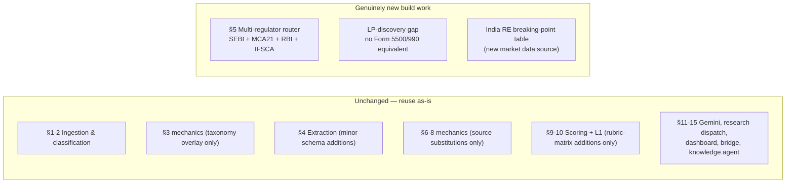

# India Variant — Build Delta vs. US Pipeline

Built from: [obs-india-gaps-and-build-delta](../../10-observations/india-market/obs-india-gaps-and-build-delta.md) and [obs-india-unchanged-components](../../10-observations/india-market/obs-india-unchanged-components.md). **Not a true process** — kept for parity with the US "Infrastructure Status Reference" entry (see [../proc-infrastructure-dormant-out-of-scope.md](../proc-infrastructure-dormant-out-of-scope.md)). This is a reference summary of what's reused as-is vs. genuinely new build work.

## Summary Diagram

## Unchanged Components (Reused As-Is)

Full detail in [obs-india-unchanged-components](../../10-observations/india-market/obs-india-unchanged-components.md); process-map cross-references for each:

| Component | Process map reference |
|---|---|
| Document upload, ingestion, classification, rasterization (§1-2) | [../proc-document-ingestion-classification.md](../proc-document-ingestion-classification.md) |
| People deep research (§7) | [../proc-people-deep-research.md](../proc-people-deep-research.md) |
| Gemini usage patterns (§11) | [../proc-gemini-usage-patterns.md](../proc-gemini-usage-patterns.md) |
| Web research dispatch (§12) | [../proc-web-research-providers.md](../proc-web-research-providers.md) |
| Fund Dashboard UI (§13) | [../proc-fund-dashboard-ui.md](../proc-fund-dashboard-ui.md) — one proposed change: SEC Data tab → multi-regulator India panel |
| Elixir↔Trigger.dev bridge (§14) | [../proc-elixir-trigger-bridge.md](../proc-elixir-trigger-bridge.md) |
| Knowledge Agent chat (§15) | [../proc-knowledge-agent-chat.md](../proc-knowledge-agent-chat.md) |

## Genuinely New Build Work

| Item | Process map | Scope |
|---|---|---|
| §5 Multi-regulator router (SEBI + MCA21 + RBI + IFSCA) | [proc-india-regulatory-diligence](proc-india-regulatory-diligence.md) | Largest new-build item — no unified API across any source |
| LP-discovery gap | [proc-india-regulatory-diligence](proc-india-regulatory-diligence.md) | Confirmed permanent capability gap, not a buildable task |
| India RE breaking-point table (`india-repe-breaking-points.json`) | [proc-india-scoring-rubric](proc-india-scoring-rubric.md) | New market-data source, no vendor contracted yet |

## Small Additions Bundled Inside "Unchanged" Sections

Worth tracking as real (if small) work items — not zero-effort just because their parent section is labeled "unchanged":

- 3 new PPM extraction fields — [proc-india-data-extraction](proc-india-data-extraction.md)
- SEC Data tab → multi-regulator India panel UI restructuring — [../proc-fund-dashboard-ui.md](../proc-fund-dashboard-ui.md)
- 2 new scoring TOML criteria (SEBI leverage-limit compliance, merchant-banker certificate presence) — [proc-india-scoring-rubric](proc-india-scoring-rubric.md)
- AIF Category I/II/III taxonomy mapping layer — [proc-india-fund-classification](proc-india-fund-classification.md)

## New Cross-Cutting Pattern (No US Equivalent)

**No single-source-of-truth regulator.** Unlike the US pipeline's single `SECProvider` abstraction, India genuinely needs a multi-source router because no one regulator covers what one fund needs verified, with no cross-index between sources. Any India `MatchChecks`-style struct needs a `source` field per check — the US struct never needed this since there's only ever one source.

## Known Issues

- This entire variant is speculative/planning-stage documentation — no India-specific codebase exists yet. Treat every "unchanged" claim as design intent, not a verified fact about running code.
- The "unchanged" bucket (12 of 15 US sections) is large, but several sections carry small bundled changes (see above) that shouldn't be mistaken for zero effort.

## Open Questions

- Is there a committed decision to build any part of this variant?
- If greenlit, does build order follow §5 (multi-regulator router) first, since most other India-specific work depends on it?
- Should the confirmed LP-discovery gap be a standing disclaimer in every India-market memo?
