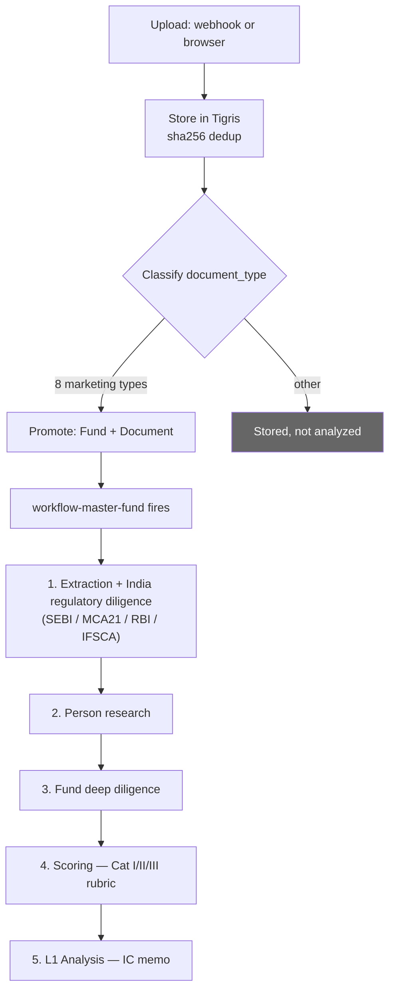
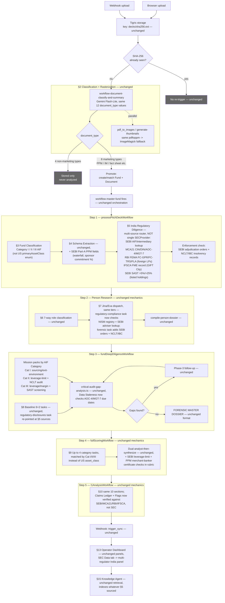

# Process: Deal Analysis Pipeline — India Variant

Built from: [obs-india-overview-and-decision-logic](../../10-observations/india-market/obs-india-overview-and-decision-logic.md) and all `obs-india-*.md` files. Companion to [../proc-deal-analysis-pipeline.md](../proc-deal-analysis-pipeline.md) (US main flow) — same `workflow-master-fund` orchestration shape; boxes below marked "unchanged" reuse that US flow as-is, boxes marked with a source name are where India-specific logic replaces the US SEC-only path.

## Process Overview

- **Name**: Deal Analysis Pipeline, India Variant (`workflow-master-fund`, proposed `market: "IN"` flag)
- **Purpose**: Turn an uploaded India-market fund document (PPM, IM, fact sheet) into a scored, sourced Investment Committee (L1) memo, verified against India's fragmented regulatory record instead of a single US filing repository.
- **Trigger**: Same as US — a document clears the promotion gate.
- **End condition**: Same as US — completion webhook posted, `Document` state flips to `scoring completed`, L1 memo visible in UI.
- **Build status**: **Not yet built.** This process describes proposed design, not a running India-market deployment.

## Roles Involved

- Same as US pipeline — fully automated, no new human role introduced.

## Inputs and Outputs

- **Input**: uploaded India-market fund document (PPM, information memorandum, fact sheet, etc.) — same 12 `document_type` classification, same 8-type promotion allowlist as US.
- **Output**: completed L1 memo + scoring report, same structure as US, but Claims Ledger/Flags verified against SEBI/MCA21/RBI/IFSCA instead of SEC.

## Process Steps

### Flow Diagram — End to End at a Glance

### Flow Diagram — Full Process, Every Stage (India Deltas Marked)

### Main Flow

1. **Upload received & stored.** Same as US — webhook or browser upload, Tigris storage keyed by SHA-256, same `ClientUpload` state machine. → [obs-india-unchanged-components](../../10-observations/india-market/obs-india-unchanged-components.md)
2. **Classify document.** Same as US — one LLM call, same 12 `document_type` values. India PPMs/IMs/fact sheets classify identically to US decks.
3. **Promotion gate (decision point).** Same as US — same 8-type marketing allowlist. Unchanged.
4. **Page rasterization.** Same as US — unchanged, jurisdiction-independent.
5. **`workflow-master-fund` fires.** Same orchestration shape as US, five internal steps:

   5.1. **`processPitchDeckWorkflow`** — internally:
      - 5.1a. **Fund classification (Pass 1).** Mechanically unchanged, but classifies into SEBI AIF Category I/II/III instead of US `primaryAssetClass`. → [proc-india-fund-classification](proc-india-fund-classification.md)
      - 5.1b. **Data extraction.** Unchanged core schemas + proposed additions for SEBI Part-A waterfall fields, sponsor commitment %, merchant-banker certificate reference. → [proc-india-data-extraction](proc-india-data-extraction.md)
      - 5.1c. **India regulatory diligence.** The step that changes most — routes across SEBI, MCA21, RBI/FEMA, and IFSCA instead of a single `SECProvider` call, plus a separate enforcement check (SEBI adjudication orders + NCLT/IBC). → [proc-india-regulatory-diligence](proc-india-regulatory-diligence.md)

   5.2. **Person research.** Mechanically unchanged; 3 of 10 research-task categories re-pointed at India sources (NISM registry, SEBI adviser lookup, NCLT/IBC). → [proc-india-key-personnel-intelligence](proc-india-key-personnel-intelligence.md)

   5.3. **`fundDeepDiligenceWorkflow`.** Baseline unchanged except `regulatory-disclosures` re-pointed at §5's India sources; mission packs reframed by AIF Category (I/II/III) instead of US PE/Credit/RE. → [proc-india-fund-deep-research](proc-india-fund-deep-research.md)

   5.4. **`fullScoringWorkflow`.** Unchanged mechanics; asset-class matching key becomes Cat I/II/III; two new proposed criteria (SEBI leverage-limit compliance, merchant-banker certificate presence). → [proc-india-scoring-rubric](proc-india-scoring-rubric.md)

   5.5. **`l1AnalysisWorkflow`.** Entirely unchanged mechanics and schema; only the Claims Ledger/Flags content reflects India-sourced verification instead of SEC-sourced. → [proc-india-l1-analysis](proc-india-l1-analysis.md)

6. **Completion sync.** Same as US — webhook posts, `Document` state flips, memo visible in UI. Unchanged.
7. **Operator dashboard.** Unchanged panels, except the "SEC Data" tab would need restructuring into a multi-source India regulatory panel. → [obs-india-unchanged-components](../../10-observations/india-market/obs-india-unchanged-components.md)

### Decision Points

- **Step 3 — Promotion gate**: same as US, unchanged.
- **Step 5.1a — AIF category gate**: determines which mission pack (5.3) and scoring rubric variant (5.4) apply for the rest of the run — same gating role as the US asset-class decision.
- **Step 5.1c — Entity/fund-structure routing**: which of the 5 India regulatory sources apply depends on fund structure (AIF manager → SEBI; any Indian company → MCA21; foreign LPs → RBI/FEMA; GIFT City → IFSCA; listed-company holdings → SAST). A single fund can route to multiple sources simultaneously. → [proc-india-regulatory-diligence](proc-india-regulatory-diligence.md)
- **Step 5.3 — Gaps found? (skeptic pass)**: same as US, unchanged — triggers Phase-3 follow-up research.

### Re-processing Path

- Same as US — unchanged. No India-specific re-processing behavior noted in source material.

## Systems and Tools (by step)

| Step | System | India delta |
|---|---|---|
| 1-4 | Same as US | None |
| 5.1a | Fund classification LLM call | Output taxonomy changes to AIF Cat I/II/III |
| 5.1b | Extraction schema pipeline | + 3 proposed PPM fields |
| 5.1c | **New**: multi-regulator router (proposed, not built) | SEBI, MCA21, RBI/FEMA, IFSCA per-source adapters — no unified API exists |
| 5.2 | `personResearchWorkflow`, Jina/Exa dispatch | 3 of 10 task categories re-pointed at NISM/SEBI/NCLT-IBC |
| 5.3 | `fundDeepDiligenceWorkflow` | Mission packs reframed by AIF Category |
| 5.4 | `fullScoringWorkflow` | Asset-class key → Cat I/II/III; 2 new TOML criteria proposed |
| 5.5 | `l1AnalysisWorkflow` | Unchanged mechanics; India-sourced content only |
| 6-7 | Elixir↔Trigger.dev bridge, dashboard | Unchanged except proposed SEC-Data-tab restructuring |

## Known Issues

- **Entire variant is unbuilt.** No India-specific codebase exists yet; this process map describes proposed design pulled from a planning document, not an audited running system.
- **Step 5.1c has no unified API across any of its 4 regulator sources** — the single largest new-build item in the whole variant. See [proc-india-regulatory-diligence](proc-india-regulatory-diligence.md).
- **No LP-discovery process exists for India** (no Form 5500/990 equivalent) — a confirmed permanent capability gap, not a step that's merely unbuilt. See [obs-india-regulatory-diligence](../../10-observations/india-market/obs-india-regulatory-diligence.md).
- Same US wiring gaps (scoring not receiving `ddResult`; L1 not receiving `consolidatedKnowledge`/`scoreResult`) are inherited as-is since the orchestration layer is unchanged — see [proc-deal-analysis-pipeline](../proc-deal-analysis-pipeline.md) Known Issues.

## Open Questions

- Is there a committed decision to build this variant, and if so what's the proposed build order? (Step 5.1c's multi-regulator router has no internal dependency on 5.2-5.5, so it could be built and validated in isolation first.)
- Has any part of this flow been tested end-to-end against a real Indian pitch deck?
- How should the confirmed LP-discovery gap be surfaced to the Investment Committee in the final memo?
