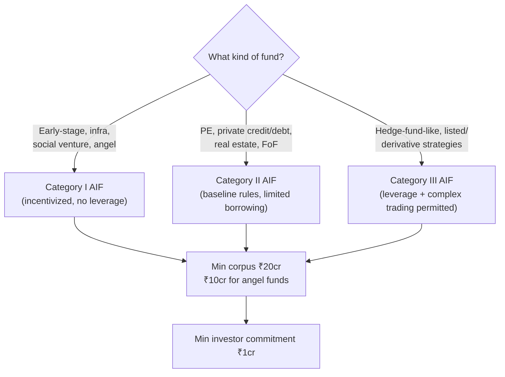

# Process: Fund Classification — India AIF Taxonomy

Built from: [obs-india-fund-classification-taxonomy](../../10-observations/india-market/obs-india-fund-classification-taxonomy.md). Sub-process of step 5.1a in [proc-india-deal-analysis-pipeline](proc-india-deal-analysis-pipeline.md). Companion to [../proc-fund-classification.md](../proc-fund-classification.md) (US Pass-1 classification).

## Process Overview

- **Purpose**: Classify a fund into SEBI's AIF Category I/II/III system in place of (or alongside) the US `primaryAssetClass` enum, so the same downstream gating logic (extraction schema, scoring rubric, mission pack) can operate on India-market funds.
- **Trigger**: Same as US — mandatory Pass-1 extraction, run before all other extraction.
- **End condition**: Fund assigned one of three AIF categories, gating extraction/scoring/research selections downstream.

## Roles Involved

- Fully automated, same as US.

## Inputs and Outputs

- **Input**: Same mechanism as US — dedicated schema, high-thinking model, forced chain-of-thought reasoning field, run over the full PDF.
- **Output**: One of Category I / II / III AIF classification, plus (unresolved) sub-tags for internal strategy type.

## Process Steps

### Flow Diagram — Category Decision

### Main Flow

1. Fund's PDF processed through the same mandatory Pass-1 extraction pattern as US — dedicated schema, high-thinking model, before any other extraction runs.
2. **Category decision (decision point)** — three-way classification:
   - Early-stage / infra / social-venture / angel → **Category I AIF** (no leverage permitted).
   - PE / private credit-debt / real estate / fund-of-funds → **Category II AIF** (baseline rules, limited borrowing only).
   - Hedge-fund-like / listed / derivative strategies → **Category III AIF** (leverage + complex trading permitted).
3. Registration/corpus facts recorded (regulatory context, not a pipeline gate): minimum fund corpus ₹20 crore (₹10 crore for angel funds), minimum per-investor commitment ₹1 crore, SEBI registration fee ₹5-15 lakh by category, 4-8 month registration timeline.
4. Classification result gates: which extraction schema fires (proc-india-data-extraction), which scoring rubric variant applies (proc-india-scoring-rubric), which research mission pack runs (proc-india-fund-deep-research) — same downstream gating role as the US `primaryAssetClass` decision.

### Decision Points

- **Step 2 — AIF category assignment**: determines every later stage's schema/rubric/mission-pack choice, mirroring the US `primaryAssetClass` gate.

## Systems and Tools

- Same extraction mechanism as US Pass-1 classification (see [proc-fund-classification](../proc-fund-classification.md)).
- Proposed schema field: AIF category, alongside or replacing `primaryAssetClass` for India-market funds — not yet built.

## Known Issues

- **No mapping layer exists yet.** Category II in particular bundles four distinct US asset classes (PE, private credit, real estate, fund-of-funds) into one bucket — the source doc proposes this mapping but it isn't reconciled into a schema.
- Adds a fourth overlapping taxonomy on top of the three the US pipeline already has unreconciled (see [obs-fund-classification](../../10-observations/obs-fund-classification.md)), unless explicitly designed against them together.

## Open Questions

- Should AIF category *replace* `primaryAssetClass` for India-market funds, or run as a parallel field on the same fund record?
- How should Category II's internal sub-types be captured for downstream mission-pack/rubric matching — as free sub-tags, or a formal secondary enum?
