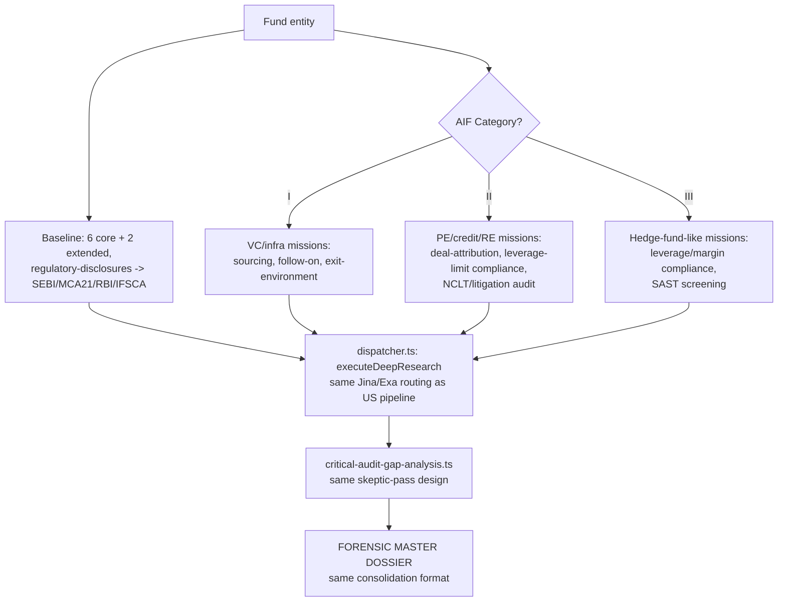

# Process: Fund Deep Research — India AIF Category Mission Packs

Built from: [obs-india-fund-deep-research-mission-packs](../../10-observations/india-market/obs-india-fund-deep-research-mission-packs.md). Sub-process of step 5.3 in [proc-india-deal-analysis-pipeline](proc-india-deal-analysis-pipeline.md). Companion to [../proc-fund-deep-research.md](../proc-fund-deep-research.md) (US baseline + PE/Credit/RE mission packs).

## Process Overview

- **Purpose**: Research the fund itself using the same baseline + gap-analysis design as US, with mission packs reframed by AIF Category (I/II/III) instead of US PE/Credit/RE.
- **Trigger**: Same as US — `fundDeepDiligenceWorkflow` starts, skips re-running regulatory diligence (already done in step 5.1c).
- **End condition**: Same as US — "FORENSIC MASTER DOSSIER" markdown synced to Tigris + Gemini File Search.

## Roles Involved

- Fully automated, same as US.

## Inputs and Outputs

- **Input**: Fund entity, AIF Category (from step 5.1a), same baseline task set as US.
- **Output**: Same FORENSIC MASTER DOSSIER format as US; same gap-analysis output fields (`redFlagsDetected[]`, `caseNumbers[]`, `tier2ServiceProviders[]`, `missingDataForWebSearch[]`).

## Process Steps

### Flow Diagram

### Main Flow

1. **Baseline task set** (6 core + 2 extended) — unchanged from US, except `regulatory-disclosures` re-pointed at India's SEBI/MCA21/RBI/IFSCA sources instead of SEC EDGAR/IAPD.
2. **Mission pack selected by AIF Category (decision point):**
   - **Category I** (VC/infra/angel-tuned): sourcing/pipeline-quality verification, follow-on-reserve discipline, exit-environment analysis (IPO/M&A liquidity for India-domiciled startups), founder-network/reputation checks.
   - **Category II** (PE/credit/RE-tuned, same shape as US PE/Credit/RE packs): deal-attribution audit, capital-structure/leverage-limit compliance (Cat II AIFs face SEBI-enforced borrowing restrictions — stricter than typical US PE leverage covenants), litigation/NCLT audit, regulatory audit repointed at SEBI+MCA21.
   - **Category III** (hedge-fund-like): leverage/margin compliance against SEBI Cat III leverage caps, market-manipulation/SAST-compliance screening, derivative-strategy verification.
3. Each task routed via `dispatcher.ts` (`executeDeepResearch`) — same Jina/Exa routing mechanics as US. **Unchanged.**
4. **Critical Audit Gap Analysis** — same skeptic-pass design as US, same 5 failure-mode categories. **Only change**: "Data Staleness" and "Regulatory/Compliance Nuance" now check freshness against MCA21 filing due dates (AOC-4/MGT-7 annual cycle) instead of SEC quarterly cadences.
5. Consolidation into FORENSIC MASTER DOSSIER — same format, same sync-back mechanics (`sync-research-responses.ts`) as US. **Unchanged.**
6. Process rejoins main flow at step 5.4 (scoring) — same downstream wiring-gap risk as US inherited unchanged.

### Decision Points

- **Step 2 — AIF Category gate**: determines mission pack, same gating role as US asset-class decision.
- **Step 4 — Gaps found?**: same as US, triggers Phase-3 follow-up research re-entering the batch.

## Systems and Tools

- Same `fund-deep-diligence.ts`, `dispatcher.ts`, `critical-audit-gap-analysis.ts`, `consolidateFundTask`, `sync-research-responses.ts` as US — all mechanically unchanged.

## Known Issues

- Category II's leverage-limit compliance check is a **hard regulatory ceiling**, not a negotiated covenant like typical US PE leverage terms — the mission-pack prompt needs to reflect this as a binary compliance check, not just relabel the US covenant-style check.
- No detail given on whether Category II mission packs should split by sub-strategy (mirroring US PE/Credit/RE 3-way split) or run as one merged Cat II pack.

## Open Questions

- Should Category II mission packs be split by sub-strategy, or unified?
- Is there a defined, programmatically-checkable SEBI Cat III leverage cap, or is this a qualitative rubric-text check only (same as US VETO conditions)?
