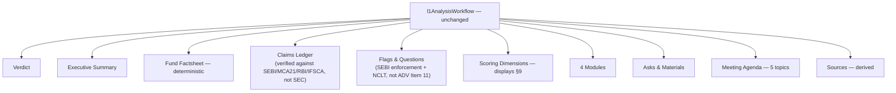

# Process: L1 Analysis — India-Sourced Verification

Built from: [obs-india-unchanged-components](../../10-observations/india-market/obs-india-unchanged-components.md) §10. Sub-process of step 5.5 in [proc-india-deal-analysis-pipeline](proc-india-deal-analysis-pipeline.md). Companion to [../proc-l1-analysis.md](../proc-l1-analysis.md) (US 10-section memo generation — full mechanics apply unchanged here).

## Process Overview

- **Purpose**: Generate the same 10-section Investment Committee memo as US, with Claims Ledger and Flags content verified against India regulatory sources instead of SEC.
- **Trigger**: Same as US — `master-workflow.ts` Step 5 calls `l1AnalysisWorkflow.triggerAndWait`.
- **End condition**: Same as US — `L1AnalysisSchema` JSON complete, rendered as Phoenix LiveView web document.

## Roles Involved

- Fully automated generation, same as US. Investment Committee reads the finished memo (outside this process).

## Inputs and Outputs

- **Input**: Same as US — fund's Gemini File Search store, same component TOML definitions. The store now contains India-sourced regulatory/research data (SEBI/MCA21/RBI/IFSCA) instead of SEC-sourced data.
- **Output**: Same `L1AnalysisSchema`, 10 anchored sections — structure entirely unchanged.

## Process Steps

### Flow Diagram

### Main Flow

Identical orchestration to US ([proc-l1-analysis](../proc-l1-analysis.md) steps 1-8) — same `l1AnalysisWorkflow`, same 14 top-level agent invocations, same deterministic Fund Factsheet, same displayed-not-generated Scoring Dimensions section, same derived Sources section. The **only** content-level change:

- **Claims Ledger** — falsifiable claims verified against SEBI/MCA21/RBI/IFSCA records (per step 5.1c) instead of SEC filings.
- **Flags & Questions** — disciplinary/enforcement flags sourced from SEBI adjudication orders + NCLT/IBC instead of ADV Item 11.

Every other section (Verdict, Executive Summary, Fund Factsheet, Scoring Dimensions, Modules, Asks, Meeting Agenda, Sources) generates identically to US, since the memo template itself is jurisdiction-agnostic.

## Systems and Tools

- Identical to US — see [proc-l1-analysis](../proc-l1-analysis.md) Systems and Tools.

## Known Issues

- Inherits the same confirmed US wiring gap (`master-workflow.ts` Step 5 doesn't pass `consolidatedKnowledge`/`scoreResult`) unchanged — since orchestration code is asserted unchanged, this gap applies identically to India-market runs. See [proc-l1-analysis](../proc-l1-analysis.md) Known Issues.
- If the LP-discovery gap (see [proc-india-regulatory-diligence](proc-india-regulatory-diligence.md)) isn't explicitly surfaced somewhere in this memo, an India-market L1 memo could silently omit LP-roster context that a US memo would include — worth a deliberate design decision, not a silent gap.

## Open Questions

- Should a standing disclaimer about the LP-discovery gap appear in every India-market memo's Claims Ledger or Sources section?
- Does the India variant inherit the US `consolidatedKnowledge`/`scoreResult` wiring-gap fix automatically once it ships for the US pipeline, given the orchestration code is shared?
