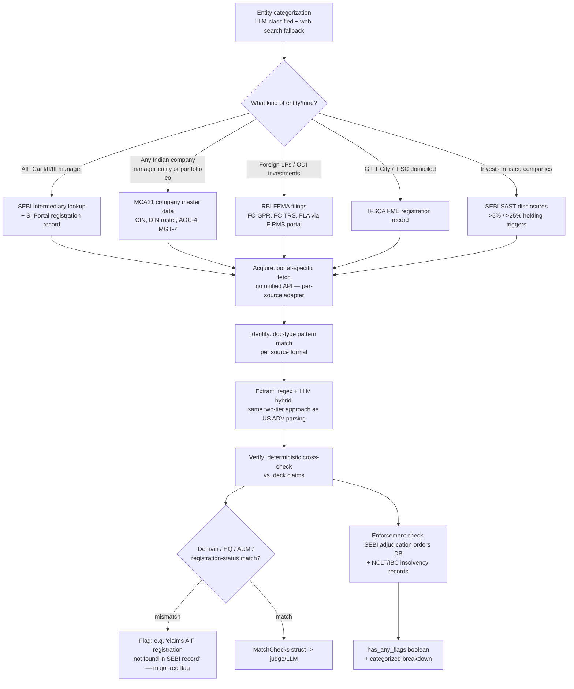

# Process: Regulatory Diligence — India Multi-Regulator Router

Built from: [obs-india-regulatory-diligence](../../10-observations/india-market/obs-india-regulatory-diligence.md). Sub-process of step 5.1c in [proc-india-deal-analysis-pipeline](proc-india-deal-analysis-pipeline.md), the process that changes most vs. the US pipeline. Companion to [../proc-sec-filing-diligence.md](../proc-sec-filing-diligence.md) (US single-source `SECProvider` flow).

## Process Overview

- **Purpose**: Acquire a fund/manager's official regulatory record and deterministically cross-check it against pitch-deck claims — same design intent as US SEC diligence, but routed across four independent regulators since no India equivalent of SEC EDGAR exists.
- **Trigger**: Runs within `processPitchDeckWorkflow`, after fund/entity identity is available from extraction (same trigger point as US).
- **End condition**: `MatchChecks`-shaped struct produced (with a proposed `source` field per check), plus a separate enforcement-check output (`has_any_flags` boolean + categorized breakdown).
- **Build status**: **Not built.** Single largest new-engineering item in the India variant.

## Roles Involved

- Fully automated, proposed — no human role in the routing/acquisition itself.

## Inputs and Outputs

- **Input**: Fund/manager identity and structural signals from deck extraction (AIF category, foreign-LP presence, GIFT City domicile, listed-company holdings — these determine which source(s) apply).
- **Output**: Per-source extracted fields, `MatchChecks`-equivalent struct, enforcement-check output.

## Process Steps

### Flow Diagram

### Main Flow

1. **Entity categorization.** LLM-classified, web-search fallback (same pattern as US step 1).
2. **Source routing (decision point)** — a fund can route to multiple sources at once based on structure:
   - AIF Cat I/II/III manager → **SEBI** intermediary lookup + SI Portal registration record.
   - Any Indian company (manager entity or portfolio company) → **MCA21** company master data (CIN, DIN roster, AOC-4, MGT-7).
   - Foreign LPs / ODI investments → **RBI FEMA** filings (FC-GPR, FC-TRS, FLA via FIRMS portal).
   - GIFT City / IFSC domiciled → **IFSCA** FME registration record.
   - Invests in listed companies → **SEBI SAST** disclosures (>5%/>25% holding triggers).
3. **Acquisition** — portal-specific fetch per source. **No unified API exists** across any of the four regulators (unlike US EDGAR's single submissions JSON); SEBI and enforcement-order acquisition specifically require Jina web-search-and-match against `sebi.gov.in`.
4. **Identification** — doc-type pattern match, per source format (same two-tier deterministic-first design as US).
5. **Extraction** — regex + LLM hybrid, same two-tier approach as US ADV parsing.
6. **Verify** — deterministic cross-check vs. deck claims (domain/HQ/AUM/registration-status).
   - **If match** → `MatchChecks` struct (with proposed `source` field per check) handed to judge/LLM upstream.
   - **If mismatch** → flagged, e.g. "claims AIF registration not found in SEBI record" — called out as a major red flag, same design intent as the US fund-flag mismatch.
7. **Enforcement check** (parallel branch, same trigger point as step 6): SEBI adjudication-orders database search + NCLT/IBC insolvency-proceeding records → `has_any_flags` boolean + categorized breakdown, same output shape as US ADV Item 11.
8. Result feeds step 5.3 (fund deep diligence) and eventually scoring (step 5.4) — same downstream wiring pattern as US, including the same class of wiring-gap risk if not explicitly connected.

**Per-source acquisition detail** (see [obs-india-regulatory-diligence](../../10-observations/india-market/obs-india-regulatory-diligence.md) for full mechanics per source):
- SEBI intermediary/AIF registration — scrape/search-based, confirms category/registration number/sponsor-manager names/merchant-banker certificate presence.
- MCA21 — free real-time CIN/company-name lookup; AOC-4/MGT-7 report corporate structure and statutory financials, not SEC-style regulatory AUM.
- RBI/FEMA — FC-GPR (30-day window), FC-TRS (60-day window), annual FLA returns.
- IFSCA — FME tier lookup (GIFT City only).
- SEBI SAST — sourced from BSE/NSE feeds, not SEBI directly.

### Decision Points

- **Step 2 — source routing**: determined by fund structure, not mutually exclusive (a fund can hit multiple sources).
- **Step 6 — match/mismatch**: same branching logic as US, different underlying sources per structure.

### Genuine Capability Gap (Not a Process Step)

**No LP-discovery process exists for India.** The US pipeline chains Form D → Form 990/5500 to build an LP roster; AIF investor lists are confidential under SEBI regulations, and no public equivalent exists. The only indirect signal — EPFO/pension-fund/IRDAI-insurer disclosures of their own AIF holdings — is not a fund-side process and isn't modeled as a pipeline step here. Flagged explicitly as a permanent gap, not a missing step to eventually build.

## Systems and Tools

- Proposed per-source adapters: SEBI (scrape/search), MCA21 (real-time API lookup), RBI FIRMS portal, IFSCA registry, BSE/NSE SAST feeds. **None built yet.**
- Same `match-verification.ts`-equivalent deterministic logic as US, re-pointed per source, plus a new `source` field on the `MatchChecks` struct that the US version never needed.

## Known Issues

- **No unified API across any of the four regulators** — every acquisition path is a per-source adapter, several scrape/search-based. Confirmed as the single largest new-build item in the entire variant.
- **AUM does not reconcile across sources by design** — SEBI AIF corpus, MCA21 balance-sheet figures, and RBI FDI-inflow totals are three different numbers; verification must compare against whichever figure the relevant source reports, not force one number.
- **Enforcement/adjudication data is not bulk-indexed** — same search-and-match acquisition burden as SEBI registration lookup; entity-name-matching quality directly determines whether disciplinary history is found.
- **Confirmed permanent capability gap**: no LP-discovery equivalent — see above.

## Open Questions

- Which of the five source adapters would be built first — is Cat II (PE/credit/RE, closest to US-familiar territory) the natural first target?
- Is there an existing third-party data vendor aggregating SEBI+MCA21+RBI+IFSCA data, avoiding five separate in-house scrapers?
- How should the LP-discovery gap be surfaced in the final memo — dedicated disclaimer, or silent omission of the section?
