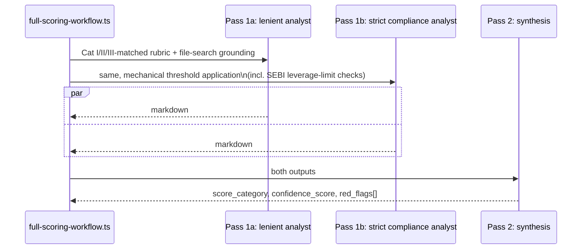

# Process: Scoring & Rubric — India New Criteria

Built from: [obs-india-scoring-rubric](../../10-observations/india-market/obs-india-scoring-rubric.md). Sub-process of step 5.4 in [proc-india-deal-analysis-pipeline](proc-india-deal-analysis-pipeline.md). Companion to [../proc-scoring-rubric.md](../proc-scoring-rubric.md) (US dual-analyst scoring engine).

## Process Overview

- **Purpose**: Score India funds using the same architecture as US, matched against AIF Category (I/II/III) instead of the US asset-class enum, plus two proposed new criteria with no US analogue.
- **Trigger**: Same as US — `fullScoringWorkflow` runs after fund deep research completes.
- **End condition**: Same as US — per-category markdown reports uploaded, POSTed to `/api/webhooks/score_sync`.

## Roles Involved

- Fully automated, same as US.

## Inputs and Outputs

- **Input**: Fund's AIF Category (I/II/III, with sub-tags), same ~57-file rubric matrix pattern as US, extended with proposed new criteria.
- **Output**: Same categorical scoring output as US (5-tier scale, no numeric roll-up), plus outputs from 2 new proposed criteria.

## Process Steps

### Flow Diagram — Dual-Analyst-Then-Synthesize (per category, unchanged mechanism)

### Main Flow

1. Same 57-file TOML rubric-matrix pattern, same 4 categories (A/B/C/D), same fixed 5-tier scale with VETO conditions, same dual-analyst-then-synthesize 3-call pattern, same up-to-12-calls-per-fund cost — all **mechanically unchanged** from US.
2. **Asset-class matching key changes (decision point)**: matches against Category I/II/III (with sub-tags for VC/infra/angel within Cat I, PE/credit/RE within Cat II) instead of US `Private Equity/Hedge Fund/Venture Capital/Real Estate/Private Credit` — mirrors how the US ruleset already sub-tags Real Estate into 22 sub-classes.
3. **Two new proposed TOML criteria, no clean US equivalent:**
   - New D-category (Operations & Compliance) criterion — **SEBI AIF leverage-limit compliance**. Cat II AIFs are restricted from borrowing except for temporary funding needs — a hard regulatory ceiling. Functions like the US `repe-breaking-points.json` quantitative gate, but as a **binary compliance check**, not a market-benchmarked range.
   - New structural-red-flag criterion — **merchant-banker due-diligence certificate presence** on the PPM. Its absence (for schemes required to have one) is a procedural red flag with no US equivalent.
4. Same dual-analyst execution as US per category (Pass 1a lenient + Pass 1b strict compliance, in parallel, then Pass 2 synthesis).
5. **Proposed quantitative table**: `india-repe-breaking-points.json`, a parallel to US `repe-breaking-points.json` for Real Estate PE — India RE cutoffs (cap rates, rental yields, RBI-driven financing costs) differ meaningfully from US benchmarks. Would need its own periodic-refresh task analogous to `mix decode_repe_matrix`. **Not yet built.**
6. Process rejoins main flow at step 5.5 (L1 memo) — same downstream wiring-gap risk as US inherited unchanged.

### Decision Points

- **Step 2 — Cat I/II/III matching**: gates which of the ~57 rubric files apply, same role as US asset-class matching.
- **Step 3 — SEBI leverage-limit check**: binary compliant/non-compliant, not a graded tier — needs confirmation the scoring schema supports this criterion type.

## Systems and Tools

- Same `full-scoring-workflow.ts`/`score-category-agent.ts` mechanism as US — unchanged.
- Proposed: `india-repe-breaking-points.json` + refresh task — not built.

## Known Issues

- `constraints.asset_class` matching key needs new Cat I/II/III values across ~57 rubric files — a real TOML-content-authoring effort, not a code change, but not yet done.
- No India market-data source contracted for `india-repe-breaking-points.json` — candidate sources named (Knight Frank/JLL India, RBI repo-rate benchmarks) but unconfirmed.
- Unclear whether the existing scoring schema natively supports a binary compliance criterion (SEBI leverage-limit check) vs. the existing 5-tier graded scale.

## Open Questions

- Does the scoring schema need structural changes to support a binary-compliance criterion type, or can it be shoehorned into the existing 5-tier scale (e.g., binary → Exemplary/Unacceptable only)?
- Who would own building/refreshing `india-repe-breaking-points.json`, and is India RE PE even in initial scope?
- Should the merchant-banker certificate check apply to all AIF categories, or only specific schemes?
