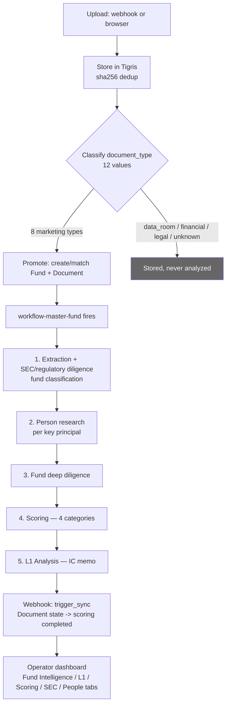
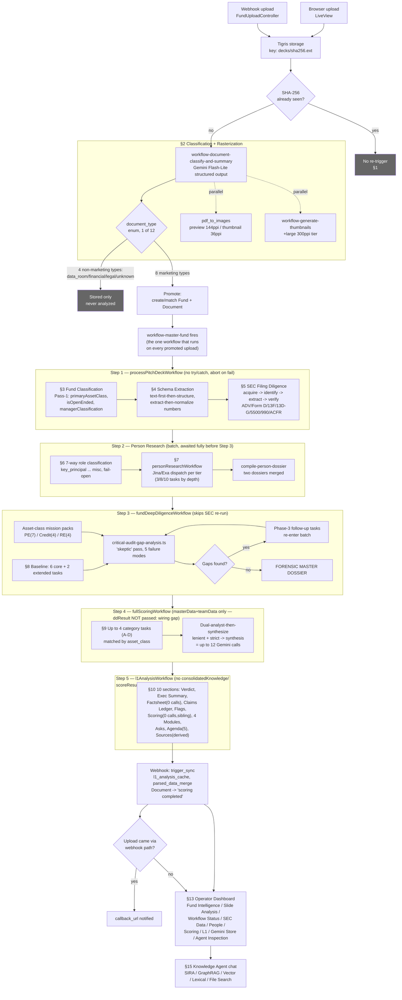
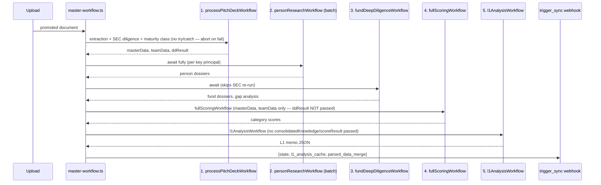

# Process: Deal Analysis Pipeline — Upload to IC Memo

Built from: all `10-observations/obs-*.md` files, themselves sourced from `00-inbox/pipeline-architecture.md`.

## Process Overview

- **Name**: Deal Analysis Pipeline (`workflow-master-fund`)
- **Purpose**: Turn an uploaded fund marketing document into a scored, sourced Investment Committee (L1) memo.
- **Trigger**: A document clears the promotion gate (§ Step 2 below).
- **End condition**: `workflow-master-fund` posts completion webhook; `Document` state flips to `scoring completed`; L1 memo visible in UI.
- **Duration**: up to 4h max duration allowed for the full run (per-step timings mostly `[UNKNOWN]`, see observations).

## Roles Involved

- **Uploader** — external system (webhook) or human (browser upload). No further role in the automated flow.
- **Pipeline** — fully automated; every step below runs without human review until the memo reaches the Investment Committee.
- **Operator** — reviews progress, debugs failures, or asks ad hoc questions via the Fund Dashboard (see [obs-fund-dashboard-ui](../10-observations/obs-fund-dashboard-ui.md)) and Knowledge Agent chat (see [obs-knowledge-agent-chat](../10-observations/obs-knowledge-agent-chat.md)). Not part of the main flow — parallel/supporting.
- **Investment Committee** — the eventual human reader of the finished L1 memo. Outside this process.

## Inputs and Outputs

- **Input**: uploaded file (pitch deck, tear sheet, fact sheet, fund overview, investor presentation, PPM, marketing flyer, or quarterly report).
- **Output**: completed L1 Analysis memo (10-section web document) + completed scoring report, both visible in the Fund Dashboard.

## Process Steps

### Flow Diagram — End to End at a Glance

### Flow Diagram — Full Process, Every Stage

### Main Flow

1. **Upload received.** Webhook (`FundUploadController.upload/2`) or direct browser upload via LiveView. → [obs-document-ingestion-classification](../10-observations/obs-document-ingestion-classification.md)
2. **Store & dedup.** File written to Tigris at `decks/<sha256>.<ext>`. SHA-256 doubles as DB lookup key. Identical bytes never re-processed.
3. **Classify document.** One LLM call (Gemini Flash-Lite) returns `document_type` (12 possible values) + `fund_name`, `company_name`, `key_principals[]`, `summary`, `fund_classification`, `asset_class`, `sector`. Opens a per-fund Gemini File Search store.
4. **Promotion gate (decision point).**
   - **If `document_type` in {`pitch_deck, tear_sheet, fact_sheet, fund_overview, investor_presentation, ppm, marketing_flyer, quarterly_report`}:** document is "promoted" — `Fund` record created/matched by `fund_name`, `Document` record created. Go to step 5.
   - **If `document_type` in {`data_room_document, financial_statement, legal_document, unknown`}:** file is stored but **never analyzed**. Process ends here for this document.
5. **Page rasterization** (runs in parallel with steps above, not blocking). Two-phase priority: page-1 thumbnail at priority 10 (fast preview), full deck at priority 0 (background). Fallback to ImageMagick if `pdftoppm` fails on a page.
6. **`workflow-master-fund` fires.** The one workflow that runs, unconditionally, on every promoted document. Five internal steps, each wrapped in try/catch **except step 6.1**, which aborts the entire run on failure: → [obs-document-ingestion-classification](../10-observations/obs-document-ingestion-classification.md)

   6.1. **`processPitchDeckWorkflow`** — schema/entity extraction, SEC-entity resolution (run once here so later diligence steps skip it), fund-maturity classification. Internally:
      - 6.1a. **Fund classification (Pass 1).** One LLM call decides `primaryAssetClass`, `isOpenEnded`, `managerClassification`. Gates every later stage's schema/rubric/mission-pack choice. → [obs-fund-classification](../10-observations/obs-fund-classification.md)
      - 6.1b. **Data extraction.** Core schemas (every asset class) + asset-class-specific schemas (gated by 6.1a), each via two-step "text-first-then-structure" pattern, consolidated into `consolidatedKnowledge` → `master_data`. → [obs-data-extraction](../10-observations/obs-data-extraction.md)
      - 6.1c. **SEC filing diligence.** Entity categorization → EDGAR acquisition → deterministic identification → type-specific extraction → deterministic match-verification against deck claims (domain/location/AUM/fund-flag). → [obs-sec-filing-diligence](../10-observations/obs-sec-filing-diligence.md)

   6.2. **Person research**, batch-triggered via `personResearchWorkflow` — **skipped entirely if no principals were found in step 6.1.**
      - 6.2a. **Key personnel classification.** Every named team member classified into 1 of 7 role tiers, which sets research depth (3/8/10 tasks). → [obs-key-personnel-intelligence](../10-observations/obs-key-personnel-intelligence.md)
      - 6.2b. **People deep research.** Per-person, per-tier research across 10 categories, consolidated into a merged dossier. → [obs-people-deep-research](../10-observations/obs-people-deep-research.md)

   6.3. **`fundDeepDiligenceWorkflow`** — explicitly skips re-running SEC diligence (already done in 6.1c). Baseline task set + asset-class mission packs, followed by automated gap-analysis "skeptic" pass that can trigger a second round of targeted research. → [obs-fund-deep-research](../10-observations/obs-fund-deep-research.md)

   6.4. **`fullScoringWorkflow`** — ~20 criteria across 4 categories (asset-class-varying), dual-analyst-then-synthesize pattern (up to 12 Gemini calls/fund), 5-tier scale, `Unacceptable` can trigger automatic VETO. → [obs-scoring-rubric](../10-observations/obs-scoring-rubric.md)

   6.5. **`l1AnalysisWorkflow`** — final IC memo, 10 sections, 14 top-level agent invocations (~30+ raw LLM requests). → [obs-l1-analysis](../10-observations/obs-l1-analysis.md)

7. **Completion sync.** `workflow-master-fund` posts webhook to `{APP_URL}/api/webhooks/trigger_sync` with `_sync: {state: "analysis completed", l1_analysis_cache, parsed_data_merge}` — flips `Document` state to `scoring completed`, makes memo visible in UI. If original upload came via webhook, `callback_url` also receives completion notification.

### Decision Points

- **Step 4 — Promotion gate**: only 8 of 12 document types get analyzed. See step 4 above.
- **Step 6.2 — skip condition**: person research skipped entirely if no principals extracted in 6.1.
- **Step 6.1a — asset-class gate**: determines which schemas (6.1b), rubric (6.4), and mission pack (6.3) apply for the rest of the run.

### Re-processing Path

- **Re-uploading identical bytes**: SHA-256 dedup catches it in step 2 — never re-triggers `workflow-master-fund`.
- **Uploading a new file for an existing fund** (e.g., updated quarterly deck): creates a new `Document` record linked to the existing `Fund`; triggers a fresh `workflow-master-fund` run scoped to that new document. Fund entity persists and accumulates documents/analyses over time.
- **Operator-triggered reruns**: via Fund Dashboard's Workflow Status tab — "Dry Run Full" (whole ~4h pipeline) or per-step "rerun_task" (single stage). → [obs-fund-dashboard-ui](../10-observations/obs-fund-dashboard-ui.md)

### Flow Diagram — `workflow-master-fund` Step Sequence

Steps 2 and 3 run sequentially today, not in parallel — see "Known Sequencing Issue" below.

## Known Sequencing Issue (Not Yet Optimized)

Steps 6.2 (person research) and 6.3 (fund deep diligence) both only depend on step 6.1's output and have no dependency on each other — but `master-workflow.ts` awaits 6.2 fully before starting 6.3, running them **sequentially, not concurrently**. Flagged in source doc as a real optimization opportunity, not yet taken.

## Systems and Tools (by step)

| Step | System |
|---|---|
| 1-2 | `FundUploadController.upload/2`, Tigris, `Uploads.ClientUpload` (Ash state machine) |
| 3-4 | `workflow-document-classify-and-summary`, Gemini Flash-Lite |
| 5 | `pdf_to_images`, `workflow-generate-thumbnails` |
| 6 | `master-workflow.ts` (`workflow-master-fund`, Trigger.dev) |
| 6.1 | `processPitchDeckWorkflow`, `master-schema-mapper.ts` |
| 6.2 | `personResearchWorkflow`, `dispatcher.ts` (Jina/Exa) |
| 6.3 | `fundDeepDiligenceWorkflow`, `critical-audit-gap-analysis.ts` |
| 6.4 | `fullScoringWorkflow`, `score-category-agent.ts` |
| 6.5 | `l1AnalysisWorkflow`, `l1PresentationAgentTask`, `generateMeetingAgendaItemTask` |
| 7 | `lib/trigger_dev/client.ex`, `/api/webhooks/trigger_sync`, `/api/webhooks/score_sync` |

**Queues** (env-tunable concurrency, prevents an upload burst from starving any one stage): `diligence-workflows`, `llm-generation` (default 20), `sec-scraping` (default 10), `jina-deep-research`, `jina-api`, `deep-research-bulk` (default 10), `test-generation` (fixed 1).

## Known Issues

- **Confirmed wiring gap (scoring)**: step 6.4 receives `masterData`/`teamData` but not `ddResult` (step 6.1c's diligence output) — scoring runs blind to the SEC/deep-diligence findings computed one step earlier in the same run. → [obs-scoring-rubric](../10-observations/obs-scoring-rubric.md)
- **Confirmed wiring gap (L1)**: step 6.5 receives neither `consolidatedKnowledge` nor `scoreResult` — every L1 section generates from file-search grounding alone, disconnected from step 6.4's scoring output sitting right next to it. A memo's Verdict/Modules could disagree with its own Scoring Dimensions section. → [obs-l1-analysis](../10-observations/obs-l1-analysis.md)
- **Step 6.1 is the single point of total failure** in the run — it's the one step not wrapped in try/catch; steps 6.2-6.5 fail gracefully (null result) without aborting.
- **6.2/6.3 run sequentially, not in parallel** — see "Known Sequencing Issue" above; adds unnecessary wall-clock time to every run.

## Open Questions

- What is the actual observed end-to-end wall-clock time for a typical fund, given `[UNKNOWN]` durations at nearly every stage?
- Has anyone measured the wall-clock savings available from parallelizing 6.2/6.3?
- Has a memo verdict ever visibly contradicted its own scorecard due to the L1 wiring gap — any observed real-world instance, or purely theoretical risk so far?
