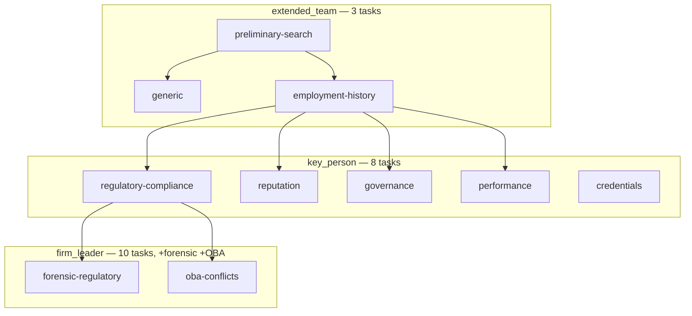

# Process: Key Personnel Intelligence & Classification

Built from: [obs-key-personnel-intelligence](../10-observations/obs-key-personnel-intelligence.md). Sub-process of step 6.2a in [proc-deal-analysis-pipeline](proc-deal-analysis-pipeline.md), runs before [proc-people-deep-research](proc-people-deep-research.md).

## Process Overview

- **Purpose**: Classify every named team member into a role tier, which mechanically sets how much research depth they receive.
- **Trigger**: Team roster available from deck extraction + website scraping + filings, and step 6.2 not skipped (principals found in 6.1).
- **End condition**: Every person bucketed into one of 7 tiers with `classificationReasoning` and optional `corrected_title`.

## Roles Involved

- Fully automated.

## Inputs and Outputs

- **Input**: team roster (pitch-deck extraction + website scraping + filings).
- **Output**: 7-bucket classification per person; feeds tiered research execution.

## Process Steps

1. Team roster assembled from three sources: pitch-deck extraction, website scraping, filings.
2. Per person, `verify-key-principals.ts` runs (Gemini Flash-Lite, strict JSON schema).
3. **Classification decision (per person)** — one of 7 buckets:
   - `key_principal` — 1-2 top-level, day-to-day heads of *this specific fund* (excludes parent-company CEOs/Chairmen).
   - `fund_principal` — senior investment pros dedicated to the fund, not lead decision-makers.
   - `firm_leadership` — parent-firm executives/partners from unrelated strategies.
   - `advisor` — formal advisors without daily deployment authority.
   - `former_member` — departed people (guarded against false positives from bios merely listing prior employers).
   - `extended_team` — VPs/Associates/Analysts.
   - `misc` — admin/operational staff.
4. **Fail-open exception handling (decision point)**:
   - No research context available for a person → default to `extended_team` (least scrutiny).
   - Parse failure/exception during classification → default to `key_principal` (most scrutiny, 10 research tasks) — deliberately biased toward not under-scrutinizing someone important.
5. Tier assignment determines research depth for step 6 (proc-people-deep-research): `firm_leader` → 10 tasks (includes forensic + OBA); `key_person` → 8 tasks (no forensic/OBA); `extended_team` → 3 tasks (preliminary-search, generic, employment-history only).
6. Result feeds `personResearchWorkflow` (proc-people-deep-research).

### Flow Diagram — Tiered Execution DAG

## Systems and Tools

- `verify-key-principals.ts`, Gemini Flash-Lite.
- `workflow.json` — tiered execution dependency graph.
- Codegen: `mix research.generate_dag` (`lib/mix/tasks/research/generate_dag.ex`) writes the same dependency graph to `config/research_dag.json` (Elixir) and `src/config/research-dag.ts` (Trigger.dev), keeping both runtimes in sync.

## Known Issues

- Fail-open defaults are asymmetric by design (low-scrutiny default on missing context, high-scrutiny default on parse failure) — see [obs-key-personnel-intelligence](../10-observations/obs-key-personnel-intelligence.md).
- `former_member` misclassification (from bios listing prior employers) was a known enough failure mode to warrant an explicit guard.

## Open Questions

- How often does the parse-failure fallback actually trigger in production? Is it monitored?
