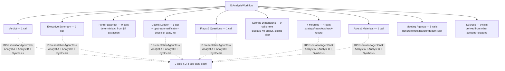

# Process: L1 Analysis (Final IC Memo)

Built from: [obs-l1-analysis](../10-observations/obs-l1-analysis.md). Sub-process of step 6.5 (`l1AnalysisWorkflow`) in [proc-deal-analysis-pipeline](proc-deal-analysis-pipeline.md), runs after [proc-scoring-rubric](proc-scoring-rubric.md). Final step of the pipeline.

## Process Overview

- **Purpose**: Generate the 10-section Investment Committee memo.
- **Trigger**: `master-workflow.ts` Step 5 calls `l1AnalysisWorkflow.triggerAndWait`.
- **End condition**: `L1AnalysisSchema` JSON complete, rendered as Phoenix LiveView web document; `workflow-master-fund` posts completion webhook (main flow step 7).

## Roles Involved

- Fully automated generation. Investment Committee reads the finished memo (outside this process).

## Inputs and Outputs

- **Input**: fund's Gemini File Search store, component definitions (`l1/definitions/analysis/*.toml`, `l1/definitions/agenda/*.toml`). Schema also accepts `consolidatedKnowledge`/`scoreResult` — see Known Issues.
- **Output**: `L1AnalysisSchema` — 10 anchored sections.

## Process Steps

### Flow Diagram — Section Fan-Out

1. `l1AnalysisWorkflow` loads component definitions: 5 top-level analysis TOMLs + 4 in `modules/` subfolder, plus 5 agenda TOMLs.
2. **Fund Factsheet** — no LLM call. Already built deterministically by `mapPrivateMarketSchema()` during step 6.1b (data extraction); this section just displays that pre-computed result.
3. **Scoring Dimensions** — no LLM call here either. Displays step 6.4's already-completed output; not part of this workflow's fan-out.
4. Remaining 8 sections generate via **14 top-level agent invocations** (9 `l1PresentationAgentTask` calls + 5 `generateMeetingAgendaItemTask` calls), each making 2-3 sub-model calls — roughly 30+ raw LLM requests total:
   - 4a. **Verdict** — `verdict.toml` → `l1PresentationAgentTask` → `decision` (ADVANCE/DECLINE/CONDITIONAL), `verdict_summary`, `what_would_change_our_mind[]`.
   - 4b. **Executive Summary** — `executive_summary.toml` → same task → narrative + `key_strengths[]`/`key_risks[]`.
   - 4c. **Claims Ledger**, two-stage:
     - i. `runVerificationChecklistAgent()` (part of step 6.3's fund-deep-diligence pipeline, not this workflow) makes 4+N sequential/parallel calls to extract falsifiable claims (fund, per-person, company).
     - ii. `claims.toml` drives its own `l1PresentationAgentTask` call, intended to be fed the verification results via `consolidatedKnowledge` — array of claims with `status` (CONFIRMED/CONTRADICTED/UNVERIFIABLE), `level` (INFO/WARNING/CRITICAL/NOTE), evidence, citations.
   - 4d. **Flags & Questions** — `flags.toml` → severity-ranked (CRITICAL/WARNING/INFO) flags with `questions_to_ask[]`.
   - 4e. **Modules** (4 separate calls): `investment_strategy`, `team`, `operational_infrastructure`, `track_record`. Each sets `schema="ModuleResponseSchema"`, own `category`/`ranking`, optional `constraints.asset_class` (skips module for non-applicable asset classes). Results sorted by `ranking`. 4-tier scale (STRONG/ADEQUATE/WEAK/FLAGGED) — different from scoring's 5-tier scale. Scoped to PE/Hedgefunds/VC.
   - 4f. **Asks & Materials Requests** — `asks.toml` → one call, one schema (`AsksSchema`), workflow splits response into `standalone_asks[]`/`materials_requests[]`.
   - 4g. **Meeting Agenda** — 5 independent `batch.triggerByTaskAndWait` calls via `generateMeetingAgendaItemTask` (different, simpler agent: single-analyst `gemini-3.1-flash-lite`, 2-pass, no `consolidatedKnowledge` support), one per topic (concentration/drawdown, key-person/succession, underwriting/valuation, AUM capacity/scaling, operational institutionalization), each calibrated with `[examples]` strong/weak exemplars.
5. **Common mechanics of `l1PresentationAgentTask`** (drives 9 of the 14 calls): Pass 1a `gemini-3.1-pro-preview` ("Analyst A", deep-context) + Pass 1b `gemini-2.5-pro` ("Analyst B", strict-quant) run in parallel over the file-search store (10 search queries cap each, `[NO_RELEVANT_DATA_FOUND]` escape hatch); Pass 2 `gemini-3.1-pro-preview` synthesizes both plus `consolidatedInfo` into the section's JSON schema. Strict prompt rules keep output free of internal artifacts (never "The Team module presents...").
6. **Sources** — not a standalone call. Derived: every `l1PresentationAgentTask`/`generateMeetingAgendaItemTask` call returns `citations` from grounding annotations, accumulated per-component into `l1_analysis._citations`.
7. All sections assembled into `L1AnalysisSchema`, rendered as a Phoenix LiveView 10-section scrollable web document.
8. Process rejoins main flow at step 7 (completion sync).

## Systems and Tools

- `l1AnalysisWorkflow` (`src/trigger/pitch-deck/workflows/l1-analysis-workflow.ts`) — real orchestrator. (`l1-analysis.ts` holds only Zod schema definitions, no orchestration logic despite the name.)
- `l1PresentationAgentTask`, `generateMeetingAgendaItemTask`.
- Model tiering: `gemini-3.1-pro-preview` + `gemini-2.5-pro` for analyst stage, `gemini-3.1-pro-preview` for synthesis — the most expensive calls in the whole pipeline, reserved for this final client-facing output.

## Known Issues

- **Confirmed real wiring gap.** `master-workflow.ts` Step 5 calls this workflow **without passing `consolidatedKnowledge` or `scoreResult`**, though the schema accepts both. Every `l1PresentationAgentTask` call today runs with an empty `consolidatedInfo` block — every section (step 4a-4f) generates from file-search grounding alone, disconnected from the scoring/claims data the design intends. Practical effect: this memo's Verdict/Modules could disagree with the Scoring Dimensions section (step 3) sitting right next to it in the same document.
- **Confirmed stale directory.** `agents/definitions/l1_presentation/{analysis,agenda,schemas}/` exists on disk, near-identical to the live `l1/definitions/`, but the workflow never reads it — only referenced as an unused default parameter.
- Same underlying pattern as the scoring wiring gap (step 5, proc-scoring-rubric): a downstream stage's payload type supports richer upstream context than `master-workflow.ts` actually wires through.

## Open Questions

- Priority/timeline for fixing the `consolidatedKnowledge`/`scoreResult` wiring gap?
- Has a memo verdict ever visibly contradicted its own scorecard in practice?
- Should the stale `agents/definitions/l1_presentation/` directory be deleted?
