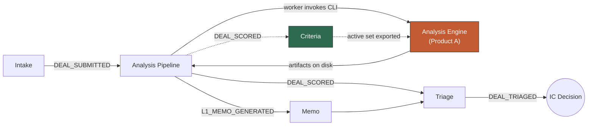

# PRD 00 — L1 Analysis Platform Overview

> **Framework**: Phlo event-sourced platform. See `00-inbox/event-system-architecture.md` and `00-inbox/prd-guide.md`.
> **Read this first.** It establishes the two-product split that every other PRD depends on.

---

### Project Identity

```
Project name: l1analysis
Company name: [TODO — confirm with stakeholder]
Display name: L1 Analysis Platform
Admin email domain: [TODO — confirm with stakeholder]
```

---

## 1. System Description

> **Positioning: an analyst co-pilot for L1 research.** Not an automated analyst. The engine does the reading, the evidencing, and the arithmetic; the analyst does the judging. Every output is traceable to a source page or explicitly marked as unestablished, and the analyst can answer what the engine could not — then re-run and watch the analysis update.
>
> This framing is not marketing. It is the only defensible claim given what the technology reliably does. The most credible operator in document AI for alternatives publicly confines AI to *"classification and information extraction — not for making value judgments, investment advice, or strategic recommendations."* This platform does generate a recommendation, but as a **decision gate** ("pursue / hold / pass, and here is what to ask"), never as investment advice — mirroring how a real IC memo requests an interview rather than a commitment.

The L1 Analysis Platform turns an alternative investment fund's marketing document — a pitch deck, PPM, or fact sheet — into a scored, evidence-grounded Investment Committee memo, and then gives the analyst a loop to close the gaps in it. It exists because manager selection at an allocator is bottlenecked on analyst reading time: decks arrive faster than they can be evaluated consistently, and the quality of a screening decision depends on which analyst happened to read it.

### The co-pilot loop

A first-pass memo on a real 52-page Cat II AIF deck produced **49 open questions** — things the document does not establish. That is not a failure mode; it is the product's main surface. Those questions sort into three kinds, and the platform routes each differently:

| Kind | Example (real, from the reference run) | What the analyst does |
|---|---|---|
| **Document-answerable** | `gp_commitment`, `key_person_clause`, `valuation_policy` — several of which literally say *"page 37 refers readers to the PPM"* | Upload the PPM; many resolve in one action |
| **Analyst-answerable** | No IC member is named anywhere in 52 pages; geography is deduced, not stated | Type an answer with a required source — recorded as **analyst-attested**, never as document-grounded |
| **Externally blocked** | The six SEBI / MCA / IFSCA register checks | Nothing the analyst can supply fixes these. Shown as blocked, with the reason, routed to whoever can unblock them |

Answering questions and re-running produces a **new version of the same analysis** (v1 → v2 → v3). Evidence accumulates; prior versions stay frozen and downloadable. The version chain is the audit story: *here is how our understanding evolved, and what caused each change.*

A co-pilot that treats all three question kinds identically is annoying. One that routes them differently is genuinely useful — and inviting an analyst to "answer" a geo-fenced register check is a broken affordance, not a minor UI flaw.

The platform is **two independently deliverable products** joined by a file contract:

**Product A — the Analysis Engine.** A standalone command-line tool. Input: a PDF and a criteria set. Output: structured JSON artifacts and a memo in Markdown. It has no dependency on the management system, no database, and no network service. An analyst can run it on a laptop against a confidential PPM with no document leaving the machine — which matters directly for Indian AIF material, where PPMs carry confidentiality obligations.

**Product B — the Management System.** A Phlo module set. Login, deal intake, pipeline status, triage, memo review, and the admin interface where an institution authors its own diligence criteria. It orchestrates Product A but does not contain it.

The boundary is deliberate. Phlo commits events and projections synchronously in the request path; an L1 analysis takes minutes to hours. Long-running work therefore cannot live inside an event emission. Keeping the engine standalone resolves that constraint, makes the engine testable in isolation, and means the analytical IP survives if the management layer is ever replaced.

### Who uses it

| User | What they do |
|---|---|
| **Analyst** | Uploads decks, monitors pipeline, reads memos, triages deals |
| **Super Admin** (Head of Research / CIO) | Authors and versions the diligence criteria that encode house policy |
| **IC Member** | Reads finished memos with full attribution to the rules that produced them |
| **Standalone CLI user** | Runs the engine manually, no management system involved |

---

## 2. Modules

| # | Module | PRD | What It Covers |
|---|---|---|---|
| 1 | Intake | `01-intake.md` | Upload, deduplication, document classification, promotion gate |
| 2 | Analysis Pipeline | `02-analysis-pipeline.md` | Async stage orchestration, worker protocol, stage events, failure handling |
| 3 | Criteria | `03-criteria.md` ✅ | Admin-authored red/green/veto rules, set versioning, export to engine |
| 4 | Triage | `04-triage.md` | Deal list, filters, stage gates, pursue/pass/hold decisions |
| 5 | Memo | `05-memo.md` | L1 memo rendering, section review, evidence drill-down, IC packet export |
| 6 | Evidence Loop | `07-evidence-loop.md` | **The co-pilot loop** — analyst answers open questions via document upload or attestation; triggers a re-run |
| 7 | Version History | `08-version-history.md` | Version chain, branded PDF export per version, causal diff between versions |
| — | Analysis Engine (CLI) | `06-analysis-engine.md` | **Product A** — standalone CLI: stages, prompts, artifact contract, auth model |
| — | User Journeys | `user-journeys.md` | Narrative walkthroughs for all roles |
| — | Screen Specs | `screen-specs/` | Per-screen UX detail: layout, data points, CTAs, validations, conditional states |

**Status**: `00`, `01`, `02`, `03`, `04`, `05`, `06`, `user-journeys` written and reviewed. `07`, `08`, and `screen-specs/` in progress.

### Where PDF generation lives

**In the management system, not the CLI.** The engine emits `05-memo.md`; Phlo renders the branded PDF. Three reasons: institutional branding is per-deployment config the CLI should not carry; `MEMO_EXPORTED` gives an audit trail of who exported which version at which criteria version; and it keeps the CLI dependency-free so an analyst can run it on a laptop and get portable markdown.

Constraint that survives export: **memo section 11 is non-excludable from any PDF.** Every exported memo carries its open questions — including, currently, the SEBI checks that could not be performed.

---

## 3. End-to-End Flow



Solid arrows are the deal's path. Dotted arrows are the criteria feedback loop: the active criteria set is exported to the engine at run time, and scoring results flow back to maintain per-criterion fire-rate statistics.

### The two-product boundary

```
┌─────────────────────── Product B: Phlo ───────────────────────┐
│  Browser ──upload──► Intake ──DEAL_SUBMITTED──► job record    │
│                                                      │         │
│                                                 (worker polls) │
└──────────────────────────────────────────────────────┼─────────┘
                                                       │
                          ┌────────────────────────────▼─────────┐
                          │  Product A: Analysis Engine (CLI)     │
                          │                                       │
                          │  l1 analyze <pdf>                     │
                          │     --criteria <dir>                  │
                          │     --out <dir>                       │
                          │                                       │
                          │  writes:                              │
                          │    01-classification.json             │
                          │    02-extraction.json                 │
                          │    03-diligence.json                  │
                          │    04-scoring.json                    │
                          │    05-memo.md                         │
                          │    status.jsonl  (progress stream)    │
                          └────────────────────────────┬──────────┘
                                                       │
┌──────────────────────────────────────────────────────▼─────────┐
│  worker reads artifacts ──POST /api/v1/events/emit──►           │
│    DEAL_CLASSIFIED, DEAL_EXTRACTED, DEAL_DILIGENCE_COMPLETED,   │
│    DEAL_SCORED, L1_MEMO_GENERATED                               │
└─────────────────────────────────────────────────────────────────┘
```

The engine never calls Phlo. Phlo never reaches inside the engine. The only contract is the artifact directory and the exit code — which is what allows either side to be rebuilt independently.

---

## 4. Shared Entities

| Entity | Aggregate Type | Created By | Referenced By |
|---|---|---|---|
| Deal | `Deal` | Intake | Analysis Pipeline, Triage, Memo |
| Document | `Document` | Intake | Analysis Pipeline, Memo |
| Criteria Set | `CriteriaSet` | Criteria | Analysis Pipeline (read), Memo (attribution) |
| Criterion | `Criterion` | Criteria | Memo (findings cite criterion_code) |
| Analysis Run | `AnalysisRun` | Analysis Pipeline | Triage, Memo |
| Finding | `Finding` | Analysis Pipeline | Memo, Triage |

**Deal vs. Document**: a Deal is the fund being evaluated and persists across documents. A Document is one uploaded file. A fund that sends an updated deck next quarter produces a second Document against the same Deal, and a second Analysis Run — so the platform can show how a manager's story changed between vintages. This is a capability allocators specifically lack today.

---

## 5. Shared Event Types

Events emitted by one module and consumed by another's projections.

| Event | Emitted By | Consumed By | Purpose |
|---|---|---|---|
| `DEAL_SUBMITTED` | Intake | Analysis Pipeline | Queues the analysis job |
| `DEAL_CLASSIFIED` | Analysis Pipeline | Triage | Sets AIF category; determines applicable criteria scope |
| `DEAL_SCORED` | Analysis Pipeline | Criteria, Triage | Updates `criterion_hit_stats`; makes deal triageable |
| `L1_MEMO_GENERATED` | Analysis Pipeline | Memo, Triage | Memo becomes readable |
| `CRITERIA_SET_ACTIVATED` | Criteria | Analysis Pipeline | Changes which rules subsequent runs use |
| `DEAL_TRIAGED` | Triage | — | Terminal decision; recorded for funnel reporting |

### Full event catalogue

| Module | Event Types |
|---|---|
| Intake | `DEAL_SUBMITTED`, `DOCUMENT_UPLOADED`, `DOCUMENT_DEDUPLICATED`, `DOCUMENT_REJECTED`, `DOCUMENT_ATTACHED_AS_EVIDENCE` |
| Evidence Loop | `EVIDENCE_UPLOADED`, `QUESTION_ANSWERED`, `QUESTION_DISMISSED`, `QUESTION_MARKED_BLOCKED`, `ANALYSIS_RERUN_REQUESTED`, `ANALYSIS_VERSION_CREATED` |
| Version History | `MEMO_EXPORTED` (v2, extended), `VERSION_COMPARED` |
| Analysis Pipeline | `ANALYSIS_RUN_STARTED`, `DEAL_CLASSIFIED`, `DEAL_EXTRACTED`, `DEAL_DILIGENCE_COMPLETED`, `DEAL_SCORED`, `L1_MEMO_GENERATED`, `ANALYSIS_RUN_FAILED`, `ANALYSIS_RUN_CANCELLED`, `ANALYSIS_RUN_REQUEUED`, `ANALYSIS_RUN_RECLAIMED`, `CRITERIA_SET_EXPORTED` (emitted here, owned by Criteria) |
| Criteria | `CRITERIA_SET_CREATED`, `CRITERION_CREATED`, `CRITERION_UPDATED`, `CRITERIA_SET_ACTIVATED`, `CRITERIA_SET_ARCHIVED`, `CRITERIA_SET_EXPORTED` |
| Triage | `DEAL_TRIAGED`, `DEAL_STAGE_ADVANCED`, `DEAL_ASSIGNED`, `DEAL_NOTE_ADDED`, `ODD_REVIEW_REQUESTED`, `ODD_REVIEW_COMPLETED` |
| Memo | `MEMO_SECTION_REVIEWED`, `MEMO_FINDING_OVERRIDDEN`, `MEMO_EXPORTED` |

> **Pending**: Triage stage names and terminology should follow industry-standard allocator practice (sourcing → screening → IDD → ODD → IC → commitment) rather than invented labels. Confirm against ILPA/AIMA conventions before finalising `04-triage.md`.

---

## 6. Architectural Constraints

Constraints that shaped this design. Each is a decision with a consequence, not a preference.

### 6.1 Phlo is synchronous; analysis is not

Phlo commits event + projections in a single transaction in the request path. An analysis run takes minutes to hours. **Therefore analysis cannot run inside an event emission.** The worker-polls-and-emits pattern is a consequence of this constraint, not a style choice.

### 6.2 Scores must be reproducible

A memo read six months later must be interpretable under the rules that produced it. **Therefore criteria sets are immutable once activated**, and every `DEAL_SCORED` carries `criteria_set_id` + `criteria_set_version`. Editing an active set clones it to a new draft. See `03-criteria.md` §1.

### 6.3 The memo must not contradict its own scorecard

A documented failure mode in comparable systems: the memo stage generates from document grounding alone, without receiving the scoring output computed immediately prior — so a memo's verdict can disagree with the scorecard printed inside it. **Therefore the artifact contract requires each stage to receive all prior stage outputs, and the CLI must assert their presence at stage boundaries rather than silently proceeding with nulls.** This is the single highest-value invariant in the engine design.

### 6.4 Self-critique loops can degrade accuracy

Naive generate-then-critique-then-revise loops have been measured reducing accuracy substantially. **Therefore the "skeptic" pass critiques only against checkable criteria** — is every numeric claim traceable to a source page, does every finding cite evidence, do the section verdicts agree — rather than open-ended "make this better". Numeric consistency is checked in code, not by asking a model.

### 6.5 Auth differs between development and production

`claude --bare` requires `ANTHROPIC_API_KEY`; Anthropic's terms do not permit third-party products to offer claude.ai subscription login to end users. **Therefore the CLI is auth-agnostic**: it invokes Claude Code and does not care how auth resolves.

| Context | Auth | Permitted |
|---|---|---|
| Local development and testing | Subscription (developer's own login) | Yes — a person using their own tool |
| Analyst running CLI on own machine | Subscription (their own login) | Yes, same basis |
| Phlo worker, unattended | `ANTHROPIC_API_KEY` | Required |
| Commercial distribution | `ANTHROPIC_API_KEY` | Required |

No code differs between these. Only the environment does. **[VERIFY — confirm exact policy language with Anthropic before making commercial claims.]**

### 6.6 The filesystem is hostile

macOS APFS is case-insensitive: `Report.pdf` and `report.pdf` are the same file, and `os.rename` overwrites without error. Sync clients (Dropbox, iCloud) write conflicted copies into watched directories and can leave dataless files where `stat()` succeeds but reads hang. **Therefore intake addresses files by content hash, never by supplied filename**, writes are atomic via temp-then-rename within the same filesystem, and the inbox must not be a synced folder. See `30-analysis/filesystem-as-state-machine.md`.

### 6.7 Citations and structured outputs are mutually exclusive

The Anthropic API returns a 400 if both are requested. Citations make source attribution structurally verifiable; structured outputs make artifacts machine-readable. **Both are wanted, so stages must choose per-stage**: extraction stages use structured output; memo generation — where grounding matters most and output is prose — uses citations. **[VERIFY — confirm current API behaviour before implementation.]**

---

## 7. Build Order

| Order | Module | Depends On | Rationale |
|---|---|---|---|
| 1 | **Criteria** | — | Everything downstream needs rules to apply. Self-contained. Written. |
| 2 | **Analysis Engine (CLI)** | Criteria (file format only) | Product A is independently valuable and testable against the Neo deck without any Phlo code existing. Validates the analytical approach before infrastructure is built. |
| 3 | **Intake** | — | Simple; can be built in parallel with the engine. |
| 4 | **Analysis Pipeline** | Intake, Engine, Criteria | The worker protocol needs a real CLI to invoke and real events to emit. |
| 5 | **Memo** | Analysis Pipeline | Renders what the pipeline produces. |
| 6 | **Triage** | Memo, Analysis Pipeline | Triage decisions depend on readable memos. |

**Critical path**: Criteria → Engine → validate against the Neo deck → then build Phlo modules around a proven engine.

The engine is deliberately second. If the analysis is not good enough to change an analyst's mind, no amount of management-system polish rescues it — so the analytical quality question gets answered before infrastructure investment.

---

## 8. Validation Reference Case

`00-inbox/Neo Infra Income Opportunities Fund-II Feb'26.pdf` — a real 52-page institutional deck used as the standing end-to-end test.

| Attribute | Value |
|---|---|
| Fund | Neo Infra Income Opportunities Fund II (NIIOF-II) |
| Structure | SEBI Category II AIF, close-ended |
| Target size | ~₹5,000 crore |
| Stated return | ~18–20% p.a. gross IRR |
| Term | 7 years (4.5yr investment / 2.5yr exit), 6 drawdowns |
| Strategy | Infrastructure credit — roads and renewables, 20–22 investments |
| Economics | 10% hurdle, carry without catch-up |
| Manager | Neo Asset Management (~₹70,000 Cr advisory, ~₹20,000 Cr AUM) |
| Service providers | EY, Trilegal, PwC, ICICI Bank, KFintech |
| Predecessor | NIIOF-I, still running |
| Document date | February 2026 |

**Why this case**: it exercises criteria across every tier. Returns are stated gross throughout with no obvious net-to-investor figure (`CR-0010`). The predecessor fund is unrealised (`CR-0011`). Service providers are tier-one and fully named (`CR-0033`). The deck is five months old at time of analysis (`CR-0017`). A memo that merely restates the deck fails; a memo that surfaces these fails differently only if it cannot evidence them.

**Acceptance bar**: the memo must surface at least the gross-vs-net disclosure gap and the unrealised predecessor track record, each with a page-level citation, and must not contradict its own scorecard.

---

## 8a. Regulatory Source Reality (verified 2026-07-20)

Empirical findings from `30-analysis/india-regulatory-data-sources.md`. These change what the diligence stage can promise.

| Source | Verdict | Notes |
|---|---|---|
| **MCA (via ZaubaCorp)** | ✅ Working | Full record retrieved for the real test case: CIN `U66300MH2021PTC371799`, Active, incorporated 18 Nov 2021, RoC Mumbai, registered address, full director list with DINs. Free, no login. ZaubaCorp robots.txt is permissive. |
| **IFSCA** | ⚠️ Browser only | Real data retrieved, but **only via headless browser** — plain HTTP silently returns an empty table, which is indistinguishable from a legitimate "no match". Must be guarded explicitly. |
| **SEBI** | ❌ **Unreachable** | Times out from this environment via every path (curl, Chrome, WebFetch, proxies). TCP connects on 443 then dies after TLS Client Hello — a **geo-fence/WAF filtering by source IP**, not bot detection. Independently reproduced: SEBI times out while IFSCA returns 200 from the same machine. **A headless browser does not help — the block is below the HTTP layer.** |
| **MCA V3 direct** | ❌ Login wall | The legacy no-login "View Company Master Data" is retired. "Enquire DIN Status" loads without login but throws a CAPTCHA **on submit, not on load** — a load-time check would wrongly score it as open. |
| **Tofler** | ⛔ Do not scrape | robots.txt explicitly disallows the search/company paths a scraper would use. License instead. |
| **Bulk data (data.gov.in)** | ❌ Dead end | API works but carries only aggregate statistics — no entity-level registers. |

### Consequences

**Three of the six diligence questions are currently unanswerable**: AIF registration validity, intermediary registration status, and enforcement actions. All three are SEBI-only. `CR-0001` (no verifiable SEBI registration) is a **veto** criterion, so this is not a peripheral gap.

The `unavailable`-never-fails-the-run policy (PRD 06 §5, stage 3) is what keeps the engine usable in this state. Without it every analysis would currently abort on an unreachable SEBI.

**Resolution path**: run the diligence stage from an India-hosted runner or via an Indian egress IP. This is an infrastructure decision, not a code change.

> ### 🔴 BLOCKER — re-graded 2026-07-21 (was: enhancement)
>
> This is not a degraded-experience issue. It is a **hard ceiling on what the product can produce**, and it compounds with two design decisions that are individually correct:
>
> 1. `unavailable` never fails a run (correct — one dead lookup must not discard sixteen good evaluations), **and**
> 2. `CR-0001` / `CR-0002` are **veto-tier** criteria that depend solely on the SEBI register.
>
> Therefore **no amount of analyst-supplied evidence can ever produce a complete analysis of an Indian AIF from this deployment.** Verified on the reference run: both vetoes sit at `veto_unevaluated`, and neither an uploaded PPM nor an analyst attestation can substitute — an attested *"the manager says they are registered"* is exactly the claim an independent register check exists to verify.
>
> **Consequence**: every exported IC packet ships permanently carrying two unevaluated vetoes in section 11, which is non-excludable. An IC reading it sees, correctly, that the fund's regulatory standing was never independently confirmed.
>
> **This constrains what can be claimed commercially.** The platform cannot be described as performing SEBI regulatory diligence until this is resolved. Until then the honest claim is document-grounded analysis with regulatory verification pending.
>
> **Options**: (a) India-hosted runner or VPN egress — cleanest, unblocks all four SEBI-dependent checks; (b) licensed data provider for SEBI/MCA data — costs money, may be more reliable than scraping anyway; (c) ship with the gap explicit and route these to a manual analyst check, treating the memo's blocked-question list as a work order.
>
> `[NEEDS DECISION — blocks the completeness claim, not the build]`

**Explicitly not pursued**: MCA's CAPTCHA is a self-hosted canvas image — the technically weak kind. Defeating an access control on a government portal is out of scope regardless of feasibility. DIN verification should route through a licensed data provider.

**Data quality caveat**: ZaubaCorp and Tofler disagree on the CIN's NIC segment and on the director list — ZaubaCorp carries departed directors as current. Aggregator data requires freshness checks, not trust.

---

## 9. Open Questions

- **Neo deck currency** — dated February 2026, analysed July 2026. Is a more recent version available? Affects whether `CR-0017` firing is a true finding or a test artifact.
- **Abakkus fit** — Abakkus is a fund manager (SEBI PMS/AIF, listed Indian equities), not obviously an allocator receiving inbound fund decks. Confirm whether they allocate to external managers, or whether the pipeline should be repointed at company/equity research for that audience. The two-product split makes this a criteria-and-prompt change rather than a rewrite, but it should be confirmed before demo.
- **Triage stage taxonomy** — pending allocator research; should follow ILPA/AIMA convention.
- ~~**Multi-document deals**~~ — **ANSWERED 2026-07-21 in PRD 07/08.** Neither supersede nor sit-alongside: a re-run creates a **new version of the same Analysis** (v1 → v2 → v3). Prior versions stay frozen and downloadable; the current version is unambiguous; comparison walks the version chain. Note the distinction from an *updated deck*, which is a new `SUBJECT` document and therefore a new Analysis on the same Deal — the version chain is for the same document plus accumulating evidence, not for a different document.
- **Human override** — when an analyst disagrees with a finding, is that a correction to the memo, training signal for criteria refinement, or both? `MEMO_FINDING_OVERRIDDEN` records it; what consumes it is unspecified.
