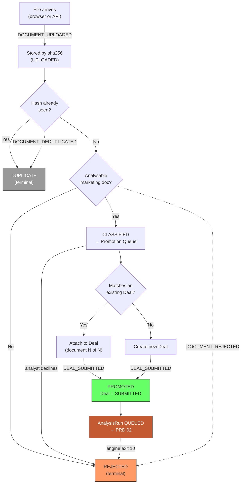

# PRD 01 — Intake Module

> **Framework**: Phlo event-sourced platform. See `00-inbox/event-system-architecture.md` and `00-inbox/prd-guide.md`.
> **Scope**: This module owns everything from "a file arrives" to "a Deal is queued for analysis". It does not run analysis — it hands off to PRD 02 via `DEAL_SUBMITTED`.

---

### Project Identity

```
Project name: l1analysis
Company name: [TODO — confirm with stakeholder]
Display name: L1 Analysis Platform
Admin email domain: [TODO — confirm with stakeholder]
```

---

## 1. Process Overview

### Process: Document Intake and Deal Promotion

An analyst receives a fund's marketing document — a pitch deck, a PPM, a fact sheet — usually by email, occasionally through a data room link. The Intake module is where that file becomes a tracked object. It does four things, in order: it stores the file addressed by its content hash, it checks whether the platform has seen those exact bytes before, it classifies the file well enough to decide whether it is worth analysing, and it decides whether the file belongs to a Deal that already exists or starts a new one.

The last of those is the design's centre of gravity. **A Deal is the fund being evaluated; a Document is one file.** Neo Infra Income Opportunities Fund II is a Deal. The February 2026 deck is a Document. When Neo circulates a June 2026 update, that is a *second Document against the same Deal* — not a new Deal, and not a replacement. The platform then holds two analysis runs for the same fund three months apart, which is the basis for a question allocators today cannot answer from their own records: *what changed in the manager's story between vintages?*

Intake deliberately does **not** auto-promote. Classification produces a proposal — "this looks like a pitch deck for Neo Infra Income Opportunities Fund II, which matches existing Deal DL-2026-0007" — and a human confirms or corrects it before the Deal is submitted for analysis. The reason is cost asymmetry: a wrong auto-match silently merges two different funds' evidence into one memo, which is far more damaging than the ten seconds a confirmation click costs.

Flow:

```
   Upload                 Deduplicate           Classify              Promote
   [ENTRY]                  [ENTRY]              [ENTRY]              [ENTRY]
      |                        |                    |                    |
DOCUMENT_UPLOADED    (sha256 compared)     (lightweight classify)  (analyst confirms
      |                        |                    |                fund + deal match)
  (stored by hash)   DOCUMENT_DEDUPLICATED   DOCUMENT_REJECTED           |
      |                        |              (not analysable)     DEAL_SUBMITTED
   [EXIT]                   [EXIT]               [EXIT]                  |
                          (terminal)           (terminal)             [EXIT]
                                                                  → PRD 02 queue
```

### Why content addressing, not filenames

Per overview §6.6: macOS APFS is case-insensitive, so `Neo Deck.pdf` and `neo deck.pdf` are the same file and `os.rename` overwrites one with the other without error. Sync clients write conflicted copies into watched folders and can leave dataless placeholders where `stat()` succeeds but a read blocks indefinitely.

**Therefore the supplied filename is metadata, never an identifier.** The storage key is `sha256(bytes)`. Two analysts forwarding the same deck from the same email thread produce one stored blob and one `DOCUMENT_DEDUPLICATED` event, regardless of what their mail clients named the attachment.

---

## 2. Entities and Aggregates

| Entity | Aggregate Type | Relationships |
|---|---|---|
| Deal | `Deal` | The fund under evaluation. Has many Documents, has many Analysis Runs (PRD 02) |
| Document | `Document` | One uploaded file. Belongs to at most one Deal. Produces at most one Analysis Run |
| Upload Source | `UploadSource` | An API credential or mailbox that documents arrive through. Referenced by Document |

### Entity Field Definitions

#### Deal

| Field | Type | Description |
|---|---|---|
| id | UUID | Primary key |
| deal_code | string | Human-readable identifier, format `DL-{YYYY}-{NNNN}` |
| fund_name | string | Canonical fund name, e.g. "Neo Infra Income Opportunities Fund II" |
| manager_name | string | Managing entity, e.g. "Neo Asset Management Private Limited" |
| manager_id | UUID | FK → Manager, nullable. Populated when the manager is a known counterparty (drives re-up detection in PRD 04) |
| aif_category | string | `CAT_I` / `CAT_II` / `CAT_III` / `NON_AIF` / `UNKNOWN` — set at intake as a proposal, confirmed by `DEAL_CLASSIFIED` (PRD 02) |
| strategy | string | Free-text strategy label, e.g. "infrastructure_credit" |
| target_size_amount | decimal | Target fund size as a normalised amount |
| target_size_currency | string | ISO currency code, e.g. `INR` |
| status | string | Lifecycle status — see State Machine |
| stage | string | Pipeline stage owned by PRD 04. Set to `SOURCING` at creation |
| document_count | decimal | Denormalised count of linked Documents |
| latest_document_id | UUID | Most recent Document by `uploaded_at` |
| first_seen_at | datetime | When the Deal was first created |
| assigned_analyst_id | UUID | Owning analyst; nullable until assigned in PRD 04 |
| created_at | datetime | Record creation |
| updated_at | datetime | Last modification |

> `document_count` is `decimal` per the guide's type convention for quantity fields, even though it will in practice hold whole numbers. Consistency here costs nothing and avoids the integer-truncation class of bug entirely.

#### Document

| Field | Type | Description |
|---|---|---|
| id | UUID | Primary key |
| document_code | string | Human-readable identifier, format `DOC-{YYYY}-{NNNNNN}` |
| deal_id | UUID | FK → Deal. Null until promotion or attachment; a rejected or orphan document may never get one |
| document_role | string | `SUBJECT` / `EVIDENCE`. **See §2a.** A `SUBJECT` document is the thing being analysed and drives promotion; an `EVIDENCE` document supports an existing Deal's analysis and never promotes. Defaults to `SUBJECT` |
| content_sha256 | string | 64-char lowercase hex. **The storage key.** Unique index |
| storage_path | string | Path or object key where the blob lives, derived from the hash |
| original_filename | string | As supplied by the uploader. Display only — never used to address the file |
| mime_type | string | Detected from content, not from the supplied extension |
| byte_size | decimal | File size in bytes |
| page_count | decimal | Page count for PDFs; null for other types |
| document_type | string | `PITCH_DECK` / `PPM` / `FACT_SHEET` / `TEAR_SHEET` / `QUARTERLY_REPORT` / `FUND_OVERVIEW` / `UNKNOWN` |
| is_analysable | boolean | Whether the classifier judged this an analysable marketing document |
| classification_confidence | string | `STATED` / `INFERRED` / `LOW` |
| status | string | Lifecycle status — see State Machine |
| rejection_reason | string | Populated when status is `REJECTED` |
| duplicate_of_document_id | UUID | Populated when status is `DUPLICATE` — points at the first Document with these bytes |
| upload_source_id | UUID | FK → Upload Source |
| upload_channel | string | `BROWSER` / `API` |
| document_date | date | Date printed on the document itself, e.g. 2026-02-01 for the Neo deck. Nullable |
| uploaded_at | datetime | When the bytes arrived |
| promoted_at | datetime | When `DEAL_SUBMITTED` fired for this document. Null otherwise — and **permanently null for every `EVIDENCE` document by design**, not as a backlog signal. See §2a |
| attached_at | datetime | When `DOCUMENT_ATTACHED_AS_EVIDENCE` fired. Null for `SUBJECT` documents |
| attached_to_question_id | UUID | FK → Open Question (PRD 07). The question this evidence was uploaded to answer. Null if attached to the Deal generally rather than to a specific gap |
| created_at | datetime | Record creation |
| updated_at | datetime | Last modification |

### §2a. Two document roles (added 2026-07-21)

> **Fixes a gap found while writing PRD 07.** Intake originally had exactly one lifecycle — upload → classify → dedupe → **promote to Deal**. But the evidence loop uploads a PPM to answer open questions on a Deal that already exists. That document must not create a second Deal, and must not sit forever in a pre-promotion state that intake reports read as backlog.

Every Document carries a `document_role`:

| Role | What it is | Promotes? | Terminal status |
|---|---|---|---|
| `SUBJECT` | The document being analysed — a pitch deck, tear sheet, fund overview. Creates or matches a Deal. | Yes → `DEAL_SUBMITTED` | `PROMOTED` |
| `EVIDENCE` | A supporting document attached to an existing Deal — a PPM, side letter, audited accounts, DDQ response. Answers open questions; never creates a Deal. | **No** | `ATTACHED` |

Both roles share everything upstream: the same upload endpoints, the same content-addressed storage, the same SHA-256 dedup, the same classification pass. They diverge only at the promotion gate.

**Why role is decided at upload, not inferred later.** A PPM can legitimately be either — the subject of its own analysis, or evidence supporting a deck-based analysis. Nothing about the bytes distinguishes them; only the uploader's intent does. So the upload screen asks, and defaults sensibly: an upload initiated from a Deal's open-question list is `EVIDENCE` with `deal_id` pre-set; an upload from the general intake screen is `SUBJECT`.

**The reporting bug this prevents.** Without the role, an evidence PPM has `deal_id` set but `promoted_at` null forever. Every intake report keyed on "documents awaiting promotion" would count it as backlog — a number that grows with successful evidence uploads and can never be worked down. Anyone investigating would find healthy documents attached to healthy Deals and no explanation. **All intake backlog and funnel reports must therefore filter `document_role = 'SUBJECT'`.** This is stated as a constraint, not left to be discovered.

**Dedup interacts with role.** If identical bytes arrive twice, the existing rules hold — but the *response* differs by role:

- Same bytes, already a `SUBJECT` on Deal X, now uploaded as `EVIDENCE` on Deal X → recognise it, do not duplicate. The document is already there; surface it rather than storing it twice.
- Same bytes, `SUBJECT` on Deal X, uploaded as `EVIDENCE` on Deal Y → legitimate. One fund's PPM can be evidence in another's analysis (a co-investment, a feeder). Create the attachment, reuse the stored blob.
- Same bytes, already `EVIDENCE` on this Deal → recognise, no-op, tell the user it is already attached.

#### Upload Source

| Field | Type | Description |
|---|---|---|
| id | UUID | Primary key |
| source_code | string | Human-readable identifier, format `SRC-{NNNN}` |
| name | string | Display name, e.g. "Deal flow mailbox", "Placement agent API key" |
| channel | string | `BROWSER` / `API` |
| api_key_id | UUID | FK → api_keys (core Phlo table), null for browser sources |
| is_active | boolean | Whether uploads are currently accepted from this source |
| document_count | decimal | Denormalised count of documents received |
| created_at | datetime | Record creation |

### Numbering

| Entity | Prefix | Format | Example |
|---|---|---|---|
| Deal | DL | `DL-{YYYY}-{NNNN}` | DL-2026-0007 |
| Document | DOC | `DOC-{YYYY}-{NNNNNN}` | DOC-2026-000142 |
| Upload Source | SRC | `SRC-{NNNN}` | SRC-0003 |

**Special characters**: none of these codes contain URL-unsafe characters. `original_filename`, however, routinely does — the reference case filename is `Neo Infra Income Opportunities Fund-II Feb'26.pdf`, which contains both a space and an apostrophe. **The filename must never appear in a URL path segment.** All routes address documents by `id` or `document_code`.

---

## 3. Process Steps

### Step: Upload Document (Browser)

Event type: `DOCUMENT_UPLOADED`

Trigger:
  Analyst opens the Upload screen, drags a PDF onto the drop zone (or picks it via the file dialog), optionally selects an existing Deal to attach it to, and clicks "Upload". The browser computes nothing — the file is posted and the server hashes it.

Data points captured:
  - file: binary — the uploaded bytes
  - original_filename: string — as supplied by the browser
  - suggested_deal_id: UUID (optional) — analyst pre-selected an existing Deal
  - notes: string (optional) — free-text context, e.g. "forwarded by placement agent, third fund from this manager"

Payload:
```
id: UUID (generated)
document_code: string (generated, DOC-YYYY-NNNNNN)
content_sha256: string
storage_path: string
original_filename: string
mime_type: string
byte_size: decimal
page_count: decimal?
upload_source_id: UUID
upload_channel: "BROWSER"
suggested_deal_id: UUID?
notes: string?
```

Aggregate: `Document` / `id`

Location: None. This process does not involve physical locations.

Preconditions:
  - `mime_type` detected from content must be `application/pdf`. Other types are accepted into storage but immediately produce `DOCUMENT_REJECTED` (see that step)
  - `byte_size` must be > 0 and ≤ the configured ceiling **[NEEDS REVIEW — ceiling not yet decided. The reference deck is 5.6 MB; PPMs of 200+ pages with embedded images can exceed 100 MB.]**
  - The uploading user must hold `events:DOCUMENT_UPLOADED:emit`
  - `suggested_deal_id`, if supplied, must reference a Deal not in status `ARCHIVED`

Side effects:
  - Bytes written to storage at a path derived from `content_sha256`, using temp-then-rename within the same filesystem (overview §6.6)
  - `documents`: new row with status `UPLOADED`
  - `upload_sources`: `document_count` += 1
  - Deduplication check runs immediately; if the hash already exists, `DOCUMENT_DEDUPLICATED` is emitted and no further processing occurs
  - If not a duplicate, lightweight classification is invoked; it emits either `DOCUMENT_REJECTED` or leaves the document `CLASSIFIED` awaiting promotion

Projections updated:
  - `documents`: new row (status = UPLOADED, content_sha256, storage_path, original_filename, byte_size, page_count)
  - `upload_sources`: document_count += 1

Permissions:
  - `events:DOCUMENT_UPLOADED:emit`

---

### Step: Upload Document (API)

Event type: `DOCUMENT_UPLOADED`

Trigger:
  An external system — a mailbox-watching integration, a placement agent's portal, or a script — POSTs the file to the intake endpoint with an API key. Same event type as browser upload; only the channel and source differ.

Data points captured:
  Identical to browser upload, plus:
  - external_reference: string (optional) — the caller's own identifier, e.g. a message ID
  - idempotency_key: string (optional) — client-supplied, prevents a retried POST creating a second Document

Payload:
```
id: UUID (generated)
document_code: string (generated)
content_sha256: string
storage_path: string
original_filename: string
mime_type: string
byte_size: decimal
page_count: decimal?
upload_source_id: UUID
upload_channel: "API"
external_reference: string?
notes: string?
```

Aggregate: `Document` / `id`

Location: None.

Preconditions:
  - Same as browser upload
  - The API key must map to an active Upload Source
  - If `idempotency_key` is supplied and already exists in `movement_events`, the existing event is returned unchanged (core Phlo behaviour, see architecture doc "Idempotency")

Side effects:
  - Identical to browser upload
  - `suggested_deal_id` is never accepted from the API channel. **API callers cannot pre-assign a Deal** — an external system does not have the context to decide whether an updated deck belongs to an existing Deal, and a wrong merge is expensive to unwind. All API uploads route to the promotion queue for human confirmation.

Projections updated:
  - `documents`: new row
  - `upload_sources`: document_count += 1

Permissions:
  - `events:DOCUMENT_UPLOADED:emit` (granted to the API key's service role)

---

### Step: Deduplicate Document

Event type: `DOCUMENT_DEDUPLICATED`

Trigger:
  System-emitted immediately after `DOCUMENT_UPLOADED`, when a Document already exists with the same `content_sha256`. Not a user action.

Data points captured:
  - id: UUID — the new (duplicate) document
  - duplicate_of_document_id: UUID — the first document with these bytes
  - content_sha256: string
  - original_deal_id: UUID? — the Deal the original document belongs to, if promoted

Payload:
```
id: UUID
duplicate_of_document_id: UUID
content_sha256: string
original_deal_id: UUID?
original_uploaded_at: datetime
```

Aggregate: `Document` / `id`

Location: None.

Preconditions:
  - A Document with the same `content_sha256` must already exist and not itself be a duplicate (duplicates always point at the original, never at another duplicate — the chain is one level deep by construction)

Side effects:
  - `documents`: the new row's status → `DUPLICATE`, `duplicate_of_document_id` set
  - **No analysis is queued.** The duplicate is a record that the file arrived again, not a second unit of work
  - The stored blob is not written twice — the second upload's bytes are discarded after hashing confirms the match

Projections updated:
  - `documents`: status → DUPLICATE, duplicate_of_document_id
  - `deal_intake_summary`: `duplicate_count` += 1 for the original's Deal, if it has one

Permissions:
  - `events:DOCUMENT_DEDUPLICATED:emit` (system actor; `actor_type` = `"system"`)

**Design note**: a duplicate is deliberately recorded rather than silently dropped. "This deck has now reached us from three different placement agents" is signal — it tells an analyst the manager is broadly marketing rather than approaching selectively, which is a fact worth having on the Deal detail page.

---

### Step: Reject Document

Event type: `DOCUMENT_REJECTED`

Trigger:
  Two paths. (a) System-emitted when the intake classifier determines the file is not an analysable marketing document — a data room index, a signed subscription agreement, a financial statement, an unreadable scan. (b) Analyst-emitted from the Promotion Queue when they judge a file not worth analysing.

Data points captured:
  - id: UUID — the document
  - rejection_reason: string — enum, see below
  - rejection_detail: string (optional) — free text
  - rejected_by: `SYSTEM` / `ANALYST`

Payload:
```
id: UUID
rejection_reason: string
rejection_detail: string?
rejected_by: string
document_type: string?
```

Aggregate: `Document` / `id`

Location: None.

Preconditions:
  - Document status must be `UPLOADED` or `CLASSIFIED` (a promoted document cannot be rejected — cancel its Analysis Run instead, PRD 02)

Rejection reasons:

| Reason | Meaning | Emitted by |
|---|---|---|
| `NOT_ANALYSABLE_TYPE` | Legal document, financial statement, data room index — not marketing material | System |
| `NO_TEXT_LAYER` | Scanned image PDF with no extractable text; OCR out of scope for v1 | System |
| `CORRUPT_FILE` | PDF will not parse | System |
| `WRONG_MIME_TYPE` | Not a PDF | System |
| `OUT_OF_SCOPE` | Analysable but not something this institution evaluates | Analyst |
| `DUPLICATE_CONTENT_DIFFERENT_BYTES` | Same fund, same vintage, trivially different file (e.g. re-exported PDF) — hash differs so dedup missed it | Analyst |
| `ANALYST_DISCRETION` | Analyst declines to pursue; detail required | Analyst |

Side effects:
  - `documents`: status → `REJECTED`, `rejection_reason` set
  - No analysis is queued
  - The document remains queryable and its blob is retained. **Rejection is not deletion** — the record of what arrived and was declined is part of the funnel picture (see PRD 04 on the passed-deals counterfactual)

Projections updated:
  - `documents`: status → REJECTED, rejection_reason, rejection_detail
  - `intake_funnel_daily`: `rejected_count` += 1, bucketed by reason

Permissions:
  - `events:DOCUMENT_REJECTED:emit`

**Cross-module boundary**: the analysis engine also produces a rejection signal — CLI exit code 10, "document rejected, not an analysable type" (PRD 06 §2). That path emits `DOCUMENT_REJECTED` from the **worker**, not from Intake, with `rejected_by` = `SYSTEM` and reason `NOT_ANALYSABLE_TYPE`. The intake classifier is a cheap pre-filter; the engine's classification stage is authoritative. Both write the same event type against the same aggregate, which is correct — the document was rejected, and the event stream records who decided and when.

---

### Step: Promote Document to Deal

Event type: `DEAL_SUBMITTED`

Trigger:
  Analyst opens the Promotion Queue, selects a classified document, reviews the proposed fund name / manager / Deal match, either accepts the proposal or corrects it (choosing an existing Deal, or creating a new one), and clicks "Submit for Analysis".

Data points captured:
  - document_id: UUID — the document being promoted
  - deal_id: UUID — existing Deal, or a newly generated UUID for a new Deal
  - is_new_deal: boolean — whether this creates a Deal or attaches to one
  - fund_name: string — confirmed by the analyst
  - manager_name: string — confirmed by the analyst
  - manager_id: UUID? — linked known manager, if matched
  - aif_category: string — proposed category, `UNKNOWN` if the analyst is unsure
  - priority: string — `NORMAL` / `HIGH`, drives worker queue ordering
  - notes: string (optional)

Payload:
```
document_id: UUID
deal_id: UUID
deal_code: string (generated if is_new_deal)
is_new_deal: boolean
fund_name: string
manager_name: string
manager_id: UUID?
aif_category: string
strategy: string?
priority: string
criteria_set_id: UUID (resolved at submission — the ACTIVE set matching aif_category)
criteria_set_version: decimal
notes: string?
```

Aggregate: `Deal` / `deal_id`

Location: None.

Preconditions:
  - Document status must be `CLASSIFIED` (not `DUPLICATE`, not `REJECTED`, not already `PROMOTED`)
  - Document `is_analysable` must be true, **or** the analyst must explicitly override with a reason recorded in `notes` — an analyst who knows better than the classifier should not be blocked, but the override must be visible
  - If `is_new_deal` is false, the target Deal must exist and not be `ARCHIVED`
  - If `is_new_deal` is true, `fund_name` must be non-empty
  - **An ACTIVE criteria set must exist whose `asset_class_scope` covers `aif_category`, or whose scope is empty.** With no applicable rules there is nothing to score against, and the submission is rejected with a message pointing at the Criteria module. This is the most likely first-run failure in a fresh deployment, because the seed set ships in `DRAFT` deliberately (PRD 03 §11)

Side effects:
  - If `is_new_deal`: `deals` new row, status `SUBMITTED`, stage `SOURCING`
  - If not: `deals` `document_count` += 1, `latest_document_id` updated
  - `documents`: status → `PROMOTED`, `deal_id` set, `promoted_at` stamped
  - **An analysis run is queued.** The Analysis Pipeline module's projection service creates an `AnalysisRun` row in status `QUEUED` in response to this event (PRD 02 §3, "Queue Analysis Run"). Note that the run is *queued*, not started — per overview §6.1, the analysis itself cannot execute inside this event's transaction
  - `criteria_set_id` and `criteria_set_version` are resolved **at submission time and frozen into the payload**. A criteria set activated between submission and worker pickup does not change what this run is scored against

Projections updated:
  - `deals`: new row or document_count += 1, latest_document_id, updated_at
  - `documents`: status → PROMOTED, deal_id, promoted_at
  - `analysis_runs` (PRD 02): new row, status QUEUED
  - `intake_funnel_daily`: `promoted_count` += 1

Permissions:
  - `events:DEAL_SUBMITTED:emit`

**Cross-module boundary**: this is the handoff to PRD 02. Intake's responsibility ends when `DEAL_SUBMITTED` is committed. The worker's responsibility begins when it next polls and finds the `QUEUED` run.

---

### Step: Attach Document as Evidence

Event type: `DOCUMENT_ATTACHED_AS_EVIDENCE`

> Added 2026-07-21. The counterpart to promotion for `EVIDENCE`-role documents — see §2a. This is the intake-side half of PRD 07's evidence loop.

Trigger:
  Analyst uploads a supporting document from a Deal's open-question list (PRD 07), or from the Deal detail screen's evidence panel. The upload completes, classification runs, and this event attaches it to the Deal rather than promoting it.

Data points captured:
  - document_id: UUID — the uploaded document
  - deal_id: UUID — the Deal it supports
  - attached_to_question_id: UUID (optional) — the specific open question this was uploaded to answer
  - evidence_kind: string — `PPM` / `AUDITED_ACCOUNTS` / `DDQ_RESPONSE` / `SIDE_LETTER` / `OTHER`
  - notes: string (optional) — analyst context

Payload:
```
document_id: UUID
deal_id: UUID
attached_to_question_id: UUID?
evidence_kind: string
notes: string?
attached_at: datetime
```

Aggregate: `Document` / `document_id`

Location: None.

Preconditions:
  - Document `document_role` must be `EVIDENCE`
  - Document status must be `CLASSIFIED`
  - Target Deal must exist and not be `ARCHIVED`
  - If `attached_to_question_id` is supplied, that question must belong to this Deal and not already be `RESOLVED`
  - **No requirement that `is_analysable` be true.** Audited accounts and DDQ responses are not marketing documents and will classify as such; that must not block them. This is a deliberate divergence from the promotion path.

Side effects:
  - `documents`: status → `ATTACHED`, `deal_id` set, `attached_at` stamped, `attached_to_question_id` set. **`promoted_at` remains null permanently** — see §2a
  - `deals`: `evidence_document_count` += 1
  - **No Deal is created.** **No analysis run is queued.** Attaching evidence does not itself trigger a re-run — the analyst decides when to re-run, because a re-run costs 8–16 minutes and ~$2–4 and they may want to attach several documents first (PRD 07)
  - The linked open question moves to `EVIDENCE_PENDING` (PRD 07), *not* `RESOLVED`. Only a re-run that stops reporting the item resolves it

Projections updated:
  - `documents`: status → ATTACHED, deal_id, attached_at, attached_to_question_id
  - `deals`: evidence_document_count += 1
  - `open_questions` (PRD 07): status → EVIDENCE_PENDING
  - `intake_funnel_daily`: `attached_count` += 1 — **a separate counter from `promoted_count`**, so evidence uploads never inflate the promotion funnel

Permissions:
  - `events:DOCUMENT_ATTACHED_AS_EVIDENCE:emit`

**Cross-module boundary**: this is the handoff to PRD 07. Intake stores and attaches; the evidence loop owns what happens to the question and when a re-run fires.

---

## 4. State Machines

### Document States

Statuses: `UPLOADED`, `CLASSIFIED`, `DUPLICATE`, `REJECTED`, `PROMOTED`

Transitions:

| From Status | Event | To Status |
|---|---|---|
| — | `DOCUMENT_UPLOADED` | `UPLOADED` |
| `UPLOADED` | (classification succeeds, no event) | `CLASSIFIED` |
| `UPLOADED` | `DOCUMENT_DEDUPLICATED` | `DUPLICATE` |
| `UPLOADED` | `DOCUMENT_REJECTED` | `REJECTED` |
| `CLASSIFIED` | `DOCUMENT_REJECTED` | `REJECTED` |
| `CLASSIFIED` | `DEAL_SUBMITTED` | `PROMOTED` |
| `CLASSIFIED` | `DOCUMENT_ATTACHED_AS_EVIDENCE` | `ATTACHED` |
| `PROMOTED` | `DOCUMENT_REJECTED` (from worker, exit 10) | `REJECTED` |

```
                                    ┌--DEAL_SUBMITTED--> PROMOTED  (role = SUBJECT)
                                    |                       |
UPLOADED --classified--> CLASSIFIED-+                DOCUMENT_REJECTED
   |                          |     |                 (engine exit 10)
   |                          |     └--DOCUMENT_ATTACHED_AS_EVIDENCE--> ATTACHED
   |                          |                                    (role = EVIDENCE, terminal)
   |                    DOCUMENT_REJECTED                                 |
   |                          v                                          |
   +--DOCUMENT_REJECTED--> REJECTED <-----------------------------------+
   |
   +--DOCUMENT_DEDUPLICATED--> DUPLICATE (terminal)
```

Notes:
- `DUPLICATE` is terminal. A duplicate is never promoted, never analysed, never rejected — it is a record that bytes arrived twice.
- **`ATTACHED` is terminal and is a success state.** An `EVIDENCE` document reaching `ATTACHED` has done its whole job. It has `deal_id` set, `attached_at` stamped, and `promoted_at` permanently null — by design, not as a pending signal. Reports that count unpromoted documents **must** filter `document_role = 'SUBJECT'`; see §2a.
- The two branches out of `CLASSIFIED` are mutually exclusive and determined by `document_role`, which is fixed at upload. A document never changes role. If an analyst genuinely needs a PPM previously attached as evidence to become the subject of its own analysis, that is a new `SUBJECT` document referencing the same stored blob — not a mutation of the existing record. The audit trail must show two distinct intents, not one record that changed its mind.
- The `UPLOADED → CLASSIFIED` transition carries **no event**. Intake classification is a cheap local heuristic (MIME sniff, text-layer presence, keyword scan for fund-document vocabulary), not a model call, and it produces no auditable business fact of its own. The auditable classification is `DEAL_CLASSIFIED` from the engine (PRD 02). **[NEEDS REVIEW — an alternative is to emit `DOCUMENT_CLASSIFIED` for symmetry. Argued against here because it would be an event nobody queries; flagged because "no event for a state transition" is unusual in this architecture and a reviewer will rightly question it.]**
- `PROMOTED → REJECTED` exists only for the engine-exit-10 path. It is the one case where a document that looked analysable to the pre-filter is authoritatively judged otherwise. The Deal it was promoted to remains, with a failed run and no documents pending — PRD 04 surfaces that as an intake anomaly.

### Deal States

Statuses: `SUBMITTED`, `ANALYSING`, `ANALYSED`, `TRIAGED`, `ARCHIVED`

Transitions:

| From Status | Event | To Status |
|---|---|---|
| — | `DEAL_SUBMITTED` | `SUBMITTED` |
| `SUBMITTED` | `ANALYSIS_RUN_STARTED` (PRD 02) | `ANALYSING` |
| `ANALYSING` | `L1_MEMO_GENERATED` (PRD 02) | `ANALYSED` |
| `ANALYSING` | `ANALYSIS_RUN_FAILED` (PRD 02) | `SUBMITTED` |
| `ANALYSING` | `ANALYSIS_RUN_CANCELLED` (PRD 02) | `SUBMITTED` |
| `ANALYSED` | `DEAL_TRIAGED` (PRD 04) | `TRIAGED` |
| `ANALYSED` | `DEAL_SUBMITTED` (second document) | `SUBMITTED` |
| `TRIAGED` | `DEAL_SUBMITTED` (second document) | `SUBMITTED` |
| `TRIAGED` | (archival, manual) | `ARCHIVED` |

Notes:
- **`SUBMITTED` is re-entrant.** A failed run returns the Deal to `SUBMITTED` so it can be retried; a new document on an already-triaged Deal also returns it to `SUBMITTED`. This is deliberate — a Deal's status describes *what the platform owes it right now*, and in both cases the answer is "an analysis".
- The Deal `status` field is orthogonal to the Deal `stage` field. `status` is the platform's processing state and lives in this module. `stage` is the allocator's pipeline position (sourcing, initial screening, IDD…) and is owned entirely by PRD 04. A Deal can be `ANALYSED`/`INITIAL_SCREENING` or `SUBMITTED`/`IDD` — the combinations are meaningful and neither field constrains the other.
- `ARCHIVED` is terminal for intake purposes. An archived Deal accepts no new documents; a later fund from the same manager is a new Deal.

---

## 5. Reports and Projections

| # | Business Question | Projection Table | Key Fields | Updated By Events |
|---|---|---|---|---|
| 1 | "What arrived today and what state is it in?" | `documents` | document_code, original_filename, status, document_type, uploaded_at, deal_id | `DOCUMENT_UPLOADED`, `DOCUMENT_DEDUPLICATED`, `DOCUMENT_REJECTED`, `DEAL_SUBMITTED` |
| 2 | "What is waiting for me to promote or reject?" | `documents` filtered to status `CLASSIFIED` | document_code, proposed_fund_name, proposed_deal_id, uploaded_at, age_hours | `DOCUMENT_UPLOADED`, `DEAL_SUBMITTED`, `DOCUMENT_REJECTED` |
| 3 | "What funds are we tracking, and how many documents does each have?" | `deals` | deal_code, fund_name, manager_name, aif_category, status, stage, document_count, latest_document_id | `DEAL_SUBMITTED`, plus PRD 02/04 events |
| 4 | "How many documents did we receive, promote, reject, and dedupe — by day and by reason?" | `intake_funnel_daily` | date, received_count, promoted_count, rejected_count, duplicate_count, rejection_reason breakdown | `DOCUMENT_UPLOADED`, `DOCUMENT_DEDUPLICATED`, `DOCUMENT_REJECTED`, `DEAL_SUBMITTED` |
| 5 | "Which sources send us the most, and how much of it is usable?" | `upload_source_stats` | source_code, name, document_count, promoted_count, rejected_count, usable_rate_pct | `DOCUMENT_UPLOADED`, `DOCUMENT_REJECTED`, `DEAL_SUBMITTED` |
| 6 | "How has this manager's story changed between documents?" | `deal_document_timeline` | deal_id, document_id, document_date, uploaded_at, analysis_run_id, headline metrics per run | `DEAL_SUBMITTED`, `DEAL_EXTRACTED` (PRD 02) |
| 7 | "Show me the full history of this document" | *Not a projection* — query `movement_events` by `aggregate_type` = `Document` | — | Automatic |
| 8 | "Which decks have we now seen more than once?" | `documents` filtered to status `DUPLICATE`, grouped by `duplicate_of_document_id` | content_sha256, duplicate_count, sources | `DOCUMENT_DEDUPLICATED` |

### Notes on report 6

`deal_document_timeline` is the payoff for the Deal/Document split, and it is the report most likely to be undersold in a demo. It answers "Neo said 20–22 investments in February and 16–18 in June — when did that change and did they flag it?" No allocator's current tooling answers that from their own file store, because their file store is a folder of decks named by whoever saved them.

The projection is populated jointly: Intake writes the document row at promotion, and PRD 02's `DEAL_EXTRACTED` fills the headline metrics once the engine has produced them. **Cross-module boundary: this module's projection service must handle `DEAL_EXTRACTED` emitted by the Analysis Pipeline.**

### Pagination

Reports 1, 2, 3 and 8 are ordinary paginated lists. **Report 6 must fetch a full document set for one Deal without pagination** — a timeline with a "load more" button is not a timeline. Deals will realistically hold under 20 documents, so an unpaginated endpoint scoped to one `deal_id` is safe.

---

## 6. Roles and Permissions

### Roles

| Role | Description | Permissions |
|---|---|---|
| Analyst | Uploads documents, promotes them to Deals, rejects what is not worth analysing | `events:DOCUMENT_UPLOADED:emit`, `events:DOCUMENT_REJECTED:emit`, `events:DEAL_SUBMITTED:emit`, `intake:read` |
| Super Admin | Everything an Analyst can do, plus source management | All intake events, `intake:read`, `intake:manage_sources` |
| IC Member | Reads deals and documents; does not upload or promote | `intake:read` |
| ODD Reviewer | Reads deals and documents to conduct operational review | `intake:read` |
| Integration Service Account | An API key that posts documents | `events:DOCUMENT_UPLOADED:emit` only |
| Worker Service Account | The analysis worker | `events:DOCUMENT_REJECTED:emit` (for engine exit 10), `intake:read` |

### Permissions

| Permission Code | Description | Used By Step |
|---|---|---|
| `events:DOCUMENT_UPLOADED:emit` | Upload a document | Upload Document (Browser), Upload Document (API) |
| `events:DOCUMENT_DEDUPLICATED:emit` | Record a duplicate (system actor only) | Deduplicate Document |
| `events:DOCUMENT_REJECTED:emit` | Reject a document | Reject Document |
| `events:DEAL_SUBMITTED:emit` | Promote a document to a Deal and queue analysis | Promote Document to Deal |
| `intake:read` | View deals, documents, and intake reports | All read screens |
| `intake:manage_sources` | Create, rename, and deactivate upload sources | Upload Sources screen |

**Design note**: the Integration Service Account holds exactly one permission. An API key that can upload should not be able to promote, reject, or read the deal book. This is why `suggested_deal_id` is refused on the API channel — not merely as policy, but because the credential that would carry that intent has no authority over Deals at all.

---

## 7. Locations

This process does not involve physical locations. Events will not carry a `location_id`.

---

## 8. Screen List

| # | Screen Name | Type | Used By | Purpose | Key Actions |
|---|---|---|---|---|---|
| 1 | Upload Document | form | Analyst | Drag-drop or browse to upload one or more PDFs | Upload, Attach to Existing Deal, Cancel |
| 2 | Promotion Queue | list | Analyst | Everything classified and awaiting a promote/reject decision, oldest first | Promote, Reject, Open Document, Bulk Reject |
| 3 | Promote Document | form | Analyst | Confirm or correct fund name, manager, Deal match, category, priority | Submit for Analysis, Create New Deal, Back |
| 4 | Documents | list | Analyst, Super Admin | All documents with status/type/source/date filters | Open, Reject, Download |
| 5 | Document Detail | detail | Analyst, IC Member, ODD Reviewer | One document: metadata, hash, classification, linked Deal, duplicates of it, event history | Promote, Reject, Download, Open Deal |
| 6 | Deals | list | Analyst, IC Member, ODD Reviewer | All Deals with status/category/manager filters. **Note: the operational deal list with pipeline stages lives in PRD 04; this one is intake-oriented** | Open, New Deal from Document |
| 7 | Deal Detail — Documents tab | detail | Analyst, IC Member | Every document against this Deal in date order, with the analysis run for each | Upload Another, Open Document, Compare Runs |
| 8 | Intake Dashboard | dashboard | Analyst, Super Admin | Today's arrivals, promotion queue depth, rejection reasons, source mix | Open Queue, Open Source |
| 9 | Upload Sources | list | Super Admin | Browser and API sources with volume and usable-rate | New Source, Deactivate, Rotate Key |
| 10 | Upload Source Detail | detail | Super Admin | One source's documents and statistics | Deactivate, Rotate Key |

### Screen notes

**Screen 3 (Promote Document)** is where the Deal/Document distinction becomes visible or invisible to the user, and it is the screen most likely to be got wrong. It must lead with the match proposal — *"This appears to be Neo Infra Income Opportunities Fund II. We already track that fund as DL-2026-0007, last document 2026-02-14. Attach this as document 2 of that Deal?"* — with "create a new Deal instead" as the secondary action. If "new Deal" is the default, every updated deck will silently become a duplicate Deal and the timeline feature dies quietly.

**Screen 5 (Document Detail)** must show the sha256 prominently, not hidden in a metadata drawer. When an analyst asks "is this the same deck they sent in February?", the hash is the answer, and displaying it teaches the model of identity the system actually uses.

**Screen 7 (Deal Detail — Documents tab)** carries the `deal_document_timeline` report. The "Compare Runs" action opens the cross-run comparison, which is specified in PRD 05.

### Palette-Searchable Entities

| Entity | Search by | Result label | Result description | Detail path |
|---|---|---|---|---|
| Deal | deal_code, fund_name, manager_name | fund_name | deal_code · manager_name · stage | `/deals/{id}` |
| Document | document_code, original_filename, content_sha256 | document_code | original_filename · status · uploaded_at | `/documents/{id}` |
| Upload Source | source_code, name | name | source_code · channel · document_count | `/upload-sources/{id}` |

Document search must accept a full or partial sha256 — an analyst holding a file and asking "have we seen this?" should be able to paste the hash into `⌘K`. The backend list endpoint's `search` parameter therefore does ILIKE against `content_sha256` in addition to the code and filename.

---

## 9. Process Flowchart



---

## 10. Cross-Module Boundaries

| Boundary | Direction | Detail |
|---|---|---|
| `DEAL_SUBMITTED` | **Emitted** to PRD 02 | The Analysis Pipeline's projection service creates a `QUEUED` AnalysisRun in response |
| `DOCUMENT_REJECTED` | **Also emitted by** PRD 02's worker | On engine exit code 10. Same event type, same aggregate, different actor |
| `DEAL_EXTRACTED` | **Consumed** from PRD 02 | Fills headline metrics in `deal_document_timeline` |
| `ANALYSIS_RUN_STARTED` / `L1_MEMO_GENERATED` / `ANALYSIS_RUN_FAILED` / `ANALYSIS_RUN_CANCELLED` | **Consumed** from PRD 02 | Drive the Deal status machine (§4) |
| `DEAL_TRIAGED` | **Consumed** from PRD 04 | Moves Deal status to `TRIAGED` |
| Active criteria set lookup | **Read** from PRD 03 | Resolved at submission time and frozen into the `DEAL_SUBMITTED` payload |
| Deal entity | **Created here, owned jointly** | Intake creates the Deal and owns `status`; PRD 04 owns `stage`, `assigned_analyst_id`, and all triage fields |

---

## 11. Open Questions

- **Maximum file size.** Not decided. The reference deck is 5.6 MB, but a full PPM with financial appendices can run to several hundred pages. A ceiling that is too low blocks the most information-dense documents; too high and a single upload can exhaust the engine's budget. Related: should page count, not bytes, be the gate?
- **OCR for scanned documents.** `NO_TEXT_LAYER` is currently a rejection. Some Indian PPMs circulate as scans. Adding OCR is a bounded piece of work but changes the accuracy characteristics of everything downstream — a citation to "page 37" means something weaker when page 37 was OCR'd. Deferred, flagged.
- **Fund-name matching for Deal proposal.** The promotion screen proposes a Deal match. How is that match computed — exact string, fuzzy match on fund name, manager match plus vintage heuristic? A fuzzy match that confidently proposes the wrong Deal is worse than no proposal. `[NEEDS REVIEW]`
- **Multi-file uploads.** Screen 1 allows dropping several PDFs. Do they promote individually, or can an analyst promote a batch to one Deal? Batch promotion is convenient and makes the "one Document, one Analysis Run" invariant harder to hold.
- **Retention.** Rejected and duplicate documents retain their blobs indefinitely under this spec. For confidential PPMs under an NDA with a defined return-or-destroy clause, that may not be acceptable. Needs a retention policy decision before any customer data is handled.
- **Email ingestion.** The API channel assumes something else watches a mailbox. Is that integration in scope, and if so does it belong here or as a separate module?
