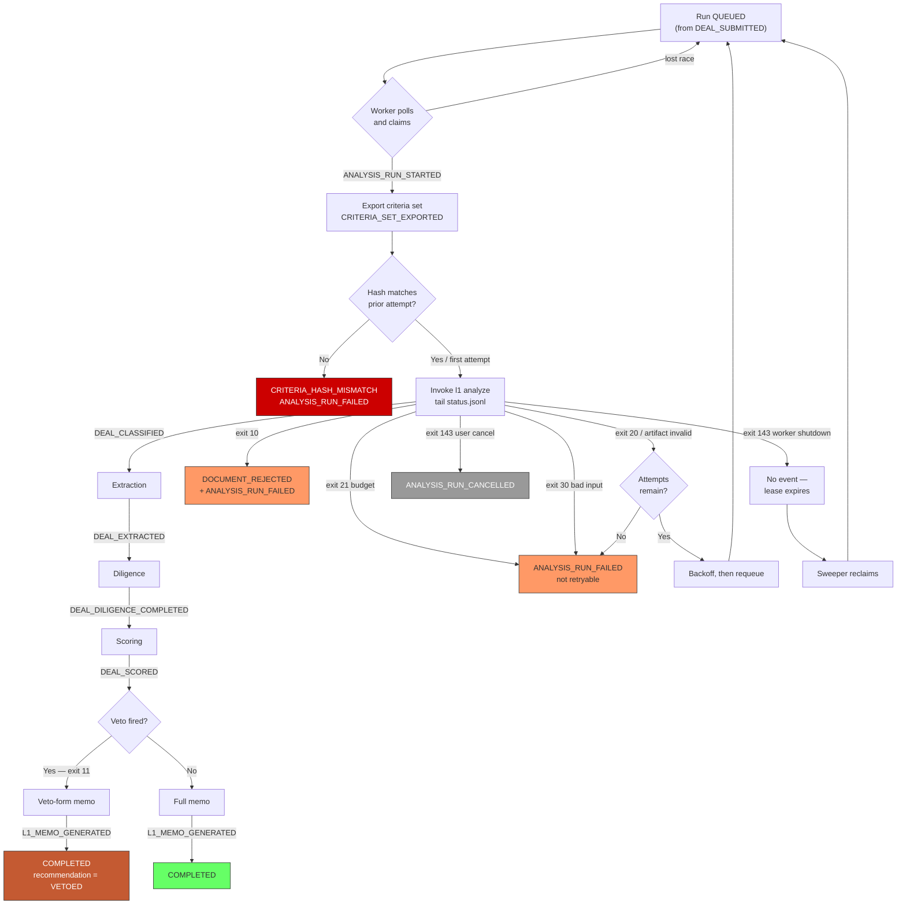

# PRD 02 — Analysis Pipeline Module

> **Framework**: Phlo event-sourced platform. See `00-inbox/event-system-architecture.md` and `00-inbox/prd-guide.md`.
> **Scope**: This module is the bridge between Product B (Phlo) and Product A (the CLI, PRD 06). It owns the worker protocol, the run lifecycle, and the translation of engine output into events.
> **Read PRD 06 §2 (exit codes) and §3 (artifact contract) first.** This module consumes both and adds nothing to them.

---

### Project Identity

```
Project name: l1analysis
Company name: [TODO — confirm with stakeholder]
Display name: L1 Analysis Platform
Admin email domain: [TODO — confirm with stakeholder]
```

---

## 1. Process Overview

### Process: Analysis Run Orchestration

An Analysis Run is one execution of the analysis engine against one Document, scored against one frozen criteria set, producing one memo. It is the unit of work that everything else in the platform waits on.

The module exists because of a hard architectural constraint, stated in overview §6.1 and worth restating because everything below is downstream of it:

> **Phlo commits the event and all its projections synchronously, in a single transaction, inside the HTTP request path. An L1 analysis takes minutes to hours. Therefore analysis cannot run inside an event emission.**

There is no configuration that relaxes this. The `EventService.create_event()` call writes the event, fans out to every discovered projection service, and commits — all before the HTTP response returns. A projection service that shelled out to the CLI would hold a database transaction open for the duration of the analysis, block the request, and roll everything back on any failure mid-run.

So the pipeline is split. `DEAL_SUBMITTED` (PRD 01) creates an `AnalysisRun` row in status `QUEUED` — a cheap, synchronous, transactional write. A **separate long-lived worker process** polls for queued runs, does the slow work outside any request path, and reports back by emitting events through the ordinary public API like any other client. The worker holds no database session across the run and has no privileged path into Phlo. It authenticates with an API key and posts to `POST /api/v1/events/emit`.

The consequence worth internalising: **the worker is a client, not a component.** It can be restarted, run on another machine, run several instances, or be replaced entirely by a different orchestrator, without Phlo knowing. What Phlo knows is the event stream.

Flow:

```
   Queue                Claim               Execute              Report              Settle
   [ENTRY]             [ENTRY]              [ENTRY]              [ENTRY]             [ENTRY]
      |                   |                    |                    |                   |
DEAL_SUBMITTED     (worker polls,      (export criteria,     (tail status.jsonl)   (read exit code)
   (PRD 01)         claims run)         invoke CLI)                |                   |
      |                   |                    |             DEAL_CLASSIFIED     L1_MEMO_GENERATED
 run = QUEUED    ANALYSIS_RUN_STARTED   CRITERIA_SET_EXPORTED  DEAL_EXTRACTED           or
      |                   |                    |          DEAL_DILIGENCE_COMPLETED ANALYSIS_RUN_FAILED
   [EXIT]              [EXIT]               [EXIT]            DEAL_SCORED               or
                                                                   |            ANALYSIS_RUN_CANCELLED
                                                                [EXIT]                  |
                                                                                     [EXIT]
```

### The worker's contract with the engine, in one paragraph

The worker writes two things to disk (a criteria directory and an empty output directory), invokes one process (`l1 analyze`), watches one file (`status.jsonl`), reads five artifacts, and interprets one integer (the exit code). It parses no engine internals, imports no engine code, and makes no model calls of its own. If the engine's prompts, model, or stage implementation change entirely, the worker does not change — which is precisely the property that lets Product A be rebuilt without touching Product B.

---

## 2. Entities and Aggregates

| Entity | Aggregate Type | Relationships |
|---|---|---|
| Analysis Run | `AnalysisRun` | Belongs to one Deal and one Document. Has many Findings. Referenced by Memo (PRD 05) and Triage (PRD 04) |
| Finding | `Finding` | Belongs to one Analysis Run. Cites one Criterion (PRD 03) |
| Run Stage | `AnalysisRun` (not its own aggregate) | A child row of Analysis Run; carries per-stage timing and status |
| Worker | `Worker` | A worker process instance. Claims Analysis Runs |

### Entity Field Definitions

#### Analysis Run

| Field | Type | Description |
|---|---|---|
| id | UUID | Primary key |
| run_code | string | Human-readable identifier, format `RUN-{YYYY}-{NNNNNN}` |
| deal_id | UUID | FK → Deal (PRD 01) |
| document_id | UUID | FK → Document (PRD 01). The `SUBJECT` document being analysed — never an `EVIDENCE` document (PRD 01 §2a) |
| analysis_version_id | UUID | FK → Analysis Version (PRD 07). Null for the first run of a Deal; set for every re-run. **Added 2026-07-21 — see §2a below** |
| created_by_event | string | `DEAL_SUBMITTED` / `ANALYSIS_RERUN_REQUESTED`. Which event created this run. **Added 2026-07-21** |
| evidence_document_ids | UUID[] | `EVIDENCE` documents supplied to this run (PRD 07). Empty for a first run; accumulates across versions |
| criteria_set_id | UUID | FK → Criteria Set (PRD 03). Frozen at submission |
| criteria_set_version | decimal | Version of that set. Frozen at submission |
| criteria_content_hash | string | sha256 of the exported criteria YAML — proves what the engine actually read |
| status | string | Lifecycle status — see State Machine |
| current_stage | string | `CLASSIFICATION` / `EXTRACTION` / `DILIGENCE` / `SCORING` / `MEMO` / null |
| priority | string | `NORMAL` / `HIGH` — drives claim ordering |
| attempt_number | decimal | 1 for the first attempt; incremented on retry |
| max_attempts | decimal | Ceiling for automatic retries (default 3) |
| worker_id | UUID | The worker that holds the claim; null when unclaimed |
| claim_expires_at | datetime | Lease expiry. A claim past this is reclaimable |
| output_dir | string | Absolute path to the engine's artifact directory |
| engine_version | string | From `run.json`; null until the run produces it |
| engine_exit_code | decimal | The integer the CLI returned; null while running |
| queued_at | datetime | When `DEAL_SUBMITTED` created the row |
| started_at | datetime | When `ANALYSIS_RUN_STARTED` fired |
| completed_at | datetime | When the run reached a terminal status |
| duration_seconds | decimal | Wall-clock duration of the successful attempt |
| cost_usd | decimal | From `run.json`. Precision to 4 decimal places |
| failure_code | string | Machine-readable failure classification — see §3 |
| failure_detail | string | Human-readable failure message |
| is_retryable | boolean | Whether the failure permits an automatic retry |
| total_score | decimal | From `04-scoring.json`. Null until scored |
| recommendation | string | `PURSUE` / `HOLD` / `PASS` / `VETOED`. Null until scored |
| veto_fired | boolean | Whether any veto-tier criterion fired |
| findings_count | decimal | Denormalised count |
| unresolved_count | decimal | Count of items destined for memo section 11 |
| created_at | datetime | Record creation |
| updated_at | datetime | Last modification |

#### Run Stage

| Field | Type | Description |
|---|---|---|
| id | UUID | Primary key |
| analysis_run_id | UUID | FK → Analysis Run |
| stage | string | `CLASSIFICATION` / `EXTRACTION` / `DILIGENCE` / `SCORING` / `MEMO` |
| sequence | decimal | 1–5, the stage's position |
| status | string | `PENDING` / `RUNNING` / `COMPLETED` / `FAILED` / `SKIPPED` |
| started_at | datetime | From `status.jsonl` `started` line |
| completed_at | datetime | From `status.jsonl` `completed` line |
| duration_seconds | decimal | Reported by the engine |
| artifact_path | string | Relative path within `output_dir`, e.g. `01-classification.json` |
| artifact_sha256 | string | Hash of the artifact as read by the worker |
| progress_detail | string | Last `progress` line's detail, for live display |
| unresolved_count | decimal | Length of the artifact's `unresolved` array |
| created_at | datetime | Record creation |

#### Finding

| Field | Type | Description |
|---|---|---|
| id | UUID | Primary key |
| analysis_run_id | UUID | FK → Analysis Run |
| deal_id | UUID | FK → Deal, denormalised for cross-deal queries |
| criterion_id | UUID | FK → Criterion (PRD 03) |
| criterion_code | string | Denormalised, e.g. `CR-0010` |
| criterion_name | string | Denormalised at time of scoring — the criterion's text may later be superseded |
| tier | string | `GREEN_FLAG` / `RED_FLAG` / `VETO` |
| severity | string | `LOW` / `MEDIUM` / `HIGH` / `CRITICAL` |
| weight | decimal | The criterion's weight at scoring time |
| fired | boolean | Whether the criterion fired |
| evaluation_state | string | `FIRED` / `NOT_FIRED` / `CONTESTED` / `VETO_UNEVALUATED` — see note |
| confidence | string | `HIGH` / `MEDIUM` / `LOW` |
| score_contribution | decimal | Signed contribution to `total_score` |
| evidence | jsonb | Array of `{page, quote}` objects |
| absence_evidence | string | What was searched, when the finding is an absence |
| reasoning | string | The engine's stated reasoning |
| remediation | string | What to ask the manager; feeds memo section 10 |
| lenient_verdict | boolean | Result of the lenient pass |
| strict_verdict | boolean | Result of the strict pass |
| is_overridden | boolean | Set true by `MEMO_FINDING_OVERRIDDEN` (PRD 05) |
| override_verdict | boolean | The analyst's replacement verdict; null unless overridden |
| created_at | datetime | Record creation |

**On `evaluation_state`**: the four values are not collapsible into a boolean. `VETO_UNEVALUATED` (PRD 06 §5 stage 3) means a veto criterion could not be checked because a diligence source was unreachable — it is neither a clean pass nor a fired veto, and rendering it as either is exactly the conflation the engine's `unavailable ≠ passed` rule exists to prevent. `CONTESTED` means the lenient and strict passes disagreed. Both states must reach the UI as themselves.

#### Worker

| Field | Type | Description |
|---|---|---|
| id | UUID | Primary key |
| worker_code | string | Human-readable identifier, format `WRK-{NNNN}` |
| hostname | string | Where the worker runs |
| process_id | string | OS PID plus a boot-unique nonce |
| engine_version | string | Version of the CLI installed alongside this worker |
| status | string | `ONLINE` / `DRAINING` / `OFFLINE` |
| current_run_id | UUID | The run it holds, if any |
| last_heartbeat_at | datetime | Freshness signal |
| runs_completed | decimal | Lifetime counter |
| runs_failed | decimal | Lifetime counter |
| created_at | datetime | Record creation |

### Numbering

| Entity | Prefix | Format | Example |
|---|---|---|---|
| Analysis Run | RUN | `RUN-{YYYY}-{NNNNNN}` | RUN-2026-000318 |
| Worker | WRK | `WRK-{NNNN}` | WRK-0002 |

Findings and Run Stages have no human-readable code — they are always viewed in the context of their parent run and have no standalone detail page.

---

## 3. The Worker Protocol

This section is the substance of the module. The process steps in §4 are the events it emits; this is what it actually does between them.

### 3.1 Polling and claiming

The worker runs an unbounded loop with a fixed poll interval (default 5 seconds, jittered ±20% so that multiple workers do not synchronise).

```
loop:
  1. GET /api/v1/analysis-runs?status=QUEUED&order=priority_desc,queued_at_asc&limit=1
  2. if none: sleep(interval); continue
  3. attempt to claim the run
  4. if claim rejected (another worker won): continue immediately, no sleep
  5. execute the run
  6. settle the run
  7. continue
```

**Claiming is the one genuinely difficult part**, because Phlo has exactly one write endpoint and no compare-and-swap primitive exposed to clients. Two workers polling simultaneously will both see the same `QUEUED` run.

The claim is made by emitting `ANALYSIS_RUN_STARTED` with an `idempotency_key` of `run-claim:{analysis_run_id}:{attempt_number}`. Phlo's event-level idempotency (architecture doc, "Idempotency") enforces a unique constraint on that key: the first worker's emit succeeds, the second receives the *existing* event back rather than creating a new one. The second worker detects this by comparing the returned event's `actor_id`/`worker_id` against its own; if they differ, it lost the race and moves on without having corrupted anything.

This is a real mutual-exclusion primitive built on a unique index, not an approximation of one. It is worth stating explicitly because the obvious alternative — read the row, check `worker_id is null`, then write — is a check-then-act race that will produce duplicate runs under load.

**Lease, not lock.** The claim sets `claim_expires_at = now + lease_duration` (default 15 minutes). The worker renews the lease by emitting a heartbeat while the run executes (§3.6). A run whose lease has expired is reclaimable by any worker — this is what makes a worker that was SIGKILLed, lost power, or partitioned from the network recoverable without human intervention. The reclaiming worker increments `attempt_number`, which changes the idempotency key, which is why the key includes it.

### 3.2 Exporting the criteria set

Before invoking the CLI, the worker materialises the run's frozen criteria set to disk in the format PRD 06 §4 specifies.

```
1. GET /api/v1/criteria-sets/{criteria_set_id}          -> set metadata
2. GET /api/v1/criteria-sets/{criteria_set_id}/criteria -> all criteria (is_active only)
3. Render set.yaml and criteria.yaml into a temp directory
4. Compute sha256 over the concatenated canonical serialisation of both files
5. Atomically rename the temp directory into <run_dir>/criteria/
6. Emit CRITERIA_SET_EXPORTED with the export path and content hash
```

Two details matter.

**The hash covers content, not files.** It is computed over a canonical serialisation (sorted keys, normalised whitespace, criteria ordered by `criterion_code`) rather than over the YAML bytes, so that a cosmetic change in the YAML writer does not invalidate the reproducibility claim. This hash is written into `run.json` by the engine and stored on the run — it is the artifact that answers "which exact rules produced this score" independently of what the database says today (overview §6.2).

**The criteria set is re-exported on every attempt**, including retries. It cannot have changed — activated sets are immutable (PRD 03 §4) — so the hash must match across attempts. **If a retry produces a different content hash than the first attempt, that is a hard failure, not a warning**: it means an immutable set mutated, which invalidates the module's central guarantee. The worker aborts with `failure_code = CRITERIA_HASH_MISMATCH` and does not retry.

The export is genuinely re-done rather than cached because a cached export cannot detect that violation.

**Cross-module boundary**: `CRITERIA_SET_EXPORTED` is defined in PRD 03 §3 and emitted here. The Criteria module owns the event; the worker is the only emitter.

### 3.3 Invoking the CLI

```bash
l1 analyze <document_path> \
    --criteria <run_dir>/criteria \
    --out <run_dir>/out \
    --json \
    --max-budget-usd <configured_ceiling> \
    [--resume]          # only when resuming an interrupted attempt
```

| Concern | Handling |
|---|---|
| Working directory | `<run_dir>`, created fresh per attempt (except on `--resume`) |
| Document path | Resolved from the Document's `storage_path`, copied into `<run_dir>/input.pdf` first. **The worker never passes a path inside the shared blob store to a subprocess** — the engine copies its input and the copy is the one that gets read |
| Environment | `ANTHROPIC_API_KEY` from the worker's environment. Per overview §6.5, the worker is the one context where subscription auth is not permitted |
| stdout | Consumed line-by-line as JSON (`--json`). Used for logging only — `status.jsonl` is the authoritative progress stream |
| stderr | Captured to `<run_dir>/stderr.log`, truncated to the last 64 KB, and attached to `ANALYSIS_RUN_FAILED` on failure |
| Timeout | Hard wall-clock ceiling (default 4 hours). On expiry the worker sends SIGTERM, waits 60s, then SIGKILL |
| Sync-path guard | The worker refuses to start if `<run_dir>` resolves inside a known sync client tree (overview §6.6). This is checked once at worker startup, not per run |

The output directory is **not** the same directory as the criteria directory, and neither is the blob store. Three separate locations, one direction of data flow.

### 3.4 Tailing `status.jsonl` and emitting stage events

This is what makes the pipeline feel live rather than opaque. Without it, an analyst watching a 25-minute run sees a spinner and nothing else, and the natural conclusion after four minutes is that it has hung.

The worker opens `<run_dir>/out/status.jsonl` and follows it as the engine appends. For each line:

```jsonl
{"ts":"...","stage":"classification","event":"started"}
{"ts":"...","stage":"classification","event":"completed","artifact":"01-classification.json","duration_s":12}
{"ts":"...","stage":"extraction","event":"started"}
{"ts":"...","stage":"extraction","event":"progress","detail":"core schema 3/7"}
```

| Line `event` | Worker action |
|---|---|
| `started` | Update `run_stages` row to `RUNNING`, set `started_at`, set the run's `current_stage`. **No Phlo event emitted** |
| `progress` | Update `run_stages.progress_detail`. **No Phlo event emitted** |
| `completed` | Read and validate the named artifact, then **emit the corresponding stage event** |
| `failed` | Stop tailing; wait for process exit and settle from the exit code |

**Progress updates do not emit events, and that is deliberate.** A `progress` line is transient display state with no business meaning — emitting one as an event would pollute an immutable audit log with "core schema 3 of 7" forever, at a rate the engine controls. Instead, progress is written to the `run_stages` projection by a direct write from the worker's read endpoint. **This is the one place in the platform where a projection table is written outside the event flow, and it needs to be called out as an exception rather than discovered as an inconsistency.** The justification: `progress_detail` is not business state, is never audited, is never rebuilt from events, and is meaningless once the stage completes. It is the same category as `last_login_at` in the architecture doc's "What Is NOT Event-Sourced" section.

Stage-completion events *are* real events, because each carries analytical output that the platform depends on.

The mapping from stage completion to event:

| `status.jsonl` stage | Artifact read | Event emitted | Aggregate |
|---|---|---|---|
| `classification` | `01-classification.json` | `DEAL_CLASSIFIED` | `Deal` / deal_id |
| `extraction` | `02-extraction.json` | `DEAL_EXTRACTED` | `Deal` / deal_id |
| `diligence` | `03-diligence.json` | `DEAL_DILIGENCE_COMPLETED` | `Deal` / deal_id |
| `scoring` | `04-scoring.json` | `DEAL_SCORED` | `Deal` / deal_id |
| `memo` | `05-memo.md` + `05-memo.json` | `L1_MEMO_GENERATED` | `Deal` / deal_id |

**Artifact validation before emission.** The worker does not emit a stage event on the strength of a `completed` line alone. It reads the artifact and checks:

1. The file exists and parses as JSON (or, for the memo, that both `.md` and `.json` exist)
2. `schema_version` matches a version the worker understands
3. The `unresolved` key is **present** — not merely truthy. Per PRD 06 §3, `unresolved` is mandatory even when empty, and a missing key means the artifact was produced by a stage that dropped what it could not find
4. `stage` in the envelope matches the stage the status line claimed

A failed validation produces `ANALYSIS_RUN_FAILED` with `failure_code = ARTIFACT_INVALID`, not a stage event. The engine may still be running at that point; the worker terminates it.

**Ordering.** Stage events must be emitted in stage order. The worker processes `status.jsonl` strictly sequentially and never emits stage N+1's event before stage N's has been committed, even if the engine has already written both artifacts. Out-of-order emission would let a memo appear in the projections before the score it is supposed to agree with.

### 3.5 Settling from the exit code

When the process exits, the worker reads the exit code and settles the run. The mapping is fixed by PRD 06 §2:

| Exit | Meaning | Worker action | Run status | Retry |
|---|---|---|---|---|
| **0** | Success — all stages completed, memo written | Verify `L1_MEMO_GENERATED` was already emitted during tailing; if the tail missed it (see below), emit it now from the artifacts | `COMPLETED` | — |
| **10** | Document not analysable | Emit `DOCUMENT_REJECTED` (PRD 01) with reason `NOT_ANALYSABLE_TYPE`, then `ANALYSIS_RUN_FAILED` with `failure_code = DOCUMENT_NOT_ANALYSABLE`, `is_retryable = false` | `FAILED` | Never |
| **11** | Veto fired; analysis halted early | Emit `DEAL_SCORED` with `veto_fired = true`, then `L1_MEMO_GENERATED` (the veto-form memo). **This is a successful run** | `COMPLETED` | — |
| **20** | Recoverable stage failure | Emit `ANALYSIS_RUN_FAILED` with `failure_code = STAGE_FAILURE`, `is_retryable = true` | `FAILED` | Yes, up to `max_attempts` |
| **21** | Budget exceeded | Emit `ANALYSIS_RUN_FAILED` with `failure_code = BUDGET_EXCEEDED`, `is_retryable = false` | `FAILED` | Only after a human raises the budget |
| **30** | Invalid input — bad PDF, malformed criteria | Emit `ANALYSIS_RUN_FAILED` with `failure_code = INVALID_INPUT`, `is_retryable = false` | `FAILED` | Never |
| **143** | SIGTERM | Emit `ANALYSIS_RUN_CANCELLED` if the worker itself sent the signal for a cancellation request; otherwise emit nothing and let the lease expire so the run is reclaimed and resumed | `CANCELLED` or `QUEUED` | Resume |
| *anything else* | Unmapped | Emit `ANALYSIS_RUN_FAILED` with `failure_code = UNKNOWN_EXIT_CODE` and the raw code in `failure_detail`, `is_retryable = true` for one attempt only | `FAILED` | One retry |

**Exit 11 is the case most likely to be implemented wrong.** A veto is a completed analysis with a terminal finding, not a failure. The run's status is `COMPLETED`, the memo exists and is readable, `recommendation` is `VETOED`, and the Deal proceeds to triage — where a human decides what to do with a vetoed fund, which is often "tell the manager why" rather than silence. Treating exit 11 as a failure would hide the single most decision-relevant output the engine produces.

**Exit 143 is ambiguous by nature** and the disambiguation is the worker's own intent, not anything in the signal. If the worker sent SIGTERM because a user requested cancellation, this is `ANALYSIS_RUN_CANCELLED`. If the worker sent SIGTERM because it is itself shutting down, or if the process was killed by something else, the correct action is to emit nothing at all — the run keeps its `RUNNING` status, its lease expires, and another worker (or the same one after restart) reclaims and resumes it. Emitting a failure in that case would convert a recoverable interruption into a permanent one.

**The "tail missed it" case in exit 0.** If the worker's tail is behind when the process exits — which happens when the memo stage's final write and the process exit land in the same filesystem flush — the worker drains the remainder of `status.jsonl` after exit before settling. Only if a stage event is still missing after the drain does it emit from the artifacts directly. Emission remains idempotent because every stage event carries `idempotency_key = stage-event:{run_id}:{stage}:{attempt_number}`, so a double-emit from tail-plus-drain is absorbed by Phlo rather than producing two `DEAL_SCORED` events.

### 3.6 Heartbeat and lease renewal

Every 60 seconds while a run executes, the worker renews its lease. This is a direct write to `analysis_runs.claim_expires_at` and `workers.last_heartbeat_at` via a small worker-only endpoint — **not an event**, for the same reason progress is not an event: it is liveness state, not business state, and at one write per minute per run it would otherwise become the highest-volume event type in the store while carrying no analytical value.

A worker whose heartbeat stops for longer than the lease duration has its runs reclaimed. A worker whose heartbeat stops entirely is marked `OFFLINE` by a sweeper (§3.8).

### 3.7 Resuming after worker restart

This is the scenario that determines whether the pipeline is operationally credible. A worker restart — a deploy, a crash, an OOM kill — must not lose a run that is 20 minutes and $1.20 into a 25-minute analysis.

The engine is designed for this: stages communicate only through artifacts on disk, never shared memory, which is what makes `--resume` possible (PRD 06 §5). The worker's job is to recognise the situation and use it.

**On startup**, the worker:

```
1. Register itself: emit nothing, POST a worker registration to the worker endpoint,
   receive its worker_id (re-using the prior identity if hostname+PID nonce matches
   a DRAINING record).
2. Query for runs in status RUNNING whose claim_expires_at is in the past
   OR whose worker_id matches this worker's prior identity.
3. For each such run, decide: resume or restart?
```

The resume decision:

| Condition | Decision |
|---|---|
| `<run_dir>` exists, contains `out/run.json`, and at least one stage artifact validates | **Resume.** Re-claim with `attempt_number` unchanged, invoke with `--resume` |
| `<run_dir>` exists but no artifact validates | **Restart.** Delete `<run_dir>`, increment `attempt_number`, fresh invocation |
| `<run_dir>` does not exist (worker restarted on a different host with no shared volume) | **Restart.** Increment `attempt_number`, fresh invocation |
| `attempt_number` already equals `max_attempts` | **Fail.** Emit `ANALYSIS_RUN_FAILED` with `failure_code = MAX_ATTEMPTS_EXHAUSTED` |

**Re-emission on resume is prevented by the artifacts, not by memory.** When the engine resumes, it skips stages whose artifacts already exist and validate — so those stages emit no new `completed` line and the worker emits no duplicate event. Where the engine does re-run a stage (because its artifact was incomplete), the re-emission is absorbed by the stage event's idempotency key, which is keyed on `attempt_number` — so a genuinely re-executed stage on the *same* attempt is idempotent, while a re-executed stage on a *new* attempt correctly produces a new event reflecting the new output.

**Multi-host caveat**: resume requires `<run_dir>` to be reachable. If workers run on multiple hosts without a shared volume, resume degrades to restart for any run whose host is gone. This is acceptable and should be stated in operational documentation rather than engineered around. **[NEEDS REVIEW — whether to require a shared volume for multi-worker deployments is a deployment decision, not a design one, but it changes the retry cost materially.]**

### 3.8 The sweeper

A small periodic task, running in the worker (or in any one worker, elected by the same idempotency-key mechanism), that handles what polling cannot:

| Condition | Action |
|---|---|
| Run in `RUNNING` with `claim_expires_at` past | Return to `QUEUED` for reclaim; do not increment `attempt_number` (the reclaiming worker does that) |
| Worker with `last_heartbeat_at` older than 3× lease duration | Mark `OFFLINE` |
| Run in `QUEUED` for longer than the alert threshold | Raise a queue-depth alert; no state change |
| Run in `FAILED` with `is_retryable = true` and `attempt_number < max_attempts` | Return to `QUEUED` after backoff (§3.9) |

### 3.9 Retry policy

| Failure | Retryable | Backoff | Notes |
|---|---|---|---|
| `STAGE_FAILURE` (exit 20) | Yes | 2 min, 8 min, 32 min | Exponential, ×4, jittered ±25% |
| `UNKNOWN_EXIT_CODE` | Once | 5 min | One attempt, then treated as permanent |
| `ARTIFACT_INVALID` | Yes | 2 min, 8 min | An artifact that fails validation twice indicates an engine bug, not a transient fault |
| `WORKER_LOST` (lease expiry) | Yes | Immediate | Not really a retry — a reclaim. Counts against `max_attempts` |
| `BUDGET_EXCEEDED` (exit 21) | No | — | Requires a human to raise the ceiling, then a manual requeue |
| `INVALID_INPUT` (exit 30) | No | — | The input will not become valid by waiting |
| `DOCUMENT_NOT_ANALYSABLE` (exit 10) | No | — | Terminal, and the Document is rejected |
| `CRITERIA_HASH_MISMATCH` | No | — | An invariant violation. Requires investigation, not a retry |
| `MAX_ATTEMPTS_EXHAUSTED` | No | — | Terminal |

`max_attempts` defaults to 3 and is configurable per run at submission. **Retries are not free** — each one re-runs the engine and re-incurs the model spend, and the engine's own `--max-budget-usd` applies per invocation, not per run. Three attempts at a $1.42 run is $4.26. **[NEEDS REVIEW — should the budget ceiling be per-run rather than per-attempt? Per-run is more correct and requires the worker to pass a decremented ceiling on each retry, which the CLI supports today via `--max-budget-usd` but which nothing currently computes.]**

---

## 4. Process Steps

### Step: Queue Analysis Run

Event type: `DEAL_SUBMITTED` *(emitted by PRD 01 — handled here)*

Trigger:
  Not a step this module emits. `DEAL_SUBMITTED` arrives from Intake; this module's projection service responds by creating the run record.

Data points captured:
  See PRD 01 §3 "Promote Document to Deal".

Payload:
  See PRD 01.

Aggregate: `Deal` / `deal_id`

Location: None. This process does not involve physical locations.

Preconditions:
  - Enforced by PRD 01 at emission

Side effects:
  - `analysis_runs`: new row, status `QUEUED`, `attempt_number` = 1, `criteria_set_id` and `criteria_set_version` copied from the payload
  - `run_stages`: five rows created in status `PENDING`, one per stage
  - **No analysis begins.** Per overview §6.1, this transaction commits and returns; the worker picks the run up on its next poll

Projections updated:
  - `analysis_runs`: new row
  - `run_stages`: 5 new rows
  - `pipeline_queue_depth`: `queued_count` += 1

Permissions:
  - Enforced at emission by PRD 01 (`events:DEAL_SUBMITTED:emit`)

---

### Step: Start Analysis Run

Event type: `ANALYSIS_RUN_STARTED`

Trigger:
  Worker polls, finds a `QUEUED` run, and claims it by emitting this event with an idempotency key. Not a user action.

Data points captured:
  - analysis_run_id: UUID
  - worker_id: UUID — the claiming worker
  - attempt_number: decimal
  - engine_version: string — the CLI version this worker will invoke
  - output_dir: string — where artifacts will be written
  - claim_expires_at: datetime — lease expiry

Payload:
```
analysis_run_id: UUID
deal_id: UUID
document_id: UUID
worker_id: UUID
worker_code: string
attempt_number: decimal
engine_version: string
output_dir: string
claim_expires_at: datetime
started_at: datetime
```

Aggregate: `AnalysisRun` / `analysis_run_id`

Location: None.

Preconditions:
  - Run status must be `QUEUED`
  - `attempt_number` in the payload must equal the run's current `attempt_number`
  - No other worker holds an unexpired claim
  - `idempotency_key` = `run-claim:{analysis_run_id}:{attempt_number}` — the unique constraint on this key is the mutual exclusion mechanism (§3.1)

Side effects:
  - `analysis_runs`: status → `RUNNING`, `worker_id`, `started_at`, `claim_expires_at`, `engine_version`, `output_dir` set
  - `deals`: status → `ANALYSING` (PRD 01 state machine)
  - `workers`: `current_run_id` set, `status` → `ONLINE`
  - `pipeline_queue_depth`: `queued_count` -= 1, `running_count` += 1
  - The worker then exports criteria (§3.2) and invokes the CLI (§3.3) — outside this transaction

Projections updated:
  - `analysis_runs`: status, worker_id, started_at, claim_expires_at, engine_version, output_dir, attempt_number
  - `deals`: status → ANALYSING
  - `workers`: current_run_id, status
  - `pipeline_queue_depth`: queued_count, running_count

Permissions:
  - `events:ANALYSIS_RUN_STARTED:emit` (worker service account only)

---

### Step: Classify Deal

Event type: `DEAL_CLASSIFIED`

Trigger:
  Worker reads a `{"stage":"classification","event":"completed"}` line from `status.jsonl`, validates `01-classification.json`, and emits.

Data points captured:
  - document_type: string — from the engine's classification
  - is_analysable: boolean
  - fund_name: string — the engine's reading of the fund name
  - manager_name: string
  - aif_category: string — `CAT_I` / `CAT_II` / `CAT_III` / `NON_AIF`
  - aif_category_confidence: string — `STATED` / `INFERRED`
  - structure: string — `OPEN_ENDED` / `CLOSE_ENDED`
  - strategy: string
  - sebi_registration: string? — null when absent from the document
  - unresolved: string[] — mandatory, may be empty

Payload:
```
analysis_run_id: UUID
deal_id: UUID
document_id: UUID
stage: "CLASSIFICATION"
document_type: string
is_analysable: boolean
fund_name: string
manager_name: string
aif_category: string
aif_category_confidence: string
structure: string
strategy: string
sebi_registration: string?
unresolved: string[]
artifact_path: string
artifact_sha256: string
duration_seconds: decimal
```

Aggregate: `Deal` / `deal_id`

Location: None.

Preconditions:
  - Run status must be `RUNNING`
  - Run's `current_stage` must be `CLASSIFICATION`
  - `01-classification.json` must exist, parse, carry `schema_version` the worker understands, and contain the `unresolved` key
  - `idempotency_key` = `stage-event:{run_id}:classification:{attempt_number}`

Side effects:
  - `run_stages`: classification row → `COMPLETED`
  - `analysis_runs`: `current_stage` → `EXTRACTION`
  - `deals`: `aif_category`, `strategy`, and — **only if the Deal's values are still the intake proposals and have not been analyst-confirmed** — `fund_name` and `manager_name` are updated. The engine's classification is authoritative over an intake heuristic but not over an analyst's explicit correction
  - **If `aif_category_confidence` is `INFERRED`**, a caveat flag is set on the run so the memo and the triage list can display it. A gating decision made on an inferred category must be visible as such
  - **If `is_analysable` is false**, the engine will exit 10; the worker handles that at settlement, not here

Projections updated:
  - `run_stages`: status → COMPLETED, completed_at, artifact_path, artifact_sha256, unresolved_count
  - `analysis_runs`: current_stage → EXTRACTION
  - `deals`: aif_category, strategy, conditionally fund_name/manager_name
  - `deal_classification`: new row with the full classification result

Permissions:
  - `events:DEAL_CLASSIFIED:emit` (worker service account only)

**Cross-module boundary**: PRD 04 consumes `DEAL_CLASSIFIED` — the AIF category determines which stage gates apply and which criteria scope was in force.

---

### Step: Extract Deal Facts

Event type: `DEAL_EXTRACTED`

Trigger:
  Worker reads `{"stage":"extraction","event":"completed"}`, validates `02-extraction.json`, emits.

Data points captured:
  - fund_terms: object — size, term, investment period, drawdowns
  - economics: object — management fee, hurdle, carry, catch-up treatment
  - team: object[] — named key persons with roles
  - track_record: object — predecessor funds and their status
  - portfolio_construction: object — target investment count, sectors, concentration
  - service_providers: object — auditor, legal, tax, custodian, registrar
  - field_count: decimal — how many fields were extracted
  - fields_with_citations: decimal — how many carry a page reference
  - unresolved: string[]

Payload:
```
analysis_run_id: UUID
deal_id: UUID
document_id: UUID
stage: "EXTRACTION"
fund_terms: object
economics: object
team: object[]
track_record: object
portfolio_construction: object
service_providers: object
target_size_amount: decimal?
target_size_currency: string?
field_count: decimal
fields_with_citations: decimal
unresolved: string[]
artifact_path: string
artifact_sha256: string
duration_seconds: decimal
```

Aggregate: `Deal` / `deal_id`

Location: None.

Preconditions:
  - Run status `RUNNING`, `current_stage` = `EXTRACTION`
  - `DEAL_CLASSIFIED` must already be committed for this run and attempt — the artifact contract requires extraction to have received classification (PRD 06 §6.1)
  - Artifact validation as above
  - **`fields_with_citations` must equal `field_count`.** PRD 06 §5 stage 2 states that a field with no page reference is invalid output. The worker checks this rather than trusting it; a mismatch is `ARTIFACT_INVALID`

Side effects:
  - `run_stages`: extraction row → `COMPLETED`
  - `analysis_runs`: `current_stage` → `DILIGENCE`
  - `deals`: `target_size_amount`, `target_size_currency` populated
  - `deal_extractions`: new row holding the full structured extraction
  - `deal_document_timeline` (PRD 01): headline metrics filled for this document

Projections updated:
  - `run_stages`, `analysis_runs`, `deals`, `deal_extractions`, `deal_document_timeline`

Permissions:
  - `events:DEAL_EXTRACTED:emit` (worker service account only)

**Cross-module boundary**: PRD 01's projection service handles this event to populate `deal_document_timeline` — the cross-vintage comparison view.

---

### Step: Complete Diligence

Event type: `DEAL_DILIGENCE_COMPLETED`

Trigger:
  Worker reads `{"stage":"diligence","event":"completed"}`, validates `03-diligence.json`, emits.

Data points captured:
  - checks: object[] — each `{check_code, outcome, source, detail}` where outcome is `PASSED` / `FAILED` / `UNAVAILABLE`
  - checks_passed: decimal
  - checks_failed: decimal
  - checks_unavailable: decimal
  - sebi_registration_verified: boolean?  — null when the check was unavailable
  - unresolved: string[]

Payload:
```
analysis_run_id: UUID
deal_id: UUID
stage: "DILIGENCE"
checks: object[]
checks_passed: decimal
checks_failed: decimal
checks_unavailable: decimal
sebi_registration_verified: boolean?
unresolved: string[]
artifact_path: string
artifact_sha256: string
duration_seconds: decimal
```

Aggregate: `Deal` / `deal_id`

Location: None.

Preconditions:
  - Run status `RUNNING`, `current_stage` = `DILIGENCE`
  - `DEAL_CLASSIFIED` and `DEAL_EXTRACTED` committed for this run and attempt
  - **Every check must carry one of exactly three outcomes.** A check with a boolean outcome, or with `UNAVAILABLE` collapsed into `PASSED`, fails validation. PRD 06 §5 stage 3 is explicit that `unavailable` and `passed` must never be conflated, and this is the checkpoint where that is enforced mechanically rather than trusted

Side effects:
  - `run_stages`: diligence row → `COMPLETED`
  - `analysis_runs`: `current_stage` → `SCORING`
  - `deal_diligence_checks`: one row per check
  - **An unreachable source never fails the run** (PRD 06 §5 stage 3). `checks_unavailable > 0` is normal and surfaces in memo section 11

Projections updated:
  - `run_stages`, `analysis_runs`, `deal_diligence_checks`

Permissions:
  - `events:DEAL_DILIGENCE_COMPLETED:emit` (worker service account only)

---

### Step: Score Deal

Event type: `DEAL_SCORED`

Trigger:
  Worker reads `{"stage":"scoring","event":"completed"}`, validates `04-scoring.json`, emits. **Also emitted on exit 11** (veto), where scoring halted early and the engine wrote the artifact before exiting.

Data points captured:
  - total_score: decimal
  - recommendation: string — `PURSUE` / `HOLD` / `PASS` / `VETOED`
  - veto_fired: boolean
  - criteria_set_id: UUID
  - criteria_set_version: decimal
  - criteria_content_hash: string
  - findings: object[] — one per criterion evaluated, with tier, evaluation_state, evidence, reasoning, remediation
  - findings_fired: decimal
  - findings_contested: decimal
  - findings_veto_unevaluated: decimal
  - unresolved: string[]

Payload:
```
analysis_run_id: UUID
deal_id: UUID
stage: "SCORING"
total_score: decimal
recommendation: string
veto_fired: boolean
criteria_set_id: UUID
criteria_set_version: decimal
criteria_content_hash: string
findings: [
  {
    criterion_id: UUID
    criterion_code: string
    criterion_name: string
    tier: string
    severity: string
    weight: decimal
    fired: boolean
    evaluation_state: string
    confidence: string
    score_contribution: decimal
    evidence: [{page: decimal, quote: string}]
    absence_evidence: string?
    reasoning: string
    remediation: string?
    lenient_verdict: boolean
    strict_verdict: boolean
  }
]
findings_fired: decimal
findings_contested: decimal
findings_veto_unevaluated: decimal
unresolved: string[]
artifact_path: string
artifact_sha256: string
duration_seconds: decimal
```

Aggregate: `Deal` / `deal_id`

Location: None.

Preconditions:
  - Run status `RUNNING`
  - `current_stage` = `SCORING`, **or** the run is settling on exit 11
  - `DEAL_CLASSIFIED`, `DEAL_EXTRACTED`, `DEAL_DILIGENCE_COMPLETED` committed for this run and attempt
  - `criteria_content_hash` in the artifact must equal the run's `criteria_content_hash` recorded at export (§3.2). A mismatch means the engine read different rules than were exported, which invalidates reproducibility — `CRITERIA_HASH_MISMATCH`, no retry
  - **Every fired finding must carry non-empty `evidence` or non-empty `absence_evidence`** (PRD 06 §6.3). Checked here in code, not trusted
  - Every finding's `criterion_id` must exist in the referenced criteria set

Side effects:
  - `run_stages`: scoring row → `COMPLETED`
  - `analysis_runs`: `current_stage` → `MEMO` (or terminal if exit 11), `total_score`, `recommendation`, `veto_fired`, `findings_count` set
  - `findings`: one row per finding
  - `deals`: becomes triageable — PRD 04's list surfaces scored deals
  - `criterion_hit_stats` (PRD 03): `deals_evaluated` += 1 for every criterion in the set; `times_fired` += 1 for each fired; `fire_rate_pct` recomputed
  - **On veto**: `recommendation` = `VETOED` and the run proceeds directly to memo generation in veto form

Projections updated:
  - `run_stages`, `analysis_runs`, `findings`, `criterion_hit_stats` (PRD 03), `pipeline_throughput_daily`

Permissions:
  - `events:DEAL_SCORED:emit` (worker service account only)

**Cross-module boundary**: this is the most widely consumed event in the platform. PRD 03 maintains `criterion_hit_stats` from it (its dead-rule detection depends on `deals_evaluated` incrementing for criteria that did *not* fire, so the payload carries every evaluated criterion, not only the fired ones). PRD 04 uses it to make a Deal triageable. PRD 05 renders findings from it.

---

### Step: Generate L1 Memo

Event type: `L1_MEMO_GENERATED`

Trigger:
  Worker reads `{"stage":"memo","event":"completed"}`, validates `05-memo.md` and `05-memo.json`, emits. Also emitted at settlement if the tail missed the line (§3.5).

Data points captured:
  - memo_markdown_path: string — path to `05-memo.md`
  - memo_json_path: string
  - memo_sha256: string
  - sections: object[] — 12 entries, each `{number, title, word_count, has_content}`
  - recommendation: string — as stated in the memo
  - unresolved_items: string[] — every entry destined for section 11
  - unresolved_count: decimal
  - citation_count: decimal
  - is_veto_form: boolean

Payload:
```
analysis_run_id: UUID
deal_id: UUID
stage: "MEMO"
memo_markdown_path: string
memo_json_path: string
memo_sha256: string
sections: [{number: decimal, title: string, word_count: decimal, has_content: boolean}]
recommendation: string
unresolved_items: string[]
unresolved_count: decimal
citation_count: decimal
is_veto_form: boolean
artifact_sha256: string
duration_seconds: decimal
engine_version: string
cost_usd: decimal
```

Aggregate: `Deal` / `deal_id`

Location: None.

Preconditions:
  - Run status `RUNNING`
  - `DEAL_SCORED` committed for this run and attempt
  - Both `05-memo.md` and `05-memo.json` exist
  - `sections` must contain exactly 12 entries matching the section list in PRD 06 §5 stage 5
  - **Section 11 ("What We Could Not Determine") must have `has_content` true whenever any prior stage reported a non-empty `unresolved` array.** A memo that drops what the pipeline could not establish presents partial analysis as complete, and this is the check that prevents it reaching a reader
  - **`recommendation` in the memo must equal `recommendation` in `04-scoring.json`.** The engine enforces this internally (PRD 06 §6.2); the worker verifies it independently, because a contradiction between memo and scorecard is the single failure mode the whole design is arranged around and one check is not enough for it

Side effects:
  - `run_stages`: memo row → `COMPLETED`
  - `analysis_runs`: status → `COMPLETED`, `completed_at`, `duration_seconds`, `cost_usd`, `unresolved_count` set; `worker_id` cleared
  - `deals`: status → `ANALYSED` (PRD 01 state machine)
  - `memos` (PRD 05): new row, status `UNREVIEWED`
  - `memo_sections` (PRD 05): 12 rows, each `UNREVIEWED`
  - `workers`: `current_run_id` cleared, `runs_completed` += 1
  - `pipeline_queue_depth`: `running_count` -= 1
  - `pipeline_throughput_daily`: `completed_count` += 1, cost and duration accumulated

Projections updated:
  - `run_stages`, `analysis_runs`, `deals`, `memos`, `memo_sections`, `workers`, `pipeline_queue_depth`, `pipeline_throughput_daily`

Permissions:
  - `events:L1_MEMO_GENERATED:emit` (worker service account only)

**Cross-module boundary**: PRD 05 creates its `memos` and `memo_sections` rows from this event. PRD 04 uses it to move the Deal into a triageable state with a readable memo.

---

### Step: Fail Analysis Run

Event type: `ANALYSIS_RUN_FAILED`

Trigger:
  Worker settles a non-zero, non-11 exit code (§3.5), or detects an artifact validation failure, or the sweeper exhausts `max_attempts`.

Data points captured:
  - analysis_run_id: UUID
  - failure_code: string — see the retry table in §3.9
  - failure_detail: string — human-readable, includes truncated stderr where relevant
  - engine_exit_code: decimal?
  - failed_stage: string? — which stage was running
  - attempt_number: decimal
  - is_retryable: boolean
  - next_retry_at: datetime? — when the sweeper will requeue, if retryable

Payload:
```
analysis_run_id: UUID
deal_id: UUID
document_id: UUID
failure_code: string
failure_detail: string
engine_exit_code: decimal?
failed_stage: string?
attempt_number: decimal
is_retryable: boolean
next_retry_at: datetime?
stderr_excerpt: string?
cost_usd: decimal?
```

Aggregate: `AnalysisRun` / `analysis_run_id`

Location: None.

Preconditions:
  - Run status must be `RUNNING`
  - `failure_code` must be one of the defined values

Side effects:
  - `analysis_runs`: status → `FAILED`, `failure_code`, `failure_detail`, `engine_exit_code`, `is_retryable`, `completed_at`; `worker_id` cleared
  - `deals`: status → `SUBMITTED` (PRD 01 — a failed run leaves the Deal owed an analysis)
  - `workers`: `current_run_id` cleared, `runs_failed` += 1
  - `pipeline_queue_depth`: `running_count` -= 1, `failed_count` += 1
  - **If `is_retryable` and `attempt_number < max_attempts`**: the sweeper returns the run to `QUEUED` after backoff. This is a projection-driven state change with no separate event — the run's re-entry to `QUEUED` is recorded by the *next* `ANALYSIS_RUN_STARTED` with an incremented `attempt_number`
  - **On `failure_code = DOCUMENT_NOT_ANALYSABLE`**: `DOCUMENT_REJECTED` (PRD 01) is emitted first, before this event

Projections updated:
  - `analysis_runs`, `deals`, `workers`, `pipeline_queue_depth`, `pipeline_failure_stats`

Permissions:
  - `events:ANALYSIS_RUN_FAILED:emit` (worker service account only)

---

### Step: Cancel Analysis Run

Event type: `ANALYSIS_RUN_CANCELLED`

Trigger:
  Analyst clicks "Cancel Run" on the Run Detail screen, or Super Admin cancels from the Pipeline dashboard. The request marks a cancellation flag; the worker observes it on its next heartbeat, sends SIGTERM to the engine, waits for exit 143, and emits.

Data points captured:
  - analysis_run_id: UUID
  - cancellation_reason: string — `USER_REQUESTED` / `DEAL_WITHDRAWN` / `SUPERSEDED_BY_NEWER_DOCUMENT` / `ADMIN_INTERVENTION`
  - cancellation_note: string (optional)
  - cancelled_at_stage: string — which stage was running
  - cost_usd: decimal — spend incurred before cancellation

Payload:
```
analysis_run_id: UUID
deal_id: UUID
cancellation_reason: string
cancellation_note: string?
cancelled_at_stage: string?
cost_usd: decimal?
requested_by_user_id: UUID
cancelled_at: datetime
```

Aggregate: `AnalysisRun` / `analysis_run_id`

Location: None.

Preconditions:
  - Run status must be `QUEUED` or `RUNNING`
  - A `COMPLETED` or `FAILED` run cannot be cancelled

Side effects:
  - `analysis_runs`: status → `CANCELLED`, `completed_at`, `cost_usd`; `worker_id` cleared
  - `deals`: status → `SUBMITTED` (the Deal is still owed an analysis; the analyst may requeue or leave it)
  - `workers`: `current_run_id` cleared
  - `pipeline_queue_depth`: decremented from whichever bucket the run was in
  - **Artifacts are retained.** A cancelled run's partial output stays on disk and its completed stages remain visible. An analyst who cancels a run at the diligence stage can still read the classification and extraction — which is often why they cancelled

Projections updated:
  - `analysis_runs`, `deals`, `workers`, `pipeline_queue_depth`

Permissions:
  - `events:ANALYSIS_RUN_CANCELLED:emit` (Analyst, Super Admin, and worker service account)

**Note on cancellation of a `QUEUED` run**: no worker holds it, so there is no process to signal. The event is emitted directly by the request and the run is simply never claimed. The worker's poll query excludes `CANCELLED`.

---

## 5. State Machines

### §2a. Two events create an Analysis Run (added 2026-07-21)

> Fixes inconsistency 12.1 raised in PRD 07 §12. This PRD originally assumed `DEAL_SUBMITTED` was the only way a run comes into existence. The evidence loop introduces a second.

| Creator | When | `analysis_version_id` | `evidence_document_ids` |
|---|---|---|---|
| `DEAL_SUBMITTED` (PRD 01) | First analysis of a Deal | Null — v1 is implicit | Empty |
| `ANALYSIS_RERUN_REQUESTED` (PRD 07) | Analyst re-runs after supplying evidence | Set — v2, v3, … | Accumulated across versions |

**The worker protocol is unchanged.** It polls for `QUEUED` runs and does not care who queued them. That is the point of routing both through the same status: a re-run is not a special kind of execution, only a differently-originated one. Everything in §3 — claiming, criteria export, CLI invocation, status tailing, exit-code mapping, retry, resume — applies identically.

Two consequences worth stating:

- **`created_by_event` is a discriminator, not a branch.** It exists so reports can separate first-pass throughput from re-run volume — a deployment where most runs are re-runs is telling you something about deck quality or criteria tuning. It must not be used to vary execution behaviour.
- **A re-run passes evidence to the CLI.** The worker materialises `evidence_document_ids` into the evidence directory and adds `--evidence <dir>` to the invocation (PRD 06 change request, PRD 07 §11). A first run omits the flag entirely rather than passing an empty directory, so the engine can distinguish "no evidence supplied" from "evidence supplied and empty".

---

### Analysis Run States

Statuses: `QUEUED`, `RUNNING`, `COMPLETED`, `FAILED`, `CANCELLED`

Transitions:

| From Status | Event | To Status |
|---|---|---|
| — | `DEAL_SUBMITTED` (PRD 01) | `QUEUED` |
| — | `ANALYSIS_RERUN_REQUESTED` (PRD 07) | `QUEUED` |
| `QUEUED` | `ANALYSIS_RUN_STARTED` | `RUNNING` |
| `QUEUED` | `ANALYSIS_RUN_CANCELLED` | `CANCELLED` |
| `RUNNING` | `L1_MEMO_GENERATED` | `COMPLETED` |
| `RUNNING` | `ANALYSIS_RUN_FAILED` | `FAILED` |
| `RUNNING` | `ANALYSIS_RUN_CANCELLED` | `CANCELLED` |
| `RUNNING` | *(lease expiry, sweeper)* | `QUEUED` |
| `FAILED` | *(sweeper retry, `is_retryable` and attempts remain)* | `QUEUED` |
| `FAILED` | `ANALYSIS_RUN_STARTED` (manual requeue) | `RUNNING` |

```
                        ANALYSIS_RUN_STARTED
        QUEUED ──────────────────────────────────► RUNNING
          ▲  │                                       │ │ │
          │  └──ANALYSIS_RUN_CANCELLED──► CANCELLED ◄┘ │ │
          │                                (terminal)  │ │
          │                                            │ │
          │            L1_MEMO_GENERATED               │ │
          │       COMPLETED ◄───────────────────────────┘ │
          │       (terminal)                              │
          │                                               │
          │       FAILED ◄──────ANALYSIS_RUN_FAILED───────┘
          │         │                                     │
          └─────────┘                                     │
        (sweeper retry,          ┌──lease expiry──────────┘
         attempts remain)        │  (sweeper, no event)
          ▲                      │
          └──────────────────────┘
```

Notes:
- **`COMPLETED` includes the veto case.** A run that exits 11 is `COMPLETED` with `recommendation = VETOED`. Modelling a veto as a failure would be wrong: the analysis succeeded and produced its most decision-relevant possible output.
- **`RUNNING → QUEUED` carries no event.** Lease expiry is inferred from the clock, not asserted by anyone — the worker that would have emitted it is by definition unreachable. The sweeper performs the transition and the reclaim is recorded by the next `ANALYSIS_RUN_STARTED` with an incremented `attempt_number`. **[NEEDS REVIEW — an alternative is an `ANALYSIS_RUN_RECLAIMED` event emitted by the sweeper. It would make the audit trail complete at the cost of one more event type. Argued for: an operator investigating a run that took three attempts currently has to infer the reclaims from attempt numbers.]**
- `CANCELLED` and `COMPLETED` are terminal. A cancelled run is never resumed; the analyst requeues by creating a new run (which today means re-promoting, since runs are created only by `DEAL_SUBMITTED` — see Inconsistencies Found §12.4).
- `FAILED` is terminal only when `is_retryable` is false or attempts are exhausted.

### Run Stage States

Statuses: `PENDING`, `RUNNING`, `COMPLETED`, `FAILED`, `SKIPPED`

Transitions:

| From Status | Event | To Status |
|---|---|---|
| — | `DEAL_SUBMITTED` (5 rows created) | `PENDING` |
| `PENDING` | *(status.jsonl `started` line)* | `RUNNING` |
| `RUNNING` | *(stage event emitted)* | `COMPLETED` |
| `RUNNING` | `ANALYSIS_RUN_FAILED` | `FAILED` |
| `PENDING` | `ANALYSIS_RUN_FAILED` at an earlier stage | `SKIPPED` |
| `PENDING` | *(engine `--resume` skips a stage with a valid artifact)* | `COMPLETED` |
| `COMPLETED` | *(new attempt, stage re-runs)* | `RUNNING` |

Notes:
- `SKIPPED` distinguishes "never ran because an earlier stage failed" from "ran and failed". Without it, a failure at classification renders four stages as `PENDING` forever, which reads as a stuck run rather than a dead one.
- `PENDING → RUNNING` and `RUNNING → COMPLETED` for the stage row are driven by `status.jsonl`, not by events. The event carries the analytical result; the stage row carries the timing. They move together for stages 1–5 but the stage row moves first.
- On exit 11 (veto), stages after scoring are `SKIPPED` except memo, which runs in veto form.

### Worker States

Statuses: `ONLINE`, `DRAINING`, `OFFLINE`

| From Status | Trigger | To Status |
|---|---|---|
| — | Worker registers on startup | `ONLINE` |
| `ONLINE` | SIGTERM received; finishes current run, claims no more | `DRAINING` |
| `DRAINING` | Current run settles | `OFFLINE` |
| `ONLINE` | Heartbeat stale > 3× lease (sweeper) | `OFFLINE` |
| `OFFLINE` | Worker restarts with same identity | `ONLINE` |

`DRAINING` is what makes a deploy safe: the worker stops claiming, finishes what it holds, and exits cleanly. A worker that is SIGKILLed skips `DRAINING` entirely and its run is recovered by lease expiry instead — slower, but correct.

---

## 6. Reports and Projections

| # | Business Question | Projection Table | Key Fields | Updated By Events |
|---|---|---|---|---|
| 1 | "What is running right now, and what stage is each one on?" | `analysis_runs` | run_code, deal_id, status, current_stage, started_at, worker_id, attempt_number | `ANALYSIS_RUN_STARTED`, all stage events, `ANALYSIS_RUN_FAILED`, `ANALYSIS_RUN_CANCELLED`, `L1_MEMO_GENERATED` |
| 2 | "How far along is this specific run?" | `run_stages` | stage, sequence, status, started_at, duration_seconds, progress_detail, unresolved_count | All stage events + direct progress writes (§3.4) |
| 3 | "How deep is the queue and is it draining?" | `pipeline_queue_depth` | queued_count, running_count, failed_count, oldest_queued_at, avg_wait_seconds | `DEAL_SUBMITTED`, `ANALYSIS_RUN_STARTED`, `ANALYSIS_RUN_FAILED`, `L1_MEMO_GENERATED`, `ANALYSIS_RUN_CANCELLED` |
| 4 | "How many analyses did we complete this week, how long did they take, and what did they cost?" | `pipeline_throughput_daily` | date, completed_count, failed_count, cancelled_count, avg_duration_seconds, total_cost_usd, avg_cost_usd | `L1_MEMO_GENERATED`, `ANALYSIS_RUN_FAILED`, `ANALYSIS_RUN_CANCELLED` |
| 5 | "What is failing, and where?" | `pipeline_failure_stats` | failure_code, failed_stage, count, retry_success_rate_pct, last_seen_at | `ANALYSIS_RUN_FAILED`, `L1_MEMO_GENERATED` (for retry success attribution) |
| 6 | "Which criteria fired on this deal, with what evidence?" | `findings` | criterion_code, tier, severity, evaluation_state, confidence, evidence, absence_evidence, remediation | `DEAL_SCORED`, `MEMO_FINDING_OVERRIDDEN` (PRD 05) |
| 7 | "Which workers are alive and what are they doing?" | `workers` | worker_code, hostname, status, current_run_id, last_heartbeat_at, runs_completed, runs_failed | `ANALYSIS_RUN_STARTED`, `L1_MEMO_GENERATED`, `ANALYSIS_RUN_FAILED` + direct heartbeat writes |
| 8 | "What did the engine verify externally, and what could it not reach?" | `deal_diligence_checks` | check_code, outcome, source, detail | `DEAL_DILIGENCE_COMPLETED` |
| 9 | "What did this run extract, field by field, with page references?" | `deal_extractions` | field paths, values, page, quote, confidence | `DEAL_EXTRACTED` |
| 10 | "Which runs cost the most, and is spend trending?" | `pipeline_throughput_daily` | date, total_cost_usd, max_cost_usd, runs_over_budget | `L1_MEMO_GENERATED`, `ANALYSIS_RUN_FAILED` |
| 11 | "Show me everything that happened to this run" | *Not a projection* — query `movement_events` by `aggregate_type` = `AnalysisRun` and by `Deal`/`deal_id` | — | Automatic |

### Notes on report 5

`pipeline_failure_stats` is the report that determines whether the retry policy in §3.9 is calibrated or guessed. `retry_success_rate_pct` per `failure_code` is the number that matters: a failure class that never succeeds on retry should have `is_retryable = false`, and continuing to retry it burns model spend for nothing. This report is how that gets discovered rather than assumed.

### Pagination

Reports 1, 3, 4, 5, 7 and 10 are dashboard aggregates and paginate normally.

**Report 2 must return all five stage rows for a run unpaginated** — a progress display with pagination is absurd.

**Reports 6 and 9 need bulk access.** A criteria set with 40 criteria produces 40 findings per run, and the memo screen (PRD 05) needs every one of them at once to render the evidence drill-down. The extraction artifact for a 52-page deck can hold several hundred field entries. Both endpoints must accept a `deal_id` or `analysis_run_id` scope and return the full set without a page limit. The default API pagination limit will be too low for both.

---

## 7. Roles and Permissions

### Roles

| Role | Description | Permissions |
|---|---|---|
| Worker Service Account | The long-running worker process. Not a human | `events:ANALYSIS_RUN_STARTED:emit`, `events:DEAL_CLASSIFIED:emit`, `events:DEAL_EXTRACTED:emit`, `events:DEAL_DILIGENCE_COMPLETED:emit`, `events:DEAL_SCORED:emit`, `events:L1_MEMO_GENERATED:emit`, `events:ANALYSIS_RUN_FAILED:emit`, `events:ANALYSIS_RUN_CANCELLED:emit`, `events:CRITERIA_SET_EXPORTED:emit`, `events:DOCUMENT_REJECTED:emit`, `pipeline:claim`, `pipeline:heartbeat`, `criteria:read`, `intake:read` |
| Analyst | Watches runs, cancels, requeues failures | `events:ANALYSIS_RUN_CANCELLED:emit`, `pipeline:read`, `pipeline:requeue` |
| Super Admin | Everything an Analyst can do, plus worker management and budget overrides | All Analyst permissions plus `pipeline:manage_workers`, `pipeline:override_budget` |
| IC Member | Reads run status to know whether a memo is ready | `pipeline:read` |
| ODD Reviewer | Reads run status and diligence check results | `pipeline:read` |

### Permissions

| Permission Code | Description | Used By Step |
|---|---|---|
| `events:ANALYSIS_RUN_STARTED:emit` | Claim a queued run | Start Analysis Run |
| `events:DEAL_CLASSIFIED:emit` | Report classification output | Classify Deal |
| `events:DEAL_EXTRACTED:emit` | Report extraction output | Extract Deal Facts |
| `events:DEAL_DILIGENCE_COMPLETED:emit` | Report diligence output | Complete Diligence |
| `events:DEAL_SCORED:emit` | Report scoring output | Score Deal |
| `events:L1_MEMO_GENERATED:emit` | Report memo completion | Generate L1 Memo |
| `events:ANALYSIS_RUN_FAILED:emit` | Record a run failure | Fail Analysis Run |
| `events:ANALYSIS_RUN_CANCELLED:emit` | Cancel a run | Cancel Analysis Run |
| `pipeline:claim` | Poll for and claim queued runs | Worker protocol §3.1 |
| `pipeline:heartbeat` | Renew a lease, register a worker | Worker protocol §3.6 |
| `pipeline:read` | View runs, stages, findings, dashboards | All read screens |
| `pipeline:requeue` | Return a failed run to the queue manually | Run Detail screen |
| `pipeline:manage_workers` | Drain, deregister, inspect workers | Workers screen |
| `pipeline:override_budget` | Raise a run's budget ceiling after exit 21 | Run Detail screen |

**Design note on the worker's permission set**: it is broad in emission and narrow in everything else. The worker can emit eight event types but cannot read the deal book beyond what it needs, cannot author criteria, cannot triage, and cannot access memos other than the one it just produced. This matters because the worker's API key sits in an environment variable on a long-running process — the most likely credential in the platform to leak. Scoping it to "can report analysis results, can do nothing else" bounds the damage to false analysis records, which are detectable and correctable, rather than data exfiltration.

**`pipeline:claim` and `pipeline:heartbeat` are not event permissions** because claiming and heartbeating are not events. They gate the two worker-only read/write endpoints that exist outside the event flow (§3.4, §3.6).

---

## 8. Locations

This process does not involve physical locations. Events will not carry a `location_id`.

The worker's `hostname` is recorded on the Worker entity for operational purposes — knowing which machine ran a job — but this is infrastructure metadata, not a Phlo Location, and must not be modelled as one. Phlo locations exist for access filtering over physical sites; a compute host is neither.

---

## 9. Screen List

| # | Screen Name | Type | Used By | Purpose | Key Actions |
|---|---|---|---|---|---|
| 1 | Pipeline Dashboard | dashboard | Analyst, Super Admin | Queue depth, running runs with live stage, today's throughput, failures by code, worker health | Open Run, Open Queue, Open Workers |
| 2 | Analysis Runs | list | Analyst, Super Admin | All runs with status/stage/deal/date filters | Open, Cancel, Requeue, Export |
| 3 | Run Detail | detail | Analyst, Super Admin, IC Member | One run: stage timeline with durations, criteria set + hash, findings, artifacts, cost, event history | Cancel, Requeue, Raise Budget, Open Memo, Download Artifacts |
| 4 | Run Progress (live) | detail | Analyst | Real-time stage view for a running analysis — the five stages with elapsed time and current progress detail | Cancel |
| 5 | Findings | list | Analyst, IC Member, ODD Reviewer | All findings across runs, filterable by criterion, tier, evaluation state | Open Finding, Open Run, Open Criterion |
| 6 | Finding Detail | detail | Analyst, IC Member | One finding: evidence quotes with page numbers, absence evidence, reasoning, lenient vs strict verdicts, remediation | Open Source Page, Open Criterion, Override (→ PRD 05) |
| 7 | Failed Runs | list | Analyst, Super Admin | Failures with code, stage, attempt count, next retry time, stderr excerpt | Requeue, Raise Budget, Open Run, Reject Document |
| 8 | Workers | list | Super Admin | Every worker with status, current run, heartbeat age, lifetime counters | Drain, Deregister, Open Worker |
| 9 | Worker Detail | detail | Super Admin | One worker: current run, recent runs, engine version, host | Drain, Deregister |
| 10 | Pipeline Settings | form | Super Admin | Poll interval, lease duration, max attempts, default budget ceiling, run timeout | Save |

### Screen notes

**Screen 4 (Run Progress)** is where the constraint from overview §6.1 becomes a user-facing feature rather than an apology. Because the worker tails `status.jsonl` and writes progress continuously, the analyst sees "Extraction — core schema 3 of 7, 4m 12s elapsed" rather than a spinner. The design cost of the async architecture is real; this screen is where its benefit is visible.

**Screen 3 (Run Detail)** must show `criteria_content_hash` alongside the criteria set code and version. It is the artifact that makes the reproducibility claim checkable rather than asserted, and hiding it in a metadata panel wastes it.

**Screen 6 (Finding Detail)** must show the lenient and strict verdicts separately when they disagree, labelled as such. A `CONTESTED` finding rendered as a plain fired/not-fired loses the entire point of the dual-pass design.

**Screen 7 (Failed Runs)** needs the stderr excerpt visible without a click. The first question on any failure is "what went wrong", and requiring navigation to answer it makes the platform feel opaque at exactly the moment it should feel diagnosable.

### Palette-Searchable Entities

| Entity | Search by | Result label | Result description | Detail path |
|---|---|---|---|---|
| Analysis Run | run_code, deal fund_name | run_code | fund_name · status · current_stage | `/analysis-runs/{id}` |
| Worker | worker_code, hostname | worker_code | hostname · status · current run | `/workers/{id}` |

Findings and Run Stages are deliberately excluded — a Finding has no human-readable code of its own (it is identified by run plus criterion code, both of which are already searchable), and a Run Stage has no detail page.

Page-scoped shortcut requested: `c` on Run Detail opens the cancel confirmation. Cancelling a run that is burning budget is time-sensitive enough to deserve a key.

---

## 10. Process Flowchart



---

## 11. Cross-Module Boundaries

| Boundary | Direction | Detail |
|---|---|---|
| `DEAL_SUBMITTED` | **Consumed** from PRD 01 | Creates the `QUEUED` AnalysisRun and five `PENDING` stage rows |
| `DOCUMENT_REJECTED` | **Emitted** into PRD 01's aggregate | On engine exit 10. This module emits an event that PRD 01 owns and whose projection PRD 01 maintains |
| `DEAL_EXTRACTED` | **Emitted**, consumed by PRD 01 | Fills `deal_document_timeline` headline metrics |
| `DEAL_CLASSIFIED` | **Emitted**, consumed by PRD 04 | Sets AIF category, which determines applicable stage gates |
| `DEAL_SCORED` | **Emitted**, consumed by PRD 03, 04, 05 | PRD 03 maintains `criterion_hit_stats`; PRD 04 makes the deal triageable; PRD 05 renders findings |
| `L1_MEMO_GENERATED` | **Emitted**, consumed by PRD 04, 05 | PRD 05 creates `memos` and 12 `memo_sections` rows; PRD 04 marks the memo readable |
| `CRITERIA_SET_EXPORTED` | **Emitted** into PRD 03's aggregate | The event type is defined in PRD 03; this module is its only emitter |
| `MEMO_FINDING_OVERRIDDEN` | **Consumed** from PRD 05 | Sets `is_overridden` and `override_verdict` on the `findings` row this module owns |
| Criteria set read | **Read** from PRD 03 | Worker fetches the frozen set at §3.2 to export it |
| Deal status | **Written** into PRD 01's projection | `ANALYSIS_RUN_STARTED` → `ANALYSING`, `L1_MEMO_GENERATED` → `ANALYSED`, failure/cancel → `SUBMITTED` |
| CLI artifact contract | **Read** from PRD 06 §3 | The only interface to Product A. This module parses artifacts and exit codes and nothing else |

---

## 12. Inconsistencies Found

> Issues in `00-overview.md` and `06-analysis-engine.md` that this module could not resolve by design and that need a decision rather than a workaround. Recorded here per the drafting instruction rather than silently accommodated.

### 12.1 The overview's event catalogue omits `CRITERIA_SET_EXPORTED` from the Analysis Pipeline

Overview §5 lists `CRITERIA_SET_EXPORTED` under the Criteria module's event types, and PRD 03 §3 defines it — but PRD 03 also states it is "emitted by the analysis worker", which is this module. The overview's per-module catalogue therefore does not list every event this module emits.

Not a contradiction, but it means anyone building the worker from the overview's catalogue alone will miss an event it must emit. **Resolution taken here**: listed in §7's worker permission set and in §11. **Needs**: the overview's catalogue should note the emitter/owner split, or the event should appear under both modules.

### 12.2 There is no event for the `RUNNING → QUEUED` reclaim transition

Every other state transition in the platform is asserted by an event. Lease expiry is not — it is inferred from the clock by the sweeper, because the worker that would assert it is by definition unreachable.

The consequence is a gap in an otherwise complete audit trail: a run that took three attempts shows three `ANALYSIS_RUN_STARTED` events with incrementing attempt numbers and no record of *why* attempts 1 and 2 ended. `ANALYSIS_RUN_FAILED` covers the failure case; it does not cover the lost-worker case, which emits nothing at all.

Flagged in §5. **[NEEDS REVIEW — recommend adding `ANALYSIS_RUN_RECLAIMED`, emitted by the sweeper. Cost: one event type. Benefit: the audit trail stops having a hole exactly where operational incidents live.]**

### 12.3 Progress and heartbeat writes bypass the event system

Overview §6.1 and the architecture document both establish that all business state changes flow through events. `run_stages.progress_detail`, `analysis_runs.claim_expires_at`, and `workers.last_heartbeat_at` do not — they are written directly by worker-only endpoints.

This is defensible (§3.4, §3.6) and analogous to the architecture doc's "What Is NOT Event-Sourced" carve-out for `last_login_at`. But that carve-out is a fixed list in the framework, and this module adds to it. **Needs**: explicit acknowledgement that project modules may extend the non-event-sourced set, and ideally a convention for declaring it, or these three fields will read as an architectural violation to the first reviewer who finds them.

### 12.4 There is no event that requeues a failed run

§3.9 and the state machine both describe `FAILED → QUEUED` on retry, and the Run Detail screen offers a "Requeue" action gated by `pipeline:requeue`. But no event type in the overview's catalogue creates or requeues an Analysis Run — `DEAL_SUBMITTED` (PRD 01) is the only event that produces one, and re-emitting it would create a second run rather than requeue the first.

So the automatic-retry path works (the sweeper changes the projection directly, which has the same problem as 12.3 but worse, because run status *is* business state), and the manual "Requeue" button has no event to emit.

**This is a genuine gap in the catalogue, not a documentation issue.** Options: (a) add `ANALYSIS_RUN_REQUEUED`, which is the clean answer and covers both the manual and sweeper paths; (b) allow `ANALYSIS_RUN_STARTED` to transition directly from `FAILED`, which the state machine in §5 currently permits as a workaround but which conflates "claimed" with "requeued" and breaks the queue-depth projection. **Recommend (a).** `[NEEDS REVIEW]`

### 12.5 Exit code 11 (veto) has an underspecified artifact guarantee

PRD 06 §2 states exit 11 means "a veto criterion fired; analysis halted early" and instructs the worker to "emit `DEAL_SCORED` with veto; memo contains veto reason". §5 stage 4 says "scoring halts, the memo is generated in veto form, and the engine exits 11".

So the memo *is* generated on exit 11 — but §3's artifact contract does not state which artifacts are guaranteed present at that exit. Specifically: is `03-diligence.json` written when the veto fires during scoring, and is `02-extraction.json` complete? This module's `L1_MEMO_GENERATED` preconditions require `DEAL_SCORED` to be committed, which holds; but the veto-form memo's 12 sections cannot all have content if extraction was partial.

**Resolution taken here**: the worker validates the same 12 sections on the veto path but tolerates `has_content: false` on sections 3, 6, 7, 8 when `is_veto_form` is true. **Needs**: PRD 06 §3 should state the artifact guarantee per exit code explicitly, rather than leaving each consumer to infer it.

### 12.6 Per-attempt versus per-run budget

PRD 06 §2 defines `--max-budget-usd` as a per-invocation ceiling and exit 21 as "budget exceeded". Nothing in either document defines a per-*run* budget across retries. With `max_attempts` of 3, a run configured with a $2 ceiling can spend $6.

For a demo this is irrelevant. For a deployment processing hundreds of decks it is the difference between a predictable and an unpredictable bill. Flagged in §3.9. **Needs**: a decision on whether the worker computes and passes a decremented ceiling per attempt.

### 12.7 The overview's build order puts Memo before Triage; the event flow does not

Overview §7 orders the build: Criteria → Engine → Intake → Analysis Pipeline → Memo → Triage, on the rationale that "triage decisions depend on readable memos".

That is true of the *decision*, but not of the *data*. `DEAL_SCORED` makes a deal triageable (overview §5 says exactly this), and `DEAL_SCORED` precedes `L1_MEMO_GENERATED`. A triage list showing scored deals is buildable and useful before any memo renders. This is a mild ordering inefficiency rather than an error, and it is worth noting because Triage-before-Memo would let the pipeline be demonstrated end-to-end one module earlier.

Not blocking. Recorded because the build order is presented as derived from dependencies, and this particular dependency does not hold.

---

## 13. Open Questions

- **Shared volume for multi-worker deployments** (§3.7). Resume requires the run directory to be reachable by the resuming worker. Requiring a shared volume constrains deployment; not requiring it makes every worker loss a full restart. Which cost is preferred?
- **Concurrency limits.** Nothing in this design limits how many runs execute simultaneously, beyond worker count. Should there be a per-deployment ceiling on concurrent model spend, independent of worker count?
- **Run directory retention.** Artifacts stay on disk indefinitely under this spec, including for cancelled and failed runs. A 52-page deck's page text plus five artifacts is small; a thousand runs is not nothing. Related to PRD 01's retention question and probably has the same answer.
- **Do stage events belong on the `Deal` aggregate or the `AnalysisRun` aggregate?** This PRD puts the five stage events on `Deal` (so a Deal's event stream reads as its analytical history) and the lifecycle events on `AnalysisRun`. The alternative — everything on `AnalysisRun` — gives a cleaner run stream and a poorer deal stream. The split chosen here is deliberate but arguable. `[NEEDS REVIEW]`
- **Should a second document on an existing Deal cancel the in-flight run for the first?** Overview §9 raises the supersede-versus-compare question. Cancellation reason `SUPERSEDED_BY_NEWER_DOCUMENT` exists in §4 for this, but nothing currently triggers it automatically, and comparison is the more valuable behaviour.
