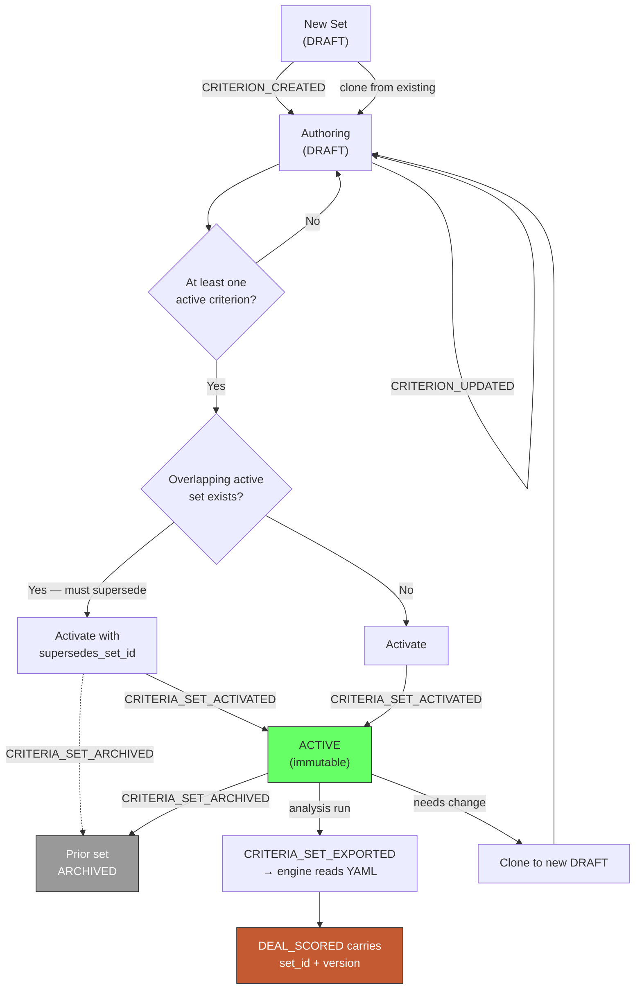

# PRD 03 — Criteria Module

> **Framework**: Phlo event-sourced platform. See `00-inbox/event-system-architecture.md` and `00-inbox/prd-guide.md`.
> **Scope**: This module owns the diligence rules that the analysis engine applies to every fund. It is the primary point of customer personalisation.

---

### Project Identity

```
Project name: l1analysis
Company name: [TODO — confirm with stakeholder]
Display name: L1 Analysis Platform
Admin email domain: [TODO — confirm with stakeholder]
```

---

## 1. Process Overview

### Process: Criteria Authoring and Versioning

The Criteria module lets a Super Admin encode an institution's own investment judgement as structured, machine-applicable rules. Every fund that passes through the analysis engine is evaluated against the currently-active criteria set. Because criteria are event-sourced, the platform can always answer *"which exact rules produced this score, and who changed them last?"* — an audit property that matters when an Investment Committee challenges a recommendation months later.

Criteria come in three tiers. **Green flags** raise a fund's score. **Red flags** lower it and surface as findings in the L1 memo. **Vetoes** terminate evaluation outright regardless of any other strength — the fund is marked `VETOED` and the memo leads with the reason.

The module ships with a **seed set of default criteria** (Section 11). These are deliberately generic starting points, not house policy. The expectation is that every deploying institution edits, disables, or replaces them. Nothing in the system treats a seeded criterion differently from an admin-authored one.

Flow:

```
  Author Criterion        Activate Set           Apply to Deal         Review Attribution
      [ENTRY]                [ENTRY]                [ENTRY]                [ENTRY]
         |                      |                      |                      |
  CRITERION_CREATED     CRITERIA_SET_ACTIVATED   (analysis engine reads    (memo cites
         |                      |                   active set)            criteria_set_version)
    (edit/tune)           (version frozen)            |                      |
         |                      |                      |                      |
  CRITERION_UPDATED     CRITERIA_SET_ARCHIVED    DEAL_SCORED            [EXIT]
         |                      |                      |
      [EXIT]                 [EXIT]                 [EXIT]
```

### Why criteria are versioned as a *set*, not individually

A fund's score is only meaningful relative to the complete rule set applied to it. If an admin edits one red flag the day after a deal was scored, re-reading that memo must not silently reinterpret it under new rules. Therefore:

- Individual criteria are mutable while a set is in `DRAFT`.
- Activating a set **freezes** it and assigns an immutable `version` integer.
- Every `DEAL_SCORED` event carries `criteria_set_id` + `criteria_set_version`.
- Editing an active set is not permitted — the UI clones it to a new `DRAFT`.

---

## 2. Entities and Aggregates

| Entity | Aggregate Type | Relationships |
|---|---|---|
| Criteria Set | `CriteriaSet` | Contains many Criteria; referenced by every Deal Score |
| Criterion | `Criterion` | Belongs to one Criteria Set |

### Entity Field Definitions

#### Criteria Set

| Field | Type | Description |
|---|---|---|
| id | UUID | Primary key |
| set_code | string | Human-readable identifier, format `CS-{YYYY}-{NNNN}` |
| name | string | Display name, e.g. "AIF Cat II Credit — House View 2026" |
| description | string | What this set is for and when to use it |
| asset_class_scope | string[] | Which AIF categories this applies to; empty = all |
| status | string | Lifecycle status — see State Machine |
| version | integer | Assigned on activation; null while DRAFT |
| activated_at | datetime | When this set became active; null while DRAFT |
| archived_at | datetime | When superseded; null while active |
| criterion_count | integer | Denormalised count for list display |
| veto_count | integer | Denormalised count of veto-tier criteria |
| created_at | datetime | Record creation |
| updated_at | datetime | Last modification |

#### Criterion

| Field | Type | Description |
|---|---|---|
| id | UUID | Primary key |
| criteria_set_id | UUID | FK → Criteria Set |
| criterion_code | string | Human-readable identifier, format `CR-{NNNN}` |
| name | string | Short label, e.g. "Gross-only return disclosure" |
| tier | string | `GREEN_FLAG` / `RED_FLAG` / `VETO` |
| category | string | Grouping for UI, e.g. `disclosure`, `track_record`, `governance`, `fees`, `regulatory`, `concentration` |
| severity | string | `LOW` / `MEDIUM` / `HIGH` / `CRITICAL` — drives score magnitude |
| weight | decimal | Multiplier applied to this criterion's contribution (default 1.0) |
| detection_guidance | text | **Plain-English instruction to the analysis engine**: what to look for in the document |
| evidence_requirement | text | What must be found to assert this criterion fires — forces grounding |
| rationale | text | Why this matters; surfaced in the memo to justify the finding |
| remediation_prompt | text | What to ask the manager if this fires; feeds the memo's "Asks" section |
| is_active | boolean | Allows disabling without deleting |
| created_at | datetime | Record creation |
| updated_at | datetime | Last modification |

**Note on `detection_guidance`**: this is the field that makes the system customisable without code. It is free text authored by the admin and passed to the analysis engine as instruction. It must be specific enough to be actionable — "returns are quoted gross with no corresponding net-to-investor figure anywhere in the document" is usable; "bad disclosure" is not. The UI should enforce a minimum length and show worked examples.

### Numbering

| Entity | Prefix | Format | Example |
|---|---|---|---|
| Criteria Set | CS | `CS-{YYYY}-{NNNN}` | CS-2026-0001 |
| Criterion | CR | `CR-{NNNN}` | CR-0042 |

---

## 3. Process Steps

### Step: Create Criteria Set

Event type: `CRITERIA_SET_CREATED`

Trigger:
  Super Admin opens Criteria Sets, clicks "New Set", enters name/description/scope, clicks Create. Optionally clones an existing set (see side effects).

Data points captured:
  - name: string — display name
  - description: string — purpose
  - asset_class_scope: string[] — AIF categories in scope; empty means all
  - clone_from_set_id: UUID (optional) — source set if cloning

Payload:
```
id: UUID (generated)
set_code: string (generated, CS-YYYY-NNNN)
name: string
description: string
asset_class_scope: string[]
clone_from_set_id: UUID?
```

Aggregate: `CriteriaSet` / `id`

Location: None. This process does not involve physical locations.

Preconditions:
  - `name` must be non-empty and unique among non-archived sets
  - If `clone_from_set_id` is supplied, that set must exist

Side effects:
  - `criteria_sets`: new row with status `DRAFT`, version null
  - If cloning: one `CRITERION_CREATED` event emitted per criterion in the source set, with new IDs and the new `criteria_set_id`

Projections updated:
  - `criteria_sets`: new row (status = DRAFT, criterion_count = 0 or source count)

Permissions:
  - `events:CRITERIA_SET_CREATED:emit`

---

### Step: Add Criterion

Event type: `CRITERION_CREATED`

Trigger:
  Super Admin opens a DRAFT criteria set, clicks "Add Criterion", fills the criterion form (tier, category, severity, detection guidance, evidence requirement, rationale, remediation prompt), clicks Save.

Data points captured:
  - criteria_set_id: UUID — parent set
  - name: string — short label
  - tier: string — GREEN_FLAG / RED_FLAG / VETO
  - category: string — grouping
  - severity: string — LOW / MEDIUM / HIGH / CRITICAL
  - weight: decimal — contribution multiplier
  - detection_guidance: text — what the engine looks for
  - evidence_requirement: text — what proves it
  - rationale: text — why it matters
  - remediation_prompt: text — what to ask the manager

Payload:
```
id: UUID (generated)
criteria_set_id: UUID
criterion_code: string (generated, CR-NNNN)
name: string
tier: string
category: string
severity: string
weight: decimal
detection_guidance: string
evidence_requirement: string
rationale: string
remediation_prompt: string
```

Aggregate: `Criterion` / `id`

Location: None.

Preconditions:
  - Parent criteria set status must be `DRAFT` (active sets are immutable)
  - `tier` must be one of the three permitted values
  - `severity` must be one of the four permitted values
  - `detection_guidance` must be at least 40 characters (guards against unusable rules)
  - `weight` must be > 0

Side effects:
  - `criteria`: new row with `is_active` = true
  - `criteria_sets`: `criterion_count` += 1; `veto_count` += 1 if tier is VETO

Projections updated:
  - `criteria`: new row
  - `criteria_sets`: criterion_count += 1, veto_count += 1 (conditional)

Permissions:
  - `events:CRITERION_CREATED:emit`

---

### Step: Update Criterion

Event type: `CRITERION_UPDATED`

Trigger:
  Super Admin edits a criterion within a DRAFT set and clicks Save.

Data points captured:
  - id: UUID — the criterion
  - Any subset of: name, tier, category, severity, weight, detection_guidance, evidence_requirement, rationale, remediation_prompt, is_active

Payload:
```
id: UUID
criteria_set_id: UUID
{changed fields only}
```

Aggregate: `Criterion` / `id`

Location: None.

Preconditions:
  - Parent criteria set status must be `DRAFT`
  - If `tier` changes to/from VETO, parent `veto_count` must be recalculated
  - Same field validations as creation

Side effects:
  - `criteria`: partial update
  - `criteria_sets`: `veto_count` recalculated if tier changed

Projections updated:
  - `criteria`: changed fields
  - `criteria_sets`: veto_count (conditional)

Permissions:
  - `events:CRITERION_UPDATED:emit`

---

### Step: Activate Criteria Set

Event type: `CRITERIA_SET_ACTIVATED`

Trigger:
  Super Admin reviews a DRAFT set and clicks "Activate". A confirmation dialog states that the set becomes immutable and will apply to all subsequent analyses.

Data points captured:
  - id: UUID — the set being activated
  - supersedes_set_id: UUID (optional) — the currently active set for the same scope

Payload:
```
id: UUID
version: integer (generated — increment of highest version for this scope)
supersedes_set_id: UUID?
activated_at: datetime
```

Aggregate: `CriteriaSet` / `id`

Location: None.

Preconditions:
  - Set status must be `DRAFT`
  - Set must contain at least one active criterion
  - **If another set is already active for an overlapping `asset_class_scope`, `supersedes_set_id` must be supplied** — prevents two active sets silently competing

Side effects:
  - `criteria_sets`: status → ACTIVE, version assigned, activated_at stamped
  - If `supersedes_set_id` supplied: `CRITERIA_SET_ARCHIVED` emitted for that set
  - Criteria in this set become immutable (enforced by the DRAFT precondition on update events)

Projections updated:
  - `criteria_sets`: status → ACTIVE, version, activated_at
  - `criteria_sets` (superseded): status → ARCHIVED, archived_at

Permissions:
  - `events:CRITERIA_SET_ACTIVATED:emit`

---

### Step: Archive Criteria Set

Event type: `CRITERIA_SET_ARCHIVED`

Trigger:
  Emitted automatically when a superseding set is activated, or manually by Super Admin.

Data points captured:
  - id: UUID
  - superseded_by_set_id: UUID (optional)
  - reason: string (optional)

Payload:
```
id: UUID
superseded_by_set_id: UUID?
reason: string?
archived_at: datetime
```

Aggregate: `CriteriaSet` / `id`

Location: None.

Preconditions:
  - Set status must be `ACTIVE`

Side effects:
  - Set no longer applied to new analyses
  - **Historical deals retain their reference** — archiving never rewrites past scores

Projections updated:
  - `criteria_sets`: status → ARCHIVED, archived_at

Permissions:
  - `events:CRITERIA_SET_ARCHIVED:emit`

---

### Step: Export Criteria Set for Engine

Event type: `CRITERIA_SET_EXPORTED`

Trigger:
  Emitted by the analysis worker when it materialises an active criteria set to disk for a CLI run. Not a user action.

Data points captured:
  - criteria_set_id: UUID
  - criteria_set_version: integer
  - export_path: string — where the YAML was written
  - content_hash: string — sha256 of the exported payload, for verification

Payload:
```
criteria_set_id: UUID
criteria_set_version: integer
export_path: string
content_hash: string
deal_id: UUID?
```

Aggregate: `CriteriaSet` / `criteria_set_id`

Location: None.

Preconditions:
  - Set status must be `ACTIVE`

Side effects:
  - None beyond audit trail. This event exists so that "which rules did the engine actually see" is provable, not inferred.

Projections updated:
  - None. Audit-only event.

Permissions:
  - `events:CRITERIA_SET_EXPORTED:emit` (granted to the worker service account, not to humans)

---

## 4. State Machines

### Criteria Set States

Statuses: `DRAFT`, `ACTIVE`, `ARCHIVED`

Transitions:

| From Status | Event | To Status |
|---|---|---|
| — | `CRITERIA_SET_CREATED` | `DRAFT` |
| `DRAFT` | `CRITERIA_SET_ACTIVATED` | `ACTIVE` |
| `ACTIVE` | `CRITERIA_SET_ARCHIVED` | `ARCHIVED` |

```
DRAFT --CRITERIA_SET_ACTIVATED--> ACTIVE --CRITERIA_SET_ARCHIVED--> ARCHIVED (terminal)
  ^
  |
(criteria mutable only here)
```

Notes:
- `ARCHIVED` is terminal. To revive an archived set, clone it into a new DRAFT.
- Criteria are mutable **only** while their parent set is `DRAFT`. This is the mechanism that makes scores reproducible.
- There is no `DRAFT → ARCHIVED` path; an unwanted draft is deleted, not archived. (Deletion is out of scope for v1 — drafts simply remain.)

---

## 5. Reports and Projections

| # | Business Question | Projection Table | Key Fields | Updated By Events |
|---|---|---|---|---|
| 1 | "What criteria sets exist and which is live?" | `criteria_sets` | set_code, name, status, version, criterion_count, veto_count, activated_at | `CRITERIA_SET_CREATED`, `CRITERIA_SET_ACTIVATED`, `CRITERIA_SET_ARCHIVED` |
| 2 | "What rules are in this set?" | `criteria` | criterion_code, name, tier, category, severity, weight, is_active | `CRITERION_CREATED`, `CRITERION_UPDATED` |
| 3 | "Which criteria fire most often across our deal flow?" | `criterion_hit_stats` | criterion_id, criterion_code, deals_evaluated, times_fired, fire_rate_pct | `DEAL_SCORED` (from PRD 02) |
| 4 | "Which rules have never fired?" (dead-rule detection) | `criterion_hit_stats` | criterion_id, times_fired = 0 | `DEAL_SCORED` |
| 5 | "Who changed our criteria and when?" | *Not a projection* — query `movement_events` by `aggregate_type` = `CriteriaSet`/`Criterion` | — | Automatic |
| 6 | "Which criteria set scored this deal?" | `deal_scores` (PRD 02) | criteria_set_id, criteria_set_version | `DEAL_SCORED` |

### Notes on report 3/4

`criterion_hit_stats` is the feedback loop that makes the criteria set improvable rather than static. A rule that fires on 95% of deals is not discriminating; a rule that never fires may be badly worded. Surfacing both in the admin UI turns criteria authoring into an iterative practice rather than a one-time setup.

This projection is updated by an event owned by another module (`DEAL_SCORED`). Per the Phlo architecture, that is fine — the criteria projection service simply handles that event type alongside its own. **Cross-module boundary: this module's projection service must handle `DEAL_SCORED` emitted by the Analysis Pipeline module (PRD 02).**

---

## 6. Roles and Permissions

### Roles

| Role | Description | Permissions |
|---|---|---|
| Super Admin | Owns house diligence policy. Typically Head of Research / CIO. | All criteria events, plus `criteria:read` |
| Analyst | Runs deals through the pipeline; reads criteria to understand scores. | `criteria:read` only |
| IC Member | Reviews memos; needs to see which rules applied. | `criteria:read` only |
| Worker Service Account | The analysis worker process. | `events:CRITERIA_SET_EXPORTED:emit`, `criteria:read` |

### Permissions

| Permission Code | Description | Used By Step |
|---|---|---|
| `events:CRITERIA_SET_CREATED:emit` | Create a new criteria set | Create Criteria Set |
| `events:CRITERION_CREATED:emit` | Add a criterion to a draft set | Add Criterion |
| `events:CRITERION_UPDATED:emit` | Modify a criterion in a draft set | Update Criterion |
| `events:CRITERIA_SET_ACTIVATED:emit` | Freeze and activate a set | Activate Criteria Set |
| `events:CRITERIA_SET_ARCHIVED:emit` | Archive an active set | Archive Criteria Set |
| `events:CRITERIA_SET_EXPORTED:emit` | Record an engine export (service account only) | Export Criteria Set |
| `criteria:read` | View criteria sets and criteria | All read screens |

**Design note**: criteria authoring is deliberately restricted to Super Admin. These rules determine what the institution rejects — a mis-authored veto silently kills deal flow. Restricting the permission and making every change an auditable event is the control.

---

## 7. Locations

This process does not involve physical locations. Events will not carry a `location_id`.

---

## 8. Screen List

| # | Screen Name | Type | Used By | Purpose | Key Actions |
|---|---|---|---|---|---|
| 1 | Criteria Sets | list | Super Admin, Analyst | Browse all sets with status/version/scope | New Set, Clone Set, Open |
| 2 | Criteria Set Detail | detail | Super Admin, Analyst | View a set's criteria grouped by tier; see activation history | Add Criterion, Activate, Clone, Archive |
| 3 | Criterion Form | form | Super Admin | Author/edit a single rule | Save, Save & Add Another, Disable, Delete |
| 4 | Criteria Set Comparison | detail | Super Admin | Side-by-side diff of two sets — what changed between versions | Export Diff |
| 5 | Criterion Performance | dashboard | Super Admin | Fire rates per criterion; flags never-fired and always-fired rules | Open Criterion, Filter by Set |

### Screen notes

**Screen 2 (Criteria Set Detail)** is the demo centrepiece. It must make the three tiers visually distinct — vetoes should be unmistakable. When a set is ACTIVE, all edit affordances are replaced by a single "Clone to Draft" action, making immutability legible rather than a surprise error.

**Screen 3 (Criterion Form)** must show worked examples of good `detection_guidance` inline, not buried in help text. The quality of this field determines the quality of the analysis; the form is where that quality is won or lost.

**Screen 4 (Comparison)** answers "what did we change and why did scores move?" — needed the first time an IC challenges a shift in recommendations.

### Palette-Searchable Entities

| Entity | Search by | Result label | Result description | Detail path |
|---|---|---|---|---|
| Criteria Set | set_code, name | set_code | name · status · v{version} | `/criteria-sets/{id}` |
| Criterion | criterion_code, name | criterion_code | name · tier · severity | `/criteria-sets/{set_id}/criteria/{id}` |

---

## 9. Process Flowchart



---

## 10. Cross-Module Boundaries

| Boundary | Direction | Detail |
|---|---|---|
| `DEAL_SCORED` | **Consumed** from PRD 02 | This module's projection service handles it to maintain `criterion_hit_stats` |
| `CRITERIA_SET_EXPORTED` | **Emitted** to worker | The analysis worker emits this; consumed only as audit trail |
| Active set lookup | **Read** by worker | Worker queries `criteria_sets` where status = ACTIVE and scope matches the deal's AIF category |

---

## 11. Seed Criteria (Default Set — CS-2026-0001)

> **These are placeholders authored to make the system demonstrable, not house policy.**
> They are grounded in general institutional diligence practice and in patterns observable in real AIF marketing material. **Every deploying institution is expected to review, edit, and replace them.** No criterion below has been validated against a specific institution's investment policy.
>
> Marked `[NEEDS REVIEW]` where the default threshold is genuinely arbitrary and should not survive to production without a decision.

### Veto tier

| Code | Name | Severity | Detection Guidance | Rationale |
|---|---|---|---|---|
| CR-0001 | No verifiable SEBI registration | CRITICAL | Document contains no SEBI AIF registration number, or states registration is "pending"/"applied for" without a number. Look for the format `IN/AIF{1,2,3}/YY-YY/NNNN`. **See the structural limit below — absence from the register is NOT evidence of non-registration.** | An unregistered AIF cannot legally accept commitments. This is a regulatory precondition, not a judgement call. |

> #### ⚠️ Structural limit on CR-0001 (discovered 2026-07-21 by querying the live register)
>
> **SEBI registers the AIF *trust*, not the manager and not the scheme.**
>
> Verified against the live register: searching `Neo` returns **7 registered AIFs** — `Neo Alternatives Investment Trust` (`IN/AIF3/21-22/1001`), `Neo Credit Alternatives Investment Trust` (`IN/AIF2/22-23/1042`), and others. But searching the *fund* name, or the *manager* name, returns a genuine "No record(s) available" — because the fund is a **scheme of a registered trust**, and neither the scheme nor the manager is itself a registrant.
>
> **Therefore an absent scheme name can never be reported as `failed`.** A criterion that fired on "we searched the register and did not find this fund" would fire on virtually every legitimately-registered AIF in India. The adapter is built so absence cannot produce an adverse finding — the strongest available outcome from a scheme-name miss is `unavailable`, with the trust-name gap stated.
>
> **What this means in practice**: verifying registration requires the *trust* name, which appears in the PPM rather than in a marketing deck. That is an analyst-resolvable gap (`unblock_owner: manual_analyst_check`), not an infrastructure one — the analyst supplies the trust name, and the check then completes.
>
> This is a good example of a criterion whose detection guidance was written from how the regulation *sounds* rather than how the register *works*. Any institution authoring criteria against a public register should verify what that register is actually keyed on before relying on absence as a signal.
| CR-0002 | Undisclosed regulatory action against sponsor or manager | CRITICAL | Any mention of ongoing SEBI enforcement, adjudication, show-cause notice, or debarment involving the manager, sponsor, or a named key person — or evidence of such found in research that the document omits. | Material non-disclosure of enforcement action is itself disqualifying, independent of the underlying matter. |
| ~~CR-0003~~ | ~~Manager unable to evidence any prior track record~~ | — | **MOVED TO RED FLAG 2026-07-21 — see CR-0018 below.** A veto here would silently reject every genuinely first-time manager, and a veto is invisible in a way a red flag is not: the analysis stops rather than surfacing the concern for judgement. | |

### Red flag tier

| Code | Name | Severity | Detection Guidance | Rationale |
|---|---|---|---|---|
| CR-0010 | Gross-only return disclosure | HIGH | Target or historical returns are stated on a gross basis with no corresponding net-to-investor figure anywhere in the document. Check whether fee load, hurdle, and carry are separately disclosed such that net could be derived. | Gross returns overstate what an investor receives. Absence of a net figure alongside a stated hurdle and carry obscures the actual economics. |
| CR-0011 | Predecessor fund track record unrealised | HIGH | The prior fund cited as evidence is still within its investment or holding period, with returns described as "tracking", "expected", or marked-to-model rather than realised and distributed. | Unrealised marks are manager estimates. A track record without exits has not been tested by an actual sale. |
| CR-0012 | Key person risk without documented succession | HIGH | Strategy attribution concentrates on one or two named individuals, with no key-person clause described and no succession or bench depth evidenced. | Concentration of decision-making in one person is an unhedged operational risk over a 7–10 year fund life. |
| CR-0013 | Fee structure outside market norms | MEDIUM | Management fee materially above 2% on committed capital, or carry above 20%, or hurdle below 8%, or catch-up terms that accelerate carry ahead of LP capital return. **[NEEDS REVIEW — thresholds are illustrative and vary by strategy and vintage.]** | Above-market economics require justification by differentiated access or demonstrated alpha. |
| CR-0014 | Sector or counterparty concentration | MEDIUM | Portfolio construction concentrates in fewer than ~15 positions, or a single sector exceeds ~40% of target deployment, without an explicit concentration policy or limits. **[NEEDS REVIEW — appropriate for diversified strategies; wrong for deliberately concentrated ones.]** | Undisclosed concentration changes the risk profile from what the headline strategy implies. |
| CR-0015 | Service providers unnamed or non-institutional | MEDIUM | Auditor, legal counsel, custodian, or registrar are unnamed, or are firms without recognised institutional practice. | Named tier-one service providers are a cheap, verifiable signal of operational seriousness. Absence is informative. |
| CR-0016 | Valuation policy undisclosed | HIGH | No description of how unlisted or illiquid assets are valued, no mention of independent valuation, or valuation performed solely in-house without third-party review. | For strategies holding illiquid assets, the valuation policy determines whether reported performance is meaningful. |
| CR-0017 | Stale marketing document | LOW | Document date is more than six months prior to the date of analysis, or references a fundraise timeline that has already elapsed. | Terms, team, and pipeline may have changed. Findings should be caveated accordingly. |
| CR-0018 | No attributable prior track record | HIGH | No predecessor fund, no attributable performance history at a prior firm, and no named team member with a documented record in the stated strategy. Note this is **conjunctive** — all three limbs must fail. A team member with a documented record at a prior firm satisfies the criterion even with no predecessor fund. | A manager with no attributable history cannot be underwritten on evidence. **Deliberately a red flag rather than a veto** (moved from CR-0003, 2026-07-21): many institutions intentionally back first-time and emerging managers, and a veto would silently reject that entire category. As a red flag the concern is surfaced, weighted, and left to the analyst. An institution that *does* want this to be disqualifying can promote it to VETO in their own criteria set — which is precisely what per-institution criteria authoring is for. |

### Green flag tier

| Code | Name | Severity | Detection Guidance | Rationale |
|---|---|---|---|---|
| CR-0030 | Meaningful GP commitment | MEDIUM | Sponsor or manager commits capital alongside LPs at a level described as a percentage of fund size, ideally ≥2%, and stated as cash rather than fee waiver. | Cash co-investment aligns the manager with LP outcomes in a way fee waivers do not. |
| CR-0031 | Realised predecessor track record | HIGH | A prior fund in the same strategy has fully or substantially exited, with realised DPI or distributed returns stated and attributable to the current team. | A realised record tested by actual exits is the strongest available evidence. |
| CR-0032 | Institutional anchor investors | MEDIUM | Named institutional LPs — development finance institutions, insurers, sovereign funds, established family offices — disclosed as anchor or prior-fund investors. | Institutional LPs perform their own diligence. Their presence is corroborating third-party evidence. |
| CR-0033 | Tier-one service provider set | LOW | Auditor, legal counsel, tax advisor, custodian, and registrar all named and all recognised institutional firms. | Signals the manager has invested in operational infrastructure. |
| CR-0034 | Transparent fee and waterfall disclosure | MEDIUM | Management fee basis, hurdle, catch-up treatment, and carry are all explicitly stated, with a worked distribution example or illustrative waterfall. | Willingness to show the full economics is a governance signal in itself. |
| CR-0035 | Independent investment committee | MEDIUM | An investment committee is described with named members, including at least one member independent of the manager, and its authority over deal approval is stated. | Independent oversight constrains single-manager discretion. |

### Seeding mechanism

These are loaded via `app/criteria/seed.py` as a `CRITERIA_SET_CREATED` event followed by one `CRITERION_CREATED` per row, then left in `DRAFT`. **The seed deliberately does not activate the set** — an admin must review and activate, which forces at least one deliberate look at the rules before any deal is scored against them.

---

## 12. Open Questions

- ~~Should `CR-0003` (no track record) be a veto or a red flag?~~ **RESOLVED 2026-07-21 — red flag.** Retired as CR-0003 and reissued as `CR-0018` at RED_FLAG tier. An institution that wants it disqualifying can promote it to VETO in its own criteria set. The seed set's tier distribution is therefore **2 VETO / 9 RED_FLAG / 6 GREEN_FLAG**, not the 3/8/6 in PRD 06 §11.
- Fee and concentration thresholds (`CR-0013`, `CR-0014`) are illustrative. Do these get set per-institution at deployment, or per criteria-set-scope?
- Should criteria support **conditional applicability** — e.g. a rule that only applies to Category II funds, or only to funds above a size threshold? Currently scope is set-level, not criterion-level. Adding criterion-level conditions is more flexible but materially more complex to author and to reason about.
- Should there be a **"requires human review"** tier between red flag and veto — a finding that blocks automated progression without killing the deal?
- How are criteria migrated when the underlying analysis engine changes its capabilities? A criterion whose `detection_guidance` relies on a capability the engine loses would silently stop firing. `criterion_hit_stats` (report 4) partially mitigates this by surfacing never-fired rules.
