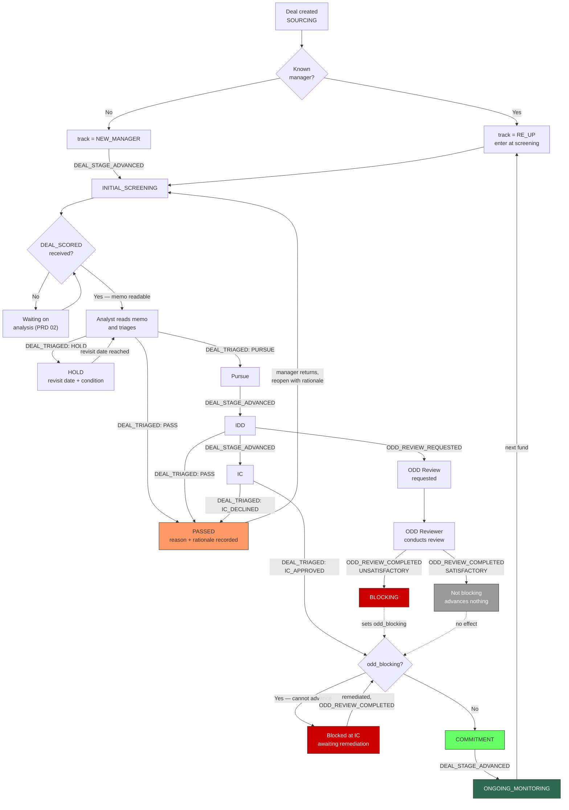

# PRD 04 — Triage Module

> **Framework**: Phlo event-sourced platform. See `00-inbox/event-system-architecture.md` and `00-inbox/prd-guide.md`.
> **Scope**: This module owns the Deal's position in the allocator's pipeline, the gates between positions, and the record of decisions taken. It does not produce analysis; it decides what to do with it.
> **Terminology is canonical, not invented.** See §1.1.

---

### Project Identity

```
Project name: l1analysis
Company name: [TODO — confirm with stakeholder]
Display name: L1 Analysis Platform
Admin email domain: [TODO — confirm with stakeholder]
```

---

## 1. Process Overview

### Process: Manager Selection Pipeline

Triage is where the platform stops being an analysis tool and becomes a system of record for how an institution allocates. A Deal arrives scored, with a memo. Someone decides whether it advances, waits, or stops — and, critically, the institution needs to be able to answer six months later *why*, and *who decided*.

The module models the allocator's actual pipeline, using the industry's actual vocabulary. This matters more than it might appear: an allocator's staff already have a shared mental model of what "the deal is in ODD" means, what it implies about who is working on it and what could still kill it. Software that renames those stages to something invented forces everyone to hold two vocabularies at once and is quietly rejected.

Flow:

```
   Sourcing          Initial Screening         IDD              IC            Commitment       Monitoring
   [ENTRY]               [ENTRY]             [ENTRY]          [ENTRY]          [ENTRY]          [ENTRY]
      |                     |                   |                |                |                |
DEAL_SUBMITTED        DEAL_SCORED       DEAL_STAGE_ADVANCED  DEAL_STAGE_    DEAL_STAGE_     DEAL_STAGE_
   (PRD 01)            (PRD 02)          + DEAL_ASSIGNED      ADVANCED        ADVANCED        ADVANCED
      |                     |                   |                |                |                |
 (deal exists)      (memo readable)      (deep diligence)    (committee)    (legal, docs)   (quarterly)
      |                     |                   |                |                |                |
DEAL_STAGE_ADVANCED   DEAL_TRIAGED       DEAL_TRIAGED       DEAL_TRIAGED           |            [EXIT]
      |               (pursue/hold/pass)  (pursue/pass)     (approve/decline)      |
   [EXIT]                [EXIT]              [EXIT]            [EXIT]           [EXIT]

                    ═══════════════════════════════════════════
                     ODD runs ALONGSIDE, on its own reporting
                     line, with its own rating and its own veto
                    ═══════════════════════════════════════════
```

### 1.1 Canonical stage taxonomy

The stages below are the verified industry-standard sequence. They are not a proposal.

| Stage | Code | What happens | Who owns it |
|---|---|---|---|
| Sourcing | `SOURCING` | The manager is on the radar. A deck has arrived or been requested | Analyst |
| Initial screening | `INITIAL_SCREENING` | First-pass evaluation against house criteria. **This is what the L1 memo serves** | Analyst |
| Investment due diligence | `IDD` | Deep evaluation of strategy, team, track record, portfolio construction | Investment team |
| Investment committee | `IC` | Formal committee decision on whether to commit | IC |
| Commitment | `COMMITMENT` | Legal negotiation, side letter, subscription documents, capital committed | Investment team + legal |
| Ongoing monitoring | `ONGOING_MONITORING` | Post-commitment surveillance, quarterly reporting, re-up evaluation | Investment team |

Terminal states outside the sequence: `PASSED` (declined at any stage) and `ARCHIVED` (no longer relevant, e.g. the fund closed without us).

**Operational due diligence (ODD) is deliberately absent from this list.** That is the subject of §1.2, and it is the single most consequential design decision in this module.

**The L1 Analysis Platform's centre of gravity is `INITIAL_SCREENING`.** Everything before it is intake; everything after it happens largely outside this system today. The platform tracks the later stages so that the funnel is complete and the counterfactual is preserved (§1.4), but it does not attempt to run IDD or an IC. Building screens for a stage the platform does not actually support would be a claim it cannot honour.

### 1.2 ODD is not a stage

The natural modelling instinct is to insert ODD between IDD and IC — a step in the pipeline that a deal passes through. **That model is wrong, and building it would encode a misunderstanding of how allocators are organised into the software.**

Three verified facts about ODD determine the design:

**ODD is organisationally separate from the investment team.** It does not report to the CIO. It reports to GRC, risk, or the COO — a deliberately independent line, because the entire value of ODD is that the people doing it are not the people whose bonus depends on the deal closing. Modelling ODD as a stage in the investment team's pipeline puts it under the pipeline's owner, which is exactly the reporting relationship the function exists to avoid.

**ODD holds an asymmetric veto.** It has the power never to hire, never the power to hire. An ODD review that comes back clean does not advance a deal; it merely removes an obstacle. An ODD review that comes back failed stops the deal regardless of how strong the investment case is. This is not a gate that opens and closes — it is a one-directional kill switch, and modelling it as a symmetric pass/fail gate misrepresents its power in both directions at once.

**ODD uses its own rating scale.** It does not score on the investment team's scale and its output is not comparable to an investment score. An ODD rating of "significant findings" is a statement about operational infrastructure — fund administration, valuation policy, cyber, business continuity, key controls — not about whether the strategy will make money.

**Therefore ODD is modelled as a parallel track**: an ODD Review is its own entity with its own lifecycle, its own rating scale, its own reviewer role reporting outside the investment team, and a veto relationship to the Deal rather than a stage position on it. A Deal in `IDD` can have an ODD Review in progress, completed, or not yet started. A Deal cannot enter `COMMITMENT` with an unresolved failing ODD Review — and that is the only place ODD constrains the pipeline.

The asymmetry is enforced structurally: `ODD_REVIEW_COMPLETED` with a failing rating **blocks** `DEAL_STAGE_ADVANCED` into `COMMITMENT`. `ODD_REVIEW_COMPLETED` with a passing rating **does not advance anything**. There is no event by which ODD moves a deal forward, because in reality there is no such power.

> **[NEEDS REVIEW — event catalogue extension.]** Overview §5 lists four events for this module: `DEAL_TRIAGED`, `DEAL_STAGE_ADVANCED`, `DEAL_ASSIGNED`, `DEAL_NOTE_ADDED`. Modelling ODD correctly requires two more — `ODD_REVIEW_REQUESTED` and `ODD_REVIEW_COMPLETED` — because an ODD review's initiation and outcome are business facts with their own actor, timing, and audit requirements, and squeezing them into `DEAL_NOTE_ADDED` would make the platform unable to answer "who signed off operational diligence on this fund" without reading free text. They are specified in §3 and flagged here because they extend the catalogue rather than implement it.

### 1.3 Re-ups are a distinct track, not a discounted new-manager path

When an existing manager raises their next fund, an allocator does not run the new-manager process with some steps skipped. **A re-up is a different process with different questions.**

A new manager asks: can these people do this? A re-up asks: did they do what they said last time, has anything changed about the team or the terms, and does our existing exposure justify more?

The distinction has teeth. A re-up starts from a position of information advantage — the allocator has years of quarterly reports, capital calls, and direct experience of how the manager behaves under stress. The relevant analysis is *change since last time*, not *evaluation from zero*. A re-up evaluated as a discounted new-manager screening asks the wrong questions well.

**Therefore Deals carry a `deal_track` of `NEW_MANAGER` or `RE_UP`**, set at triage from the Deal's `manager_id`, and the track determines:

| | New manager | Re-up |
|---|---|---|
| Entry stage | `SOURCING` | `INITIAL_SCREENING` — the manager is already known |
| Screening question | "Should we underwrite these people?" | "What changed, and did the last fund do what it said?" |
| Prior context shown | None | Prior Deals, prior memos, prior ODD reviews, prior triage decisions with reasons |
| ODD requirement | Full review | Refresh review — scoped to what changed since the last full review |
| Criteria emphasis | Track record criteria carry full weight | Track record is partly answered by the allocator's own experience **[NEEDS REVIEW — does the criteria set differ by track? PRD 03 scopes sets by asset class, not by track. This may require criterion-level applicability, which PRD 03 §12 lists as an open question.]** |

The platform detects a re-up by matching `manager_id` against prior Deals. It **proposes** the track and a human confirms — the same principle as PRD 01's promotion gate, and for the same reason: a wrong auto-classification here routes a first-time manager through a process that assumes prior knowledge that does not exist.

### 1.4 Passed deals: the counterfactual most allocators lose

Verified: **most allocators do not track the deals they passed on.** A decline is a decision made, communicated, and then dropped — the record survives, if at all, in an email thread and someone's memory.

The consequence is that an allocator cannot answer its own most useful question: *how good are we at saying no?* The funds we backed are measured continuously. The funds we declined are invisible, so the counterfactual against which our selection skill would be measured does not exist. An institution can run for a decade with a screening process that systematically declines its best available opportunities and never find out.

**This module treats a pass as a first-class outcome with the same record quality as a pursue.** A `DEAL_TRIAGED` with decision `PASS` requires a structured reason, keeps the Deal and its memo permanently readable, and populates a Passed Deals view designed to be revisited rather than archived.

It is a differentiator, and it is a cheap one — the data is already being created by the act of declining. The only reason allocators do not have it is that nothing asks them to record the reason in a form that aggregates.

What it enables, concretely:

- "We passed on 14 infrastructure credit funds in 2026. What did we say, and which of them are now in market with a successor?"
- "Our most common pass reason is unrealised track record. Is that a policy we hold deliberately, or a habit?"
- "This manager is back with Fund III. We passed on Fund II — here is exactly why, in the words of the analyst who decided."

The third is the one that pays for the feature. A manager returning after a decline is a common event, and today the allocator's institutional memory of the prior decision is whoever happens to still work there.

**[NEEDS REVIEW — outcome tracking.]** The full counterfactual would require recording what the passed fund subsequently *did* — its eventual returns — which requires data the platform does not have and cannot easily get. Without it, the Passed Deals view answers "what did we say" but not "were we right". Whether to build manual outcome entry, integrate a market data source, or accept the limitation is a genuine open decision.

---

## 2. Entities and Aggregates

| Entity | Aggregate Type | Relationships |
|---|---|---|
| Deal | `Deal` | Created by PRD 01. This module owns its `stage`, `deal_track`, `assigned_analyst_id`, and triage fields |
| Triage Decision | `TriageDecision` | Belongs to one Deal. A Deal has many over its life |
| Stage Transition | `Deal` (not its own aggregate) | A child row recording each stage move with timing |
| ODD Review | `ODDReview` | Belongs to one Deal. Runs on its own reporting line |
| Deal Note | `DealNote` | Belongs to one Deal. Free-text commentary with an author and timestamp |
| Manager | `Manager` | The managing entity. Referenced by many Deals — this is what makes a re-up detectable |

### Entity Field Definitions

#### Deal (fields owned by this module)

> The full Deal field table is in PRD 01 §2. These are the fields this module writes.

| Field | Type | Description |
|---|---|---|
| stage | string | Pipeline position — see §1.1. `SOURCING` at creation |
| deal_track | string | `NEW_MANAGER` / `RE_UP` / `UNDETERMINED` |
| predecessor_deal_id | UUID | For re-ups, the prior Deal with this manager. Null otherwise |
| assigned_analyst_id | UUID | Owning analyst. Null until assigned |
| assigned_at | datetime | When ownership was taken |
| stage_entered_at | datetime | When the current stage began — drives ageing |
| days_in_stage | decimal | Computed on read; not stored |
| latest_decision | string | `PURSUE` / `HOLD` / `PASS` / `IC_APPROVED` / `IC_DECLINED`. Null before first triage |
| latest_decision_at | datetime | When the latest decision was taken |
| latest_decision_by | UUID | Who decided |
| pass_reason | string | Structured reason, populated on `PASS` — see §3 |
| pass_reason_detail | string | Free text elaboration |
| odd_status | string | `NOT_REQUIRED` / `NOT_STARTED` / `IN_PROGRESS` / `PASSED` / `PASSED_WITH_FINDINGS` / `FAILED` |
| odd_blocking | boolean | True when a failing ODD Review blocks advancement |
| priority | string | `HIGH` / `NORMAL` / `LOW` |
| target_commitment_amount | decimal | Amount under consideration. Nullable |
| target_commitment_currency | string | ISO code |
| next_action | string | Free text — what happens next |
| next_action_due | date | When |

#### Triage Decision

| Field | Type | Description |
|---|---|---|
| id | UUID | Primary key |
| decision_code | string | Human-readable identifier, format `TD-{YYYY}-{NNNNNN}` |
| deal_id | UUID | FK → Deal |
| analysis_run_id | UUID | FK → Analysis Run (PRD 02). The analysis this decision was taken against. Nullable — later-stage decisions may not reference a run |
| stage_at_decision | string | Which stage the Deal was in |
| decision | string | `PURSUE` / `HOLD` / `PASS` / `IC_APPROVED` / `IC_DECLINED` |
| decided_by_user_id | UUID | Who decided |
| decided_at | datetime | When |
| rationale | text | **Required.** Why this decision was taken |
| pass_reason | string | Structured reason; required when decision is `PASS` or `IC_DECLINED` |
| memo_recommendation | string | What the L1 memo recommended, captured at decision time |
| agreed_with_memo | boolean | Whether the human decision matched the memo's recommendation |
| findings_cited | string[] | Criterion codes the decider explicitly cited |
| hold_until | date | For `HOLD` — when to revisit. Nullable |
| hold_condition | string | For `HOLD` — what would change the answer |
| created_at | datetime | Record creation |

**`agreed_with_memo` is the most analytically valuable field in this module.** Computed, not entered. It is the measurement of whether the analysis engine is worth anything: an engine whose recommendations humans override 80% of the time is not helping, and an engine humans agree with 100% of the time is either excellent or being rubber-stamped. Neither number is knowable without recording both sides of every decision, which is why the memo's recommendation is captured onto the decision rather than looked up later — the memo can be superseded by a newer run, and the question is what the decider was looking at.

#### Stage Transition

| Field | Type | Description |
|---|---|---|
| id | UUID | Primary key |
| deal_id | UUID | FK → Deal |
| from_stage | string | Prior stage; null for the first |
| to_stage | string | New stage |
| transitioned_by_user_id | UUID | Who moved it |
| transitioned_at | datetime | When |
| days_in_prior_stage | decimal | Computed at transition and stored — this is what makes cycle-time reporting possible |
| rationale | string | Why, optional for forward moves, required for backward moves |
| gate_checks_passed | jsonb | Which gate conditions were satisfied — see §3 |

#### ODD Review

| Field | Type | Description |
|---|---|---|
| id | UUID | Primary key |
| review_code | string | Human-readable identifier, format `ODD-{YYYY}-{NNNN}` |
| deal_id | UUID | FK → Deal |
| review_type | string | `FULL` / `REFRESH` — refresh applies to re-ups |
| requested_by_user_id | UUID | Who asked for it |
| requested_at | datetime | When |
| reviewer_id | UUID | The ODD Reviewer conducting it |
| status | string | Lifecycle status — see State Machine |
| rating | string | **ODD's own scale**: `SATISFACTORY` / `SATISFACTORY_WITH_OBSERVATIONS` / `SIGNIFICANT_FINDINGS` / `UNSATISFACTORY`. Null until completed |
| is_blocking | boolean | True when the rating is `UNSATISFACTORY` |
| findings_summary | text | The reviewer's summary |
| findings | jsonb | Structured findings by category — fund administration, valuation, compliance, cyber, BCP, key controls |
| remediation_required | text | What the manager must fix |
| remediation_deadline | date | By when. Nullable |
| completed_at | datetime | When the review concluded |
| expires_at | date | Reviews go stale; a review older than the configured horizon requires a refresh |
| created_at | datetime | Record creation |

**The rating scale is deliberately not the investment team's scale.** No numeric score, no shared vocabulary with the L1 recommendation, and no way to average the two into a combined number. An ODD rating and an investment score are not commensurable, and a UI that displays them side by side as if they were invites exactly the trade-off ODD exists to prevent.

#### Deal Note

| Field | Type | Description |
|---|---|---|
| id | UUID | Primary key |
| deal_id | UUID | FK → Deal |
| author_user_id | UUID | Who wrote it |
| note_type | string | `GENERAL` / `MEETING` / `CALL` / `MANAGER_RESPONSE` / `INTERNAL` |
| body | text | The note |
| related_criterion_code | string | If the note responds to a specific finding. Nullable |
| related_analysis_run_id | UUID | If the note relates to a specific run. Nullable |
| is_visible_to_ic | boolean | Whether the note appears in the IC packet (PRD 05) |
| created_at | datetime | Record creation |

#### Manager

| Field | Type | Description |
|---|---|---|
| id | UUID | Primary key |
| manager_code | string | Human-readable identifier, format `MGR-{NNNN}` |
| name | string | Legal name, e.g. "Neo Asset Management Private Limited" |
| aliases | string[] | Alternative names seen in documents |
| relationship_status | string | `PROSPECT` / `ACTIVE_LP` / `FORMER_LP` / `DECLINED` |
| first_seen_at | datetime | First Deal from this manager |
| deal_count | decimal | Total Deals |
| commitment_count | decimal | How many we committed to |
| pass_count | decimal | How many we declined |
| total_committed_amount | decimal | Aggregate commitment across funds |
| total_committed_currency | string | ISO code |
| latest_odd_review_id | UUID | Most recent ODD review across all their funds |
| created_at | datetime | Record creation |

The Manager entity is what makes re-up detection possible and is worth having for its own sake — "how many funds has this house brought us, and what did we do each time" is a question with no home in most allocators' systems.

### Numbering

| Entity | Prefix | Format | Example |
|---|---|---|---|
| Triage Decision | TD | `TD-{YYYY}-{NNNNNN}` | TD-2026-000091 |
| ODD Review | ODD | `ODD-{YYYY}-{NNNN}` | ODD-2026-0014 |
| Manager | MGR | `MGR-{NNNN}` | MGR-0037 |

Stage Transitions and Deal Notes have no code — they are always viewed in the context of their Deal.

---

## 3. Process Steps

### Step: Assign Deal

Event type: `DEAL_ASSIGNED`

Trigger:
  Analyst clicks "Take" on an unassigned deal in the deal list, or Super Admin assigns a deal to a named analyst from the Deal Detail screen.

Data points captured:
  - deal_id: UUID
  - assigned_analyst_id: UUID — who now owns it
  - assigned_by_user_id: UUID — who made the assignment
  - reason: string (optional) — e.g. "sector coverage", "prior relationship with manager"

Payload:
```
deal_id: UUID
assigned_analyst_id: UUID
previous_analyst_id: UUID?
assigned_by_user_id: UUID
reason: string?
assigned_at: datetime
```

Aggregate: `Deal` / `deal_id`

Location: None. This process does not involve physical locations.

Preconditions:
  - Deal must not be `ARCHIVED`
  - `assigned_analyst_id` must reference a user holding the Analyst role
  - Reassignment of an already-assigned deal is permitted and expected — coverage changes, people leave

Side effects:
  - `deals`: `assigned_analyst_id`, `assigned_at` set
  - `analyst_workload`: counts adjusted for both the new and previous analyst

Projections updated:
  - `deals`: assigned_analyst_id, assigned_at
  - `analyst_workload`: `active_deals` += 1 for new, -= 1 for previous

Permissions:
  - `events:DEAL_ASSIGNED:emit`

---

### Step: Triage Deal

Event type: `DEAL_TRIAGED`

Trigger:
  Analyst finishes reading the L1 memo and records a decision from the Deal Detail screen or directly from the memo (PRD 05). Selects `PURSUE`, `HOLD`, or `PASS`, writes a rationale, optionally cites specific findings, and submits. At the IC stage, an IC Member records `IC_APPROVED` or `IC_DECLINED` through the same event.

Data points captured:
  - deal_id: UUID
  - analysis_run_id: UUID — which analysis this decision was taken against
  - decision: string — `PURSUE` / `HOLD` / `PASS` / `IC_APPROVED` / `IC_DECLINED`
  - rationale: text — **required, minimum length enforced**
  - pass_reason: string — required when decision is `PASS` or `IC_DECLINED`
  - findings_cited: string[] — criterion codes the decider is relying on
  - hold_until: date — required when decision is `HOLD`
  - hold_condition: string — required when decision is `HOLD`

Payload:
```
id: UUID (generated)
decision_code: string (generated, TD-YYYY-NNNNNN)
deal_id: UUID
analysis_run_id: UUID?
stage_at_decision: string
decision: string
rationale: string
pass_reason: string?
pass_reason_detail: string?
findings_cited: string[]
memo_recommendation: string?
agreed_with_memo: boolean?
hold_until: date?
hold_condition: string?
decided_by_user_id: UUID
decided_at: datetime
```

Aggregate: `Deal` / `deal_id`

Location: None.

Structured pass reasons:

| Reason | Meaning |
|---|---|
| `STRATEGY_MISMATCH` | Good fund, wrong strategy for our portfolio |
| `TRACK_RECORD_INSUFFICIENT` | Cannot underwrite on the evidence available |
| `TERMS_UNACCEPTABLE` | Fees, hurdle, carry, or waterfall outside what we accept |
| `TEAM_CONCERNS` | Key person risk, turnover, attribution unclear |
| `OPERATIONAL_CONCERNS` | Raised by or consistent with an ODD finding |
| `CONCENTRATION_LIMIT` | Would breach our exposure limits for the sector, manager, or vintage |
| `CAPACITY` | We have no capital to deploy in this vintage |
| `TIMING` | Right manager, wrong time — often paired with `HOLD` instead |
| `REGULATORY` | Registration, jurisdiction, or compliance issue |
| `FUND_CLOSED` | They closed before we decided. **A pass reason that is really a process failure, and worth counting as such** |
| `NO_RESPONSE` | The manager did not engage |
| `OTHER` | Detail required |

Preconditions:
  - Deal must not be `ARCHIVED`
  - `rationale` must be at least 40 characters. **A one-word rationale destroys the value of the passed-deals record (§1.4), which is the whole reason this field is required at all**
  - When `decision` is `PASS` or `IC_DECLINED`, `pass_reason` is required
  - When `decision` is `HOLD`, both `hold_until` and `hold_condition` are required — a hold without a revisit date is a pass that nobody admitted to
  - When `decision` is `IC_APPROVED` or `IC_DECLINED`, the Deal must be in stage `IC` and the actor must hold the IC Member role
  - When `analysis_run_id` is supplied, that run must be `COMPLETED`
  - A Deal in `INITIAL_SCREENING` cannot be triaged before `DEAL_SCORED` has fired for it — there is nothing to decide against. **Cross-module dependency on PRD 02**

Side effects:
  - `triage_decisions`: new row
  - `deals`: `latest_decision`, `latest_decision_at`, `latest_decision_by` set; on `PASS`, `stage` → `PASSED` and `pass_reason` set
  - `agreed_with_memo` computed by comparing `decision` against the run's `recommendation` — `PURSUE` against `PURSUE`, `PASS` against `PASS` or `VETOED`, `HOLD` against `HOLD`. Null when no run is referenced
  - **On `PASS`: the Deal is not archived and the memo remains readable.** It moves to the Passed Deals view (§1.4)
  - **On `PURSUE`: no stage advance happens automatically.** Pursue and advance are separate acts — an analyst can decide to pursue and advance the stage in the same interaction, but the events are distinct because an analyst frequently decides to pursue while the deal waits on something else
  - `triage_funnel`: counts updated by stage and decision
  - `manager_stats`: `pass_count` += 1 on a pass; `relationship_status` → `DECLINED` if this was the manager's only deal

Projections updated:
  - `triage_decisions`, `deals`, `triage_funnel`, `passed_deals`, `manager_stats`, `memo_agreement_stats`

Permissions:
  - `events:DEAL_TRIAGED:emit` (Analyst for PURSUE/HOLD/PASS; IC Member for IC_APPROVED/IC_DECLINED)

---

### Step: Advance Deal Stage

Event type: `DEAL_STAGE_ADVANCED`

Trigger:
  Analyst moves a deal to the next stage from the Deal Detail screen or by dragging it between columns on the pipeline board. Also used for backward moves, which require a rationale.

Data points captured:
  - deal_id: UUID
  - from_stage: string
  - to_stage: string
  - rationale: string — optional forward, **required backward**
  - gate_checks_passed: object — which gate conditions were satisfied

Payload:
```
deal_id: UUID
from_stage: string
to_stage: string
is_backward: boolean
rationale: string?
gate_checks_passed: object
days_in_prior_stage: decimal
transitioned_by_user_id: UUID
transitioned_at: datetime
```

Aggregate: `Deal` / `deal_id`

Location: None.

Stage gates — the preconditions for entering each stage:

| To stage | Gate conditions |
|---|---|
| `INITIAL_SCREENING` | A Document is promoted and an Analysis Run exists (any status) |
| `IDD` | `DEAL_SCORED` has fired; a `DEAL_TRIAGED` with decision `PURSUE` exists against the latest run; the Deal has an assigned analyst |
| `IC` | An ODD Review exists in status other than `NOT_STARTED`; the latest triage decision is `PURSUE`; a target commitment amount is set |
| `COMMITMENT` | A `DEAL_TRIAGED` with decision `IC_APPROVED` exists; **`odd_blocking` is false** |
| `ONGOING_MONITORING` | Deal is in `COMMITMENT` and a commitment amount is recorded |
| `PASSED` | Reached only via `DEAL_TRIAGED` with `PASS` or `IC_DECLINED`, never by direct advance |
| `ARCHIVED` | Any stage; requires rationale |

Preconditions:
  - `to_stage` must be reachable from `from_stage` per the state machine (§4)
  - All gate conditions for `to_stage` must be satisfied, **except** that a Super Admin may override a gate with a recorded rationale. The override is stored in `gate_checks_passed` as an explicit override entry so that "who waived which gate" is answerable
  - **The `COMMITMENT` gate on `odd_blocking` is not overridable by anyone in the investment team.** It can be cleared only by a subsequent `ODD_REVIEW_COMPLETED` with a non-blocking rating, or by a Super Admin acting with an ODD Reviewer's concurrence recorded in the rationale. This is the asymmetric veto from §1.2 rendered as an access rule rather than a suggestion **[NEEDS REVIEW — should a Super Admin be able to override ODD at all? Argued yes with a recorded rationale, because a system with no override at all gets bypassed outside the system, which is worse. But this is a governance decision for the institution, not a software one.]**
  - Backward moves require `rationale`

Side effects:
  - `deals`: `stage`, `stage_entered_at` updated
  - `stage_transitions`: new row with `days_in_prior_stage` computed and stored
  - `triage_funnel`: counts moved between stage buckets
  - `stage_cycle_time`: prior stage's duration accumulated
  - **On entering `IDD`**: if `deal_track` is `RE_UP`, the prior Deal's memo and decisions are surfaced on the Deal Detail screen
  - **On entering `IC`**: the IC packet becomes exportable (PRD 05)
  - **On entering `COMMITMENT`**: `manager_stats.commitment_count` += 1, `relationship_status` → `ACTIVE_LP`

Projections updated:
  - `deals`, `stage_transitions`, `triage_funnel`, `stage_cycle_time`, `manager_stats`

Permissions:
  - `events:DEAL_STAGE_ADVANCED:emit`

---

### Step: Add Deal Note

Event type: `DEAL_NOTE_ADDED`

Trigger:
  Any user with deal access writes a note on the Deal Detail screen — a call summary, a manager's response to an ask, an internal observation.

Data points captured:
  - deal_id: UUID
  - note_type: string — `GENERAL` / `MEETING` / `CALL` / `MANAGER_RESPONSE` / `INTERNAL`
  - body: text
  - related_criterion_code: string (optional) — when the note answers a specific finding
  - related_analysis_run_id: UUID (optional)
  - is_visible_to_ic: boolean — defaults true except for `INTERNAL`

Payload:
```
id: UUID (generated)
deal_id: UUID
note_type: string
body: string
related_criterion_code: string?
related_analysis_run_id: UUID?
is_visible_to_ic: boolean
author_user_id: UUID
created_at: datetime
```

Aggregate: `Deal` / `deal_id`

Location: None.

Preconditions:
  - Deal must exist and not be `ARCHIVED`
  - `body` must be non-empty
  - If `related_criterion_code` is supplied, it must exist in the criteria set that scored the Deal's latest run

Side effects:
  - `deal_notes`: new row
  - **When `note_type` is `MANAGER_RESPONSE` and `related_criterion_code` is set**, the note is linked to that finding and surfaces alongside it in the memo view (PRD 05). This is how the memo's "Asks" section (PRD 06 §5 section 10) closes the loop: the engine generates the ask, the analyst sends it, the manager answers, and the answer lands against the finding that prompted it
  - Notes are immutable. A correction is a new note, not an edit — the audit value of a note is destroyed if it can be rewritten after a decision cites it

Projections updated:
  - `deal_notes`

Permissions:
  - `events:DEAL_NOTE_ADDED:emit`

---

### Step: Request ODD Review

Event type: `ODD_REVIEW_REQUESTED`

> **Extends the overview's event catalogue.** See §1.2.

Trigger:
  Analyst requests operational due diligence from the Deal Detail screen, typically on entering or during `IDD`. The request goes to the ODD function, which sits outside the investment team.

Data points captured:
  - deal_id: UUID
  - review_type: string — `FULL` / `REFRESH`
  - requested_by_user_id: UUID
  - target_completion_date: date
  - scope_notes: string (optional) — specific concerns to examine, often derived from L1 findings

Payload:
```
id: UUID (generated)
review_code: string (generated, ODD-YYYY-NNNN)
deal_id: UUID
review_type: string
requested_by_user_id: UUID
target_completion_date: date
scope_notes: string?
prior_review_id: UUID?
requested_at: datetime
```

Aggregate: `ODDReview` / `id`

Location: None.

Preconditions:
  - Deal must be in stage `IDD` or later
  - No ODD Review may be in status `IN_PROGRESS` for this Deal
  - When `review_type` is `REFRESH`, a prior completed review must exist for this manager and `prior_review_id` must reference it. A refresh with nothing to refresh from is a full review mislabelled

Side effects:
  - `odd_reviews`: new row, status `REQUESTED`
  - `deals`: `odd_status` → `NOT_STARTED`
  - **The request does not assign a reviewer.** ODD assignment happens within the ODD function, on its own reporting line. The investment team requests; it does not staff

Projections updated:
  - `odd_reviews`, `deals`, `odd_queue`

Permissions:
  - `events:ODD_REVIEW_REQUESTED:emit` (Analyst, Super Admin)

---

### Step: Complete ODD Review

Event type: `ODD_REVIEW_COMPLETED`

> **Extends the overview's event catalogue.** See §1.2.

Trigger:
  ODD Reviewer finishes the review, records a rating on the ODD scale, writes findings, and submits.

Data points captured:
  - odd_review_id: UUID
  - rating: string — `SATISFACTORY` / `SATISFACTORY_WITH_OBSERVATIONS` / `SIGNIFICANT_FINDINGS` / `UNSATISFACTORY`
  - findings_summary: text
  - findings: object — structured by category
  - remediation_required: text (optional)
  - remediation_deadline: date (optional)
  - expires_at: date — when this review goes stale

Payload:
```
id: UUID
deal_id: UUID
reviewer_id: UUID
rating: string
is_blocking: boolean
findings_summary: string
findings: object
remediation_required: string?
remediation_deadline: date?
expires_at: date
completed_at: datetime
```

Aggregate: `ODDReview` / `id`

Location: None.

Preconditions:
  - Review status must be `REQUESTED` or `IN_PROGRESS`
  - Actor must hold the ODD Reviewer role. **An Analyst cannot complete an ODD review, and neither can a Super Admin who is the CIO.** The independence of the function is enforced at the permission layer, not by convention
  - `findings_summary` required
  - When rating is `SIGNIFICANT_FINDINGS` or `UNSATISFACTORY`, `remediation_required` is required

Side effects:
  - `odd_reviews`: status → `COMPLETED`, rating, findings, `completed_at`, `expires_at`
  - `deals`: `odd_status` set from the rating; `odd_blocking` = true only when rating is `UNSATISFACTORY`
  - **A blocking rating prevents `DEAL_STAGE_ADVANCED` into `COMMITMENT`.** It does not change the Deal's stage, does not emit `DEAL_TRIAGED`, and does not pass or fail the deal — it removes one option from the investment team
  - **A non-blocking rating advances nothing.** No stage moves, no decision is recorded, nothing is unlocked except the removal of a block that may never have existed. This asymmetry is the design (§1.2)
  - `manager_stats`: `latest_odd_review_id` updated
  - `odd_queue`: review removed from the open queue

Projections updated:
  - `odd_reviews`, `deals`, `manager_stats`, `odd_queue`, `odd_findings_stats`

Permissions:
  - `events:ODD_REVIEW_COMPLETED:emit` (ODD Reviewer only)

---

## 4. State Machines

### Deal Stage States

Statuses: `SOURCING`, `INITIAL_SCREENING`, `IDD`, `IC`, `COMMITMENT`, `ONGOING_MONITORING`, `PASSED`, `ARCHIVED`

Transitions:

| From Stage | Event | To Stage |
|---|---|---|
| — | `DEAL_SUBMITTED` (PRD 01) | `SOURCING` |
| `SOURCING` | `DEAL_STAGE_ADVANCED` | `INITIAL_SCREENING` |
| `SOURCING` | `DEAL_TRIAGED` (PASS) | `PASSED` |
| `INITIAL_SCREENING` | `DEAL_STAGE_ADVANCED` | `IDD` |
| `INITIAL_SCREENING` | `DEAL_TRIAGED` (PASS) | `PASSED` |
| `INITIAL_SCREENING` | `DEAL_STAGE_ADVANCED` (backward) | `SOURCING` |
| `IDD` | `DEAL_STAGE_ADVANCED` | `IC` |
| `IDD` | `DEAL_TRIAGED` (PASS) | `PASSED` |
| `IDD` | `DEAL_STAGE_ADVANCED` (backward) | `INITIAL_SCREENING` |
| `IC` | `DEAL_TRIAGED` (IC_APPROVED) + `DEAL_STAGE_ADVANCED` | `COMMITMENT` |
| `IC` | `DEAL_TRIAGED` (IC_DECLINED) | `PASSED` |
| `IC` | `DEAL_STAGE_ADVANCED` (backward) | `IDD` |
| `COMMITMENT` | `DEAL_STAGE_ADVANCED` | `ONGOING_MONITORING` |
| `COMMITMENT` | `DEAL_STAGE_ADVANCED` (backward) | `IC` |
| `ONGOING_MONITORING` | `DEAL_STAGE_ADVANCED` | `ARCHIVED` |
| any | `DEAL_STAGE_ADVANCED` (with rationale) | `ARCHIVED` |
| `PASSED` | `DEAL_STAGE_ADVANCED` (reopen, with rationale) | `INITIAL_SCREENING` |

```
SOURCING ──► INITIAL_SCREENING ──► IDD ──► IC ──► COMMITMENT ──► ONGOING_MONITORING
    │              │                 │       │                            │
    │              │                 │       │                            ▼
    └──────────────┴─────────────────┴───────┴──► PASSED            ARCHIVED
                        DEAL_TRIAGED (PASS / IC_DECLINED)          (terminal)
                                     │
                                     └──reopen (rationale)──► INITIAL_SCREENING

         ╔══════════════════════════════════════════════════════╗
         ║  ODD Review runs in parallel from IDD onward.        ║
         ║  UNSATISFACTORY blocks IC ──► COMMITMENT.            ║
         ║  Nothing ODD does advances a deal.                   ║
         ╚══════════════════════════════════════════════════════╝
```

Notes:
- **`PASSED` is not terminal.** A manager comes back, circumstances change, capacity frees up. Reopening requires a rationale and is itself a recorded transition — "we passed in March and reopened in September" is exactly the institutional memory §1.4 exists to preserve. Archiving a passed deal would destroy the counterfactual the module is built around.
- `ARCHIVED` is terminal.
- **Backward transitions are legal and required.** A deal that reaches IDD and turns out to need more screening goes back. Systems that only move forward get worked around by staff creating duplicate deals, which is worse than an ugly arrow on a diagram.
- Stage skipping is not permitted. A deal cannot go from `SOURCING` to `IC`. A Super Admin who needs this uses successive advances, each recorded — which is slower and correct, because each skipped gate is then individually visible as an override.
- `deal_track = RE_UP` enters at `INITIAL_SCREENING` rather than `SOURCING`, per §1.3.

### ODD Review States

Statuses: `REQUESTED`, `IN_PROGRESS`, `COMPLETED`, `EXPIRED`, `CANCELLED`

Transitions:

| From Status | Event | To Status |
|---|---|---|
| — | `ODD_REVIEW_REQUESTED` | `REQUESTED` |
| `REQUESTED` | *(reviewer picks it up — direct write, no event)* | `IN_PROGRESS` |
| `REQUESTED` | `ODD_REVIEW_COMPLETED` | `COMPLETED` |
| `IN_PROGRESS` | `ODD_REVIEW_COMPLETED` | `COMPLETED` |
| `COMPLETED` | *(sweeper, `expires_at` passed)* | `EXPIRED` |
| `REQUESTED` / `IN_PROGRESS` | *(deal passed or archived)* | `CANCELLED` |

Notes:
- `EXPIRED` matters for re-ups. A review completed three years ago on the manager's prior fund does not answer the question today, and a system that treats a stale `SATISFACTORY` as current gives false comfort. Expiry converts `odd_status` back to a state requiring a refresh review, and `odd_blocking` remains false — an expired review does not block, it simply stops clearing.
- The `REQUESTED → IN_PROGRESS` transition carries no event. Picking up a review is workload management within the ODD function, not a business fact the investment team needs. **[NEEDS REVIEW — same category of question as PRD 02 §12.3.]**

### Triage Decision States

Triage Decisions are immutable records. They have no lifecycle — a decision is taken and stands. A changed mind is a new decision, and the sequence of decisions on a Deal is itself informative: "pursued in April, held in June, passed in September" tells a story that overwriting would erase.

---

## 5. Reports and Projections

| # | Business Question | Projection Table | Key Fields | Updated By Events |
|---|---|---|---|---|
| 1 | "What is in my pipeline, by stage?" | `deals` | deal_code, fund_name, manager_name, stage, deal_track, assigned_analyst_id, days_in_stage, latest_decision, odd_status | `DEAL_STAGE_ADVANCED`, `DEAL_TRIAGED`, `DEAL_ASSIGNED`, `ODD_REVIEW_COMPLETED` |
| 2 | "How does our funnel convert, stage by stage?" | `triage_funnel` | period, stage, entered_count, advanced_count, passed_count, conversion_pct | `DEAL_STAGE_ADVANCED`, `DEAL_TRIAGED` |
| 3 | "How long do deals sit in each stage?" | `stage_cycle_time` | stage, period, deal_count, avg_days, median_days, p90_days | `DEAL_STAGE_ADVANCED` |
| 4 | "What did we pass on, and why?" | `passed_deals` | deal_code, fund_name, manager_name, passed_at, stage_at_pass, pass_reason, rationale, decided_by, memo_recommendation | `DEAL_TRIAGED` (PASS, IC_DECLINED) |
| 5 | "What are our most common reasons for passing?" | `pass_reason_stats` | period, pass_reason, count, pct_of_passes, avg_stage_at_pass | `DEAL_TRIAGED` |
| 6 | "Does the analysis engine agree with our analysts?" | `memo_agreement_stats` | period, decisions_count, agreed_count, agreement_pct, by_recommendation breakdown | `DEAL_TRIAGED` |
| 7 | "What is each analyst carrying?" | `analyst_workload` | analyst_id, active_deals, deals_by_stage, oldest_deal_days, decisions_this_period | `DEAL_ASSIGNED`, `DEAL_TRIAGED`, `DEAL_STAGE_ADVANCED` |
| 8 | "What ODD reviews are open and how old are they?" | `odd_queue` | review_code, deal_id, review_type, requested_at, target_completion_date, days_open, reviewer_id | `ODD_REVIEW_REQUESTED`, `ODD_REVIEW_COMPLETED` |
| 9 | "What do our ODD reviews keep finding?" | `odd_findings_stats` | period, finding_category, count, rating_distribution | `ODD_REVIEW_COMPLETED` |
| 10 | "Which managers have we seen more than once, and what did we do each time?" | `manager_stats` | manager_code, name, deal_count, commitment_count, pass_count, relationship_status, total_committed_amount | `DEAL_TRIAGED`, `DEAL_STAGE_ADVANCED` |
| 11 | "Which re-ups are in flight, and what did we conclude last time?" | `deals` filtered `deal_track = RE_UP`, joined to `predecessor_deal_id` | fund_name, predecessor deal, prior decision, prior rationale, prior ODD rating | `DEAL_STAGE_ADVANCED`, `DEAL_TRIAGED` |
| 12 | "What is stalled?" | `deals` filtered by `days_in_stage` over threshold | deal_code, stage, days_in_stage, assigned_analyst_id, next_action, next_action_due | `DEAL_STAGE_ADVANCED` |
| 13 | "Show me everything that happened to this deal" | *Not a projection* — query `movement_events` by `aggregate_type` = `Deal` | — | Automatic |

### Notes on reports 4, 5 and 6

These three are the module's argument for existing beyond a pipeline tracker.

**Report 4 (Passed Deals)** is the counterfactual most allocators lose (§1.4). It is a list designed to be browsed, not archived — filterable by manager, sector, reason, and period, and reachable in one click from any manager who returns with a new fund.

**Report 5 (Pass Reason Stats)** turns individual declines into a picture of policy-in-practice. An institution that believes it is open to emerging managers, and whose most common pass reason is `TRACK_RECORD_INSUFFICIENT` at `INITIAL_SCREENING`, is not open to emerging managers. That gap between stated and revealed policy is not visible from any single decision.

**Report 6 (Memo Agreement)** is the honest measurement of whether the analysis engine earns its place. It should be shown to the people who authored the criteria, because a low agreement rate is more often a criteria problem than an engine problem — and PRD 03's `criterion_hit_stats` is the other half of the same diagnosis.

`FUND_CLOSED` in the pass reason enum is deliberately in the same list as substantive reasons. A fund we lost because we were too slow is a process failure, and burying it in a separate category would let it not be counted.

### Pagination

Reports 1, 4, 8, 10 and 12 are paginated lists.

**Report 2 needs bulk access** — a funnel chart needs every stage's counts for the period in one response, not a page of stages.

**Report 11 needs the predecessor Deal's full decision history joined**, which is a small unbounded set (a manager rarely has more than a handful of prior funds) and should not be paginated.

**Report 1 is the pipeline board and may be requested unpaginated for the board view**, where all stages' columns render at once. A deployment with several hundred live deals will need a cap; the board should show the most recent N per column with a "show all" that paginates.

---

## 6. Roles and Permissions

### Roles

| Role | Description | Permissions |
|---|---|---|
| Analyst | Owns deals through screening and IDD. Triages, advances, notes, requests ODD | `events:DEAL_TRIAGED:emit`, `events:DEAL_STAGE_ADVANCED:emit`, `events:DEAL_ASSIGNED:emit`, `events:DEAL_NOTE_ADDED:emit`, `events:ODD_REVIEW_REQUESTED:emit`, `triage:read` |
| Super Admin (Head of Research / CIO) | Everything an Analyst can do, plus assignment across the team, gate overrides, and archival | All Analyst permissions plus `triage:override_gate`, `triage:archive`, `triage:read_all` |
| IC Member | Records IC decisions. Reads everything, decides at one stage | `events:DEAL_TRIAGED:emit` (restricted to `IC_APPROVED` / `IC_DECLINED`), `events:DEAL_NOTE_ADDED:emit`, `triage:read` |
| **ODD Reviewer** | Conducts operational due diligence. **Reports outside the investment team** | `events:ODD_REVIEW_COMPLETED:emit`, `odd:conduct`, `triage:read` |
| Worker Service Account | No triage permissions | — |

### Permissions

| Permission Code | Description | Used By Step |
|---|---|---|
| `events:DEAL_TRIAGED:emit` | Record a triage decision | Triage Deal |
| `events:DEAL_STAGE_ADVANCED:emit` | Move a deal between stages | Advance Deal Stage |
| `events:DEAL_ASSIGNED:emit` | Assign or reassign a deal | Assign Deal |
| `events:DEAL_NOTE_ADDED:emit` | Write a note on a deal | Add Deal Note |
| `events:ODD_REVIEW_REQUESTED:emit` | Request an operational review | Request ODD Review |
| `events:ODD_REVIEW_COMPLETED:emit` | Record an ODD rating and findings | Complete ODD Review |
| `triage:read` | View deals, decisions, funnel, passed deals | All read screens |
| `triage:read_all` | View deals assigned to other analysts | Team views |
| `triage:override_gate` | Advance a stage whose gate conditions are unmet, with rationale | Advance Deal Stage |
| `triage:archive` | Archive a deal | Advance Deal Stage (to ARCHIVED) |
| `odd:conduct` | Pick up and conduct an ODD review | ODD workflow |

### The permission design that encodes ODD's independence

Three constraints, and they are the mechanism by which §1.2 becomes real rather than documentary:

1. **`events:ODD_REVIEW_COMPLETED:emit` is held only by the ODD Reviewer role.** Not by Analyst, not by Super Admin, not by the CIO. An investment team that can record its own operational sign-off does not have an ODD function; it has a checkbox.

2. **The ODD Reviewer holds no `DEAL_TRIAGED` permission and no `DEAL_STAGE_ADVANCED` permission.** ODD cannot advance a deal, cannot pass a deal, cannot decide anything about the investment. The asymmetry is enforced by the absence of these permissions, not by a rule in the UI — there is literally no event an ODD Reviewer can emit that moves a deal forward.

3. **ODD Reviewer is not a subset or superset of any investment role.** It is a parallel role with a different reporting line, which is why it appears in `intake:read`, `pipeline:read`, and `triage:read` but in none of the decision permissions.

The first constraint is the one most likely to be relaxed during implementation for convenience — "just let admins do it in a pinch". It should not be. A Super Admin who is the CIO holding the ability to sign off operational diligence on their own deal defeats the entire control.

---

## 7. Locations

This process does not involve physical locations. Events will not carry a `location_id`.

---

## 8. Screen List

| # | Screen Name | Type | Used By | Purpose | Key Actions |
|---|---|---|---|---|---|
| 1 | Pipeline Board | dashboard | Analyst, Super Admin | Kanban by stage; drag to advance; ODD status and track badge per card | Advance, Open Deal, Filter, Toggle My Deals |
| 2 | Deals | list | Analyst, Super Admin, IC Member | Full deal list with stage, track, score, recommendation, ODD status, age filters | Open, Assign, Triage, Export |
| 3 | Deal Detail | detail | All roles | One deal: memo summary, findings, stage history, decisions, notes, ODD reviews, prior funds if re-up | Triage, Advance, Assign, Add Note, Request ODD, Open Memo |
| 4 | Triage Decision | form | Analyst, IC Member | Record a decision with rationale, pass reason, cited findings | Pursue, Hold, Pass, Cancel |
| 5 | Passed Deals | list | Analyst, Super Admin, IC Member | Everything we declined, with reason, rationale, and who decided | Open Deal, Reopen, Filter by Reason/Manager/Period, Export |
| 6 | Funnel Report | dashboard | Super Admin, IC Member | Stage-by-stage conversion, cycle time, pass reason mix, memo agreement rate | Change Period, Drill to Stage, Export |
| 7 | My Deals | list | Analyst | The analyst's own book, sorted by what needs action | Open, Triage, Advance |
| 8 | Managers | list | Analyst, Super Admin | Every manager with deal count, commitments, passes, relationship status | Open Manager, Filter |
| 9 | Manager Detail | detail | Analyst, Super Admin, IC Member | One manager: every fund they brought us, what we decided each time, ODD history | Open Deal, Open ODD Review |
| 10 | ODD Queue | list | **ODD Reviewer** | Open review requests with age and target date. **This is the ODD function's own workspace** | Pick Up, Open Review |
| 11 | ODD Review | form | **ODD Reviewer** | Record rating, findings by category, remediation | Save Draft, Complete Review |
| 12 | ODD Review Detail | detail | ODD Reviewer, Analyst, Super Admin, IC Member | One review: rating, findings, remediation, expiry | Request Refresh, Export |
| 13 | Stalled Deals | list | Super Admin | Deals over the age threshold in their current stage | Open Deal, Reassign, Nudge |
| 14 | Triage Settings | form | Super Admin | Stage age thresholds, ODD expiry horizon, gate override policy | Save |

### Screen notes

**Screen 1 (Pipeline Board)** must show ODD status as a badge on the card, not as a column. The moment ODD becomes a column on the investment team's board, it has been modelled as a stage and §1.2 has been lost in the UI regardless of what the data model says. The badge reads `ODD: blocking` in a form that cannot be mistaken for a stage position.

**Screen 3 (Deal Detail)** for a `RE_UP` must open with the prior fund's decision visible above the fold — "We committed ₹200 crore to NIIOF-I in 2023. ODD rated it Satisfactory with Observations. Here is what we said." A re-up screen that looks identical to a new-manager screen has thrown away the institution's information advantage (§1.3).

**Screen 4 (Triage Decision)** must show the memo's recommendation and require the analyst to write a rationale *before* the recommendation is revealed, or at minimum record whether the rationale was written before or after. **[NEEDS REVIEW — this is an anchoring-bias mitigation and it is genuinely contentious: it adds friction to the most-used screen, and an analyst who wants to see the recommendation first will simply open the memo in another tab. Flagged rather than decided.]**

**Screen 5 (Passed Deals)** is a differentiator screen and should be treated as one in the demo. Its default view is the last 12 months grouped by reason, and its most important control is the manager filter — because the moment it earns its keep is when a declined manager comes back.

**Screens 10 and 11 (ODD)** belong to a different function and should look like it. Different navigation section, no pipeline board, no deal-advancement affordances anywhere on the screen. An ODD Reviewer who sees an "Advance to IC" button they cannot press has been shown a power they do not have.

### Palette-Searchable Entities

| Entity | Search by | Result label | Result description | Detail path |
|---|---|---|---|---|
| Deal | deal_code, fund_name, manager_name | fund_name | deal_code · stage · latest_decision | `/deals/{id}` |
| Manager | manager_code, name, aliases | name | manager_code · deal_count deals · relationship_status | `/managers/{id}` |
| ODD Review | review_code, deal fund_name | review_code | fund_name · rating · completed_at | `/odd-reviews/{id}` |
| Triage Decision | decision_code | decision_code | fund_name · decision · decided_at | `/deals/{deal_id}/decisions/{id}` |

Manager search must match against `aliases` as well as `name` — a manager appears in documents under several forms ("Neo Asset Management", "Neo AMC", "Neo Asset Management Private Limited") and an analyst typing the form they remember should find them.

Page-scoped shortcuts requested: `t` opens the triage form on Deal Detail, `n` opens the note composer. Both are high-frequency actions on the platform's most-visited screen.

---

## 9. Process Flowchart



The two ODD outcome nodes are drawn deliberately unequal: `UNSATISFACTORY` has an edge that changes the deal's fate, `SATISFACTORY` has a dotted edge to a decision it does not influence. The asymmetry should be visible in the diagram, because a diagram that draws them symmetrically is how the misunderstanding gets built.

---

## 10. Cross-Module Boundaries

| Boundary | Direction | Detail |
|---|---|---|
| `DEAL_SUBMITTED` | **Consumed** from PRD 01 | Creates the Deal at stage `SOURCING`; this module takes over `stage` from there |
| `DEAL_CLASSIFIED` | **Consumed** from PRD 02 | AIF category determines which criteria scope applied and informs stage gate display |
| `DEAL_SCORED` | **Consumed** from PRD 02 | Makes the Deal triageable. **A Deal in `INITIAL_SCREENING` cannot be triaged before this arrives** |
| `L1_MEMO_GENERATED` | **Consumed** from PRD 02 | Memo becomes readable; `memo_recommendation` becomes available for `agreed_with_memo` |
| `DEAL_TRIAGED` | **Emitted** | Terminal decision. Consumed by PRD 05 for the IC packet's decision record |
| `MEMO_SECTION_REVIEWED` | **Consumed** from PRD 05 | Informs whether the memo was actually read before the decision — a quality signal on the triage record |
| Deal entity | **Owned jointly with PRD 01** | PRD 01 owns `status` (processing state) and creates the row; this module owns `stage`, `deal_track`, assignment, and all triage fields. The two never write the same column |
| Manager entity | **Created here** | Referenced by PRD 01's `manager_id` on the Deal. First Deal from an unseen manager creates the Manager record |
| Criteria set | **Read** from PRD 03 | `findings_cited` validated against the set that scored the run |

---

## 11. Open Questions

- **Do criteria differ by `deal_track`?** §1.3 argues a re-up asks different questions, but PRD 03 scopes criteria sets by asset class only. Applying different criteria to re-ups needs either a second dimension of scope or criterion-level applicability, which PRD 03 §12 already lists as open. These are the same question arriving from two directions and should be decided together.
- **Outcome tracking for passed deals** (§1.4). Without knowing what the declined fund subsequently returned, the counterfactual is only half built. Manual entry, market data integration, or accept the limitation?
- **Should the ODD block be overridable at all?** §3 argues yes with a recorded rationale, on the grounds that an unbreakable control gets bypassed outside the system. An institution's GRC function may disagree strongly. This is a governance decision, not a design one, and it should be configurable rather than fixed.
- **Anchoring on the memo recommendation** (§8 screen 4). Whether to withhold the engine's recommendation until the analyst has formed a view is a real methodological question with a real usability cost. Needs a stakeholder decision, ideally an experiment.
- **`HOLD` follow-up.** A hold carries a revisit date, but nothing currently acts on it. Does the platform surface overdue holds, notify the analyst, or auto-reopen? Some mechanism is needed or `HOLD` becomes a silent pass.
- **Multi-analyst deals.** `assigned_analyst_id` is singular. Larger allocators run deals with a lead and a support analyst. Adding a team model is straightforward but changes every workload report.
- **Where does the IC actually meet?** The platform records `IC_APPROVED` and `IC_DECLINED` but models no meeting, no agenda, and no quorum. If the IC packet (PRD 05) is exported to a real meeting held elsewhere, this is correct and sufficient. If the IC is expected to work inside the platform, it is not.
