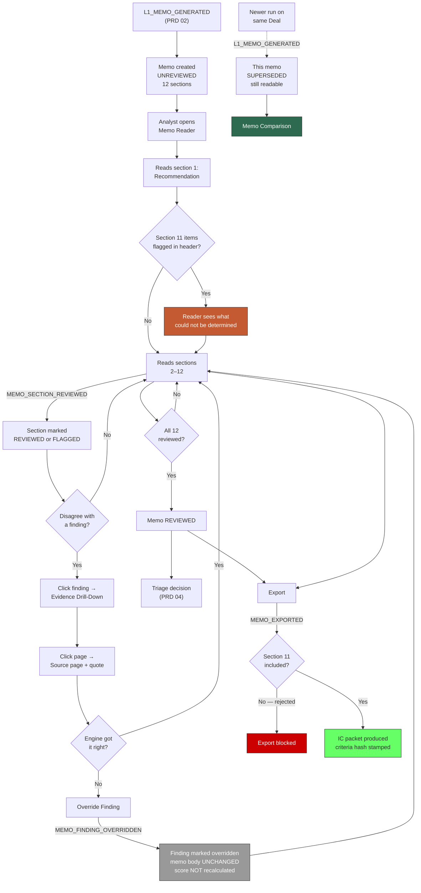

# PRD 05 — Memo Module

> **Framework**: Phlo event-sourced platform. See `00-inbox/event-system-architecture.md` and `00-inbox/prd-guide.md`.
> **Scope**: This module renders the memo the engine produced, lets an analyst review it section by section, drill from any finding to the page and quote that support it, override findings they disagree with, and export an IC packet.
> **The 12 sections are fixed by PRD 06 §5 stage 5.** This module does not define them and must not deviate from them.

---

### Project Identity

```
Project name: l1analysis
Company name: [TODO — confirm with stakeholder]
Display name: L1 Analysis Platform
Admin email domain: [TODO — confirm with stakeholder]
```

---

## 1. Process Overview

### Process: Memo Review and IC Packet Production

The engine produces a memo. This module is where a human decides whether to stand behind it.

That framing matters because of what an IC memo actually is at an allocator. Verified context that shapes every design decision below:

**IC memos average two months to write.** Not two days. The document that goes to an investment committee is the product of weeks of work, and its length reflects the seriousness of committing institutional capital for a decade. A tool that produces a first draft in twenty-five minutes is not competing with the two-month memo — it is competing with the *screening note* that precedes it, and the honest claim is "this replaces the first pass, not the IC memo". Overclaiming here is the fastest way to lose credibility with the audience that matters.

**97% of institutions have a formal template.** The memo format is not a design opportunity. Institutions have a house format, often mandated, and a memo that arrives in an unfamiliar shape gets reformatted by hand — which destroys the time saving entirely. The 12 sections in PRD 06 are drawn from what the Addepar/Stanford study of 54 institutions found most common, and the export path (§3) must support mapping them onto a house template rather than assuming ours wins.

**The recommendation is stated first.** Section 1. Not buried in a conclusion. An IC member reads the recommendation, then reads backward to see whether they believe it.

**A real IC memo often requests an interview, not a commitment.** This is the finding that most changes what "good output" means. The engine's memo recommends a decision gate — pursue, hold, pass, and here is what to ask (PRD 06 §1). A memo whose recommendation is "commit ₹200 crore" would be a memo nobody could act on from a 52-page deck. A memo whose recommendation is "pursue, and here are the eleven things to ask before the manager meeting" is exactly the artefact a screening process produces.

**Section 11 is the section this module exists to protect.** "What We Could Not Determine" is what makes the memo honest enough to put in front of an IC, and it is precisely the section a UI would naturally collapse, tuck behind a tab, or render in grey small text at the bottom. **It must not be collapsed by default, must not be visually de-emphasised, and must appear in every export.** A memo that presents partial analysis as complete is worse than no memo, because it is confidently wrong in the direction of action.

Flow:

```
   Memo Generated        Section Review          Evidence Check         Export
      [ENTRY]               [ENTRY]                 [ENTRY]             [ENTRY]
         |                     |                       |                   |
L1_MEMO_GENERATED      (analyst reads each      (click a finding →   (assemble packet)
      (PRD 02)          section, marks it)       page + quote)             |
         |                     |                       |             MEMO_EXPORTED
  12 sections created   MEMO_SECTION_REVIEWED   MEMO_FINDING_OVERRIDDEN     |
         |                     |                    (if disputed)        [EXIT]
      [EXIT]                [EXIT]                   [EXIT]
```

### What review means here

Section review is not approval in a workflow sense — there is no gate that a memo must pass through before anyone can read it. It is a record of *what a human actually looked at*. An analyst who triages a deal having marked two sections reviewed made a different quality of decision than one who marked twelve, and PRD 04's triage record is more interpretable when that is knowable.

The design consequence: review is per-section, optional, and never blocking. Making it mandatory would produce twelve reflexive clicks and no information.

---

## 2. Entities and Aggregates

| Entity | Aggregate Type | Relationships |
|---|---|---|
| Memo | `Memo` | Belongs to one Analysis Run (PRD 02) and one Deal. Has exactly 12 Memo Sections |
| Memo Section | `Memo` (child, not its own aggregate) | Belongs to one Memo. Fixed set of 12 |
| Finding Override | `Finding` (PRD 02's entity) | An override recorded against a Finding this module does not own |
| Memo Export | `MemoExport` | A produced artefact — an IC packet or a single memo, in a named format |

### Entity Field Definitions

#### Memo

| Field | Type | Description |
|---|---|---|
| id | UUID | Primary key |
| memo_code | string | Human-readable identifier, format `MEMO-{YYYY}-{NNNNNN}` |
| analysis_run_id | UUID | FK → Analysis Run (PRD 02) |
| deal_id | UUID | FK → Deal |
| document_id | UUID | FK → Document — the source deck |
| criteria_set_id | UUID | Which rules produced it |
| criteria_set_version | decimal | Which version |
| criteria_content_hash | string | The hash proving what the engine read |
| recommendation | string | `PURSUE` / `HOLD` / `PASS` / `VETOED`. Section 1's content |
| is_veto_form | boolean | Whether the memo was generated in veto form (engine exit 11) |
| markdown_path | string | Path to `05-memo.md` in the run's output directory |
| json_path | string | Path to `05-memo.json` |
| memo_sha256 | string | Hash of the rendered markdown — proves the memo has not been altered on disk |
| status | string | Lifecycle status — see State Machine |
| sections_reviewed_count | decimal | How many of 12 have been marked reviewed |
| findings_count | decimal | Total findings rendered |
| findings_overridden_count | decimal | How many an analyst disputed |
| unresolved_count | decimal | Section 11's item count |
| citation_count | decimal | Total page-level citations |
| word_count | decimal | Length of the rendered memo |
| generated_at | datetime | When the engine wrote it |
| first_read_at | datetime | When a human first opened it |
| last_reviewed_at | datetime | Most recent section review |
| engine_version | string | Which engine produced it |
| created_at | datetime | Record creation |

**`memo_sha256` deserves a note.** The memo lives on disk in the run's output directory, not in the database. The hash is stored so that a memo read six months after generation can be verified as the memo that was generated — the artifact directory is a filesystem, and filesystems are hostile (overview §6.6). A hash mismatch on read is surfaced as a warning on the memo screen, not silently ignored.

#### Memo Section

| Field | Type | Description |
|---|---|---|
| id | UUID | Primary key |
| memo_id | UUID | FK → Memo |
| section_number | decimal | 1–12, fixed |
| section_key | string | Stable key — see the fixed table in §2.1 |
| title | string | Display title |
| body_markdown | text | The section's rendered content |
| word_count | decimal | Length |
| has_content | boolean | Whether the section produced content |
| is_generated | boolean | False for sections 3, 6, 11, 12 — direct renders with no model call |
| finding_codes | string[] | Criterion codes referenced in this section |
| citation_count | decimal | Page citations within this section |
| review_status | string | `UNREVIEWED` / `REVIEWED` / `FLAGGED` |
| reviewed_by_user_id | UUID | Who reviewed it |
| reviewed_at | datetime | When |
| review_note | text | Optional comment left at review |
| created_at | datetime | Record creation |

#### Memo Export

| Field | Type | Description |
|---|---|---|
| id | UUID | Primary key |
| export_code | string | Human-readable identifier, format `EXP-{YYYY}-{NNNNNN}` |
| memo_id | UUID | FK → Memo |
| deal_id | UUID | FK → Deal |
| export_type | string | `MEMO_ONLY` / `IC_PACKET` / `SECTION_SUBSET` |
| format | string | `PDF` / `MARKDOWN` / `DOCX` |
| template_id | UUID | House template applied. Null for the default |
| sections_included | string[] | Section keys included. **Must always contain `could_not_determine`** |
| includes_findings_detail | boolean | Whether full evidence appears as an appendix |
| includes_source_document | boolean | Whether the original deck is bundled |
| includes_notes | boolean | Whether IC-visible deal notes are appended |
| includes_odd_summary | boolean | Whether the ODD rating and findings are included |
| includes_prior_fund_history | boolean | For re-ups, whether prior decisions are appended |
| exported_by_user_id | UUID | Who exported |
| exported_at | datetime | When |
| file_path | string | Where the produced file lives |
| file_sha256 | string | Hash of the produced file |
| byte_size | decimal | Size |
| recipient_note | string | Optional note recorded with the export |
| created_at | datetime | Record creation |

### 2.1 The fixed 12 sections

Defined by PRD 06 §5 stage 5. Reproduced here because this module renders them and any drift between the two documents is a defect.

| # | `section_key` | Title | Source | Generated? |
|---|---|---|---|---|
| 1 | `recommendation` | Recommendation | Scoring result + veto status | Yes |
| 2 | `rationale` | Rationale | Top findings by severity | Yes |
| 3 | `fund_facts` | Fund Facts | Extraction | **No — direct render** |
| 4 | `risk_factors` | Risk Factors | Red flags and vetoes, with evidence | Yes |
| 5 | `supporting_factors` | Supporting Factors | Green flags, with evidence | Yes |
| 6 | `fees_and_terms` | Fees and Terms | Extraction | **No — direct render** |
| 7 | `team` | Team | Extraction + diligence | Yes |
| 8 | `track_record` | Track Record | Extraction + diligence | Yes |
| 9 | `contested_findings` | Contested Findings | Where lenient and strict passes disagreed | Yes |
| 10 | `asks` | Asks | `remediation_prompt` from every fired criterion | Yes |
| 11 | `could_not_determine` | What We Could Not Determine | Every `unresolved` entry from every stage | **No — direct render** |
| 12 | `sources` | Sources | Derived from citations | **No — direct render** |

`is_generated = false` on sections 3, 6, 11 and 12 is not decoration. The UI displays it, because "this section was assembled mechanically from extracted data, not written by a model" is the strongest thing that can be said about a section's reliability, and it is worth saying.

### Numbering

| Entity | Prefix | Format | Example |
|---|---|---|---|
| Memo | MEMO | `MEMO-{YYYY}-{NNNNNN}` | MEMO-2026-000318 |
| Memo Export | EXP | `EXP-{YYYY}-{NNNNNN}` | EXP-2026-000044 |

Memo Sections have no code — they are addressed by `memo_id` plus `section_number`, and their URL fragment is the `section_key` (`/memos/{id}#could_not_determine`), which is stable across memos and citable in an email.

---

## 3. Process Steps

### Step: Create Memo Record

Event type: `L1_MEMO_GENERATED` *(emitted by PRD 02 — handled here)*

Trigger:
  Not a step this module emits. The worker emits `L1_MEMO_GENERATED` when the engine's memo stage completes; this module's projection service responds by creating the Memo and its 12 sections.

Data points captured:
  See PRD 02 §4 "Generate L1 Memo".

Payload:
  See PRD 02.

Aggregate: `Deal` / `deal_id`

Location: None. This process does not involve physical locations.

Preconditions:
  - Enforced by PRD 02 at emission, including the requirement that the memo's recommendation matches the scorecard and that section 11 has content whenever any stage reported unresolved items

Side effects:
  - `memos`: new row, status `UNREVIEWED`
  - `memo_sections`: exactly 12 rows, one per fixed section, each `UNREVIEWED`
  - Section bodies are read from `05-memo.json` and stored in `body_markdown`. **The memo is stored in the database as well as on disk.** The disk copy is the engine's artifact and the source of `memo_sha256`; the database copy is what the UI renders, because rendering a memo should not require the web tier to have filesystem access to a worker's output directory
  - `memo_agreement_stats` (PRD 04): the memo's recommendation becomes available for comparison against the eventual triage decision

Projections updated:
  - `memos`, `memo_sections`

Permissions:
  - Enforced at emission by PRD 02 (`events:L1_MEMO_GENERATED:emit`)

---

### Step: Review Memo Section

Event type: `MEMO_SECTION_REVIEWED`

Trigger:
  Analyst finishes reading a section and clicks "Reviewed" (or "Flag") in the section header on the Memo screen. Optionally leaves a note.

Data points captured:
  - memo_id: UUID
  - section_number: decimal — 1–12
  - section_key: string
  - review_status: string — `REVIEWED` / `FLAGGED`
  - review_note: text (optional) — required when `FLAGGED`
  - time_on_section_seconds: decimal (optional) — how long the section was on screen

Payload:
```
memo_id: UUID
deal_id: UUID
analysis_run_id: UUID
section_number: decimal
section_key: string
review_status: string
review_note: string?
time_on_section_seconds: decimal?
reviewed_by_user_id: UUID
reviewed_at: datetime
```

Aggregate: `Memo` / `memo_id`

Location: None.

Preconditions:
  - Memo must exist and not be `SUPERSEDED`
  - `section_number` must be between 1 and 12
  - `section_key` must match the fixed key for that number (§2.1) — a mismatch means the caller and the server disagree about the section structure, which is a defect worth failing on rather than accepting
  - When `review_status` is `FLAGGED`, `review_note` is required. A flag without a reason is noise
  - Re-reviewing an already-reviewed section is permitted; it records a second event and updates the projection. **The event stream keeps both**, so "reviewed, then flagged an hour later" survives

Side effects:
  - `memo_sections`: `review_status`, `reviewed_by_user_id`, `reviewed_at`, `review_note` updated
  - `memos`: `sections_reviewed_count` recomputed, `last_reviewed_at` set; `first_read_at` set if null
  - `memos`: status → `IN_REVIEW` on the first review, → `REVIEWED` when all 12 sections are `REVIEWED` or `FLAGGED`
  - **No gate opens.** A fully reviewed memo is not more exportable, more triageable, or more anything than an unreviewed one. Review is a record, not a permission

Projections updated:
  - `memo_sections`, `memos`, `memo_review_stats`

Permissions:
  - `events:MEMO_SECTION_REVIEWED:emit`

**On `time_on_section_seconds`**: optional and lightly held. It is genuinely useful for one question — whether section 11 is being read or skipped — and genuinely creepy if surfaced as individual productivity monitoring. **[NEEDS REVIEW — recommend capturing it, aggregating it only at the section level across all users, and never displaying it per-person. If that discipline cannot be guaranteed, drop the field. A metric that will be misused is worse than a metric that does not exist.]**

---

### Step: Override Finding

Event type: `MEMO_FINDING_OVERRIDDEN`

Trigger:
  Analyst reading a finding in the memo disagrees with it — the criterion fired but the evidence does not support it, or it did not fire but should have. They click "Override" on the finding, select the corrected verdict, and write a justification.

Data points captured:
  - memo_id: UUID
  - finding_id: UUID — the Finding (PRD 02's entity)
  - criterion_code: string
  - original_verdict: boolean — what the engine concluded
  - override_verdict: boolean — what the analyst concludes
  - override_reason: string — structured, see below
  - justification: text — **required**
  - supporting_page: decimal (optional) — a page the analyst believes the engine misread or missed
  - supporting_quote: string (optional)

Payload:
```
memo_id: UUID
deal_id: UUID
analysis_run_id: UUID
finding_id: UUID
criterion_id: UUID
criterion_code: string
original_verdict: boolean
original_evaluation_state: string
override_verdict: boolean
override_reason: string
justification: string
supporting_page: decimal?
supporting_quote: string?
overridden_by_user_id: UUID
overridden_at: datetime
```

Aggregate: `Memo` / `memo_id`

Location: None.

Structured override reasons:

| Reason | Meaning | What it implies |
|---|---|---|
| `EVIDENCE_MISREAD` | The cited page does not say what the finding claims | Engine extraction or reasoning error |
| `EVIDENCE_MISSED` | The information exists elsewhere in the document; the engine did not find it | Engine coverage gap |
| `CRITERION_MISAPPLIED` | The rule fired but does not apply to this fund type or structure | **Criteria authoring problem, not an engine problem** |
| ~~`EXTERNAL_KNOWLEDGE`~~ | **REMOVED 2026-07-21.** The analyst knows something not in the document — a prior meeting, a reference call, market knowledge | **Route to PRD 07 attestation instead — see below** |
| `CRITERION_TOO_BROAD` | The rule technically fired but the finding is not material here | Criteria calibration problem |
| `JUDGEMENT_DIFFERS` | Same evidence, different professional conclusion | Legitimate disagreement, not an error |

Preconditions:
  - Memo must exist and not be `SUPERSEDED`
  - The Finding must belong to this memo's Analysis Run
  - `justification` must be at least 40 characters. This is the same threshold as PRD 03's `detection_guidance` and PRD 04's triage rationale, and for the same reason: the field's value is entirely in its specificity
  - `override_verdict` must differ from `original_verdict` — an override that changes nothing is a note, and `DEAL_NOTE_ADDED` (PRD 04) is the event for that
  - A previously overridden finding may be overridden again; the latest override wins in the projection and every override survives in the event stream

Side effects:
  - `findings` (PRD 02's projection): `is_overridden` → true, `override_verdict` set. **This module writes to a projection another module owns** — declared explicitly in §10
  - `memos`: `findings_overridden_count` += 1
  - **The memo body is NOT rewritten.** The rendered section still contains the engine's original finding text, with the override displayed alongside it. Rewriting the memo would destroy the record of what the engine actually said, which is the thing the override is evidence about
  - **The recommendation is NOT recalculated.** An override does not re-score the deal. Recomputing `total_score` from overridden findings would produce a number that is neither the engine's assessment nor a human's, attributable to nobody, and reproducible by nothing. The analyst's disagreement is expressed in the triage decision (PRD 04), which is where a human verdict belongs
  - `override_stats`: aggregated by criterion and reason

Projections updated:
  - `findings` (PRD 02), `memos`, `override_stats`

Permissions:
  - `events:MEMO_FINDING_OVERRIDDEN:emit`

**What consumes an override**, since the overview §9 lists this as an open question and it deserves a position rather than a shrug:

The `override_reason` enum is designed to route it. `CRITERION_MISAPPLIED` and `CRITERION_TOO_BROAD` are signals to the Criteria module — a criterion overridden for these reasons repeatedly is badly authored, and `override_stats` grouped by criterion is a companion to PRD 03's `criterion_hit_stats`. Together they answer "which of our rules are working": one shows fire rate, the other shows how often humans disagree when they fire. `EVIDENCE_MISREAD` and `EVIDENCE_MISSED` are signals about the engine and belong in a regression corpus (PRD 06 §8). `JUDGEMENT_DIFFERS` is a signal about neither and should not be fed back into anything — it is the system working correctly, with a human disagreeing about a correctly-read fact.

#### Why `EXTERNAL_KNOWLEDGE` was removed (2026-07-21)

It described an **attestation**, not an override, and the two have opposite consequences. Keeping both would have given an analyst two paths for the same intent with silently different outcomes:

| | Override (this module) | Attestation (PRD 07) |
|---|---|---|
| What it means | "The engine read the document wrong" | "The document doesn't say, but I know" |
| Effect on the analysis | **Inert** — annotates the memo, does not recalculate | Feeds the next run as an input; can change findings |
| Effect on the score | None | Can flip a criterion, with provenance labelling |
| Cost | Free | Triggers a re-run: 8–16 min, ~$2–4 |

An analyst adding "GP commitment is 2.5%, confirmed with the CFO" as an *override* would have annotated one memo and changed nothing — while believing they had corrected the analysis. The same input as an *attestation* propagates into the next version and can fire `CR-0030`. Same knowledge, same words, entirely different result depending on which button they happened to find.

The remaining five reasons are all genuinely about misreadings of the supplied document, which is what an override is for. The UI must route external knowledge to PRD 07's attestation form, and should say why — *"this isn't in the document, so it needs to go in as evidence rather than a correction."*

**Cross-module boundary**: PRD 07 owns everything that changes what the next run sees. This module owns annotations to a memo that already exists. A change that affects a future analysis never belongs here.

**Overrides are not training data in the machine-learning sense** and should not be described as such. Nothing in this architecture fine-tunes on them. They are diagnostic input for humans authoring criteria and humans fixing the engine.

---

### Step: Export Memo

Event type: `MEMO_EXPORTED`

Trigger:
  Analyst or IC Member clicks "Export" on the Memo screen, selects an export type and format, chooses what to include, and confirms.

Data points captured:
  - memo_id: UUID
  - export_type: string — `MEMO_ONLY` / `IC_PACKET` / `SECTION_SUBSET`
  - format: string — `PDF` / `MARKDOWN` / `DOCX`
  - template_id: UUID (optional) — house template
  - sections_included: string[]
  - includes_findings_detail: boolean
  - includes_source_document: boolean
  - includes_notes: boolean
  - includes_odd_summary: boolean
  - includes_prior_fund_history: boolean
  - recipient_note: string (optional)

Payload:
```
id: UUID (generated)
export_code: string (generated, EXP-YYYY-NNNNNN)
memo_id: UUID
deal_id: UUID
analysis_run_id: UUID
export_type: string
format: string
template_id: UUID?
sections_included: string[]
includes_findings_detail: boolean
includes_source_document: boolean
includes_notes: boolean
includes_odd_summary: boolean
includes_prior_fund_history: boolean
file_path: string
file_sha256: string
byte_size: decimal
recipient_note: string?
exported_by_user_id: UUID
exported_at: datetime
```

Aggregate: `Memo` / `memo_id`

Location: None.

Preconditions:
  - Memo must exist
  - **`sections_included` must contain `could_not_determine`.** Section 11 cannot be excluded from any export, by anyone, for any reason. This is the same invariant PRD 06 §5 states for generation, enforced again at the boundary where the memo leaves the platform. An export that omits what the analysis could not establish presents partial work as complete to the audience least able to detect it
  - `sections_included` must contain `recommendation` and `sources` — the recommendation because a memo without one is not a memo, sources because a claim without attribution is not evidence
  - When `export_type` is `IC_PACKET`, all 12 sections are included and the choice is not offered
  - When `includes_odd_summary` is true, an ODD Review must exist for the Deal (PRD 04)
  - When `includes_prior_fund_history` is true, the Deal's `deal_track` must be `RE_UP`

IC packet contents:

| Component | Included | Source |
|---|---|---|
| Cover page | Always | Deal, fund, manager, date, analyst, recommendation |
| All 12 memo sections | Always | `memo_sections` |
| Findings appendix with full evidence | Default on | `findings` (PRD 02) |
| Overrides, shown against their findings | Always when any exist | `findings.override_*` |
| Criteria set reference | Always | Set code, version, and `criteria_content_hash` |
| Source document | Optional | The original deck |
| ODD summary | Optional | `odd_reviews` (PRD 04) |
| IC-visible deal notes | Optional | `deal_notes` where `is_visible_to_ic` (PRD 04) |
| Prior fund history | Optional, re-ups only | Prior Deals and their triage decisions (PRD 04) |

Side effects:
  - `memo_exports`: new row
  - The file is produced and written to the export store, addressed by content hash
  - `memos`: no status change. **Export is not a lifecycle event for the memo** — the same memo can be exported repeatedly in different forms, and each export is its own record
  - **The criteria set reference is stamped onto every export.** A memo read at an IC meeting without knowing which rules produced it cannot be interrogated, and interrogation is what an IC is for

Projections updated:
  - `memo_exports`, `export_stats`

Permissions:
  - `events:MEMO_EXPORTED:emit`

**On house templates.** `template_id` is nullable and the default template is ours. Given that 97% of institutions have a formal template of their own, the default will be wrong for almost every deployment, and the mapping from our 12 sections onto a house format is the work that determines whether the export is used or reformatted by hand. Template authoring is **out of scope for v1** and flagged as the highest-value follow-on: it is the difference between saving an analyst a first draft and saving them a first draft plus a reformat.

---

## 4. State Machines

### Memo States

Statuses: `UNREVIEWED`, `IN_REVIEW`, `REVIEWED`, `SUPERSEDED`

Transitions:

| From Status | Event | To Status |
|---|---|---|
| — | `L1_MEMO_GENERATED` (PRD 02) | `UNREVIEWED` |
| `UNREVIEWED` | `MEMO_SECTION_REVIEWED` (first) | `IN_REVIEW` |
| `IN_REVIEW` | `MEMO_SECTION_REVIEWED` (twelfth) | `REVIEWED` |
| `REVIEWED` | `MEMO_SECTION_REVIEWED` (re-review as `FLAGGED`) | `IN_REVIEW` |
| any | `L1_MEMO_GENERATED` for a newer run on the same Deal | `SUPERSEDED` |

```
UNREVIEWED --first section--> IN_REVIEW --all 12--> REVIEWED
                                  ^                    |
                                  +---re-flag----------+

  any state --newer run on same Deal--> SUPERSEDED (terminal)
```

Notes:
- **`SUPERSEDED` is terminal and non-destructive.** A superseded memo remains fully readable, exportable, and citable. When Neo circulates a June deck and a second run produces a second memo, the February memo becomes `SUPERSEDED` — not deleted, not hidden. The comparison between them is the point (PRD 01 §5 report 6).
- A `SUPERSEDED` memo accepts no new section reviews or overrides. Reviewing a memo that has been replaced records an opinion about a document nobody will act on.
- No status gates anything. `REVIEWED` unlocks nothing; `UNREVIEWED` blocks nothing. The status is a description of what a human has looked at, and it is used in reporting and in the triage record's interpretation, not in permissions.

### Memo Section States

Statuses: `UNREVIEWED`, `REVIEWED`, `FLAGGED`

| From Status | Event | To Status |
|---|---|---|
| — | `L1_MEMO_GENERATED` | `UNREVIEWED` |
| `UNREVIEWED` | `MEMO_SECTION_REVIEWED` (REVIEWED) | `REVIEWED` |
| `UNREVIEWED` | `MEMO_SECTION_REVIEWED` (FLAGGED) | `FLAGGED` |
| `REVIEWED` | `MEMO_SECTION_REVIEWED` (FLAGGED) | `FLAGGED` |
| `FLAGGED` | `MEMO_SECTION_REVIEWED` (REVIEWED) | `REVIEWED` |

`FLAGGED` means "I have read this and something is wrong with it" — distinct from unreviewed, and it should be visible on the memo list so that a colleague picking up the deal sees it immediately.

### Memo Export

Exports are immutable records of a file produced at a moment. No lifecycle. A re-export is a new export, which is correct: two people at an IC holding different PDFs of the same memo is a real failure mode, and being able to say "you have EXP-2026-000044, the current one is EXP-2026-000051" resolves it.

---

## 5. Reports and Projections

| # | Business Question | Projection Table | Key Fields | Updated By Events |
|---|---|---|---|---|
| 1 | "Which memos are ready to read, and which have I not finished?" | `memos` | memo_code, deal_id, fund_name, recommendation, status, sections_reviewed_count, generated_at | `L1_MEMO_GENERATED`, `MEMO_SECTION_REVIEWED` |
| 2 | "What does this memo say, section by section?" | `memo_sections` | section_number, section_key, title, body_markdown, is_generated, review_status, citation_count | `L1_MEMO_GENERATED`, `MEMO_SECTION_REVIEWED` |
| 3 | "What could this analysis not determine?" | `memo_sections` filtered to `could_not_determine`, plus `unresolved_count` on the run | unresolved items with the stage that reported each | `L1_MEMO_GENERATED` |
| 4 | "Which findings do analysts override, and why?" | `override_stats` | criterion_code, override_count, fire_count, override_rate_pct, reason breakdown | `MEMO_FINDING_OVERRIDDEN`, `DEAL_SCORED` |
| 5 | "Are our memos actually being read?" | `memo_review_stats` | period, memos_generated, memos_opened, memos_fully_reviewed, avg_sections_reviewed, section_11_review_rate_pct | `L1_MEMO_GENERATED`, `MEMO_SECTION_REVIEWED` |
| 6 | "What have we exported, to what, and when?" | `memo_exports` | export_code, memo_code, export_type, format, exported_by, exported_at, byte_size | `MEMO_EXPORTED` |
| 7 | ~~"How did this manager's story change between decks?"~~ | ~~`memo_comparison`~~ | **SUPERSEDED 2026-07-21 by PRD 08 §4 — see note below** | — |
| 8 | "Which memos have contested findings needing human judgement?" | `memos` joined to `findings` where `evaluation_state = CONTESTED` | memo_code, fund_name, contested_count | `DEAL_SCORED`, `L1_MEMO_GENERATED` |
| 9 | "Where did this claim come from?" | *Not a projection* — evidence is stored on `findings` (PRD 02) and rendered inline | — | `DEAL_SCORED` |
| 10 | "Show me everything that happened to this memo" | *Not a projection* — query `movement_events` by `aggregate_type` = `Memo` | — | Automatic |

### Note on report 7 — superseded by PRD 08 (2026-07-21)

This module originally defined a `memo_comparison` projection producing **section-level textual diffs** between two runs on one Deal. PRD 08 §4 defines version comparison at **finding level with causal attribution**. These are the same feature specified twice at different granularities, and the coarser one is actively worse:

Memo prose is model-generated and non-deterministic — PRD 06 measures contested findings varying 3, 3, 0 across identical runs. A textual diff of two memos therefore surfaces dozens of wording changes that mean nothing, burying the one change that matters. PRD 08's version instead reports *"`CR-0030` flipped not-fired → fired because the PPM (uploaded 24 Jul, p.14) disclosed a 2.5% GP commitment"* — the same question, answered usefully.

**Report 7 and its screen are removed from this module.** Comparison lives in PRD 08. This module owns rendering and reviewing a single memo version; it does not own the relationship between versions.

### Notes on reports 4 and 5

**Report 4 (Override Stats)** is the companion to PRD 03's `criterion_hit_stats`. Fire rate alone cannot distinguish a rule that fires often because it is important from a rule that fires often because it is too broad. Override rate can: a criterion that fires on 60% of deals and is overridden on 50% of those firings is miscalibrated, and grouping the overrides by reason says which way. This should appear on PRD 03's Criterion Performance screen alongside the fire rate, not in a separate memo-module report nobody visits.

**Report 5 (Memo Review Stats)** exists mainly to carry one number: `section_11_review_rate_pct`. Section 11 is the section the whole design protects, and whether analysts actually read it is a question the platform should be able to answer about itself. If it turns out to be the least-read section, that is a UI failure to fix, not a user failure to tolerate.

### Pagination

Reports 1 and 6 are paginated lists.

**Report 2 must return all 12 sections unpaginated.** Obviously.

**Report 9's underlying data — the findings with full evidence — must be fetchable in bulk for one run.** A criteria set with 40 criteria produces 40 findings, each with multiple evidence quotes, and the memo screen renders the drill-down inline. Requesting them a page at a time would make the memo screen feel broken. The endpoint is scoped by `analysis_run_id` and returns everything. This is the same requirement PRD 02 §6 states from the other side.

**Report 7 (comparison) needs two full memos at once** — 24 sections plus both runs' findings. Unpaginated, scoped to a Deal and two run IDs.

---

## 6. Roles and Permissions

### Roles

| Role | Description | Permissions |
|---|---|---|
| Analyst | Reads memos, reviews sections, overrides findings, exports | `events:MEMO_SECTION_REVIEWED:emit`, `events:MEMO_FINDING_OVERRIDDEN:emit`, `events:MEMO_EXPORTED:emit`, `memo:read` |
| Super Admin | Everything an Analyst can do, plus template management | All Analyst permissions plus `memo:manage_templates` |
| IC Member | Reads memos and exports IC packets. **Does not override findings** | `events:MEMO_SECTION_REVIEWED:emit`, `events:MEMO_EXPORTED:emit`, `memo:read` |
| ODD Reviewer | Reads memos for operational context | `memo:read` |
| Worker Service Account | Creates memos via `L1_MEMO_GENERATED` (PRD 02) | — (no memo-module permissions) |

### Permissions

| Permission Code | Description | Used By Step |
|---|---|---|
| `events:MEMO_SECTION_REVIEWED:emit` | Mark a section reviewed or flagged | Review Memo Section |
| `events:MEMO_FINDING_OVERRIDDEN:emit` | Dispute a finding | Override Finding |
| `events:MEMO_EXPORTED:emit` | Produce a memo or IC packet file | Export Memo |
| `memo:read` | View memos, sections, findings, evidence | All read screens |
| `memo:manage_templates` | Author and edit house export templates | Template screens |

**Why an IC Member cannot override a finding.** An override is a statement about whether the engine read the document correctly — an analytical correction made by the person who did the analysis, recorded against the analysis. An IC Member disagreeing with a memo does not correct it; they decide against it, which is `DEAL_TRIAGED` with `IC_DECLINED` and a rationale (PRD 04). Letting the committee edit the analysis it is evaluating collapses two distinct acts, and the memo stops being a record of what the analyst put forward.

---

## 7. Locations

This process does not involve physical locations. Events will not carry a `location_id`.

---

## 8. Screen List

| # | Screen Name | Type | Used By | Purpose | Key Actions |
|---|---|---|---|---|---|
| 1 | Memos | list | Analyst, IC Member, Super Admin | All memos with recommendation, review status, flagged count, date | Open, Export, Filter |
| 2 | **Memo Reader** | detail | Analyst, IC Member, ODD Reviewer | The memo itself — 12 sections, findings inline, evidence drill-down, section review controls | Review Section, Flag Section, Override Finding, Export, Open Source Page |
| 3 | Evidence Drill-Down | detail | Analyst, IC Member | A finding's full evidence — every quote with its page, the source page rendered alongside, absence evidence, lenient/strict verdicts | Open Criterion, Override, Back to Memo |
| 4 | Source Document Viewer | detail | Analyst, IC Member | The original deck, opened to a cited page with the quote highlighted | Back to Finding, Next Citation, Download |
| 5 | Override Finding | form | Analyst | Record a disagreement with a finding | Save Override, Cancel |
| 6 | Export Memo | form | Analyst, IC Member | Choose type, format, template, and inclusions | Export, Preview, Cancel |
| 7 | Export History | list | Analyst, Super Admin | Every export with who, when, what was included | Download, Open Memo |
| 8 | Memo Comparison | detail | Analyst, IC Member | Two runs on one Deal side by side — what changed between decks | Open Either Memo, Export Comparison |
| 9 | Overrides | list | Super Admin, Analyst | All overrides across memos, grouped by criterion and reason | Open Finding, Open Criterion |
| 10 | Memo Templates | list | Super Admin | House export templates | New Template, Edit, Set Default |
| 11 | Template Editor | form | Super Admin | Map the 12 sections onto a house format | Save, Preview, Set Default |

### Screen notes

**Screen 2 (Memo Reader) is the product.** Everything else in the platform exists to fill this screen. Specific requirements, each of which is load-bearing:

- **Section 11 is not collapsed, not in a tab, not below a fold that requires scrolling past twelve sections to reach.** The strongest treatment is a persistent summary of section 11 in the memo header — "3 items could not be determined" — that jumps to the section. A reader who forms a view from sections 1 and 2 and never scrolls has been misled by the layout, and layout is our responsibility.
- The recommendation (section 1) is at the top, because that is how IC memos work, and the reader's eye should reach it before anything else.
- Findings render **inline within their sections**, not in a separate appendix. A red flag in section 4 shows its criterion code, its severity, and its evidence quote right there, with the page number as a link.
- `is_generated = false` sections carry a visible marker — "assembled from extracted data" — because it is the strongest reliability signal available and it costs one line of UI.
- `CONTESTED` findings render with both verdicts shown and labelled, never resolved to one.
- `VETO_UNEVALUATED` findings (PRD 02 §2) render as neither passed nor fired, with the reason the check could not be performed. This is the state most likely to be mis-rendered as a green tick.
- A memo whose `memo_sha256` does not match the file on disk shows a warning banner. Rare, but silent corruption of the artefact an IC is about to read is not something to absorb quietly.

**Screen 3/4 (Evidence Drill-Down and Source Viewer)** are the pair that makes the engine's central claim checkable. PRD 06 §1 states every finding must cite page-level evidence; this is where a reader tests that. The interaction is: click a finding in the memo → see every quote with its page → click a page → the deck opens to it with the quote highlighted. **Two clicks from an assertion to the words in the document that support it.** If this path is slower or more indirect than that, the evidence discipline the engine enforces is invisible to the person who needs it.

PRD 06 §9 raises a real limitation here: text extracted from PowerPoint-derived PDFs loses spatial layout, so a page-level citation may point at a slide whose meaning depends on a chart. Screen 4 should render the actual page image, not the extracted text, precisely for this reason — the reader needs to see what the analyst would have seen.

**Screen 8 (Memo Comparison)** is the payoff for the Deal/Document model (PRD 01 §1). Two runs on one Deal, section by section, with findings that appeared, findings that disappeared, and extracted metrics that changed. The highest-value display is the metric delta table: "target investments 20–22 → 16–18, target size ₹5,000cr → ₹5,000cr, hurdle 10% → 10%". A finding that fired in February and did not fire in June is either progress by the manager or a regression in the engine, and both are worth knowing.

### Palette-Searchable Entities

| Entity | Search by | Result label | Result description | Detail path |
|---|---|---|---|---|
| Memo | memo_code, deal fund_name, manager_name | fund_name | memo_code · recommendation · status | `/memos/{id}` |
| Memo Export | export_code | export_code | fund_name · export_type · exported_at | `/exports/{id}` |

Memo Sections are not separately searchable — they are addressed by fragment within a memo (`/memos/{id}#could_not_determine`) and have no standalone page.

Page-scoped shortcuts requested on the Memo Reader: `r` marks the current section reviewed, `f` flags it, `j`/`k` move between sections, `e` opens export. An analyst reading twelve sections should be able to do it without reaching for the mouse.

---

## 9. Process Flowchart



---

## 10. Cross-Module Boundaries

| Boundary | Direction | Detail |
|---|---|---|
| `L1_MEMO_GENERATED` | **Consumed** from PRD 02 | Creates the Memo and its 12 sections. This module does not emit it |
| `DEAL_SCORED` | **Consumed** from PRD 02 | Findings rendered in the memo come from this event's projection |
| `MEMO_FINDING_OVERRIDDEN` | **Emitted**, writes into PRD 02's projection | This module sets `is_overridden` and `override_verdict` on the `findings` table PRD 02 owns. **Declared explicitly because a module writing another module's projection is unusual** and would otherwise look like a mistake. It is correct under Phlo's model — projection services handle any event type they choose — but it must be intentional |
| `MEMO_SECTION_REVIEWED` | **Emitted**, consumed by PRD 04 | Informs whether the memo was read before the triage decision |
| `MEMO_EXPORTED` | **Emitted** | Consumed only as an audit record |
| Criteria set + criteria | **Read** from PRD 03 | Criterion names, rationales, and remediation prompts render in the memo; the set reference stamps every export |
| `override_stats` | **Surfaced in** PRD 03's screens | Override rate per criterion belongs next to fire rate on the Criterion Performance screen, not in a separate memo report |
| ODD Review | **Read** from PRD 04 | Optional IC packet component |
| Deal Notes | **Read** from PRD 04 | IC-visible notes optionally appended to the packet |
| Source document | **Read** from PRD 01 | Screen 4 renders the original deck; the blob is PRD 01's |
| Memo artifacts on disk | **Read** from PRD 06 §3 | `05-memo.md` and `05-memo.json` in the run's output directory; `memo_sha256` verifies them |

---

## 11. Open Questions

- **House templates** (§3). Out of scope for v1, and the highest-value follow-on. With 97% of institutions running a formal template, an export in our format gets reformatted by hand and the time saving evaporates. How configurable does the mapping need to be — section reordering only, or arbitrary layout?
- **DOCX export.** Listed as a format. Producing a DOCX that survives contact with an institution's template is materially harder than producing a PDF, and an IC administrator who needs to edit the memo will want DOCX specifically. Is PDF sufficient for v1?
- **`time_on_section_seconds`** (§3). Useful in aggregate for one important question, dangerous per-person. Capture with an aggregation-only discipline, or omit?
- **Should overrides recalculate anything?** This PRD says no, firmly (§3), on the grounds that a partly-human partly-engine score is attributable to nobody. An alternative view is that an analyst who overrides three red flags has materially changed the assessment and the memo should reflect it. The counter-argument is that PRD 04's triage decision already carries the human verdict and does so with a rationale attached. `[NEEDS REVIEW]`
- **Memo comparison depth** (screen 8). Section-level diff, finding-level diff, and metric deltas are specified. Should it also diff the extracted facts field by field? More useful and materially more work, and it depends on PRD 02's `deal_extractions` being structured consistently across engine versions — which is not guaranteed when `schema_version` changes.
- **Who sees a memo before the analyst has read it?** Currently anyone with `memo:read`, immediately on generation. An analyst may reasonably want to review before an IC Member sees a raw engine output attributed to their deal. A hold-until-first-reviewed visibility rule is easy to add and easy to resent. Needs a stakeholder view.
