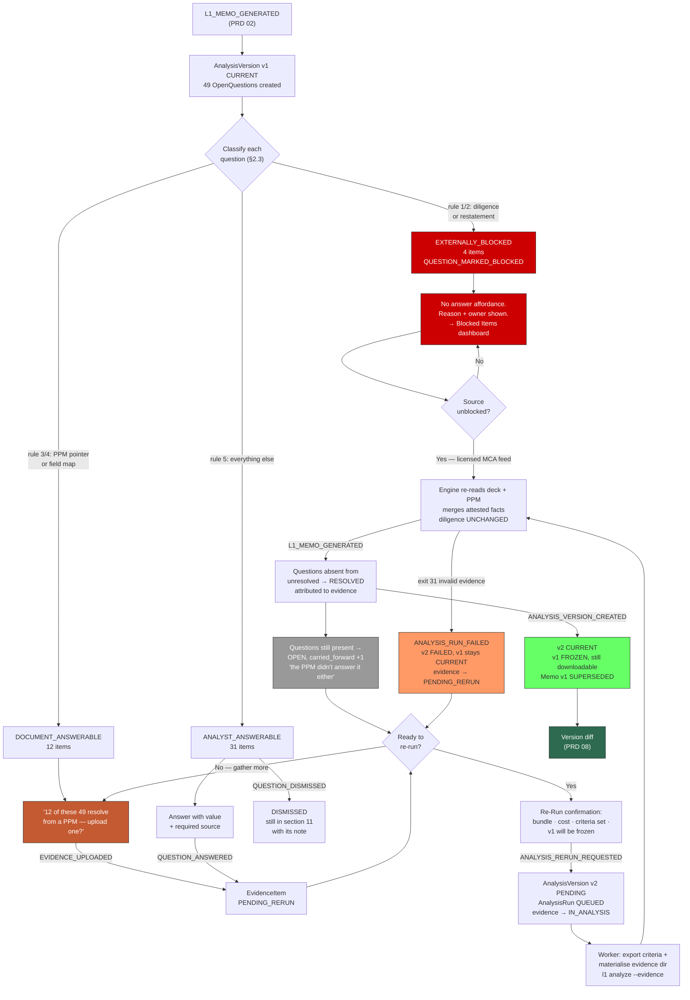

# PRD 07 — Evidence Loop Module

> **Framework**: Phlo event-sourced platform. See `00-inbox/event-system-architecture.md` and `00-inbox/prd-guide.md`.
> **Scope**: This module turns memo section 11 from a static confession into a worklist. It owns the Open Question, the Evidence Item, and the Analysis Version — the loop by which an analyst closes gaps and re-runs the engine with more than it had the first time.
> **Read PRD 05 §2.1 (section 11), PRD 06 §3 (the `unresolved` array), and PRD 06 §5 stage 3 (the `unavailable` policy) first.** This module is entirely downstream of those three things.
> **This PRD requires a change to PRD 06 §2.** See §11. Do not build the re-run path assuming the CLI already accepts evidence.

---

### Project Identity

```
Project name: l1analysis
Company name: [TODO — confirm with stakeholder]
Display name: L1 Analysis Platform
Admin email domain: [TODO — confirm with stakeholder]
```

---

## 1. Process Overview

### Process: Closing the Analysis Gaps

The engine's honesty is its most expensive property. On the reference case — a real 52-page SEBI Category II AIF deck — the engine reported **49 open items** in memo section 11: one from classification, eleven from extraction, six from diligence, thirty-one from scoring. (Counts are from the reference run at `/tmp/l1-v3`, which predates the 2026-07-21 SEBI correction; the totals hold, the diligence *routing* changed — see §3.) Every one is a real gap, stated with what was searched and why nothing was found. PRD 05 §1 defends section 11 from being collapsed, hidden, or greyed out. This module is what happens after the analyst has read it.

Because a section 11 of 49 items is, on its own, a wall. It is a correct wall — it is what the document actually failed to establish — but a co-pilot that hands an analyst forty-nine identical-looking bullet points and no route through them has converted honesty into an obstacle. The gap between "the engine told you the truth" and "the engine helped you" is entirely in the routing.

**The central insight of this module: the 49 items are three different kinds of thing, and treating them identically is the failure mode.**

| Kind | What closes it | Reference-case examples | Count |
|---|---|---|---|
| **`DOCUMENT_ANSWERABLE`** | Uploading another document — most often the PPM | `gp_commitment`, `team.key_person_clause`, `valuation_policy`, `first_close_status`, `fund_terms.minimum_commitment`, `portfolio_construction.concentration_limits` | ~12 of 49 |
| **`ANALYST_ANSWERABLE`** | The analyst typing what they know, with a source | `team.investment_committee` (no IC member named anywhere; known from a call), `portfolio_construction.geography` (deduced, not stated), `sebi_registration_active` (needs the *trust* name from the PPM) | ~33 of 49 |
| **`EXTERNALLY_BLOCKED`** | Nothing the analyst can do at their desk | `mca_master_data`, `ifsca_gift_city_registration`, plus two dependent comparisons | 4 of 49 |

The document-answerable group is the one with leverage. Several of those items say so in their own text — the extraction stage recorded that **page 37 refers readers to the PPM** for exactly the terms it could not find. So a large fraction of section 11 collapses on a single action: upload the PPM. The UI must recognise this and say it: *"12 of these 49 typically resolve from a PPM — upload one?"* That sentence is the product.

The externally-blocked group is the one where the UI must **not** help. `mca_master_data` cannot be answered by an analyst typing "yes, the company is active" — that is precisely the unverified assertion the whole grounding design exists to prevent. The engine's own text is explicit: *"This is NOT a finding of no adverse history — it is the absence of a search."* Offering an "Answer this" button next to it invites an analyst to launder a guess into the record. **These items get no answer affordance at all.** They get a reason, a named blocker, and a route to whoever can unblock them — which, for MCA, is a licensed data provider (`unblock_owner: procurement`), not a person with more knowledge.

> **Corrected 2026-07-21.** This section previously used `sebi_registration_active` as its canonical example, on the basis that SEBI was geo-fenced and needed an Indian egress IP. **That diagnosis was wrong** (overview §8a). SEBI is reachable; both SEBI checks now run for real. MCA replaces it as the canonical example, and is a better one: MCA's blocker is a login wall plus a canvas CAPTCHA — a deliberate access control we decline to defeat on a government system — rather than a header bug that could turn out to be wrong next week.

Flow:

```
   Route Questions        Add Evidence          Re-Run              Compare
      [ENTRY]               [ENTRY]             [ENTRY]             [ENTRY]
         |                     |                   |                   |
 L1_MEMO_GENERATED     EVIDENCE_UPLOADED   ANALYSIS_RERUN_       ANALYSIS_VERSION_
    (PRD 02)                  or             REQUESTED               CREATED
         |              QUESTION_ANSWERED         |                   |
 open_questions rows          or           (worker re-invokes    (v2 frozen;
 one per unresolved    QUESTION_DISMISSED    CLI with            v1 still
 with question_kind          or              --evidence)         downloadable)
         |            QUESTION_MARKED_BLOCKED      |                   |
      [EXIT]                [EXIT]              [EXIT]              [EXIT]
                                                                    → PRD 08
```

### What a co-pilot means here, concretely

The word is doing work, so it should be pinned down. This module does **not** make the engine smarter. It makes the analyst's knowledge and the analyst's documents available to an engine that already knows how to use them. Three properties follow, and each constrains the design:

1. **The analyst's contribution is evidence, not correction.** PRD 05's `MEMO_FINDING_OVERRIDDEN` is where an analyst says *the engine read this wrong*. This module is where an analyst says *the engine did not have this*. Different act, different event, different consequence — an override changes nothing and re-scores nothing (PRD 05 §3); evidence changes the inputs and produces a genuinely new analysis.

2. **Provenance never blurs.** An attested fact and a page citation are not the same class of evidence and the memo must never render them as though they were. §4 makes this a hard invariant.

3. **The engine stays the author.** The analyst does not edit the memo. They add inputs and re-run. What comes out is still the engine's output, still scored against a frozen criteria set, still reproducible from artifacts. An analyst who could hand-edit the memo would have a document nobody could audit; an analyst who adds a PPM and re-runs has a document that says exactly where the new facts came from.

---

## 2. Entities and Aggregates

| Entity | Aggregate Type | Relationships |
|---|---|---|
| Open Question | `OpenQuestion` | Belongs to one Analysis Version and one Deal. Derived from one `unresolved` entry. Optionally resolved by one Evidence Item |
| Evidence Item | `EvidenceItem` | Belongs to one Deal. A document upload **or** an analyst attestation. Referenced by many Open Questions |
| Analysis Version | `AnalysisVersion` | Belongs to one Analysis (a Deal's analysis lineage). Wraps one Analysis Run (PRD 02). Ordered v1 → v2 → v3 |
| Evidence Bundle | `AnalysisVersion` (child, not its own aggregate) | The set of Evidence Items handed to one re-run |

### 2.1 The Analysis Version and the re-run model

**Decided**: a re-run creates a **new version of the same Analysis**, not a separate Analysis.

This resolves the open question left in overview §9 ("does the new Analysis Run supersede the prior one, or sit alongside it for comparison?") and PRD 05 §11's related question, and it resolves it in the direction of comparison. The reasoning:

- Evidence **accumulates**. v3 receives the PPM added before v2 *and* the side letter added before v3. Treating each re-run as an independent Analysis would mean re-attaching evidence each time, and the first time an analyst forgot, v3 would be worse than v2 for no visible reason.
- The prior version is **frozen and remains downloadable**. Its memo, its findings, its criteria set version, and its artifacts on disk are all untouched. An IC that received v1 on Tuesday can still read exactly what it received when v2 lands on Thursday.
- The comparison between versions is the deliverable (PRD 08). A model where versions are siblings under one parent makes that a first-class query; a model where they are unrelated Analyses makes it a join by fund name and a prayer.

`AnalysisVersion` is deliberately **a wrapper around PRD 02's `AnalysisRun`, not a replacement for it.** One version has exactly one run. The run owns execution — claiming, stages, exit codes, worker leases. The version owns lineage — which number it is, what evidence it received, which version it supersedes. Splitting them keeps PRD 02 unchanged: the worker still claims a run, still tails `status.jsonl`, still settles an exit code, and does not need to know that versions exist.

**Version 1 is created implicitly.** The first `L1_MEMO_GENERATED` on a Deal (PRD 02) produces `AnalysisVersion` v1 with an empty evidence bundle. There is no "create version 1" action; an analyst who never adds evidence never sees this module's vocabulary at all.

### 2.2 Two kinds of Evidence Item

Both are `EvidenceItem` rows. `evidence_type` distinguishes them and **nothing downstream may collapse the distinction**.

| | `DOCUMENT_UPLOAD` | `ANALYST_ATTESTATION` |
|---|---|---|
| What it is | A PPM, side letter, audited accounts, DDQ response, quarterly report | A typed answer plus a required source |
| Addressed by | `content_sha256`, exactly as PRD 01 addresses the source deck | `id`; there is no content to hash beyond the text itself |
| Reaches the engine as | An **additional input PDF** in the evidence directory | A line in `attested-facts.yaml` |
| Grounding in the memo | Page + quote, verified by `l1/quoteverify.py` like any other citation | **`ANALYST-ATTESTED` label plus the stated source. Never a page citation.** |
| Evidential weight | Document-grounded | Attested — the analyst's word, sourced and attributed |
| Can close | Any question kind except `EXTERNALLY_BLOCKED` | `ANALYST_ANSWERABLE` only — see §4 |

**A document upload here is a PRD 01 `Document`.** It is deduplicated by content hash against every document already in the system, it gets a `DOC-` code, and it is stored in the same blob store by the same content-addressed path. What this module adds is the *link*: an `EvidenceItem` row that says "DOC-2026-000318 was attached to Deal DL-2026-0007 as evidence, and it closes these six questions." The Document is not promoted to a Deal of its own — an uploaded PPM is not a second deal, and `DEAL_SUBMITTED` must not fire for it. **This is a real trap in PRD 01's flow** and is flagged in §12.2.

### Entity Field Definitions

#### Open Question

| Field | Type | Description |
|---|---|---|
| id | UUID | Primary key |
| question_code | string | Human-readable identifier, format `OQ-{YYYY}-{NNNNNN}` |
| deal_id | UUID | FK → Deal (PRD 01) |
| analysis_version_id | UUID | FK → Analysis Version — the version that raised it |
| analysis_run_id | UUID | FK → Analysis Run (PRD 02) — denormalised, the run that produced the `unresolved` entry |
| first_raised_version | decimal | Version number where this question first appeared. Survives carry-forward |
| stage_origin | string | `CLASSIFICATION` / `EXTRACTION` / `DILIGENCE` / `SCORING` — which stage's `unresolved` array it came from |
| field_path | string | Dotted path the item concerns, e.g. `team.key_person_clause`, `economics.gp_commitment`, `sebi_registration_active`. Extracted from the `unresolved` entry's leading token |
| question_kind | string | `DOCUMENT_ANSWERABLE` / `ANALYST_ANSWERABLE` / `EXTERNALLY_BLOCKED` — **the routing field.** See §2.3 |
| question_text | text | The full `unresolved` entry verbatim, including what was searched. Never truncated in storage |
| short_label | string | Display label derived from `field_path`, e.g. "GP commitment" |
| what_was_searched | text | The search-scope clause parsed out of `question_text`, when parseable. Null when not |
| related_criterion_codes | string[] | Criteria whose evaluation this question affects, e.g. `["CR-0030"]` for `gp_commitment` |
| blocks_criterion | boolean | True when a criterion could not be evaluated at all because of this — the `VETO_UNEVALUATED` case |
| typical_source | string | Where this kind of item usually lives: `PPM` / `SIDE_LETTER` / `AUDITED_ACCOUNTS` / `DDQ` / `MANAGER_CALL` / `EXTERNAL_REGISTER` / `UNKNOWN` |
| blocked_reason | text | Why it cannot be answered. Populated only for `EXTERNALLY_BLOCKED` |
| blocker_class | string | `NETWORK_EGRESS` / `AUTH_WALL` / `CAPTCHA` / `CLIENT_SIDE_RENDER` / `LICENSED_DATA_REQUIRED` / `DEPENDENT_CHECK`. Null otherwise |
| unblock_owner | string | Who can unblock it: `INFRASTRUCTURE` / `PROCUREMENT` / `NOT_UNBLOCKABLE`. Null otherwise |
| status | string | Lifecycle status — see State Machine §5 |
| resolved_by_evidence_id | UUID | FK → Evidence Item that closed it. Null until `RESOLVED` |
| resolved_in_version | decimal | Version number in which it closed. Null until `RESOLVED` |
| resolution_note | text | What the evidence established, in the resolver's words |
| dismissed_reason | string | `NOT_MATERIAL` / `ANSWERED_ELSEWHERE` / `WILL_NOT_PURSUE` / `DUPLICATE_OF_ANOTHER_QUESTION`. Null unless `DISMISSED` |
| dismissed_note | text | Required when dismissing. Minimum 40 characters |
| duplicate_of_question_id | UUID | Set when `dismissed_reason` is `DUPLICATE_OF_ANOTHER_QUESTION` |
| assigned_to_user_id | UUID | Who owns closing it. Null when unassigned |
| carried_forward_count | decimal | How many re-runs this question has survived. A high number is a signal |
| created_at | datetime | Record creation |
| updated_at | datetime | Last modification |

**On `question_text` being stored verbatim and never truncated.** The reference case's entries run to several hundred characters each, and the length is the value — *"searched all 52 pages for 'sponsor commitment', 'GP commitment', 'manager commitment', 'co-investment', 'skin in the game'"* is what makes the absence falsifiable. A UI may collapse it; the projection must not.

**On `carried_forward_count`.** A question that survives three re-runs is either genuinely unanswerable or is being avoided, and both are worth surfacing. It is the cheapest available signal that the loop is not working for a particular item.

#### Evidence Item

| Field | Type | Description |
|---|---|---|
| id | UUID | Primary key |
| evidence_code | string | Human-readable identifier, format `EV-{YYYY}-{NNNNNN}` |
| deal_id | UUID | FK → Deal |
| evidence_type | string | `DOCUMENT_UPLOAD` / `ANALYST_ATTESTATION` |
| added_in_version | decimal | Version number this evidence was added before. It participates in that version and every later one |
| status | string | Lifecycle status — see State Machine §5 |
| **Document-upload fields** | | *(null for attestations)* |
| document_id | UUID | FK → Document (PRD 01) |
| content_sha256 | string | 64-char lowercase hex. The storage key, same convention as PRD 01 |
| original_filename | string | Display only. Never used to address the file |
| document_kind | string | `PPM` / `SIDE_LETTER` / `AUDITED_ACCOUNTS` / `DDQ_RESPONSE` / `QUARTERLY_REPORT` / `TRACK_RECORD_SCHEDULE` / `LEGAL_OPINION` / `OTHER` |
| page_count | decimal | Pages, for PDFs |
| byte_size | decimal | File size in bytes |
| is_confidential | boolean | Whether the document carries confidentiality obligations. Defaults true for `PPM` and `SIDE_LETTER` |
| **Attestation fields** | | *(null for document uploads)* |
| field_path | string | The path this attestation supplies, e.g. `economics.gp_commitment` |
| attested_value | text | The value as the analyst states it, e.g. "2.5% of fund size, in cash" |
| attested_value_normalised | decimal | Numeric form where the value is numeric. Null otherwise. **`decimal`, never `integer`** |
| attested_value_unit | string | `PERCENT` / `INR` / `USD` / `YEARS` / `COUNT` / `TEXT` |
| attestation_source | text | **Required.** Where the analyst got it, e.g. "PPM page 14, Fund Terms table" or "SEBI AIF register entry IN/AIF2/22-23/1104" |
| attestation_source_kind | string | `ATTACHED_DOCUMENT` / `PUBLIC_SOURCE` / `UNVERIFIABLE`. **See §2b — this determines whether the attestation can fire a criterion** |
| attestation_source_document_id | UUID | FK → Document. Required when `source_kind` is `ATTACHED_DOCUMENT`. The uploaded file backing the claim |
| attestation_source_locator | text | Required when `source_kind` is `ATTACHED_DOCUMENT` (page/section) or `PUBLIC_SOURCE` (URL, register entry, filing reference). What a verifier follows to check the claim |
| attestation_source_date | date | When the analyst learned it. Distinct from when they typed it |
| attestation_verdict | string | `SOURCED` / `UNSOURCED`. Derived from `source_kind`, not set by the analyst |
| attested_by_user_id | UUID | Who is standing behind this. Never null |
| **Common fields** | | |
| resolves_question_count | decimal | Denormalised count of Open Questions this closed |
| added_by_user_id | UUID | Who added the evidence |
| added_at | datetime | When |
| superseded_by_evidence_id | UUID | Set when a later evidence item replaces this one — e.g. a corrected attestation |
| created_at | datetime | Record creation |

**`attestation_source` is required and there is no override.** An attestation without a source is a rumour with a UUID. The field's minimum length is 20 characters and the form must reject "confirmed", "yes", and "known" — the check is the same species as PRD 03's 40-character `detection_guidance` floor and PRD 05's 40-character `justification` floor, and it exists for the same reason: the field's entire value is its specificity.

### §2b. Only a sourced attestation can fire a criterion (decided 2026-07-21)

> **The rule**: an attestation may change the scorecard **only** if it cites a source a third party could check. Otherwise it is recorded, displayed, and carried into the memo — but it does not fire, unfire, or reweight any criterion.

This resolves the question of whether the scorecard stays document-grounded. It does — because a sourced attestation is not testimony, it is a *pointer to evidence*. "Confirmed with the CFO on a call" and "stated on page 14 of the PPM" are different species of claim: the first is unverifiable by anyone else, the second is checkable by the next person who reads the memo.

| `source_kind` | What it means | Requires | Verdict | Can fire a criterion? |
|---|---|---|---|---|
| `ATTACHED_DOCUMENT` | The backing document is uploaded to the platform | `source_document_id` + locator (page/section) | `SOURCED` | ✅ Yes |
| `PUBLIC_SOURCE` | A source anyone can independently look up | Locator: URL, register entry, filing reference, ISIN, or citation | `SOURCED` | ✅ Yes |
| `UNVERIFIABLE` | A call, a private email, market knowledge, analyst judgement | Nothing beyond the prose | `UNSOURCED` | ❌ No |

**Both sourced kinds are needed, and neither alone is sufficient.** A confidential PPM or side letter cannot be cited publicly, so it must be attachable. A SEBI filing or audited annual report does not need uploading, because anyone can go and read it. Requiring attachment for public facts is friction with no audit benefit; permitting bare citation of confidential documents is unverifiable by design. This mirrors how diligence actually works.

**`UNVERIFIABLE` attestations are still worth capturing.** They are recorded, attributed, dated, and surfaced in memo §11 alongside the open question they address. An IC reading *"the analyst reports on a manager call that GP commitment is 2.5%, unverified"* is better informed than one reading nothing. What they cannot do is silently move a number.

**Interaction with the provenance boundary.** A criterion fired by a sourced attestation is labelled `attested` in the scorecard, not `document-grounded`, and links to the attestation. So there are three provenance levels visible in any memo:

1. **Document-grounded** — the engine found it in the analysed document, with a page citation and a verified quote
2. **Attested (sourced)** — an analyst supplied it with a checkable source; the criterion fired
3. **Attested (unsourced)** — an analyst supplied it without one; recorded, never scored

**Consequence worth naming.** Requiring attachment often makes the attestation redundant: once the PPM is uploaded, the engine reads page 14 itself and `CR-0030` fires document-grounded, with a verified quote. That is the better outcome, and the design should prefer it — the attestation form should say so, offering *"upload the PPM instead and let the engine read it"* whenever `source_kind` is `ATTACHED_DOCUMENT`. Attestation is the fallback for facts no supplied document contains; it should not become the path of least resistance for facts a document does contain.

### §2c. The engine verifies the source (decided 2026-07-21)

> **A cited locator is a claim, not proof.** The engine attempts to reach the source and confirm the attested value actually appears there. `SOURCED` therefore means *verified at the locator*, not *a locator was typed*.

Without this, "sourced" degrades to a formatting requirement — an analyst could cite any URL and the criterion would fire. Verification is what makes the tier meaningful.

On the next run, for every attestation with `attestation_verdict = SOURCED`:

| `source_kind` | How the engine verifies |
|---|---|
| `ATTACHED_DOCUMENT` | The document is already in the evidence directory. The engine reads the cited page/section and checks the attested value appears there — the **same quote-verification machinery** used for the primary document (PRD 06 §7), including the three-tier `exact` / `layout` / `unverified` verdict |
| `PUBLIC_SOURCE` | The engine fetches the locator and checks the attested value appears in the retrieved content. Subject to the same reachability limits as diligence (PRD 06 §5 stage 3) — an MCA URL will fail behind its login wall exactly as the master-data check does |

This produces a **verification outcome the analyst does not control**:

| Outcome | Meaning | Effect |
|---|---|---|
| `CONFIRMED` | The attested value was found at the cited locator | Criterion may fire; labelled *attested, source verified* |
| `CONTRADICTED` | The source was reached but says something **different** | **Criterion does not fire.** Surfaced prominently — a contradicted attestation is a serious finding about the analysis, not a footnote |
| `UNREACHABLE` | The source could not be retrieved | Criterion does not fire. Recorded as `unavailable` with a reason, exactly like a blocked diligence check — **never conflated with `CONTRADICTED`** |

`CONTRADICTED` is the case that justifies the whole mechanism. An analyst mistyping a figure, misreading a table, or citing the wrong page is caught by the engine rather than propagating into an IC memo under their name. That is a genuine safety property no amount of form validation provides.

**This preserves the standalone principle (PRD 06 §0).** Verification happens in the engine, so a CLI-only user gets it too: they hand the engine an attested-facts file with locators, and the engine checks them. Phlo supplies the form; it does not supply the verification.

**Artifact contract change required.** PRD 06 must extend the attested-facts file format to carry `source_kind`, `source_locator`, and `source_document` per attestation, and must emit a per-attestation verification outcome into `04-scoring.json`. Recorded here as a change request; the flag and file format are specified in §11.

`[NEEDS REVIEW — should a PUBLIC_SOURCE be archived at verification time? URLs rot, and a memo defended two years later may cite a page that no longer exists. Archiving the retrieved content makes the claim durable and makes CONFIRMED reproducible, at the cost of storage and a possible copyright question on third-party content.]`

`[NEEDS REVIEW — how often is a PUBLIC_SOURCE re-verified? A source confirmed in v2 is not re-fetched in v3 unless something forces it, which means a corrected or withdrawn filing goes unnoticed. Re-verifying every attestation on every run is the safe answer and adds cost and latency proportional to attestation count.]`

**`attested_by_user_id` is never null and never a service account.** An attestation is a person putting their name to a fact. If a future integration wants to import DDQ responses in bulk, those are `DOCUMENT_UPLOAD` evidence (the DDQ is a document), not attestations. `[NEEDS REVIEW — a structured DDQ response is arguably neither: it is third-party-supplied structured data with a provenance stronger than an attestation and weaker than a page citation. Modelling it as a document upload is the honest v1 answer, but a third `evidence_type` may be warranted once a DDQ integration is real.]`

#### Analysis Version

| Field | Type | Description |
|---|---|---|
| id | UUID | Primary key |
| version_code | string | Human-readable identifier, format `AV-{YYYY}-{NNNNNN}` |
| deal_id | UUID | FK → Deal |
| analysis_id | UUID | The lineage key — shared by every version of one Deal's analysis. See note below |
| version_number | decimal | 1, 2, 3 … Monotonic within an `analysis_id`. **`decimal` per the type convention, though it holds whole numbers** |
| analysis_run_id | UUID | FK → Analysis Run (PRD 02). The execution this version wraps |
| memo_id | UUID | FK → Memo (PRD 05). Null until the memo generates |
| supersedes_version_id | UUID | The prior version. Null for v1 |
| superseded_by_version_id | UUID | The next version. Null for the current version |
| is_current | boolean | Exactly one true per `analysis_id` |
| status | string | Lifecycle status — see State Machine §5 |
| trigger_reason | string | `INITIAL` / `EVIDENCE_ADDED` / `CRITERIA_SET_UPDATED` / `ENGINE_UPGRADED` / `MANUAL_REQUEST` |
| criteria_set_id | UUID | Which set scored this version |
| criteria_set_version | decimal | Which version of that set |
| criteria_content_hash | string | Proves what the engine read |
| evidence_item_ids | UUID[] | Every Evidence Item handed to this version — **cumulative**, not only the new ones |
| evidence_added_since_prior | decimal | How many are new relative to the prior version |
| evidence_dir_path | string | Where the evidence directory was materialised for the CLI |
| evidence_manifest_sha256 | string | Hash over the canonical manifest of the evidence bundle. The reproducibility artifact for evidence, mirroring `criteria_content_hash` for rules |
| recommendation | string | `PURSUE` / `HOLD` / `PASS` / `VETOED`. Null until scored |
| total_score | decimal | From `04-scoring.json` |
| open_question_count | decimal | Count at this version — the number an IC sees in section 11 |
| open_questions_closed_since_prior | decimal | How many closed between the prior version and this one |
| open_questions_new_in_version | decimal | Questions this version raised that no prior version had |
| findings_flipped_count | decimal | How many findings changed `evaluation_state` versus the prior version |
| cost_usd | decimal | Model spend for this version's run. Precision to 4 decimal places |
| cumulative_cost_usd | decimal | Spend across every version in the lineage |
| engine_version | string | Which engine produced it |
| requested_by_user_id | UUID | Who asked for the re-run. Null for v1 |
| created_at | datetime | Record creation |
| completed_at | datetime | When the version reached `CURRENT` or `FAILED` |

**On `analysis_id`.** There is no separate `Analysis` entity and this is deliberate — an "Analysis" with no fields of its own beyond an identifier is a table that exists to be joined through. `analysis_id` is generated when v1 is created and copied onto every subsequent version. Every "the Analysis" query is `WHERE analysis_id = ?`. `[NEEDS REVIEW — if the Analysis later acquires state of its own (an owner, a target IC date, a status independent of any version), it should become a real aggregate. It does not have any today, and inventing one now would be speculative.]`

**On `is_current` alongside `superseded_by_version_id`.** Redundant, and kept anyway: `is_current` is what every list screen filters on, and deriving it from a null check on a self-referencing FK in every query is the kind of thing that is correct once and wrong after the first person copies a query. The projection maintains both and they must agree; a disagreement is a defect worth an assertion in the projection service.

### Numbering

| Entity | Prefix | Format | Example |
|---|---|---|---|
| Open Question | OQ | `OQ-{YYYY}-{NNNNNN}` | OQ-2026-000418 |
| Evidence Item | EV | `EV-{YYYY}-{NNNNNN}` | EV-2026-000073 |
| Analysis Version | AV | `AV-{YYYY}-{NNNNNN}` | AV-2026-000091 |

An Evidence Item of type `DOCUMENT_UPLOAD` carries **both** an `EV-` code and the underlying Document's `DOC-` code. They address different things — the `EV-` is the act of attaching, the `DOC-` is the bytes — and a screen that shows only one of them will confuse the first person who uploads the same PPM to two Deals.

**Special characters**: none of these codes contain URL-unsafe characters. `original_filename` and `attested_value` routinely do — attested values contain `%`, `~`, and currency symbols, and filenames contain spaces and apostrophes (PRD 01's reference filename contains both). Neither may appear in a URL path segment.

### 2.3 How `question_kind` is assigned

This is the most important derivation in the module, so it is specified as a rule rather than left to inference. It runs when `L1_MEMO_GENERATED` creates the Open Question rows, in this order, first match wins:

| # | Rule | Result |
|---|---|---|
| 1 | `stage_origin` is `DILIGENCE`, **or** the `unresolved` text names an external source that was `unavailable` in `03-diligence.json` | `EXTERNALLY_BLOCKED` |
| 2 | The item is a scoring-stage restatement of a diligence-stage block — same `field_path` as an existing `EXTERNALLY_BLOCKED` question | `EXTERNALLY_BLOCKED`, and `duplicate_of_question_id` set to the diligence one |
| 3 | The `unresolved` text contains a documentary pointer — "refers readers to the PPM", "see the PPM", "PPM", "offering document", "side letter", "audited" | `DOCUMENT_ANSWERABLE`, `typical_source` from the matched token |
| 4 | `field_path` matches the document-answerable field list (§2.4) | `DOCUMENT_ANSWERABLE` |
| 5 | Everything else | `ANALYST_ANSWERABLE` |

**Rule 1 is the safety rule and must be evaluated first.** Its failure mode is asymmetric: mis-routing a blocked item as answerable invites an analyst to attest to something no one checked, which is the exact conflation PRD 06 §5 stage 3 forbids. Mis-routing an answerable item as blocked merely makes the analyst click "reclassify". **When the classifier is uncertain between blocked and answerable, it must choose blocked.**

**Rule 2 matters more than it looks.** On the reference case, the scoring stage restated the SEBI block four separate times in its own `unresolved` array (`sebi_registration_active`, `sebi_enforcement_actions`, the `CR-0001` entry, the `CR-0002` entry) on top of the two diligence entries. Without deduplication, an analyst sees six SEBI rows for one unreachable website and reasonably concludes the tool is broken. With it, they see one blocked item with four affected criteria listed against it.

**The classifier is heuristic and must be visibly so.** `question_kind` is editable by an analyst via `QUESTION_MARKED_BLOCKED` (§4) and by reclassification on the answer form. A heuristic presented as a fact is worse than a heuristic presented as a default. **[NEEDS REVIEW — whether rules 3 and 4 should run in the engine (where the stage that wrote the `unresolved` entry knows why it could not find the field) rather than in Phlo's projection. The engine knows more; putting it there means a PRD 06 schema change on top of the one §11 already requires. Recommend: Phlo for v1, engine-emitted `kind` hint as a v2 schema addition, with Phlo's heuristic as the fallback when the hint is absent.]**

### 2.4 The document-answerable field list

Seeded from the reference case, editable by a Super Admin. This is what powers the *"12 of these 49 typically resolve from a PPM"* prompt, and it is a lookup table rather than a model call because it must give the same answer every time.

| `field_path` | `typical_source` | Why |
|---|---|---|
| `economics.gp_commitment` | `PPM` | Sponsor commitment is a PPM term; decks routinely omit it |
| `team.key_person_clause` | `PPM` | A key-person provision is a legal term, not a marketing point |
| `valuation_policy` | `PPM` | Valuation methodology lives in the offering document |
| `fund_terms.minimum_commitment` | `PPM` | Reference case deduced this from a contribution band; the PPM states it |
| `fund_terms.first_close_status` | `PPM` / `SIDE_LETTER` | Close status is disclosed in the offering document or a closing notice |
| `portfolio_construction.concentration_limits` | `PPM` | Investment restrictions are a PPM schedule |
| `economics.management_fee.basis` | `PPM` | The fee *basis* — committed vs. invested capital — is a PPM term. The reference case found rates but no basis |
| `economics.waterfall` | `PPM` | Distribution mechanics are a PPM article |
| `track_record.realised_dpi` | `AUDITED_ACCOUNTS` / `QUARTERLY_REPORT` | DPI comes from the predecessor fund's reporting |
| `team.investment_committee` | `DDQ` / `PPM` | IC composition appears in a DDQ; sometimes in the PPM's governance section |
| `service_providers.*` | `PPM` | Named providers appear in the offering document even when the deck shows logos only |
| `fund_terms.investment_period` | `PPM` | Reference case read these off a timeline graphic at medium confidence |

`team.investment_committee` appears here **and** is cited in §1 as analyst-answerable. That is not a contradiction — it is the honest case. A DDQ would answer it; so would an analyst who was on the call. The rule order in §2.3 routes it to `DOCUMENT_ANSWERABLE` (rule 4 matches before rule 5), and the answer form offers both paths. **Any question routed as `DOCUMENT_ANSWERABLE` must still permit an attestation.** The reverse does not hold: `EXTERNALLY_BLOCKED` permits neither.

---

## 3. Reference Case: the 49 items, routed

Design against the real output, not an invented one. The reference run (`/tmp/l1-v3`, 2026-07-21, Neo Infra Income Opportunities Fund II) produced 49 items. Routed by §2.3:

| Stage | Items | `DOCUMENT_ANSWERABLE` | `ANALYST_ANSWERABLE` | `EXTERNALLY_BLOCKED` |
|---|---|---|---|---|
| Classification | 1 | 0 | 1 (`sebi_registration_number` — the *document's* omission) | 0 |
| Extraction | 11 | 8 | 3 | 0 |
| Diligence | 6 | 0 | 2 (the two SEBI residuals — see below) | **4** |
| Scoring | 31 | 4 | 21 | 6 (all deduplicated into the diligence six by rule 2) |
| **Total rows created** | **49** | **12** | **27** | **4** + 6 duplicates |

> **Corrected 2026-07-21.** The diligence row previously read `0 / 0 / 6` — all six diligence items externally blocked. Two of those six were the SEBI checks, blocked on a geo-fence that **did not exist** (overview §8a). Those two checks now run. They still appear as items on this reference run, but as `ANALYST_ANSWERABLE` residuals (supply the trust name from the PPM), not as walls. The 49 total is unchanged because the items still exist — what changed is the *kind*, which is the only thing this module routes on.
>
> The 49-item total, and the 12/31 split, are from the pre-correction reference run at `/tmp/l1-v3`. **They should be recomputed against a post-fix run before any of these numbers appear in the UI as a promise** — see §11 open question 2.

The scoring stage's 31 items are largely restatements of extraction and diligence gaps expressed in criterion terms — `gp_commitment` appears in extraction as a missing field and again in scoring as *"CR-0030 could not fire"*. Rule 2's deduplication applies to the diligence restatements; the extraction restatements are linked rather than merged, because *"the field is absent"* and *"the criterion could not fire as a result"* are genuinely two facts and an analyst closing the first wants to see the second close with it.

### The four blocked items, exactly as they must render

*(Was six until 2026-07-21, when the two SEBI checks were found to be reachable and began running for real. Their rows are retained at the foot of the table for their residual, analyst-closable case.)*

These get **no answer affordance**. Not a greyed-out one — none. The screen shows the reason and the route.

| `field_path` | `blocker_class` | `unblock_owner` | What the UI says |
|---|---|---|---|
| `mca_master_data` | `login_required` | `procurement` | "MCA master data requires an authenticated account; DIN enquiry is CAPTCHA-gated on submit. These are deliberate access controls on a government system and the engine does not circumvent them. Route through a licensed data provider." |
| `ifsca_gift_city_registration` | `paid_source` | `manual_analyst_check` | "The IFSCA directory renders rows client-side, so a plain fetch returns an empty table — indistinguishable from a genuine 'no match', and therefore not reported as one. Needs a browser-driven fetch; a person can do it by hand today." |
| `registered_address_matches_hq` | `paid_source` | `manual_analyst_check` | "Blocked by the corporate filing check. Needs a filed registered address to compare against." |
| `key_persons_appear_in_filings` | `paid_source` | `manual_analyst_check` | "Blocked by the corporate filing check. **This is not a finding that any named person is absent from filings.**" |
| `sebi_registration_active` | *(none)* | `manual_analyst_check` | Residual only. The check runs. "SEBI registers the AIF **trust**, not the manager and not the scheme, so a miss on the fund name is ordinary and can never be an adverse finding. Supply the trust name from the PPM and the check completes." |
| `sebi_enforcement_actions` | *(none)* | `manual_analyst_check` | Residual only. The enforcement search runs and discriminates. **"This is not a finding of no adverse history — it is the absence of a search."** |

> **Corrected 2026-07-21.** The first two rows previously read `NETWORK_EGRESS` / `INFRASTRUCTURE` with the text *"the connection is dropped after the TLS Client Hello, which is a geo-fence... Requires an Indian egress IP."* **That was a misdiagnosis** (overview §8a). SEBI returns HTTP 530 to a default `curl` user-agent and HTTP 200 to a browser one — ordinary bot filtering at the HTTP layer. Both registers are server-side-rendered Struts pages needing no headless browser. The engine now queries both live, and diligence went from 7/7 unavailable to **3 passed, 4 unavailable**. `CR-0001` and `CR-0002` are genuinely evaluated for the first time, and `criteria_blocked_by_unavailable_source` is empty.
>
> The SEBI rows survive because a **residual gap** does — a different and narrower one. It is `manual_analyst_check`, not an infrastructure ticket: no one needs to provision anything, an analyst needs to open the PPM and read the trust name. See `03-criteria.md`, the structural-limit block under CR-0001.
>
> The `blocker_class` and `unblock_owner` values in this table were also realigned to the vocabulary the engine actually emits (`CHECK_TO_BLOCKER` in `engine/l1/stages/diligence.py`). The prior `NETWORK_EGRESS` / `AUTH_WALL` / `CLIENT_SIDE_RENDER` / `DEPENDENT_CHECK` names were invented in this document and never existed in the engine.

The two dependent items are worth their own note. They are blocked *by another blocked item*, not by their own problem — so when the corporate filing check unblocks, they unblock automatically and no analyst action closes them individually. The screen must show the dependency (`blocked_by_question_id`, via `duplicate_of_question_id`'s sibling relationship) rather than presenting four independent walls where there are two.

**Cross-reference**: overview §8a's SEBI blocker is **resolved**. The reference run's `veto_unevaluated` no longer carries `CR-0001` and `CR-0002` on that basis. What remains genuinely blocked is MCA — a deliberate access control — and IFSCA's client-rendered directory. This module does not fix those. It makes each fact routable, attributable to a named owner, and visible as a procurement or analyst task rather than an analytical dead end.

---

## 4. Process Steps

### Step: Raise Open Questions from a Memo

Event type: `L1_MEMO_GENERATED` *(emitted by PRD 02 — handled here)*

Trigger:
  Not a step this module emits. The worker emits `L1_MEMO_GENERATED` when the memo stage completes; this module's projection service responds by creating the Analysis Version (v1, or the next number on a re-run) and one Open Question row per `unresolved` entry.

Data points captured:
  See PRD 02 §4 "Generate L1 Memo". This module reads `unresolved_items`, `unresolved_count`, `analysis_run_id`, and `deal_id` from that payload.

Payload:
  See PRD 02. **No new payload fields are required on `L1_MEMO_GENERATED`** — `unresolved_items: string[]` already carries every entry, which is the reason this module can be built without changing PRD 02.

Aggregate: `Deal` / `deal_id`

Location: None. This process does not involve physical locations.

Preconditions:
  - Enforced by PRD 02 at emission, including that section 11 has content whenever any stage reported unresolved items

Side effects:
  - `analysis_versions`: new row. `version_number` = 1 if no prior version exists for the Deal, else prior + 1. `is_current` → true; the prior version's `is_current` → false and its `superseded_by_version_id` set
  - `open_questions`: one row per entry in `unresolved_items`, each classified per §2.3
  - **Carry-forward**: for each new question, if a question with the same `field_path` exists in the prior version with status `OPEN` or `BLOCKED`, the new row inherits its `first_raised_version`, `assigned_to_user_id`, and `carried_forward_count` + 1. **A question is not "new" merely because a new version raised it**
  - **Auto-resolution**: for each question in the prior version with status `OPEN`, if no corresponding entry appears in this version's `unresolved_items`, it is marked `RESOLVED` with `resolved_by_evidence_id` set to the evidence item whose `field_path` matches, when one does. **This is the moment the loop closes** — the analyst uploaded a PPM, the engine found the GP commitment, and the question disappears from section 11 because the fact is now in the memo
  - `analysis_versions`: `open_question_count`, `open_questions_closed_since_prior`, `open_questions_new_in_version` computed
  - `evidence_items`: `resolves_question_count` incremented for each auto-resolution attributed to it
  - `deals`: `open_question_count` denormalised for the triage list (PRD 04)

Projections updated:
  - `analysis_versions`, `open_questions`, `evidence_items`, `deals`, `open_question_stats`

Permissions:
  - Enforced at emission by PRD 02 (`events:L1_MEMO_GENERATED:emit`)

**On auto-resolution attribution.** When a question closes and two evidence items could plausibly have closed it — a PPM and an attestation both supplying `gp_commitment` — attribution goes to the **document**, because the engine's memo will cite the document's page, and the attribution must match what the memo says. If only the attestation supplied it, attribution goes to the attestation and the memo carries the `ANALYST-ATTESTED` label. Attribution that disagrees with the memo's own grounding would make PRD 08's causal diff lie.

---

### Step: Upload Evidence Document

Event type: `EVIDENCE_UPLOADED`

Trigger:
  Analyst on the Open Questions screen clicks "Upload PPM" (or "Add Document"), selects a file, chooses a `document_kind`, optionally ticks which open questions it is expected to answer, and clicks Attach.

Data points captured:
  - deal_id: UUID
  - document_id: UUID — from the PRD 01 upload that produced the blob
  - content_sha256: string — 64-char lowercase hex
  - original_filename: string
  - document_kind: string — `PPM` / `SIDE_LETTER` / `AUDITED_ACCOUNTS` / `DDQ_RESPONSE` / `QUARTERLY_REPORT` / `TRACK_RECORD_SCHEDULE` / `LEGAL_OPINION` / `OTHER`
  - page_count: decimal
  - byte_size: decimal
  - is_confidential: boolean — defaults true for `PPM` and `SIDE_LETTER`
  - expected_question_ids: UUID[] (optional) — the analyst's expectation of what this closes. **Not binding**

Payload:
```
id: UUID (generated)
evidence_code: string (generated, EV-YYYY-NNNNNN)
deal_id: UUID
evidence_type: "DOCUMENT_UPLOAD"
document_id: UUID
content_sha256: string
original_filename: string
document_kind: string
page_count: decimal
byte_size: decimal
is_confidential: boolean
expected_question_ids: UUID[]
added_in_version: decimal
added_by_user_id: UUID
added_at: datetime
```

Aggregate: `EvidenceItem` / `id`

Location: None.

Preconditions:
  - Deal must exist and not be in a terminal triage state (`PASSED` / `IC_DECLINED`, PRD 04) — evidence against a dead deal is effort spent on a decision already made. **[NEEDS REVIEW — an analyst re-opening a passed deal because the manager sent the PPM they asked for is a real workflow. Recommend permitting it and having the Deal transition out of the terminal state, but that transition belongs to PRD 04 and does not exist there today.]**
  - `content_sha256` must be 64 lowercase hex characters and must match the blob PRD 01 stored
  - The Document must exist in PRD 01's `documents` table with `deal_id` either null or equal to this Deal
  - **The Document must not already be this Deal's source deck.** Re-attaching the deck the analysis already read is a no-op that will produce an identical re-run at full cost
  - If the same `content_sha256` is already attached to this Deal as evidence, the emission is rejected as a duplicate. PRD 01's `DOCUMENT_DEDUPLICATED` already prevents duplicate blobs; this prevents duplicate *attachments*, which is a different check
  - `expected_question_ids`, where supplied, must all belong to this Deal and must not include any question with `question_kind` = `EXTERNALLY_BLOCKED`

Side effects:
  - `evidence_items`: new row, status `PENDING_RERUN`
  - `documents` (PRD 01): `deal_id` set to this Deal if it was null. **`DEAL_SUBMITTED` is NOT emitted.** An evidence document is not a new deal — see §12.2
  - `open_questions`: for each `expected_question_ids` entry, `status` → `EVIDENCE_PENDING`. **The question does not close here.** It closes when the re-run's memo omits it (§4, Raise Open Questions)
  - `analysis_versions`: the current version's `evidence_added_since_prior` is not touched — that field belongs to the *next* version, which does not exist yet. A pending-evidence count is maintained separately on `deals`
  - `deals`: `pending_evidence_count` += 1 — this is what drives the "3 items of evidence added, re-run to apply" prompt

Projections updated:
  - `evidence_items`, `documents` (PRD 01), `open_questions`, `deals`, `evidence_stats`

Permissions:
  - `events:EVIDENCE_UPLOADED:emit`

**`expected_question_ids` is explicitly not binding, and the distinction is load-bearing.** The analyst's expectation that the PPM answers the GP commitment question is a hint for the UI, not a claim about the document's contents. **Only the re-run establishes what the document actually says.** A design in which ticking a box closed a question would let an analyst close forty-nine questions in forty-nine clicks without the engine reading a single new page, which is the failure mode this entire module exists to avoid.

**On confidentiality.** PPMs carry confidentiality obligations — overview §1 names this as a reason the engine runs locally. `is_confidential` on the Evidence Item drives an export warning (PRD 08 §4) and must not be quietly ignored when an IC packet is assembled. **[NEEDS REVIEW — should confidential evidence be excludable from an IC packet's appendix while its derived findings remain? Almost certainly yes, and it interacts with PRD 05's non-excludable section 11 rule in a way that needs a stakeholder view: the *finding* stays, the *source document* does not travel.]**

---

### Step: Answer Open Question by Attestation

Event type: `QUESTION_ANSWERED`

Trigger:
  Analyst on the Open Question detail screen clicks "I know this", types the value, types the source, selects the source kind and date, and clicks Attest. The button is **absent** when `question_kind` is `EXTERNALLY_BLOCKED`.

Data points captured:
  - question_id: UUID
  - deal_id: UUID
  - field_path: string — copied from the question
  - attested_value: text — the value as stated
  - attested_value_normalised: decimal (optional) — numeric form
  - attested_value_unit: string
  - attestation_source: text — **required**, minimum 20 characters
  - attestation_source_kind: string
  - attestation_source_date: date
  - resolution_note: text (optional) — what this establishes, beyond the bare value

Payload:
```
evidence_id: UUID (generated)
evidence_code: string (generated, EV-YYYY-NNNNNN)
question_id: UUID
deal_id: UUID
analysis_version_id: UUID
evidence_type: "ANALYST_ATTESTATION"
field_path: string
attested_value: string
attested_value_normalised: decimal?
attested_value_unit: string
attestation_source: string
attestation_source_kind: string          # ATTACHED_DOCUMENT | PUBLIC_SOURCE | UNVERIFIABLE
attestation_source_document_id: UUID?    # required when kind is ATTACHED_DOCUMENT
attestation_source_locator: string?      # required when kind is ATTACHED_DOCUMENT or PUBLIC_SOURCE
attestation_source_date: date
resolution_note: string?
added_in_version: decimal
attested_by_user_id: UUID
added_by_user_id: UUID
added_at: datetime
```

Aggregate: `EvidenceItem` / `evidence_id`

Location: None.

Preconditions:
  - Question must exist, belong to this Deal, and have status `OPEN` or `EVIDENCE_PENDING`
  - **`question_kind` must NOT be `EXTERNALLY_BLOCKED`.** This is enforced at the API, not only hidden in the UI. A blocked question is blocked because no one performed a check, and an attestation cannot substitute for a check that no one performed. Rejected with a 400 and an explicit message naming the blocker
  - `attestation_source` must be at least 20 characters and must not match a stoplist of non-sources (`confirmed`, `yes`, `known`, `n/a`, `as discussed`, `per management`)
  - **Source-kind conditional requirements (§2b):**
    - `ATTACHED_DOCUMENT` → `attestation_source_document_id` must reference a Document already attached to this Deal with `document_role = 'EVIDENCE'`, **and** `attestation_source_locator` must be non-empty (a page or section — "the PPM" is not a locator)
    - `PUBLIC_SOURCE` → `attestation_source_locator` must be non-empty and must be independently resolvable: a URL, a register entry identifier, a filing reference, or a full citation. A locator naming a private document is a validation error, not a `PUBLIC_SOURCE`
    - `UNVERIFIABLE` → no locator required. The API accepts it, and `attestation_verdict` is set to `UNSOURCED`; the resulting attestation **cannot fire a criterion**
  - `attestation_verdict` is **derived, never supplied**. An analyst cannot self-certify their attestation as sourced; the verdict follows from whether the required locator was provided and validated
  - `attestation_source_date` must not be in the future
  - `attested_value` must be non-empty
  - Where `attested_value_unit` is `PERCENT`, `INR`, `USD`, `YEARS`, or `COUNT`, `attested_value_normalised` is required — a numeric attestation the engine cannot compare against a criterion threshold is half an answer
  - A question already answered may be answered again; the later attestation supersedes the earlier one via `superseded_by_evidence_id` and **both survive in the event stream**

Side effects:
  - `evidence_items`: new row, `evidence_type` = `ANALYST_ATTESTATION`, status `PENDING_RERUN`
  - `open_questions`: `status` → `EVIDENCE_PENDING`, `resolution_note` set
  - `deals`: `pending_evidence_count` += 1
  - **The memo is NOT rewritten and the score is NOT recalculated.** Identical posture to PRD 05 §3's override rule, for a related but distinct reason: there, a partly-human score is attributable to nobody; here, the attested fact has not yet been through the engine, so any score incorporating it would be a score the engine never computed. The attestation becomes analytically live only at the next `ANALYSIS_VERSION_CREATED`
  - `attestation_stats`: aggregated by `field_path` and `attestation_source_kind`

Projections updated:
  - `evidence_items`, `open_questions`, `deals`, `attestation_stats`

Permissions:
  - `events:QUESTION_ANSWERED:emit`

#### The provenance boundary

**An analyst attestation must be labelled `ANALYST-ATTESTED` everywhere it appears, and must never be rendered as document-grounded.** This is the single hardest invariant in this module and it is enforced in four independent places, because one enforcement point is not enough for something this easy to lose:

| Where | Enforcement |
|---|---|
| The attested-facts file (§7) | Every entry carries `provenance: analyst_attested` and a `source` string. The schema has no field that could be mistaken for a page citation |
| The engine's memo generation | An attested fact renders as `[ANALYST-ATTESTED — {source}, {date}, {attested_by}]`, never as `(p. N)`. **Requires the PRD 06 change in §11** |
| The Phlo memo renderer (PRD 05 screen 2) | Attested facts render in a visually distinct treatment with the label always visible — not on hover, not in a tooltip |
| Export (PRD 08 §4) | The IC packet's sources section lists attested facts under a separate heading from document citations, with the attesting analyst named |

The reason this matters more than it might seem: the engine's entire credibility rests on `quoteverify.py` — the claim that every quote was checked against the page it cites (PRD 06 §7). The reference memo's section 12 states it precisely: *"101 of 104 matched. 3 did not and are marked."* An attested fact **cannot** be verified that way. It has no page. If it renders like a citation, it silently borrows the verification guarantee of things that were actually checked, and the guarantee stops meaning anything for any claim in the document.

An IC member must be able to look at any statement in the memo and know, without asking, whether it came from a page or from a person. **[NEEDS REVIEW — should an attested fact be able to satisfy a *green flag* criterion at all? "GP commitment is 2.5%, confirmed with the CFO" firing CR-0030 means a green flag fires on an analyst's word. The conservative alternative is that attestations can resolve open questions and inform the narrative but never fire a criterion in either direction, which keeps the scorecard purely document-grounded at the cost of leaving CR-0030 permanently unfired on a fund that does have a GP commitment. Recommend: attestations may fire criteria, the finding carries `evidence_provenance: ANALYST_ATTESTED`, and the memo and scorecard both show it — but this needs an explicit stakeholder decision because it changes what a score means.]**

---

### Step: Dismiss Open Question

Event type: `QUESTION_DISMISSED`

Trigger:
  Analyst decides an open question is not worth pursuing — immaterial to this deal, already answered elsewhere in the memo, or a duplicate. Clicks "Dismiss" and selects a reason with a note.

Data points captured:
  - question_id: UUID
  - deal_id: UUID
  - dismissed_reason: string — `NOT_MATERIAL` / `ANSWERED_ELSEWHERE` / `WILL_NOT_PURSUE` / `DUPLICATE_OF_ANOTHER_QUESTION`
  - dismissed_note: text — **required**, minimum 40 characters
  - duplicate_of_question_id: UUID — required when reason is `DUPLICATE_OF_ANOTHER_QUESTION`

Payload:
```
question_id: UUID
deal_id: UUID
analysis_version_id: UUID
field_path: string
question_kind: string
dismissed_reason: string
dismissed_note: string
duplicate_of_question_id: UUID?
dismissed_by_user_id: UUID
dismissed_at: datetime
```

Aggregate: `OpenQuestion` / `question_id`

Location: None.

Preconditions:
  - Question status must be `OPEN`, `EVIDENCE_PENDING`, or `BLOCKED`
  - `dismissed_note` at least 40 characters
  - When reason is `DUPLICATE_OF_ANOTHER_QUESTION`, the target must exist, belong to this Deal, and not itself be dismissed as a duplicate — one level of indirection only, so that a chain of duplicates cannot form
  - **A dismissed question still appears in memo section 11.** Dismissal is a workflow state in Phlo, not a suppression of the engine's output — see below

Side effects:
  - `open_questions`: `status` → `DISMISSED`, reason and note recorded
  - `analysis_versions`: `open_question_count` unchanged. **Dismissal does not reduce the count an IC sees**
  - `deals`: `open_questions_actioned_count` += 1
  - **The question reappears on the next re-run** unless the evidence actually resolves it, because the engine will emit the same `unresolved` entry. The projection carries the dismissal forward: a question dismissed in v2 that reappears in v3 is created with status `DISMISSED` and its note intact, so an analyst is not asked the same question a third time. `carried_forward_count` still increments

Projections updated:
  - `open_questions`, `deals`, `open_question_stats`

Permissions:
  - `events:QUESTION_DISMISSED:emit`

**Dismissal does not remove an item from section 11, and this is not negotiable.** PRD 05 §1 and §3 establish that section 11 is non-excludable from any export; PRD 06 §5 establishes that the engine states what it could not determine. A dismissal is an *analyst's judgement that the gap does not matter here* — which is useful, and belongs next to the item — but it is not a statement that the gap does not exist. The memo renders a dismissed item with its dismissal note attached: *"Not material — this fund's strategy has no illiquid Level 3 assets requiring an independent valuer."* That is more informative than either the bare gap or its absence.

The alternative design — dismissal hides the item — fails the exact test PRD 05 §1 sets: it would let a memo present partial analysis as complete, one click at a time, to the audience least able to detect it.

---

### Step: Mark Question Blocked

Event type: `QUESTION_MARKED_BLOCKED`

Trigger:
  Two paths. **Automatic**: the projection classifies a question as `EXTERNALLY_BLOCKED` at creation (§2.3 rule 1) and emits this event as part of the same transaction. **Manual**: an analyst discovers that an item classified as answerable is in fact blocked — the manager refuses to disclose it, the register is down, the data requires a licence — and marks it so.

Data points captured:
  - question_id: UUID
  - deal_id: UUID
  - blocked_reason: text — why it cannot be answered, verbatim from the diligence artifact where automatic
  - blocker_class: string — `NETWORK_EGRESS` / `AUTH_WALL` / `CAPTCHA` / `CLIENT_SIDE_RENDER` / `LICENSED_DATA_REQUIRED` / `DEPENDENT_CHECK`
  - unblock_owner: string — `INFRASTRUCTURE` / `PROCUREMENT` / `NOT_UNBLOCKABLE`
  - blocked_by_question_id: UUID (optional) — for `DEPENDENT_CHECK`
  - external_source_url: string (optional) — the source that could not be reached
  - marked_by: string — `SYSTEM` / `ANALYST`

Payload:
```
question_id: UUID
deal_id: UUID
analysis_version_id: UUID
field_path: string
prior_question_kind: string
blocked_reason: string
blocker_class: string
unblock_owner: string
blocked_by_question_id: UUID?
external_source_url: string?
marked_by: string
marked_by_user_id: UUID?
marked_at: datetime
```

Aggregate: `OpenQuestion` / `question_id`

Location: None.

Preconditions:
  - Question status must be `OPEN` or `EVIDENCE_PENDING`
  - When `marked_by` is `ANALYST`, `marked_by_user_id` is required and `blocked_reason` must be at least 40 characters
  - When `marked_by` is `SYSTEM`, `actor_type` on the event is `"system"` and `blocked_reason` is copied verbatim from the diligence check's `reason` field — the engine already writes a paragraph of empirical detail there, and paraphrasing it would lose the evidence
  - `blocker_class` = `DEPENDENT_CHECK` requires `blocked_by_question_id`

Side effects:
  - `open_questions`: `status` → `BLOCKED`, `question_kind` → `EXTERNALLY_BLOCKED`, blocker fields populated
  - **Any pending attestation on this question is rejected**, and if one already exists as an Evidence Item it is marked `SUPERSEDED` with a note. An attestation on a question that turns out to be externally blocked is exactly the unverified assertion the boundary exists to prevent
  - `blocked_question_stats`: aggregated by `blocker_class` and `unblock_owner` — **this is the report that turns blocked items on one deal into "MCA's login wall is blocking 3 checks on 41 deals", which is what makes it a procurement ticket instead of a shrug**
  - `deals`: `blocked_question_count` set

Projections updated:
  - `open_questions`, `evidence_items`, `deals`, `blocked_question_stats`

Permissions:
  - `events:QUESTION_MARKED_BLOCKED:emit` (Analyst, Super Admin, and worker service account for the automatic path)

**Unblocking is not an event in this module.** When a licensed MCA feed is procured and the master-data check starts returning records, nothing is marked "unblocked" by hand — the next re-run's diligence stage returns `passed` or `failed` instead of `unavailable`, the `unresolved` entry does not appear, and the question auto-resolves through the ordinary path in §4. **The fix is verified by the analysis, not asserted by a person.** A manual "unblock" button would let someone clear a blocker that is still blocking.

This property was worth what it cost. When the SEBI geo-fence diagnosis turned out to be wrong on 2026-07-21 and the checks simply started working, no one had to go and un-assert anything: the next run returned `passed` and the questions closed themselves. Had "unblocked" been a hand-set flag, the wrong diagnosis would have left a trail of manual corrections behind it.

---

### Step: Request Re-Run

Event type: `ANALYSIS_RERUN_REQUESTED`

Trigger:
  Analyst on the Deal or Open Questions screen sees "4 items of evidence added since v1" and clicks "Re-run analysis". A confirmation dialog shows: what evidence will be included, the estimated cost, which criteria set will apply, and that the current version will be frozen and remain downloadable.

Data points captured:
  - deal_id: UUID
  - analysis_id: UUID — the lineage
  - from_version_id: UUID — the current version being superseded
  - new_version_number: decimal
  - evidence_item_ids: UUID[] — **cumulative**: every non-superseded Evidence Item on the Deal, not only the new ones
  - trigger_reason: string — `EVIDENCE_ADDED` / `CRITERIA_SET_UPDATED` / `ENGINE_UPGRADED` / `MANUAL_REQUEST`
  - criteria_set_id: UUID — which set to apply; defaults to the currently active set for the Deal's scope
  - max_budget_usd: decimal — ceiling for this run
  - request_note: string (optional)

Payload:
```
analysis_version_id: UUID (generated — the new version's ID)
version_code: string (generated, AV-YYYY-NNNNNN)
deal_id: UUID
analysis_id: UUID
from_version_id: UUID
from_version_number: decimal
new_version_number: decimal
evidence_item_ids: UUID[]
evidence_document_ids: UUID[]
attestation_evidence_ids: UUID[]
evidence_manifest_sha256: string
trigger_reason: string
criteria_set_id: UUID
criteria_set_version: decimal
max_budget_usd: decimal
request_note: string?
requested_by_user_id: UUID
requested_at: datetime
```

Aggregate: `AnalysisVersion` / `analysis_version_id`

Location: None.

Preconditions:
  - Deal must exist and have at least one completed Analysis Version
  - **No Analysis Run may be in `QUEUED` or `RUNNING` for this Deal.** A second concurrent run on the same lineage would produce two versions claiming the same `version_number`. The UI disables the button; the API enforces it
  - `evidence_item_ids` must be non-empty **unless** `trigger_reason` is `CRITERIA_SET_UPDATED` or `ENGINE_UPGRADED` — a re-run with no new inputs and no new rules produces a new version at full cost for no reason, and the only thing it can demonstrate is engine non-determinism
  - Every Evidence Item must belong to this Deal and not be `SUPERSEDED`
  - `criteria_set_id` must reference an `ACTIVE` set whose `asset_class_scope` covers the Deal's AIF category
  - `max_budget_usd` must be > 0. Reference runs cost $2–$4 (PRD 06 §7); a ceiling below that guarantees exit 21
  - `evidence_manifest_sha256` must be computed over the canonical manifest (§7) by the requester and verified by the worker

Side effects:
  - `analysis_versions`: new row, status `PENDING`, `is_current` false — **the prior version stays current until the new one completes.** A re-run that fails must not leave the Deal with no current version
  - `analysis_runs` (PRD 02): a new row in status `QUEUED`. **This is the second event that creates an Analysis Run, and PRD 02 currently has only one** — see §12.1
  - `run_stages` (PRD 02): five `PENDING` rows
  - `evidence_items`: every item in the bundle → status `IN_ANALYSIS`
  - `deals`: `pending_evidence_count` → 0; status → `ANALYSING` (PRD 01)
  - `pipeline_queue_depth` (PRD 02): `queued_count` += 1
  - **The worker picks it up on its next poll.** Per overview §6.1, no analysis begins in this transaction

Projections updated:
  - `analysis_versions`, `analysis_runs` (PRD 02), `run_stages` (PRD 02), `evidence_items`, `deals`, `pipeline_queue_depth` (PRD 02), `rerun_stats`

Permissions:
  - `events:ANALYSIS_RERUN_REQUESTED:emit`

**On cumulative evidence.** `evidence_item_ids` carries everything, not the delta, and the payload is self-contained per the architecture doc's design principle. The worker materialises the whole bundle every time. This means v3's run reads the PPM added before v2 as well as the side letter added before v3 — which is the only behaviour that makes sense, and which would be easy to get wrong by passing only the new items and assuming the engine remembers. **The engine remembers nothing. Every run is from scratch, from the artifacts and inputs it is given.**

**On cost.** A re-run is a full re-analysis at full price. The reference case runs $2–$4 with 6× wall-clock variance (PRD 06 §7). Three versions of one deal is $6–$12 and the confirmation dialog must say so before the click, not after. **[NEEDS REVIEW — a cheaper "extraction-and-scoring only" re-run that skips classification and diligence is technically possible via `--stage`, and for an evidence-added re-run the classification will not change. It would roughly halve the cost. It would also mean v2 and v3 have artifacts produced by different stage sets, which complicates PRD 08's diff and breaks the invariant in PRD 06 §6.1 that every stage receives all prior stage outputs. Recommend full re-runs for v1 and revisiting once cost is a real complaint rather than an anticipated one.]**

---

### Step: Create Analysis Version

Event type: `ANALYSIS_VERSION_CREATED`

Trigger:
  Emitted by the worker after `L1_MEMO_GENERATED` settles successfully for a run that belongs to a pending Analysis Version. Not a user action. It is the event that makes the new version current and freezes the old one.

Data points captured:
  - analysis_version_id: UUID
  - analysis_run_id: UUID
  - memo_id: UUID
  - recommendation: string
  - total_score: decimal
  - open_question_count: decimal
  - open_questions_closed_since_prior: decimal
  - open_questions_new_in_version: decimal
  - findings_flipped_count: decimal
  - evidence_applied_count: decimal
  - cost_usd: decimal
  - criteria_set_id, criteria_set_version, criteria_content_hash
  - evidence_manifest_sha256: string — as the engine actually read it

Payload:
```
analysis_version_id: UUID
version_code: string
deal_id: UUID
analysis_id: UUID
version_number: decimal
analysis_run_id: UUID
memo_id: UUID
supersedes_version_id: UUID?
recommendation: string
total_score: decimal
prior_recommendation: string?
prior_total_score: decimal?
open_question_count: decimal
open_questions_closed_since_prior: decimal
open_questions_new_in_version: decimal
findings_flipped_count: decimal
evidence_applied_count: decimal
evidence_manifest_sha256: string
criteria_set_id: UUID
criteria_set_version: decimal
criteria_content_hash: string
engine_version: string
cost_usd: decimal
cumulative_cost_usd: decimal
completed_at: datetime
```

Aggregate: `AnalysisVersion` / `analysis_version_id`

Location: None.

Preconditions:
  - `L1_MEMO_GENERATED` must be committed for this version's `analysis_run_id`
  - Version status must be `PENDING`
  - `version_number` must be exactly the prior current version's number + 1
  - **`evidence_manifest_sha256` in the run's `run.json` must equal the value recorded at `ANALYSIS_RERUN_REQUESTED`.** A mismatch means the engine read a different evidence bundle than was requested, which is the evidence-side twin of PRD 02 §3.2's `CRITERIA_HASH_MISMATCH` and gets the same treatment: hard failure, no retry
  - No other version in this `analysis_id` may have `is_current` true after this transaction

Side effects:
  - `analysis_versions`: this version → `CURRENT`, `is_current` true; prior version → `FROZEN`, `is_current` false, `superseded_by_version_id` set
  - `memos` (PRD 05): the prior version's Memo → `SUPERSEDED`. **This is exactly PRD 05 §4's existing transition** — "any state → `SUPERSEDED` on `L1_MEMO_GENERATED` for a newer run on the same Deal" — and it already does the right thing without change. The prior memo stays readable, exportable, and citable
  - `evidence_items`: every item in the bundle → status `APPLIED`
  - `open_questions`: resolution and carry-forward already performed by the `L1_MEMO_GENERATED` handler (§4). This event does not re-do it
  - `deals`: `current_version_number`, `open_question_count`, `recommendation` updated
  - `rerun_stats`: questions closed per evidence item, cost per question closed
  - **Nothing is deleted.** v1's artifacts, memo, findings, and exports all remain

Projections updated:
  - `analysis_versions`, `memos` (PRD 05), `evidence_items`, `deals`, `rerun_stats`, `evidence_effectiveness_stats`

Permissions:
  - `events:ANALYSIS_VERSION_CREATED:emit` (worker service account only)

**Ordering matters and is easy to get wrong.** `L1_MEMO_GENERATED` must commit before `ANALYSIS_VERSION_CREATED`, because the version's counts are computed from the questions the memo handler created. The worker emits them in that order, sequentially, exactly as PRD 02 §3.4 requires for stage events. A version created before its memo would carry an `open_question_count` of zero for a memo with forty-nine.

**On a failed re-run.** If the run exits non-zero, `ANALYSIS_RUN_FAILED` fires (PRD 02) and this event never does. The pending version transitions to `FAILED`, the prior version stays `CURRENT`, and the evidence returns to `PENDING_RERUN` so a retry picks it up. **The Deal is never left without a current version**, and evidence is never stranded in `IN_ANALYSIS` on a run that died.

---

## 5. State Machines

### Open Question States

Statuses: `OPEN`, `EVIDENCE_PENDING`, `RESOLVED`, `DISMISSED`, `BLOCKED`

Transitions:

| From Status | Event | To Status |
|---|---|---|
| — | `L1_MEMO_GENERATED` (§4) | `OPEN` |
| — | `L1_MEMO_GENERATED` where §2.3 rule 1 matches | `BLOCKED` (via cascaded `QUESTION_MARKED_BLOCKED`) |
| `OPEN` | `EVIDENCE_UPLOADED` naming it in `expected_question_ids` | `EVIDENCE_PENDING` |
| `OPEN` | `QUESTION_ANSWERED` | `EVIDENCE_PENDING` |
| `OPEN` | `QUESTION_DISMISSED` | `DISMISSED` |
| `OPEN` | `QUESTION_MARKED_BLOCKED` | `BLOCKED` |
| `EVIDENCE_PENDING` | `L1_MEMO_GENERATED` on a later version, item absent from `unresolved` | `RESOLVED` |
| `EVIDENCE_PENDING` | `L1_MEMO_GENERATED` on a later version, item still present | `OPEN` (carried forward, `carried_forward_count` += 1) |
| `EVIDENCE_PENDING` | `QUESTION_DISMISSED` | `DISMISSED` |
| `EVIDENCE_PENDING` | `QUESTION_MARKED_BLOCKED` | `BLOCKED` |
| `BLOCKED` | `L1_MEMO_GENERATED` on a later version, item absent | `RESOLVED` |
| `BLOCKED` | `QUESTION_DISMISSED` | `DISMISSED` |
| `DISMISSED` | `L1_MEMO_GENERATED` on a later version, item absent | `RESOLVED` |

```
                    QUESTION_ANSWERED / EVIDENCE_UPLOADED
      OPEN ──────────────────────────────────────────► EVIDENCE_PENDING
        │  ▲                                                │  │
        │  └──────re-run, item still unresolved─────────────┘  │
        │                                                      │
        │                       re-run, item gone              ▼
        ├──────────────────────────────────────────────► RESOLVED
        │                                                (terminal)
        ├──QUESTION_DISMISSED──► DISMISSED ──re-run, item gone──┘
        │                       (carried forward with its note)
        │
        └──QUESTION_MARKED_BLOCKED──► BLOCKED ──re-run, item gone──┘
                                    (no answer affordance)
```

Notes:
- **`RESOLVED` is the only status reached by the engine rather than by a person**, and that is the design's core property. A human can attest, upload, dismiss, or block — but only a re-run that no longer reports the item can close it. Nothing in the UI marks a question resolved by hand.
- **`BLOCKED` is not terminal.** Procuring a data feed — or discovering the blocker was never real — makes it resolvable through the ordinary re-run path (§4). Modelling it as terminal would mean a licensed MCA feed left forty-one deals permanently marked blocked. The SEBI correction of 2026-07-21 is the live proof: a blocker that evaporated on re-diagnosis, with no manual cleanup required.
- `DISMISSED` is not terminal for the same reason and additionally because a dismissal in v2 must survive into v3 with its note.
- `EVIDENCE_PENDING → OPEN` is the honest outcome that a naive design would hide: the analyst uploaded the PPM, the engine re-read everything, and **the PPM did not contain the answer either.** The question comes back with `carried_forward_count` incremented. Silently leaving it `EVIDENCE_PENDING` would show a worklist that never empties and never explains why.
- There is no `RESOLVED → OPEN` transition. A resolved question that reappears in a later version is a **new row** in that version carrying the prior `first_raised_version` — because the thing that resolved it may have been superseded, and rewriting history on an immutable prior version is not available to us.

### Analysis Version States

Statuses: `PENDING`, `RUNNING`, `CURRENT`, `FROZEN`, `FAILED`

Transitions:

| From Status | Event | To Status |
|---|---|---|
| — | `ANALYSIS_RERUN_REQUESTED` | `PENDING` |
| — | `L1_MEMO_GENERATED` with no prior version (v1) | `CURRENT` |
| `PENDING` | `ANALYSIS_RUN_STARTED` (PRD 02) for this version's run | `RUNNING` |
| `RUNNING` | `ANALYSIS_VERSION_CREATED` | `CURRENT` |
| `RUNNING` | `ANALYSIS_RUN_FAILED` (PRD 02) with attempts exhausted | `FAILED` |
| `RUNNING` | `ANALYSIS_RUN_CANCELLED` (PRD 02) | `FAILED` |
| `CURRENT` | `ANALYSIS_VERSION_CREATED` for a higher version number | `FROZEN` |
| `PENDING` | `ANALYSIS_RUN_CANCELLED` before claim | `FAILED` |

```
  ANALYSIS_RERUN_REQUESTED        ANALYSIS_RUN_STARTED       ANALYSIS_VERSION_CREATED
        ──────────────► PENDING ──────────────────► RUNNING ────────────────► CURRENT
                           │                           │                         │
                           │                           │                         │ next version
                           └───cancelled───► FAILED ◄───┘ failed/cancelled        │  completes
                                            (terminal)                            ▼
                                                                               FROZEN
                                                                             (terminal,
                                                                          fully readable)
```

Notes:
- **`FROZEN` is terminal and non-destructive**, in the same sense and for the same reason as PRD 05's `SUPERSEDED` memo. A frozen version's memo is readable, its findings queryable, its artifacts on disk, and **it is downloadable as a branded PDF** (PRD 08 §4). An IC that received v1 must be able to retrieve exactly what it received.
- **Exactly one version per `analysis_id` is `CURRENT` at any time.** `PENDING` and `RUNNING` versions do not displace the current one — the transition to `FROZEN` happens only when the successor actually completes.
- `FAILED` is terminal *for that version number*. A retry of a failed re-run creates a **new** version row with the same `version_number`? **No** — it reuses the same version row via PRD 02's retry mechanism (`attempt_number` increments on the run; the version is unchanged). The version row is only `FAILED` when the run is finally failed with attempts exhausted. **[NEEDS REVIEW — this means a version can sit in `RUNNING` across three run attempts spanning forty minutes of backoff, which is correct but makes `RUNNING` a much longer-lived state than it appears. Worth confirming the UI communicates "attempt 2 of 3" rather than just "running".]**
- A `FAILED` version leaves a hole in the numbering — v1, v2 failed, v3. The numbering is not renumbered to close it. A gap that reflects a real failed attempt is information; renumbering would erase it and would break any URL anyone had bookmarked.

### Evidence Item States

Statuses: `PENDING_RERUN`, `IN_ANALYSIS`, `APPLIED`, `SUPERSEDED`

| From Status | Event | To Status |
|---|---|---|
| — | `EVIDENCE_UPLOADED` / `QUESTION_ANSWERED` | `PENDING_RERUN` |
| `PENDING_RERUN` | `ANALYSIS_RERUN_REQUESTED` including it | `IN_ANALYSIS` |
| `IN_ANALYSIS` | `ANALYSIS_VERSION_CREATED` | `APPLIED` |
| `IN_ANALYSIS` | `ANALYSIS_RUN_FAILED` (PRD 02) | `PENDING_RERUN` |
| `APPLIED` | A later `QUESTION_ANSWERED` on the same `field_path` | `SUPERSEDED` |
| `APPLIED` | `QUESTION_MARKED_BLOCKED` on a question this attestation answered | `SUPERSEDED` |
| `PENDING_RERUN` | `QUESTION_MARKED_BLOCKED` on the answered question | `SUPERSEDED` |

Notes:
- `APPLIED` is not terminal: an attestation superseded by a corrected one moves to `SUPERSEDED`, and **a superseded attestation is excluded from every subsequent re-run's bundle** while remaining in the event stream and visible in the version that used it. v2 was analysed with the wrong GP commitment figure; v3 was not; both facts survive.
- `IN_ANALYSIS → PENDING_RERUN` on failure is what keeps evidence from being stranded. Without it, a failed re-run would leave four items in `IN_ANALYSIS` forever, invisible to the "3 items of evidence added, re-run to apply" prompt.
- Document uploads are never superseded by a later upload of a different document. Two PPMs are two documents — a first PPM and an amended one — and **both belong in the bundle**, because a diff between them is itself analytically interesting. Only attestations supersede, and only on the same `field_path`.

---

## 6. Reports and Projections

| # | Business Question | Projection Table | Key Fields | Updated By Events |
|---|---|---|---|---|
| 1 | "What is still open on this deal, and what would close each one?" | `open_questions` | question_code, field_path, short_label, question_kind, status, typical_source, related_criterion_codes, carried_forward_count | `L1_MEMO_GENERATED`, `QUESTION_ANSWERED`, `QUESTION_DISMISSED`, `QUESTION_MARKED_BLOCKED`, `EVIDENCE_UPLOADED` |
| 2 | "How many of these would a PPM answer?" | `open_questions` grouped by `typical_source` where `question_kind` = `DOCUMENT_ANSWERABLE` | typical_source, count, field_paths | `L1_MEMO_GENERATED` |
| 3 | "What is blocking us across the whole book, and who can unblock it?" | `blocked_question_stats` | blocker_class, unblock_owner, external_source, deals_affected, questions_affected, criteria_blocked, first_seen_at, last_seen_at | `QUESTION_MARKED_BLOCKED`, `L1_MEMO_GENERATED` |
| 4 | "What evidence have we gathered on this deal and what did each piece close?" | `evidence_items` | evidence_code, evidence_type, document_kind, added_in_version, resolves_question_count, added_by, added_at | `EVIDENCE_UPLOADED`, `QUESTION_ANSWERED`, `ANALYSIS_VERSION_CREATED` |
| 5 | "Which facts in this memo are attested rather than document-grounded?" | `evidence_items` filtered to `ANALYST_ATTESTATION` and `APPLIED` | field_path, attested_value, attestation_source, attestation_source_kind, attested_by, attestation_source_date | `QUESTION_ANSWERED`, `ANALYSIS_VERSION_CREATED` |
| 6 | "Is uploading a PPM actually worth it?" | `evidence_effectiveness_stats` | document_kind, uploads_count, avg_questions_closed, avg_cost_per_question_closed, close_rate_pct | `ANALYSIS_VERSION_CREATED` |
| 7 | "Which questions never close, no matter what we add?" | `open_questions` where `carried_forward_count` ≥ 2 | field_path, carried_forward_count, deals_affected, question_kind | `L1_MEMO_GENERATED` |
| 8 | "What versions exist for this deal and what changed between them?" | `analysis_versions` | version_number, recommendation, open_question_count, evidence_added_since_prior, cost_usd, criteria_set_version, is_current | `ANALYSIS_RERUN_REQUESTED`, `ANALYSIS_VERSION_CREATED` |
| 9 | "How much are we spending on re-runs, and are they earning it?" | `rerun_stats` | period, reruns_requested, reruns_completed, total_cost_usd, avg_questions_closed_per_rerun, avg_cost_per_question_closed | `ANALYSIS_RERUN_REQUESTED`, `ANALYSIS_VERSION_CREATED`, `ANALYSIS_RUN_FAILED` |
| 10 | "Which analysts attest most, and to what?" | `attestation_stats` | attested_by_user_id, field_path, attestation_source_kind, count | `QUESTION_ANSWERED` |
| 11 | "Show me everything that happened to this question" | *Not a projection* — query `movement_events` by `aggregate_type` = `OpenQuestion` | — | Automatic |
| 12 | "Show me everything that happened to this deal's analysis" | *Not a projection* — query `movement_events` by `aggregate_type` = `AnalysisVersion` and `Deal` | — | Automatic |

### Notes on reports 3, 6 and 7

**Report 3 (`blocked_question_stats`) is the most valuable report in this module and the least obvious.** On one deal, four blocked items look like four annoyances. Aggregated across the book, they become one sentence with a budget attached: *"MCA master data has been behind a login wall on every run since 2026-07-14, blocking 3 diligence checks on 41 deals. Owner: procurement. Fix: licensed data provider."* This report is what turns it from a note in a PRD into a tracked operational item with a measurable cost. It should be visible on the Super Admin dashboard, not buried in a per-deal screen.

**A second use, learned the hard way.** This report is also the cheapest place to notice that a blocker diagnosis is *wrong*. A source blocking every check on every deal for weeks, with a mechanism story nobody has re-tested, is exactly the shape the SEBI misdiagnosis had (overview §8a). An aggregate view invites the question "has anyone actually re-checked this?" that a per-deal view never prompts. Blocked-source rows should carry the date the blocker was last empirically verified, not just the date it was first observed.

**Report 6 (`evidence_effectiveness_stats`) is how the product learns whether its own central claim is true.** The claim in §1 is that uploading a PPM closes a large fraction of open questions. That is a hypothesis derived from one deck. This report measures it: PPM uploads, average questions closed, cost per question closed. If PPMs close two questions each at $3 a re-run, the *"upload a PPM?"* prompt is the wrong prompt and the product should say something else.

**Report 7 (never-closing questions)** is the companion to PRD 03's dead-rule detection, and it points at the same class of problem from the other end. A `field_path` that appears in every deal's section 11 and never closes is either a field decks genuinely never contain — in which case the extraction schema is asking for something that does not exist and the question is noise — or a field the engine cannot find even when present, which is an engine defect. Both need finding; neither is visible from one deal.

### Pagination

Reports 3, 6, 7, 9 and 10 are dashboard aggregates and paginate normally.

**Report 1 must return every open question for a Deal unpaginated.** Forty-nine on the reference case; a criteria set larger than the seed set could plausibly produce more. The Open Questions screen groups, filters, and counts client-side, and a paginated worklist where "12 of these resolve from a PPM" is computed over page one only would state a wrong number confidently. Scoped by `deal_id`, returns everything.

**Report 4 must return every evidence item for a Deal unpaginated** — the re-run confirmation dialog lists the whole bundle, and a truncated bundle in a confirmation dialog is a lie about what is about to be analysed.

**Report 8 must return every version for an `analysis_id` unpaginated.** Version counts are small by nature.

---

## 7. The Engine Contract for Evidence

> **This section specifies a change to PRD 06 that does not exist today.** It is stated here in full so that PRD 06 can adopt it verbatim. See §11 for the change request and §12.5 for the risk if it is not made.

### 7.1 What the worker materialises

Before invoking the CLI for a re-run, the worker writes an evidence directory alongside the criteria directory, using the same temp-then-rename discipline PRD 02 §3.2 uses for criteria:

```
<run_dir>/
  criteria/                       # unchanged, PRD 06 §4
    set.yaml
    criteria.yaml
  evidence/                       # NEW
    manifest.yaml
    attested-facts.yaml
    documents/
      EV-2026-000073.pdf          # named by evidence code, not by original filename
      EV-2026-000081.pdf
  input.pdf                       # the original deck, unchanged
  out/                            # unchanged, PRD 06 §3
```

**Documents are named by evidence code, never by original filename.** PRD 01's reference filename contains a space and an apostrophe; overview §6.6 establishes that filenames are never trusted as paths. The `manifest.yaml` carries the original filename for display, and the engine cites the document by its `EV-` code.

### 7.2 `manifest.yaml`

```yaml
schema_version: 1
deal_id: "uuid"
analysis_id: "uuid"
version_number: 2
source_document:
  sha256: "2b176083b2938978a9ab84ba1cc2fc72cad052ded1bcf4893293abd1a4613562"
  role: primary
evidence:
  - evidence_code: "EV-2026-000073"
    evidence_type: document_upload
    document_kind: PPM
    file: "documents/EV-2026-000073.pdf"
    sha256: "9f2c..."
    page_count: 187
    original_filename: "NIIOF-II Private Placement Memorandum.pdf"
    added_in_version: 2
    added_by: "a.mehta@example.com"
    added_at: "2026-07-24T09:12:00Z"
  - evidence_code: "EV-2026-000081"
    evidence_type: analyst_attestation
    file: "attested-facts.yaml"
    field_path: "team.investment_committee"
    added_in_version: 2
```

`evidence_manifest_sha256` is computed over a **canonical serialisation** of this file — sorted keys, normalised whitespace, evidence entries ordered by `evidence_code` — exactly as PRD 02 §3.2 computes `criteria_content_hash`, and for exactly the same reason: a cosmetic change in the YAML writer must not invalidate the reproducibility claim. The engine writes the hash it computed into `run.json`; the worker compares it at `ANALYSIS_VERSION_CREATED` and fails hard on a mismatch.

### 7.3 `attested-facts.yaml`

```yaml
schema_version: 1
attested_facts:
  - evidence_code: "EV-2026-000081"
    field_path: "economics.gp_commitment"
    value: "2.5% of fund size, in cash"
    value_normalised: 2.5
    unit: PERCENT
    provenance: analyst_attested
    source: "GP commitment is 2.5%, confirmed with CFO on call, 22 Jul 2026"
    source_kind: MANAGER_CALL
    source_date: "2026-07-22"
    attested_by: "a.mehta@example.com"
    attested_by_name: "Anjali Mehta"
    attested_at: "2026-07-24T09:20:00Z"
  - evidence_code: "EV-2026-000082"
    field_path: "team.investment_committee"
    value: "IC comprises R. Iyer (CIO), S. Nambiar (independent, ex-IDFC), and one further independent member not yet named"
    value_normalised: null
    unit: TEXT
    provenance: analyst_attested
    source: "DDQ response §4.2, received 19 Jul 2026"
    source_kind: DDQ_RESPONSE
    source_date: "2026-07-19"
    attested_by: "a.mehta@example.com"
    attested_by_name: "Anjali Mehta"
    attested_at: "2026-07-24T09:24:00Z"
```

**`provenance` is a required field with exactly one permitted value, `analyst_attested`.** A single-valued enum looks redundant and is not: it means the engine's memo template can never render an attested fact without having read a field that says what it is, and a future third provenance class (a licensed data feed, say) extends the enum rather than changing every consumer's assumption about what an unlabelled fact means.

### 7.4 What the engine must do with it

| Stage | Behaviour with evidence |
|---|---|
| Classification | Runs against the **primary document only**. A PPM's own cover would otherwise compete with the deck for `document_type` and `fund_name`. Evidence documents do not reclassify the deal |
| Extraction | Extracts from the primary document **and every evidence document**, with each field carrying the `EV-` code or `primary` as its source alongside its page and quote. **A field found in both must record both**, with the primary document's value first and any disagreement surfaced as an `unresolved` entry — a PPM that contradicts the deck is one of the most decision-relevant things this loop can find |
| | Attested facts are merged **after** document extraction, and **only for fields document extraction did not resolve**. A document-grounded value always beats an attestation for the same field, and the superseded attestation is reported as an `unresolved` note rather than dropped |
| Diligence | **Unchanged.** Evidence documents do not make SEBI reachable. This is the stage where the blocked six stay blocked |
| Scoring | Evaluates criteria against the merged substrate. Every finding's evidence array carries the source (`primary`, an `EV-` code, or `analyst_attested`) per item |
| Memo | Renders document-grounded facts with page citations as today. Renders attested facts as `[ANALYST-ATTESTED — {source}, {source_date}, {attested_by_name}]`. **Section 12 (Sources) lists attested facts under a separate heading from document citations** |

**Quote verification applies to evidence documents exactly as to the primary.** `l1/quoteverify.py` (PRD 06 §7) checks each quote against the page of the document it cites; the only change is that the document is now identified as well as the page. Attested facts are **not** put through quote verification — there is nothing to verify them against — and must not be counted in the verification statistics section 12 reports. Counting them would inflate *"101 of 104 matched"* with items that were never checkable.

### 7.5 The CLI flag

```bash
l1 analyze <pdf-path> \
    --criteria <criteria-dir> \
    --evidence <evidence-dir> \      # NEW — optional
    --out <output-dir> \
    [--json] [--max-budget-usd <amount>] [--resume] [--stage <stage>] [--model <model>]
```

| Flag | Required | Description |
|---|---|---|
| `--evidence` | No | Directory containing `manifest.yaml`, `attested-facts.yaml`, and `documents/`. Absent means a v1-style run with the primary document only |

**Backward compatibility is total.** A run without `--evidence` behaves exactly as PRD 06 specifies today. Every existing v1 run, every standalone CLI user, and every regression test is unaffected. This is what makes the change additive rather than a version bump on the artifact contract.

Two supporting commands extend correspondingly:

```bash
l1 validate <criteria-dir> [--evidence <evidence-dir>]   # lints the manifest and attested-facts schema too
l1 inspect <output-dir>                                   # reports which evidence documents were read
```

`l1 validate --evidence` checks: manifest schema conformance, every `file` path exists and its sha256 matches, unique evidence codes, `provenance` present and valid on every attested fact, `source` non-empty and above the length floor, and `field_path` values that match the extraction schema — a `field_path` typo would otherwise produce an attestation the engine silently never merges.

### 7.6 New exit code

| Code | Meaning | Phlo worker action |
|---|---|---|
| **31** | **Invalid evidence — malformed manifest, missing file, sha256 mismatch, bad attested-facts schema** | Emit `ANALYSIS_RUN_FAILED` with `failure_code = INVALID_EVIDENCE`; do not retry |

Distinct from exit 30 (invalid input) because the operator response differs: exit 30 means the deck is bad and the Deal is probably dead; exit 31 means the *worker* built a bad evidence directory, the Deal is fine, and the bug is in Phlo. Collapsing them would send an engineer to read a PDF when they should be reading the worker's manifest writer.

### 7.7 Artifact contract additions

`run.json` gains an `evidence` block, alongside the existing `criteria` block and for the same purpose:

```json
{
  "criteria": { "set_id": "uuid", "set_code": "CS-2026-0001", "version": 3, "content_hash": "sha256:..." },
  "evidence": {
    "manifest_sha256": "sha256:...",
    "document_count": 2,
    "attested_fact_count": 3,
    "documents": [
      {"evidence_code": "EV-2026-000073", "kind": "PPM", "sha256": "9f2c...", "page_count": 187, "pages_read": 187}
    ]
  }
}
```

`pages_read` is worth carrying: a 187-page PPM that reports `pages_read: 12` has been truncated somewhere, and that would otherwise show up only as an inexplicably unhelpful re-run.

---

## 8. Roles and Permissions

### Roles

| Role | Description | Permissions |
|---|---|---|
| Analyst | Works the open-question list, uploads evidence, attests, dismisses, requests re-runs | `events:EVIDENCE_UPLOADED:emit`, `events:QUESTION_ANSWERED:emit`, `events:QUESTION_DISMISSED:emit`, `events:QUESTION_MARKED_BLOCKED:emit`, `events:ANALYSIS_RERUN_REQUESTED:emit`, `evidence:read` |
| Super Admin | Everything an Analyst can do, plus the document-answerable field list and the blocked-question dashboard | All Analyst permissions plus `evidence:manage_field_map`, `evidence:override_budget` |
| IC Member | Reads open questions and evidence. **Does not attest, dismiss, or re-run** | `evidence:read` |
| ODD Reviewer | Reads open questions, particularly the blocked ones — operational diligence is where an unverifiable registration matters most | `evidence:read` |
| Worker Service Account | Emits the automatic block classification and creates versions | `events:QUESTION_MARKED_BLOCKED:emit`, `events:ANALYSIS_VERSION_CREATED:emit` |

### Permissions

| Permission Code | Description | Used By Step |
|---|---|---|
| `events:EVIDENCE_UPLOADED:emit` | Attach a document as evidence to a Deal | Upload Evidence Document |
| `events:QUESTION_ANSWERED:emit` | Attest to a fact against an open question | Answer Open Question by Attestation |
| `events:QUESTION_DISMISSED:emit` | Record that a question will not be pursued | Dismiss Open Question |
| `events:QUESTION_MARKED_BLOCKED:emit` | Record that a question cannot be answered and by whom it could be unblocked | Mark Question Blocked |
| `events:ANALYSIS_RERUN_REQUESTED:emit` | Request a new analysis version with accumulated evidence | Request Re-Run |
| `events:ANALYSIS_VERSION_CREATED:emit` | Freeze the prior version and make the new one current (worker only) | Create Analysis Version |
| `evidence:read` | View open questions, evidence items, versions | All read screens |
| `evidence:manage_field_map` | Edit the document-answerable field list (§2.4) | Field Map screen |
| `evidence:override_budget` | Raise a re-run's budget ceiling | Re-Run form |

**Why an IC Member cannot attest.** The same reasoning PRD 05 §6 gives for overrides, one step further. An attestation is a fact contributed to an analysis by the person who did the analysis, recorded against their name and their source. An IC member who knows the GP commitment tells the analyst, who attests to it with the IC member named as the source. Letting the committee inject facts into the analysis it is evaluating collapses the two roles, and the memo stops being a record of what the analyst put forward.

**Why `events:ANALYSIS_RERUN_REQUESTED:emit` is an Analyst permission and not a Super Admin one.** A re-run costs $2–$4 and an analyst who has just gathered a PPM should not need approval to use it. The control is the budget ceiling and the confirmation dialog, not a role gate. `rerun_stats` (report 9) makes the spend visible if it becomes a problem, which is the right order — measure first, gate only if the measurement says to.

---

## 9. Locations

This process does not involve physical locations. Events will not carry a `location_id`.

A location-like concept could arise if a blocker were ever genuinely about where a run originates. None currently is — the `NETWORK_EGRESS` blocker this section previously described was the SEBI geo-fence, which **did not exist** (overview §8a, corrected 2026-07-21). The rule is recorded anyway because it is the right rule if such a blocker ever appears: network egress is a topology fact about the *deployment*, recorded on `blocked_question_stats` as `external_source` plus `unblock_owner`, and it must not be modelled as a Phlo Location. Phlo locations exist for access filtering over physical sites (architecture doc); a network egress point is not one, and the same reasoning PRD 02 §8 applies to worker hostnames applies here.

---

## 10. Screen List

| # | Screen Name | Type | Used By | Purpose | Key Actions |
|---|---|---|---|---|---|
| 1 | **Open Questions** | list | Analyst, IC Member, ODD Reviewer | The worklist for one Deal — every open item grouped by kind, with the PPM prompt at the top | Upload PPM, Add Document, Answer, Dismiss, Assign, Re-run |
| 2 | Open Question Detail | detail | Analyst, IC Member | One question: full `question_text` including what was searched, affected criteria, resolution history across versions | Answer, Dismiss, Mark Blocked, Open Criterion, Open Memo Section 11 |
| 3 | Answer Question | form | Analyst | Attest a value with a required source | Attest, Cancel |
| 4 | Upload Evidence | form | Analyst | Attach a document, choose its kind, tick expected questions | Upload, Cancel |
| 5 | Evidence | list | Analyst, IC Member, Super Admin | All evidence on a Deal, both kinds, with what each closed and in which version | Open Evidence, Download, Supersede |
| 6 | Evidence Detail | detail | Analyst, IC Member | One item: for documents the file and its questions; for attestations the value, source, attester, and date | Open Document, Supersede, Open Questions Closed |
| 7 | Re-Run Analysis | form | Analyst | Confirm the bundle, the criteria set, the cost estimate, and that v{n} will be frozen | Re-run, Cancel |
| 8 | **Blocked Items** | dashboard | Super Admin, Analyst, ODD Reviewer | Every blocked question across the book, grouped by blocker and owner | Open Question, Open Deal, Copy Summary |
| 9 | Evidence Effectiveness | dashboard | Super Admin | Does uploading a PPM actually close questions, and at what cost per question | Open Deal, Export |
| 10 | Attested Facts | list | Analyst, IC Member, Super Admin | Every attested fact across the book, by field and by attester | Open Evidence, Open Deal |
| 11 | Document-Answerable Field Map | form | Super Admin | Edit the `field_path` → `typical_source` table that powers the PPM prompt | Add, Edit, Remove, Save |

### Screen notes

**Screen 1 (Open Questions) is the module.** Everything else supports it. Specific requirements, each load-bearing:

- **The PPM prompt is the first thing on the screen**, above the list, stated as a number and an action: *"12 of these 49 questions typically resolve from a PPM. Upload one?"* with the twelve listed on expand. This is the single highest-leverage sentence in the product and burying it under a filter bar wastes it. The number comes from report 2, computed over the whole set, never over a page.
- **The three kinds are visually distinct groups, not a filter dropdown.** A dropdown defaulting to "all" shows forty-nine undifferentiated rows, which is the wall this module exists to remove. Default view: `DOCUMENT_ANSWERABLE` first (there is an action), `ANALYST_ANSWERABLE` second, `EXTERNALLY_BLOCKED` last and collapsed by default **with its count visible in the header**. Collapsed-with-a-count is the correct treatment for the blocked group and the wrong one for section 11 as a whole — the distinction is that section 11 contains things a reader must know, while this screen's blocked group contains things a reader can do nothing about and has already been told in the memo.
- **`EXTERNALLY_BLOCKED` rows have no Answer button.** Not disabled — absent. A disabled button is an invitation with an obstacle; an absent one is a statement that this is not the kind of thing you answer. Each row shows the blocker reason verbatim, the owner, and a "Copy for infrastructure ticket" action that yields the reason, the affected criteria, and the deal count from report 3.
- **The two `DEPENDENT_CHECK` items nest under `mca_master_data`**, not beside it. Four flat rows for two problems reads as twice the obstruction there actually is.
- **Every row shows its affected criteria.** `gp_commitment` shows `CR-0030`; `sebi_registration_active` shows `CR-0001 (VETO)`. The veto marker matters — a blocked item that prevents a veto criterion from being evaluated is not the same weight of problem as a missing minimum commitment, and the list should not present them as equals.
- **`carried_forward_count` ≥ 2 renders a marker.** "Asked in v1, v2, v3" tells an analyst not to spend another re-run on it.

**Screen 2 (Open Question Detail)** must show the **full `question_text`**, not a summary. The reference case's entries name every search term tried — *"searched all 52 pages for 'sponsor commitment', 'GP commitment', 'manager commitment', 'co-investment', 'skin in the game'"* — and that list is what lets an analyst judge whether the search was competent before they go looking themselves. Summarising it discards the falsifiability that made the finding worth stating.

**Screen 3 (Answer Question)** is where the provenance boundary is taught. The form shows a live preview of how the fact will render in the memo: `[ANALYST-ATTESTED — confirmed with CFO on call, 22 Jul 2026, A. Mehta]`. An analyst who sees, before submitting, that their name and source will appear next to the fact in an IC packet writes a better source string. The `attestation_source` field shows its character count and rejects the stoplist inline rather than on submit.

**Screen 7 (Re-Run Analysis)** must state four things before the button: what evidence is in the bundle (all of it, cumulative, not just the new items), the estimated cost with the observed range rather than a point estimate ($2–$4 per PRD 06 §7, not "$2.80"), which criteria set version will apply — **which may differ from the one that scored v1**, and that v{n} will be frozen and remain downloadable. The criteria-set line is the one most likely to be omitted and the most likely to cause a surprise: a re-run under a newer criteria set produces findings that changed for reasons that have nothing to do with the evidence, and PRD 08's diff has to disentangle the two.

**Screen 8 (Blocked Items)** is the screen that converts an analytical dead end into an operational task. Grouped by `blocker_class` and `unblock_owner`, with deal counts and criteria counts, and a "Copy summary" that produces the paragraph a procurement owner needs. MCA's login wall — `login_required` / `procurement`, blocking three checks on every Indian deal — is exactly what this screen is for. It must also show, per source, **when the blocker was last empirically verified**, for the reason given in §6.

### Palette-Searchable Entities

| Entity | Search by | Result label | Result description | Detail path |
|---|---|---|---|---|
| Open Question | question_code, field_path, short_label | short_label | question_code · fund_name · question_kind · status | `/deals/{deal_id}/questions/{id}` |
| Evidence Item | evidence_code, original_filename, field_path | evidence_code | fund_name · evidence_type · document_kind or field_path | `/deals/{deal_id}/evidence/{id}` |
| Analysis Version | version_code | version_code | fund_name · v{version_number} · recommendation | `/deals/{deal_id}/versions/{id}` |

Searching by `field_path` is deliberate and unusual: `gp_commitment` typed into the palette should return every deal where that question is open. It is how an analyst who has just learned something about market-standard GP commitments finds the four deals it applies to.

Page-scoped shortcuts requested on Open Questions: `u` opens Upload Evidence, `a` answers the focused question, `d` dismisses it, `r` opens the re-run confirmation. Working a forty-nine-item list is exactly the task where keyboard support earns itself.

---

## 11. Required Change to PRD 06 — Stated Explicitly

> **PRD 06 as written today does not support this module.** The CLI accepts one PDF and one criteria directory. There is no evidence input, no attested-facts input, no provenance labelling in the memo, and no exit code for a malformed evidence bundle. **This is not an assumption that the CLI already does this — it is a change request against PRD 06.**

| # | PRD 06 section | Change required | Status |
|---|---|---|---|
| 1 | §2 Command Interface | Add `--evidence <dir>` (optional). Full spec in §7.5 | **Required** |
| 2 | §2 Exit codes | Add exit **31** — invalid evidence. Full spec in §7.6 | **Required** |
| 3 | §3 Artifact contract | Add the `evidence` block to `run.json`. Full spec in §7.7 | **Required** |
| 4 | §4 Criteria input format | Add a parallel §4a for the evidence directory format. Full spec in §7.2 and §7.3 | **Required** |
| 5 | §5 stage 2 (Extraction) | Extract from evidence documents as well as the primary; merge attested facts after, document-first; record disagreements as `unresolved` | **Required** |
| 6 | §5 stage 5 (Memo) | Render attested facts as `[ANALYST-ATTESTED — …]`, never as a page citation. List them separately in section 12 | **Required — this is the provenance boundary** |
| 7 | §6 Invariants | Add §6.7: an attested fact must never render as document-grounded, and must never be counted in quote-verification statistics | **Required** |
| 8 | §7 Grounding | State that quote verification applies per-document once evidence exists, and that attested facts are exempt-and-labelled rather than verified | **Required** |
| 9 | §8 Validation | Add a reference case: the Neo deck plus a synthetic PPM supplying `gp_commitment`, asserting that `CR-0030` fires and that section 11 shrinks by the expected count | Recommended |
| 10 | §5 stage 1 (Classification) | State that classification runs against the primary document only | Recommended |

**Until change 6 lands, this module must not ship an attestation path.** The upload path can ship first and is independently valuable — a PPM is a document, the engine already reads documents, and change 5 is the only strictly required change for it. **The attestation path without change 6 would put an unlabelled analyst assertion into an IC memo indistinguishable from a verified page citation, which is the worst single outcome available in this design.** Sequencing: upload path first (changes 1–5, 7–8), attestation path second (change 6), and the UI hides the "I know this" button entirely until the engine can label its output.

---

## 12. Inconsistencies Found

> Issues in the existing PRDs that this module could not resolve by design and that need a decision rather than a workaround. Recorded here per the drafting instruction rather than silently accommodated.

> ### Resolution status — all seven addressed 2026-07-21
>
> | # | Issue | Status | Where fixed |
> |---|---|---|---|
> | 12.1 | Only `DEAL_SUBMITTED` creates an Analysis Run | ✅ **Fixed** | PRD 02 §2a — `analysis_version_id`, `created_by_event`, `evidence_document_ids` added; `ANALYSIS_RERUN_REQUESTED` added as a second creator in the state machine |
> | 12.2 | No path for a document attached to an existing Deal | ✅ **Fixed** | PRD 01 §2a — `document_role` (`SUBJECT`/`EVIDENCE`), `DOCUMENT_ATTACHED_AS_EVIDENCE` event, terminal `ATTACHED` status, and the explicit rule that intake backlog reports filter `document_role = 'SUBJECT'` |
> | 12.3 | Overview poses the multi-document question as still open | ✅ **Fixed** | Overview §9 — answered: re-runs create versions of one Analysis; an updated deck is a new `SUBJECT` document and a new Analysis |
> | 12.4 | `memo_comparison` and the version diff are the same feature twice | ✅ **Fixed** | PRD 05 report 7 and its screen removed and superseded by PRD 08 §4, with the reasoning recorded — a textual diff of non-deterministic prose buries the one real change |
> | 12.5 | `unavailable`-never-fails + veto = permanently incomplete memo | ✅ **Escalated** | Overview §8a re-graded from enhancement to 🔴 **BLOCKER**, with the commercial consequence stated: cannot claim SEBI regulatory diligence until resolved |
> | 12.6 | `EXTERNAL_KNOWLEDGE` override duplicates attestation | ✅ **Fixed** | Removed from PRD 05's enum; routing rule and consequence table added; `user-journeys.md` rewritten so the form refuses the override and offers an attestation |
> | 12.7 | Re-run cost estimate the platform cannot produce | ✅ **Accepted as written** | Display the ceiling, not a prediction — PRD 06 §7 documents 7× cost variance on identical runs |
>
> The original analysis of each is retained below as the record of why the change was made.

### 12.1 There is still no event that creates an Analysis Run other than `DEAL_SUBMITTED`

PRD 02 §12.4 already flags this: `DEAL_SUBMITTED` (PRD 01) is the only event that produces an `AnalysisRun`, the manual "Requeue" button has no event, and the recommendation there was to add `ANALYSIS_RUN_REQUEUED`.

**This module makes the gap worse, and differently.** `ANALYSIS_RERUN_REQUESTED` must create a *new* Analysis Run in `QUEUED` — not requeue an existing one. So there are now three distinct needs against one existing event:

| Need | Event today | Correct event |
|---|---|---|
| First analysis of a Deal | `DEAL_SUBMITTED` | `DEAL_SUBMITTED` ✅ |
| Retry a failed run, same inputs | *none* | `ANALYSIS_RUN_REQUEUED` (PRD 02 §12.4's recommendation) |
| New version with new inputs | *none* | `ANALYSIS_RERUN_REQUESTED` (this PRD) |

**Resolution taken here**: `ANALYSIS_RERUN_REQUESTED` creates the run row directly in its side effects, which is consistent with how `DEAL_SUBMITTED` does it and requires no change to PRD 02's worker protocol — the worker polls for `QUEUED` runs and does not care who queued them. **Needs**: PRD 02 §2's Analysis Run entity should gain an `analysis_version_id` FK and a `created_by_event` discriminator, and its state machine should list `ANALYSIS_RERUN_REQUESTED` as a second creator. Neither is a redesign; both are omissions that will otherwise be discovered during implementation.

### 12.2 PRD 01 has no path for a document attached to an existing Deal

PRD 01's Document lifecycle is upload → classify → dedupe → **promote to Deal** (`DEAL_SUBMITTED`). Every document that survives intake becomes a Deal's *source document* and triggers an analysis.

An evidence PPM is a document that must **not** do that. It belongs to an existing Deal, it is not the primary document, and emitting `DEAL_SUBMITTED` for it would create a second Deal for the same fund and start an analysis of a PPM as though it were a pitch deck.

**Resolution taken here**: `EVIDENCE_UPLOADED` sets `documents.deal_id` directly and does not emit `DEAL_SUBMITTED`. This works but leaves PRD 01's `documents` table with rows whose `deal_id` is set by a module PRD 01 does not know about, and whose `promoted_at` is null forever — a state PRD 01's own state machine does not describe.

**Needs**: PRD 01's Document entity needs a `document_role` field (`PRIMARY` / `EVIDENCE`) and its state machine needs an `ATTACHED_AS_EVIDENCE` terminal status distinct from `PROMOTED`. Without it, PRD 01's intake reports will count evidence PPMs as un-promoted documents sitting in a backlog, which is a queue-depth number that will be wrong in a way nobody can explain. **This is the most likely of these seven to cause a real bug.**

### 12.3 Overview §9's multi-document question is answered here, but the overview still poses it as open

Overview §9 asks: *"when a fund sends an updated deck, does the new Analysis Run supersede the prior one, or sit alongside it for comparison?"* PRD 05 §11 asks a related version about memo comparison depth.

This PRD decides it: **versions, not siblings** (§2.1). But the overview's framing conflates two genuinely different cases and the decision only covers one:

| Case | Answer |
|---|---|
| Same document, more evidence added | **New version** of the same Analysis. This PRD |
| **New primary document** — the manager sends a June deck replacing the February one | **Unspecified.** Arguably a new version (same fund, better information) or a new Analysis (different document, different vintage, and PRD 01's `deal_document_timeline` exists to compare vintages) |

**Needs**: a decision on the second row. It leans toward a new version with `trigger_reason = PRIMARY_DOCUMENT_REPLACED` and the prior deck retained in the evidence bundle — which would make the vintage comparison a version diff and let PRD 08 handle both cases with one screen. But that means `evidence_manifest_sha256` covers a changing primary document, and PRD 01's `deal_document_timeline` becomes redundant with PRD 08's version diff. **`[NEEDS REVIEW]` — recorded rather than decided, because deciding it silently would quietly obsolete a PRD 01 report.**

### 12.4 PRD 05's `memo_comparison` projection and PRD 08's version diff are the same thing, specified twice

PRD 05 §5 report 7 defines `memo_comparison` — *"How did this manager's story change between decks?"* — updated by `L1_MEMO_GENERATED` on two or more runs of one Deal, and screen 8 renders it. PRD 08 specifies a version diff over the same data with a causal, finding-level model.

They are not compatible: PRD 05's is a section-level and metric-level diff keyed on run pairs; PRD 08's is a finding-level diff with evidence attribution keyed on version pairs. Two projections over the same events computing overlapping answers is how a codebase acquires two "which is right?" screens.

**Recommendation**: PRD 08's version diff supersedes PRD 05 report 7 and screen 8, and PRD 05 should reference it rather than define its own. **Needs**: confirmation, and an edit to PRD 05. Recorded here rather than assumed because deleting another PRD's report is not this module's call to make.

### 12.5 The `unavailable`-never-fails policy plus a veto criterion produces a memo that can never be complete

> **Substantially revised 2026-07-21.** This section formerly argued that the `unavailable`-never-fails policy plus two SEBI-dependent vetoes meant **no complete analysis of an Indian AIF was ever possible from this deployment** — a permanent hole in the veto tier, constraining what could be claimed commercially. That argument rested entirely on SEBI being geo-fenced. **It was not** (overview §8a). Both vetoes are now genuinely evaluated. The conclusion below is what survives once the false premise is removed, and it is a narrower and more ordinary claim.

PRD 06 §5 stage 3 decides that an unreachable source never fails the run, **even for veto-tier criteria**. The policy is right — a partial memo beats no memo, and failing a run because one lookup timed out would discard sixteen good evaluations.

The residual consequence is real but bounded. `CR-0001` can still land `unevaluated` on a given deal — not because SEBI is unreachable, but because **SEBI registers the AIF trust rather than the manager or the scheme**, so a search on the fund name legitimately returns nothing (`03-criteria.md`, structural limit under CR-0001). That is closable: an analyst reads the trust name out of the PPM and the check completes. It is `unblock_owner: manual_analyst_check`, which is precisely the case this module's evidence loop is built for — a gap an analyst can close with an upload, not a wall.

**What this module should do about it**: treat a `CR-0001` unevaluated-for-trust-name as a **document-answerable prompt**, not a blocked item. The question is effectively *"which trust is this scheme registered under?"* and the PPM answers it. Routing it to the blocked list would tell an analyst there is nothing they can do, when in fact they are the only one who can.

**Lesson retained**: the version of this section written before 2026-07-21 was confident, detailed, and wrong, and its wrongness came entirely from inheriting an upstream diagnosis without testing it. A document that reasons carefully from a false premise reaches a false conclusion carefully.

### 12.6 PRD 05's `MEMO_FINDING_OVERRIDDEN` and this module's `QUESTION_ANSWERED` will be confused by users

Both are "the analyst knows something the engine did not." PRD 05 §3 even lists `EXTERNAL_KNOWLEDGE` as an override reason — *"the analyst knows something not in the document — a prior meeting, a reference call, market knowledge"* — which is a near-verbatim description of an attestation.

The distinction is real and defensible: an override says *the engine's conclusion is wrong* and changes nothing; an attestation says *the engine lacked an input* and changes the next version. But an analyst who knows the GP commitment is 2.5% faces two buttons on two screens that both look like the place to put it, and the consequences are opposite — one is inert, one triggers a $3 re-run.

**Needs**: an explicit UI rule. **Recommendation**: `MEMO_FINDING_OVERRIDDEN` with reason `EXTERNAL_KNOWLEDGE` should be **removed** as an override reason and the UI should route that case to this module's attestation form. External knowledge is not a correction to a reading of the document — it is a missing input, and this module is the mechanism built for it. The other five override reasons are genuinely about misreadings and stay where they are. Recorded rather than applied, because it is an edit to PRD 05's enum.

> ✅ **RESOLVED 2026-07-21.** Accepted and applied. `EXTERNAL_KNOWLEDGE` is removed from PRD 05's `override_reason` enum; PRD 05 now carries the routing rule and the consequence table (override is inert, attestation feeds the next run). `user-journeys.md` was updated so the analyst narrative shows the form refusing the override and offering an attestation instead.

### 12.7 The re-run confirmation shows a cost estimate the platform cannot actually estimate

Screen 7 (§10) requires a cost estimate. PRD 06 §7 measures extraction varying **6× in wall-clock and 7× in cost** across identical runs of the same document — $0.418 to $2.918 for one stage. Adding a 187-page PPM to a 52-page deck multiplies the input, and nothing in either PRD models how cost scales with page count.

So the estimate is a range with a factor-of-seven width, on an input size nobody has measured. **Resolution taken here**: show the observed range ($2–$4 for a deck-only run) with an explicit "evidence documents increase this" caveat and the budget ceiling prominently, rather than a false point estimate. **Needs**: a measured re-run with a real PPM before any figure is presented as an estimate. Until then the honest display is the ceiling, not a prediction. Related to PRD 02 §12.6's per-attempt-versus-per-run budget question, which compounds: three attempts at a re-run with a 187-page PPM is an unbounded number today.

---

## 13. Process Flowchart



---

## 14. Cross-Module Boundaries

| Boundary | Direction | Detail |
|---|---|---|
| `L1_MEMO_GENERATED` | **Consumed** from PRD 02 | Creates the Analysis Version and every Open Question. Performs carry-forward and auto-resolution. **This module's entire input** |
| `ANALYSIS_RERUN_REQUESTED` | **Emitted**, creates a row in PRD 02's projection | Creates an `analysis_runs` row in `QUEUED` and five `run_stages` rows. **A second creator of an entity PRD 02 owns** — declared explicitly because PRD 02 documents only one (§12.1) |
| `ANALYSIS_VERSION_CREATED` | **Emitted**, writes into PRD 05's projection | Sets the prior Memo to `SUPERSEDED`. PRD 05 §4's state machine already permits this transition on a newer run for the same Deal, so no PRD 05 change is required — but the writer is now this module, not PRD 02 |
| `EVIDENCE_UPLOADED` | **Emitted**, writes into PRD 01's projection | Sets `documents.deal_id` without emitting `DEAL_SUBMITTED`. **PRD 01 does not describe this state** — see §12.2 |
| `DOCUMENT_UPLOADED` / `DOCUMENT_DEDUPLICATED` | **Consumed** from PRD 01 | An evidence document is uploaded through PRD 01's ordinary path first; this module attaches it afterwards. Content-hash deduplication is PRD 01's, unchanged |
| `DEAL_SCORED` | **Consumed** from PRD 02 | `related_criterion_codes` on an Open Question is populated by matching `field_path` against the findings' evidence and reasoning |
| Criteria set read | **Read** from PRD 03 | The re-run form shows which set will apply, which may differ from the one that scored the prior version |
| `MEMO_FINDING_OVERRIDDEN` | **Adjacent**, from PRD 05 | Not consumed. Deliberately distinct — see §12.6 for the recommended boundary edit |
| CLI evidence contract | **Written** to PRD 06 §2/§3/§4/§5 | §7 specifies a change PRD 06 must adopt. **Not currently supported** — see §11 |
| Version list and diff | **Emitted to** PRD 08 | `analysis_versions` is PRD 08's primary projection; `ANALYSIS_VERSION_CREATED` is what populates it |

---

## 15. Open Questions

- **Can an attestation fire a criterion?** (§4). If yes, a green flag can fire on an analyst's word and the scorecard is no longer purely document-grounded. If no, `CR-0030` stays unfired on a fund that does have a GP commitment. Recommended yes-with-provenance-labelling, but it changes what a score means and needs a stakeholder decision.
- **Should a DDQ response be a third `evidence_type`?** (§2.2). It is third-party structured data — stronger provenance than an attestation, weaker than a page citation. Modelled as a document upload for v1.
- **Should re-runs be partial?** (§4, Request Re-Run). Skipping classification and diligence would roughly halve the cost, and for an evidence-added re-run classification will not change. It breaks PRD 06 §6.1's every-stage-receives-all-prior-outputs invariant and complicates PRD 08's diff.
- **Does a new primary document create a version or a new Analysis?** (§12.3). Answered for evidence; unanswered for a replacement deck. Interacts with PRD 01's `deal_document_timeline`.
- **Confidential evidence in an IC packet** (§4, Upload Evidence). A PPM's derived findings must travel; the PPM itself probably must not. Interacts with PRD 05's non-excludable section 11.
- **Who owns a blocked question?** `unblock_owner` is a string enum, not a user. An infrastructure blocker affecting 41 deals needs an actual assignee and probably a ticket in whatever system tracks infrastructure work, which is outside this platform. Should `blocked_question_stats` integrate with an issue tracker, or is "copy summary" sufficient?
- **Should `question_kind` classification move into the engine?** (§2.3). The stage that wrote the `unresolved` entry knows why it could not find the field; Phlo is guessing from text. Recommended as a v2 schema addition with Phlo's heuristic as fallback.
- **Re-run cost at scale.** §12.7 notes the estimate is unmeasurable today. Three versions per deal across a book of a hundred deals is a materially different bill from one, and nothing currently caps spend per Deal as opposed to per run.
