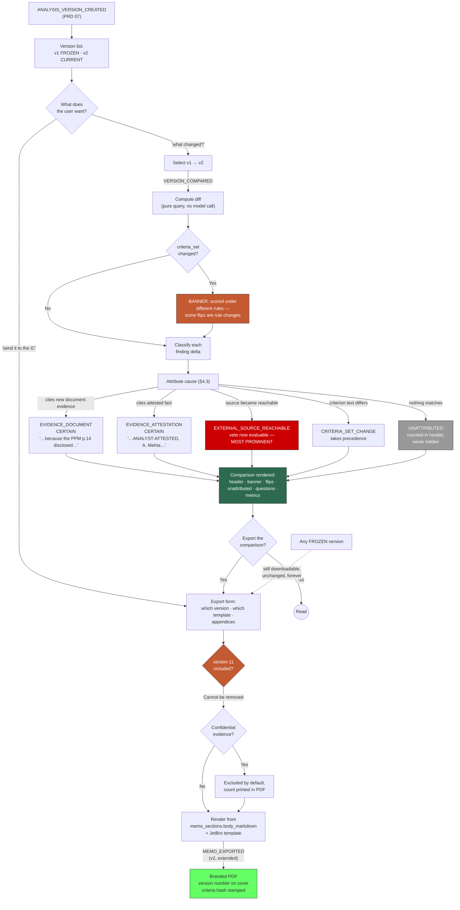

# PRD 08 — Version History Module

> **Framework**: Phlo event-sourced platform. See `00-inbox/event-system-architecture.md` and `00-inbox/prd-guide.md`.
> **Scope**: This module is the audit and comparison layer over the versions PRD 07 produces. It owns the version list, the causal diff between any two versions, and the branded PDF export of any version.
> **Read PRD 07 §2.1 (the version model) and PRD 05 §3 (export, and the section 11 rule) first.** This module extends both and contradicts neither.
> **The most valuable thing in this document is §4's causal diff.** A textual diff of two memos is nearly useless; a finding-level diff with evidence attribution is what an IC actually wants.

---

### Project Identity

```
Project name: l1analysis
Company name: [TODO — confirm with stakeholder]
Display name: L1 Analysis Platform
Admin email domain: [TODO — confirm with stakeholder]
```

---

## 1. Process Overview

### Process: Version Comparison and Attributable Export

PRD 07 produces versions. This module is where they become useful to someone who was not in the room.

The situation this module is built for: a deal was analysed in July as `HOLD` with 49 open questions. The analyst asked the manager for the PPM, got it, uploaded it, attested to two things learned on a call, and re-ran. v2 comes back `PURSUE` with 31 open questions. The IC meets in August and asks the only question that matters — **"what changed, and why should we believe it?"**

A textual diff of the two memos answers neither. Two memos generated from overlapping-but-different substrates by a non-deterministic model differ on nearly every line: rephrased sentences, reordered risk factors, different adjectives, different section lengths. Show that to an IC and the real change — one green flag started firing because a specific page of a specific document disclosed a specific fact — is buried under three hundred lines of prose churn that means nothing. **A text diff would make the tool look like it changed its mind arbitrarily, which is the opposite of what happened.**

The diff that works is **causal, at the level of findings**:

> **CR-0030 (Meaningful GP commitment) flipped from not-fired to fired** because the PPM (EV-2026-000073, uploaded 24 Jul, p.14) disclosed a 2.5% GP commitment in cash. In v1 this criterion could not fire — extraction searched all 52 pages of the deck for 'sponsor commitment', 'GP commitment', 'co-investment' and found nothing.

That is one sentence, it names the evidence, it names the page, it says what the prior state was and why, and an IC member can check it in two clicks. It is also mechanically derivable — every element comes from a field the platform already stores — which means it is not a summary written by a model and can be trusted the way a page citation can.

Flow:

```
   Versions Exist        Compare              Export             Audit
      [ENTRY]           [ENTRY]              [ENTRY]            [ENTRY]
         |                 |                    |                  |
ANALYSIS_VERSION_    (select two          (choose version,    (query the
    CREATED           versions)            branded PDF)        event stream)
    (PRD 07)              |                    |                  |
         |          VERSION_COMPARED      MEMO_EXPORTED           |
   version list      diff computed:       with version_id    full lineage
   per Analysis      findings flipped      section 11         reconstructable
         |           questions closed      NON-EXCLUDABLE          |
      [EXIT]         criteria delta            |                [EXIT]
                         [EXIT]             [EXIT]
```

### What this module deliberately does not do

**It does not diff memo prose.** Section-level text comparison is available as a secondary view (§5 screen 3) and is explicitly labelled as low-signal. The primary view is findings, questions, and metrics. Prose diff exists because someone will ask for it and because it is occasionally useful for spotting a section that vanished entirely — not because it is the answer.

**It does not re-analyse anything.** A comparison is a query over two frozen versions' projections. It makes no model call, costs nothing, and produces the same answer every time it runs. This is why `VERSION_COMPARED` can be an audit event without becoming a cost centre.

**It does not resolve which version is right.** v2 is later; it is not automatically better. A re-run under a newer criteria set can flip findings for reasons that have nothing to do with the evidence, and §4.4 is entirely about not letting that be silently attributed to the analyst's PPM.

---

## 2. Entities and Aggregates

| Entity | Aggregate Type | Relationships |
|---|---|---|
| Version Comparison | `VersionComparison` | References two Analysis Versions (PRD 07) of one `analysis_id`. Immutable once computed |
| Finding Delta | `VersionComparison` (child, not its own aggregate) | One row per criterion whose state differs between the two versions |
| Question Delta | `VersionComparison` (child, not its own aggregate) | One row per Open Question that closed, opened, or persisted between the two versions |
| Memo Export | `MemoExport` (PRD 05's entity) | **Extended** by this module with a version reference — see §3 |

**No new entity for "the version list."** It is a query over PRD 07's `analysis_versions` filtered by `analysis_id`. Creating a wrapper entity for a filtered list is a table that exists to be joined through, and PRD 07 §2.1 already made that argument about `analysis_id` itself.

### Entity Field Definitions

#### Version Comparison

| Field | Type | Description |
|---|---|---|
| id | UUID | Primary key |
| comparison_code | string | Human-readable identifier, format `CMP-{YYYY}-{NNNNNN}` |
| deal_id | UUID | FK → Deal (PRD 01) |
| analysis_id | UUID | The lineage both versions belong to |
| from_version_id | UUID | FK → Analysis Version — the earlier version |
| from_version_number | decimal | Denormalised for display |
| to_version_id | UUID | FK → Analysis Version — the later version |
| to_version_number | decimal | Denormalised for display |
| is_adjacent | boolean | Whether `to` is `from` + 1. A non-adjacent diff spans intermediate versions and must say so |
| recommendation_changed | boolean | Whether the recommendation differs |
| from_recommendation | string | `PURSUE` / `HOLD` / `PASS` / `VETOED` |
| to_recommendation | string | Same enum |
| from_total_score | decimal | Score at the earlier version |
| to_total_score | decimal | Score at the later version |
| score_delta | decimal | Signed difference |
| criteria_set_changed | boolean | **Whether a different criteria set version applied.** The confounder flag — see §4.4 |
| from_criteria_set_version | decimal | Which rules scored the earlier version |
| to_criteria_set_version | decimal | Which rules scored the later version |
| engine_version_changed | boolean | Whether a different engine version produced them |
| from_engine_version | string | Engine version at the earlier run |
| to_engine_version | string | Engine version at the later run |
| findings_flipped_count | decimal | How many criteria changed `evaluation_state` |
| findings_attributed_count | decimal | How many flips have a named evidence cause |
| findings_unattributed_count | decimal | How many flips have no identifiable cause — **the honesty number**, see §4.3 |
| questions_closed_count | decimal | Open Questions resolved between the versions |
| questions_opened_count | decimal | Open Questions new in the later version |
| questions_persisted_count | decimal | Open Questions present in both |
| evidence_added_count | decimal | Evidence Items added between the versions |
| evidence_documents_added | decimal | Of those, document uploads |
| evidence_attestations_added | decimal | Of those, analyst attestations |
| cost_between_versions_usd | decimal | Model spend incurred producing the later version(s). Precision to 4 decimal places |
| computed_at | datetime | When the diff was computed |
| computed_by_user_id | UUID | Who requested it |
| created_at | datetime | Record creation |

**`findings_unattributed_count` is the field this entity exists to be honest about.** A flip the platform cannot explain is more important than one it can, because it is either a criteria-set change nobody noticed, engine non-determinism, or a bug. Burying it in a footnote would let a diff claim more causal power than it has. It renders on the comparison header, not in a detail panel.

#### Finding Delta

| Field | Type | Description |
|---|---|---|
| id | UUID | Primary key |
| comparison_id | UUID | FK → Version Comparison |
| criterion_code | string | e.g. `CR-0030` |
| criterion_name | string | Denormalised at comparison time |
| tier | string | `GREEN_FLAG` / `RED_FLAG` / `VETO` |
| severity | string | `LOW` / `MEDIUM` / `HIGH` / `CRITICAL` |
| from_evaluation_state | string | `FIRED` / `NOT_FIRED` / `CONTESTED` / `VETO_UNEVALUATED` / `ABSENT` |
| to_evaluation_state | string | Same enum. `ABSENT` means the criterion was not in that version's criteria set |
| delta_type | string | `FLIPPED_TO_FIRED` / `FLIPPED_TO_NOT_FIRED` / `BECAME_CONTESTED` / `CONTEST_RESOLVED` / `BECAME_EVALUABLE` / `BECAME_UNEVALUABLE` / `CRITERION_ADDED` / `CRITERION_REMOVED` / `EVIDENCE_STRENGTHENED` |
| from_confidence | string | `HIGH` / `MEDIUM` / `LOW` |
| to_confidence | string | Same enum |
| score_contribution_delta | decimal | Signed change in this criterion's contribution |
| **Attribution** | | |
| attribution_class | string | `EVIDENCE_DOCUMENT` / `EVIDENCE_ATTESTATION` / `EXTERNAL_SOURCE_REACHABLE` / `CRITERIA_SET_CHANGE` / `ENGINE_VERSION_CHANGE` / `UNATTRIBUTED` |
| attributed_evidence_id | UUID | FK → Evidence Item (PRD 07) that caused it. Null unless evidence-attributed |
| attributed_evidence_code | string | Denormalised, e.g. `EV-2026-000073` |
| attribution_page | decimal | The page in the attributed document that supplied the new evidence |
| attribution_quote | text | The quote from that page |
| attribution_confidence | string | `CERTAIN` / `PROBABLE` / `INFERRED` — how sure the platform is about the cause. See §4.3 |
| causal_sentence | text | The rendered one-sentence explanation. Generated mechanically from the fields above, **not by a model** |
| **Prior state, for context** | | |
| from_absence_evidence | text | What the earlier version searched and did not find. This is what makes the flip legible |
| to_evidence | jsonb | The later version's evidence array — `{document, page, quote}` per item |
| created_at | datetime | Record creation |

**`from_absence_evidence` is what turns a flip into an argument.** "CR-0030 now fires" is a fact. "CR-0030 now fires; in v1 the engine searched all 52 pages of the deck for five different phrasings of sponsor commitment and found none; the PPM discloses it on page 14" is a case an IC can evaluate. The reference case's `unresolved` entries carry exactly this text, and it is already stored on the Open Question (PRD 07 §2).

#### Question Delta

| Field | Type | Description |
|---|---|---|
| id | UUID | Primary key |
| comparison_id | UUID | FK → Version Comparison |
| question_id | UUID | FK → Open Question (PRD 07) — the later version's row |
| prior_question_id | UUID | FK → Open Question — the earlier version's row. Null when newly opened |
| question_code | string | Denormalised |
| field_path | string | e.g. `economics.gp_commitment` |
| short_label | string | Display label |
| question_kind | string | `DOCUMENT_ANSWERABLE` / `ANALYST_ANSWERABLE` / `EXTERNALLY_BLOCKED` |
| stage_origin | string | Which stage raised it |
| delta_type | string | `CLOSED` / `OPENED` / `PERSISTED` / `DISMISSED` / `BECAME_BLOCKED` / `BECAME_UNBLOCKED` |
| closed_by_evidence_id | UUID | FK → Evidence Item that closed it. Null unless `CLOSED` |
| closed_by_evidence_code | string | Denormalised |
| closed_by_evidence_type | string | `DOCUMENT_UPLOAD` / `ANALYST_ATTESTATION` |
| resolution_page | decimal | Page in the evidence document that answered it. Null for attestations |
| carried_forward_count | decimal | How many versions this has survived |
| related_criterion_codes | string[] | Criteria affected by this question |
| created_at | datetime | Record creation |

**`closed_by_evidence_type` renders differently and must.** A question closed by a document upload closes with a page. A question closed by an attestation closes with a person's name and their source. Rendering them identically in a diff an IC reads would breach the provenance boundary PRD 07 §4 spends a section defending, at exactly the moment it matters most — when someone is deciding whether the change justifies a different recommendation.

### Numbering

| Entity | Prefix | Format | Example |
|---|---|---|---|
| Version Comparison | CMP | `CMP-{YYYY}-{NNNNNN}` | CMP-2026-000012 |

Finding Deltas and Question Deltas have no code — they are always viewed within their parent comparison and have no standalone page.

**Special characters**: none of these codes contain URL-unsafe characters. `attribution_quote` and `causal_sentence` routinely contain quotation marks, currency symbols, and the `~` prefix the reference deck uses on nearly every figure. Neither may appear in a URL path segment; comparisons are addressed by `id` or `comparison_code`.

---

## 3. Process Steps

### Step: Compare Two Versions

Event type: `VERSION_COMPARED`

Trigger:
  Analyst or IC Member on the Version History screen selects two versions and clicks "Compare", or clicks "What changed?" on the current version — which compares it against its immediate predecessor.

Data points captured:
  - deal_id: UUID
  - analysis_id: UUID
  - from_version_id: UUID — the earlier version
  - to_version_id: UUID — the later version
  - comparison_context: string — `USER_REQUESTED` / `IC_PREPARATION` / `EXPORT_APPENDIX` — why this comparison was run

Payload:
```
id: UUID (generated)
comparison_code: string (generated, CMP-YYYY-NNNNNN)
deal_id: UUID
analysis_id: UUID
from_version_id: UUID
from_version_number: decimal
to_version_id: UUID
to_version_number: decimal
is_adjacent: boolean
comparison_context: string
recommendation_changed: boolean
from_recommendation: string
to_recommendation: string
from_total_score: decimal
to_total_score: decimal
score_delta: decimal
criteria_set_changed: boolean
from_criteria_set_version: decimal
to_criteria_set_version: decimal
engine_version_changed: boolean
from_engine_version: string
to_engine_version: string
findings_flipped_count: decimal
findings_attributed_count: decimal
findings_unattributed_count: decimal
questions_closed_count: decimal
questions_opened_count: decimal
questions_persisted_count: decimal
evidence_added_count: decimal
evidence_documents_added: decimal
evidence_attestations_added: decimal
cost_between_versions_usd: decimal
finding_deltas: [
  {
    criterion_code: string
    criterion_name: string
    tier: string
    severity: string
    from_evaluation_state: string
    to_evaluation_state: string
    delta_type: string
    from_confidence: string
    to_confidence: string
    score_contribution_delta: decimal
    attribution_class: string
    attributed_evidence_id: UUID?
    attributed_evidence_code: string?
    attribution_page: decimal?
    attribution_quote: string?
    attribution_confidence: string
    causal_sentence: string
    from_absence_evidence: string?
    to_evidence: [{document: string, page: decimal, quote: string}]
  }
]
question_deltas: [
  {
    question_id: UUID
    prior_question_id: UUID?
    question_code: string
    field_path: string
    short_label: string
    question_kind: string
    stage_origin: string
    delta_type: string
    closed_by_evidence_id: UUID?
    closed_by_evidence_code: string?
    closed_by_evidence_type: string?
    resolution_page: decimal?
    carried_forward_count: decimal
    related_criterion_codes: string[]
  }
]
computed_by_user_id: UUID
computed_at: datetime
```

Aggregate: `VersionComparison` / `id`

Location: None. This process does not involve physical locations.

Preconditions:
  - Both versions must exist, share an `analysis_id`, and belong to this Deal
  - Both versions must be in status `CURRENT` or `FROZEN`. **A `PENDING`, `RUNNING`, or `FAILED` version has no findings to compare** and comparing against one would produce a diff that changes when the run completes
  - `from_version_number` must be strictly less than `to_version_number` — a comparison has a direction, and letting it run backwards would produce deltas whose sign nobody could interpret
  - The comparison must be **recomputable and identical**: it is a pure query over two frozen versions. If an identical `(from, to)` pair already exists, the API returns the existing comparison rather than recomputing. **[NEEDS REVIEW — this means the event is emitted once per pair, so `comparison_context` records only the first requester's reason. An alternative is to emit every time and dedupe the projection, which gives a complete record of who compared what and when at the cost of many near-identical events. Recommend the latter if comparison access is ever an audit question; the former otherwise.]**

Side effects:
  - `version_comparisons`: new row
  - `finding_deltas`: one row per criterion whose state differs
  - `question_deltas`: one row per question that closed, opened, or persisted
  - **Nothing else changes.** No version status moves, no memo is touched, no score is recomputed. A comparison is a read that happens to be recorded
  - `comparison_stats`: aggregated for report 6

Projections updated:
  - `version_comparisons`, `finding_deltas`, `question_deltas`, `comparison_stats`

Permissions:
  - `events:VERSION_COMPARED:emit`

**Why a comparison is an event at all**, since it changes no business state and could reasonably be a plain GET. Two reasons, and the second is the real one. First, the diff is what an IC is shown, so *"which comparison did the committee actually see"* is a question the platform should be able to answer six months later — the same reasoning PRD 03 §3 gives for `CRITERIA_SET_EXPORTED`, which also changes no state and exists purely so that "which rules did the engine see" is provable rather than inferred. Second, a comparison's output depends on the criteria sets, engine versions, and evidence in play at both ends; recording the computed result means a comparison shown in August can be reproduced in February even if the projections have since been rebuilt from a corrected event stream.

---

### Step: Export a Version

Event type: `MEMO_EXPORTED` *(defined in PRD 05 §3 — **extended here**)*

Trigger:
  Analyst or IC Member clicks "Download PDF" on any version — current or frozen — from the Version History screen, the Memo Reader, or the comparison view.

**This module does not define a new event.** It adds fields to PRD 05's existing `MEMO_EXPORTED`. The alternative — a separate `VERSION_EXPORTED` — would mean two events for one act and two projections counting the same exports, and PRD 05 §5 report 6 already answers "what have we exported."

Additional data points captured (beyond PRD 05 §3):
  - analysis_version_id: UUID — **which version this PDF is.** Required
  - analysis_id: UUID — the lineage
  - version_number: decimal — printed on the cover page
  - is_current_version: boolean — whether this was the current version at export time
  - includes_version_history: boolean — whether a version-list appendix is attached
  - includes_comparison: boolean — whether a diff appendix is attached
  - comparison_id: UUID (optional) — which comparison, when `includes_comparison`
  - includes_evidence_manifest: boolean — whether the evidence bundle is listed
  - includes_evidence_documents: boolean — whether the evidence PDFs are bundled. **Defaults false when any evidence item is `is_confidential`**

Additional payload fields:
```
analysis_version_id: UUID
analysis_id: UUID
version_number: decimal
is_current_version: boolean
includes_version_history: boolean
includes_comparison: boolean
comparison_id: UUID?
includes_evidence_manifest: boolean
includes_evidence_documents: boolean
confidential_evidence_excluded_count: decimal
evidence_manifest_sha256: string
criteria_content_hash: string
```

Aggregate: `Memo` / `memo_id` *(unchanged from PRD 05)*

Location: None.

Preconditions (in addition to every precondition PRD 05 §3 states, all of which still apply):
  - `analysis_version_id` must be supplied and must reference a version in status `CURRENT` or `FROZEN`
  - The version's `memo_id` must equal the export's `memo_id` — a mismatch means the caller is exporting one version's memo under another version's number, which would put a wrong version number on a cover page an IC reads
  - **`sections_included` must contain `could_not_determine`.** PRD 05 §3 states this for every export; **it holds for every version, including frozen ones.** A v1 PDF retrieved eight months later carries v1's 49 open questions, including the two unevaluated vetoes. See §3.1
  - When `includes_comparison` is true, `comparison_id` must reference a comparison whose `to_version_id` equals this export's `analysis_version_id`. Attaching a diff that does not end at the version being exported would be actively misleading
  - When `includes_evidence_documents` is true and any bundled item is `is_confidential`, the export requires an explicit confirmation flag. **The default is exclusion**

Side effects:
  - `memo_exports` (PRD 05's projection): new row, extended with the version fields. **This module writes into PRD 05's projection** — declared in §8
  - `analysis_versions`: `export_count` += 1, `last_exported_at` set. Useful for answering "was v1 ever actually sent to anyone before v2 replaced it"
  - The PDF is produced and written to the export store, addressed by content hash
  - `confidential_evidence_excluded_count` is recorded on the export **and printed in the PDF** — an IC packet that silently omits a source is worse than one that says "2 confidential documents were not included; contact the analyst"
  - No version status changes. **Export is not a lifecycle event**, exactly as PRD 05 §3 states for memos

Projections updated:
  - `memo_exports` (PRD 05), `analysis_versions`, `export_stats` (PRD 05)

Permissions:
  - `events:MEMO_EXPORTED:emit` *(unchanged from PRD 05 §6)*

### 3.1 Section 11 is non-excludable from every version

PRD 05 §1 and §3 establish that section 11 cannot be excluded from any export, by anyone, for any reason. **That constraint applies unchanged to every version, and it has a consequence worth stating in full because it is the kind of thing a well-meaning feature request erodes.**

A v1 PDF exported today carries v1's section 11: 49 items, including the two SEBI checks that could not be performed and the four other externally blocked items. A v3 PDF carries v3's — fewer, because evidence closed some, but **still carrying the blocked items**, because PRD 07 §12.5 establishes that no amount of evidence gathering unblocks them from this deployment.

Three consequences, each of which will be argued against at some point:

1. **A frozen version's PDF is not retroactively improved.** When v3 answers a question v1 could not, v1's PDF still says v1 could not. That is what a frozen version means, and an export that silently backfilled later knowledge would make the version history worthless as a record of what was known when.
2. **"Only include unresolved questions that are still open" is not an available option.** It sounds reasonable and would produce a v1 PDF listing v3's open questions, which describes no analysis that ever happened.
3. **Every IC packet, from every version, carries the blocked six.** Permanently, until the infrastructure changes. This is the single most likely place someone will ask for an exception — a clean-looking packet is nicer to hand around — and it is the single place an exception does the most damage, because the audience least able to detect the omission is the one being asked to commit capital.

### 3.2 Branding lives in Phlo, not the CLI

The engine writes `05-memo.md` and `05-memo.json` — plain Markdown and structured JSON, no styling, no fonts, no logo (PRD 06 §3). **PDF rendering and JetBro branding are entirely Product B's concern.** This follows directly from the two-product boundary the overview §3 establishes, and the reasoning is worth stating because "just have the CLI emit a PDF" is an obvious-looking shortcut:

| Concern | Why it must not be in the CLI |
|---|---|
| Branding is per-deployment | Every institution deploying this has its own logo, palette, and house format. The engine would need to ship a template system for something with no analytical content |
| 97% of institutions have a formal template | PRD 05 §1. The mapping onto a house format is Phlo's problem and is already scoped there (PRD 05 §3, out of scope for v1) |
| The engine must run offline on a laptop | Overview §1. Adding a PDF toolchain, fonts, and asset pipeline to a tool whose value is that it runs against a confidential PPM without anything leaving the machine is a cost with no matching benefit |
| Artifacts must stay diffable | The whole artifact contract is text. A PDF is not diffable, not greppable, and not verifiable by `quoteverify.py` |
| Versioned re-export | A frozen version must be re-exportable years later under a *current* brand. If the PDF were baked at analysis time, a rebrand would orphan every historical export |

The export pipeline is therefore: `memo_sections.body_markdown` (already in Phlo's database per PRD 05 §3) → house or default template → branded PDF. **The engine's Markdown is the source; the PDF is a rendering.** Re-exporting the same version twice produces two `memo_exports` rows and two files, which PRD 05 §4 already establishes is correct.

**Branding requirements** (per the project's `jetbro-brand` skill, which governs all styled output): JetBro palette with accent `#c45a32`, Bricolage Grotesque for headings, Outfit for body, Space Mono for codes and figures, the accent-gradient separator between sections, and the logo on the cover. **[NEEDS REVIEW — the default template is JetBro-branded, which is right for a demo and wrong for a deployment at an allocator who will want their own mark on a document going to their IC. PRD 05 §3 scopes house templates out of v1; this module inherits that and the default should be understood as a placeholder, not a product decision.]**

---

## 4. The Causal Diff

This is the substance of the module. §3 defines the event; this is what computing it actually means.

### 4.1 Finding deltas: the algorithm

For each criterion present in either version's criteria set:

```
1. Fetch the Finding from each version (PRD 02's findings table, keyed by analysis_run_id).
   Absent from a version's criteria set → evaluation_state = ABSENT.

2. If from_evaluation_state == to_evaluation_state AND the evidence arrays are equivalent:
     no delta. Skip.
     (Equivalence is by (document, page, quote) tuple set, not by array order —
      the engine does not guarantee ordering.)

3. If states are equal but evidence differs:
     delta_type = EVIDENCE_STRENGTHENED. Worth showing: a criterion that fired
     on absence in v1 and fires on a PPM page in v2 is the same verdict on much
     better grounds, and an IC should see that.

4. Otherwise classify delta_type from the state pair (§4.2).

5. Attribute the cause (§4.3).

6. Render causal_sentence mechanically from the attributed fields. Never by a model.
```

Step 6 is not a stylistic preference. The sentence appears in an IC packet as an explanation of why a recommendation changed. Generating it with a model would make the one part of the diff an IC leans on the one part nothing verifies — and PRD 06 §5 is explicit that the more of the output that is mechanical, the less surface there is for fabrication. Sections 3, 6, 11 and 12 of the memo are direct renders for exactly this reason. **The causal sentence joins them.**

The template:

> **{criterion_code} ({criterion_name}) {delta_phrase}** because {attribution_phrase}. In v{from} {prior_state_phrase}.

Rendered for the worked example:

> **CR-0030 (Meaningful GP commitment) flipped from not-fired to fired** because the PPM (EV-2026-000073, uploaded 24 Jul 2026, p.14) disclosed a 2.5% GP commitment in cash. In v1 this criterion could not fire — extraction searched all 52 pages for 'sponsor commitment', 'GP commitment', 'manager commitment', 'co-investment', 'skin in the game' and found no figure.

And for an attestation, where the provenance must differ visibly:

> **CR-0035 (Independent investment committee) flipped from not-fired to fired** because an **analyst attestation** (EV-2026-000082, A. Mehta, sourced to "DDQ response §4.2, received 19 Jul 2026") named three IC members including one independent. **This finding is analyst-attested, not document-grounded.** In v1 no individual IC member was named on any of the 52 pages.

### 4.2 The delta types

| `delta_type` | State pair | What it means |
|---|---|---|
| `FLIPPED_TO_FIRED` | `NOT_FIRED` → `FIRED` | The criterion now fires. The headline case |
| `FLIPPED_TO_NOT_FIRED` | `FIRED` → `NOT_FIRED` | A concern was resolved by new information |
| `BECAME_CONTESTED` | `FIRED`/`NOT_FIRED` → `CONTESTED` | Lenient and strict passes now disagree where they previously agreed. **Often a sign the new evidence is ambiguous rather than clarifying** |
| `CONTEST_RESOLVED` | `CONTESTED` → `FIRED`/`NOT_FIRED` | Evidence settled a disagreement. The most satisfying delta type and the rarest |
| `BECAME_EVALUABLE` | `VETO_UNEVALUATED` → `FIRED`/`NOT_FIRED` | **An external source became reachable.** This is what the Indian egress IP produces, and it will arrive in a batch across the whole book |
| `BECAME_UNEVALUABLE` | `FIRED`/`NOT_FIRED` → `VETO_UNEVALUATED` | A source that worked stopped working. An operational alarm, not an analytical result |
| `CRITERION_ADDED` | `ABSENT` → any | The criteria set changed. **Not caused by evidence** — see §4.4 |
| `CRITERION_REMOVED` | any → `ABSENT` | Same |
| `EVIDENCE_STRENGTHENED` | same state, different evidence | Same verdict, better grounds |

`BECAME_EVALUABLE` deserves its own note. On the reference case, `CR-0001` and `CR-0002` are both `VETO_UNEVALUATED` because SEBI is unreachable. The day an Indian egress IP is provisioned, the next re-run of every deal in the book produces this delta — and for `CR-0001`, a **CRITICAL veto** criterion, the result could be `FIRED`, which changes a recommendation to `VETOED`. **A diff view must render a veto becoming evaluable as the most prominent thing on the screen.** It is not one row among nine.

### 4.3 Attribution, and being honest about it

Attribution is a heuristic. It is a good one, and it must be visibly a heuristic — `attribution_confidence` carries `CERTAIN` / `PROBABLE` / `INFERRED`, and the rules that assign it:

| Rule | `attribution_class` | `attribution_confidence` |
|---|---|---|
| The later version's finding cites evidence from a document added between the versions, and the earlier version's did not | `EVIDENCE_DOCUMENT` | `CERTAIN` — the page citation is the proof |
| The later version's finding cites an attested fact added between the versions | `EVIDENCE_ATTESTATION` | `CERTAIN` |
| `delta_type` is `BECAME_EVALUABLE`/`BECAME_UNEVALUABLE` and the diligence check's outcome changed between the versions | `EXTERNAL_SOURCE_REACHABLE` | `CERTAIN` |
| The criterion's text, tier, severity, or weight differs between the two criteria set versions | `CRITERIA_SET_CHANGE` | `CERTAIN` — and this **takes precedence** over evidence attribution when both apply |
| An Open Question with a matching `field_path` closed in the same interval, attributed to an evidence item | `EVIDENCE_DOCUMENT` or `EVIDENCE_ATTESTATION` | `PROBABLE` — the question closed and the finding flipped, but no citation links them directly |
| Only `engine_version_changed` is true and nothing else differs | `ENGINE_VERSION_CHANGE` | `INFERRED` |
| Nothing above matches | `UNATTRIBUTED` | — |

**`UNATTRIBUTED` flips are shown, counted in the header, and never hidden.** A flip with no identifiable cause is one of three things: a criteria change the comparison did not catch, engine non-determinism, or a bug. PRD 06 §7 measures structured-output failures at roughly 2 in 8 identical calls and a text-mode fallback that is flagged in the artifact — so a genuinely non-deterministic flip is a live possibility, not a theoretical one, and a diff that quietly attributed one to the analyst's PPM would be manufacturing a causal story.

The comparison header therefore reads, always:

> **9 findings changed. 7 attributed to evidence, 1 to a criteria set change, 1 unexplained.**

The "1 unexplained" is the most valuable number on the screen, because it is the one that tells a reader how much to trust the other eight.

### 4.4 The criteria-set confounder

**The single most likely way this diff misleads someone.** A re-run under a newer criteria set can flip findings for reasons that have nothing to do with the evidence. PRD 03 §1 makes criteria sets immutable once activated precisely so a score is interpretable under the rules that produced it — and a version diff spanning a criteria-set change is comparing two things scored by different rules.

The handling, in order of how loudly it must be said:

1. **`criteria_set_changed` is a banner on the comparison, not a field in a metadata panel.** *"These versions were scored under different criteria sets: v1 under CS-2026-0001 v3, v2 under CS-2026-0001 v4. Some findings changed because the rules changed, not because the evidence did."*
2. **`CRITERIA_SET_CHANGE` attribution takes precedence over evidence attribution.** If a criterion's text changed *and* a PPM arrived, the diff says the rule changed. Attributing it to the PPM would credit the analyst's work with a flip the rule change caused, and PRD 03 already provides the tool to see the rule change on its own (screen 4, Criteria Set Comparison).
3. **Criteria added and removed are listed separately** from findings that flipped, under their own heading. A criterion that fires in v2 because it did not exist in v1 is not a change in the fund.
4. **The re-run form warns before the fact.** PRD 07 §10 screen 7 requires the criteria set version to be shown at re-run request time, because the cleanest way to avoid a confounded diff is to notice the confound before spending $3 creating it.

**Recommended practice, stated in the UI**: when comparing to isolate the effect of evidence, re-run under the same criteria set version that scored the prior version. PRD 07's `ANALYSIS_RERUN_REQUESTED` accepts `criteria_set_id` explicitly and defaults to the active set — so this is a supported choice, and the form should offer "same set as v1" as a named option rather than requiring someone to know the set code. **[NEEDS REVIEW — this conflicts mildly with PRD 03's intent that the *active* set represents current house policy. Deliberately scoring a deal under a superseded set produces a memo that does not reflect current policy, which is fine for an isolating comparison and wrong for a memo going to an IC. Recommend permitting it, marking the resulting version `criteria_set_is_superseded`, and refusing to export that version as an IC packet without an explicit acknowledgement.]**

### 4.5 Question deltas

Simpler than finding deltas and, for the analyst rather than the IC, more immediately useful — it is the scoreboard for the work they just did.

```
For each Open Question in the later version:
  - matching field_path in the earlier version, now RESOLVED  → CLOSED
  - matching field_path in the earlier version, still open     → PERSISTED
  - no match in the earlier version                            → OPENED
  - matching field_path, now DISMISSED                         → DISMISSED
  - question_kind changed to EXTERNALLY_BLOCKED                → BECAME_BLOCKED
  - was BLOCKED, now resolved                                  → BECAME_UNBLOCKED

For each Open Question in the earlier version with no match in the later:
  → CLOSED, attributed via the Open Question's resolved_by_evidence_id (PRD 07 §4)
```

The display groups by `delta_type` and leads with `CLOSED`, because that is the answer to "was the PPM worth uploading". Each closed item names its evidence and, for documents, its page:

> `economics.gp_commitment` — **closed** by EV-2026-000073 (PPM, p.14)
> `team.investment_committee` — **closed** by EV-2026-000082 (**analyst attestation**, A. Mehta)
> `valuation_policy` — **still open** after 2 versions
> `sebi_registration_active` — **still blocked** (network egress, infrastructure)

`PERSISTED` with a high `carried_forward_count` is the honest bad news: the analyst uploaded a 187-page PPM and this question survived it. That belongs on the screen at the same weight as the closures, because it is what tells them whether to ask the manager directly rather than buy another re-run.

---

## 5. State Machines

### Version Comparison

**A Version Comparison has no lifecycle.** It is computed once from two frozen versions and is immutable thereafter. Recomputing it yields the same result by construction — it is a pure query over immutable inputs — which is why §3 returns the existing comparison rather than creating a second one for the same pair.

This is the same posture PRD 05 §4 takes for Memo Export: *"exports are immutable records of a file produced at a moment. No lifecycle."* Both are records of a derivation, not entities that evolve.

The one case that looks like a lifecycle and is not: a comparison whose `to_version` was `CURRENT` at computation time and is `FROZEN` later. **The comparison does not change** — it compared two specific versions and both still exist unaltered. `is_current_version` is captured on exports (§3) precisely because that snapshot matters; on comparisons it does not, because a comparison names both endpoints explicitly.

### Analysis Version — the states this module reads

Defined in PRD 07 §5 and reproduced here because this module's preconditions depend on them and drift between the two documents would be a defect.

| Status | Comparable? | Exportable? |
|---|---|---|
| `PENDING` | No — no findings yet | No |
| `RUNNING` | No — findings incomplete and changing | No |
| `CURRENT` | Yes | Yes |
| `FROZEN` | Yes | **Yes — this is the point** |
| `FAILED` | No | No — there is no memo |

**`FROZEN` being fully exportable is the property this module exists to guarantee.** A version that could be compared but not exported would let an analyst see what changed and be unable to show anyone.

---

## 6. Reports and Projections

| # | Business Question | Projection Table | Key Fields | Updated By Events |
|---|---|---|---|---|
| 1 | "What versions exist for this deal, and what does each one say?" | `analysis_versions` (PRD 07) | version_number, recommendation, total_score, open_question_count, evidence_added_since_prior, cost_usd, criteria_set_version, engine_version, is_current, completed_at | `ANALYSIS_VERSION_CREATED` (PRD 07) |
| 2 | "What changed between v1 and v2, and why?" | `version_comparisons` + `finding_deltas` + `question_deltas` | everything in §2 | `VERSION_COMPARED` |
| 3 | "Which findings flipped, and what evidence flipped them?" | `finding_deltas` | criterion_code, delta_type, attribution_class, attributed_evidence_code, attribution_page, attribution_confidence, causal_sentence | `VERSION_COMPARED` |
| 4 | "Which of our open questions actually got closed, and by what?" | `question_deltas` | field_path, delta_type, closed_by_evidence_code, closed_by_evidence_type, resolution_page, carried_forward_count | `VERSION_COMPARED` |
| 5 | "What did we send to the IC, which version was it, and when?" | `memo_exports` (PRD 05, extended) | export_code, memo_code, version_number, is_current_version, format, includes_comparison, exported_by, exported_at, file_sha256 | `MEMO_EXPORTED` |
| 6 | "Do re-runs actually change recommendations, or just cost money?" | `comparison_stats` | period, comparisons_run, recommendation_change_rate_pct, avg_findings_flipped, avg_questions_closed, avg_cost_between_versions | `VERSION_COMPARED`, `ANALYSIS_VERSION_CREATED` |
| 7 | "How many findings change for reasons we cannot explain?" | `comparison_stats` | period, total_flips, unattributed_flips, unattributed_rate_pct, by attribution_class | `VERSION_COMPARED` |
| 8 | "Which deals have a stale current version?" | `analysis_versions` (PRD 07) where `is_current` and `completed_at` older than threshold | deal_id, fund_name, version_number, completed_at, open_question_count, pending_evidence_count | `ANALYSIS_VERSION_CREATED`, `EVIDENCE_UPLOADED` (PRD 07) |
| 9 | "Was v1 ever actually sent to anyone before v2 replaced it?" | `analysis_versions` | version_number, export_count, last_exported_at | `MEMO_EXPORTED` |
| 10 | "Show me everything that happened across this deal's analysis lineage" | *Not a projection* — query `movement_events` by `aggregate_type` in (`AnalysisVersion`, `OpenQuestion`, `EvidenceItem`, `VersionComparison`, `Memo`) filtered by `deal_id` in payload | — | Automatic |

### Notes on reports 6, 7 and 9

**Report 6 is the module's own accountability.** PRD 07's premise is that gathering evidence and re-running improves the analysis. This measures whether it does: how often a re-run changes the recommendation, how many findings move, how many questions close, and what it cost. If re-runs never change a recommendation, the loop is expensive theatre and the product should say so before a customer works it out. This is the same species of self-measurement as PRD 03's `criterion_hit_stats` (a rule that never fires may be badly worded) and PRD 05's `section_11_review_rate_pct` (if the protected section is unread, that is a UI failure) — each report exists to falsify a claim the design makes about itself.

**Report 7 is the diff's own accountability.** `unattributed_rate_pct` trending up means either the attribution rules are missing a cause or the engine is getting less deterministic. Both are worth knowing early, and neither is visible from any single comparison.

**Report 9 answers a question that turns out to matter procedurally.** If v1 was exported and sent to an IC, superseding it is a communication event, not just a data event — someone has a PDF that is no longer current, which PRD 05 §4 already identifies as a real failure mode ("two people at an IC holding different PDFs of the same memo"). If v1 was never exported, superseding it is invisible and costless. The version list should mark exported versions distinctly for this reason.

### Pagination

Reports 6, 7 and 8 are dashboard aggregates and paginate normally.

**Report 1 must return every version for an `analysis_id` unpaginated.** Version counts are small.

**Report 2 must return the entire comparison in one response** — the header, every finding delta, and every question delta. A criteria set with 40 criteria could in principle flip most of them, and the reference case has 49 questions; a paginated diff would show "9 findings changed" in a header computed over the full set and five rows in the body, which is the specific inconsistency that makes a reader stop trusting a screen. Scoped by `comparison_id`, returns everything.

**Report 5 filtered to one Deal must return every export unpaginated**, because the version list renders export counts inline per version.

---

## 7. Roles and Permissions

### Roles

| Role | Description | Permissions |
|---|---|---|
| Analyst | Compares versions, exports any version, reads the lineage | `events:VERSION_COMPARED:emit`, `events:MEMO_EXPORTED:emit`, `versions:read` |
| IC Member | Compares versions and exports IC packets. **This module's most important reader** | `events:VERSION_COMPARED:emit`, `events:MEMO_EXPORTED:emit`, `versions:read` |
| Super Admin | Everything an Analyst can do, plus the comparison and unattributed-flip dashboards | All Analyst permissions plus `versions:manage_templates` |
| ODD Reviewer | Reads versions and comparisons; particularly `BECAME_EVALUABLE` and `BECAME_UNEVALUABLE` deltas | `versions:read` |
| Worker Service Account | None. The worker creates versions via PRD 07's `ANALYSIS_VERSION_CREATED` and never compares or exports | — |

### Permissions

| Permission Code | Description | Used By Step |
|---|---|---|
| `events:VERSION_COMPARED:emit` | Compute and record a comparison between two versions | Compare Two Versions |
| `events:MEMO_EXPORTED:emit` | Export a version as a branded PDF *(PRD 05's permission, unchanged)* | Export a Version |
| `versions:read` | View the version list, comparisons, and deltas | All read screens |
| `versions:manage_templates` | Author export templates *(shares scope with PRD 05's `memo:manage_templates`)* | Template screens (PRD 05) |

**An IC Member can compare, and this is a deliberate difference from PRD 05 and PRD 07.** PRD 05 §6 withholds finding overrides from IC Members; PRD 07 §8 withholds attestation and re-run. Both withhold *contributing to the analysis*, on the reasoning that a committee editing the analysis it is evaluating collapses two roles. **Comparison contributes nothing.** It is reading, and it is the specific reading an IC member most needs to do — "what changed since the version I saw in July, and why". Withholding it would be a control with no risk to control.

**Nobody can delete a comparison, a version, or an export.** No permission exists for it and no event type would express it. The lineage is the audit trail; a deletable audit trail is not one.

---

## 8. Cross-Module Boundaries

| Boundary | Direction | Detail |
|---|---|---|
| `analysis_versions` | **Read** from PRD 07 | This module's primary input. It defines no version entity of its own |
| `ANALYSIS_VERSION_CREATED` | **Consumed** from PRD 07 | Makes a new version comparable and exportable; updates report 8's staleness view |
| `findings` | **Read** from PRD 02 | Finding deltas are computed from two runs' findings rows. This module never writes them |
| `open_questions` | **Read** from PRD 07 | Question deltas are computed from two versions' question rows, including `from_absence_evidence` |
| `evidence_items` | **Read** from PRD 07 | Attribution resolves to an Evidence Item and renders its code, page, and — for attestations — its attester and source |
| `MEMO_EXPORTED` | **Extended**, writes into PRD 05's projection | This module adds version fields to PRD 05's event and writes the extended row into PRD 05's `memo_exports` table. **Declared explicitly because extending another module's event is unusual** — see below |
| `memo_sections.body_markdown` | **Read** from PRD 05 | The PDF renders from Phlo's stored Markdown, not from the engine's file on disk (§3.2) |
| Criteria sets and criteria | **Read** from PRD 03 | Criterion text, tier, severity, and weight at each version, for the `CRITERIA_SET_CHANGE` attribution rule |
| PRD 05 report 7 (`memo_comparison`) | **Supersedes** | PRD 07 §12.4 records that PRD 05 §5 report 7 and screen 8 specify the same comparison this module defines, at a different granularity. **This module's version diff should replace them.** Recorded there; repeated here because a builder reading only this PRD would otherwise implement both |
| PRD 03 screen 4 (Criteria Set Comparison) | **Complements** | That screen diffs two rule sets; this one diffs two analyses. When `criteria_set_changed` is true, the comparison banner links to it — the rule diff is the explanation for the `CRITERIA_SET_CHANGE` deltas |

**On extending `MEMO_EXPORTED` rather than defining a new event.** PRD 05 owns the event, the `memo_exports` projection, and the `Memo` aggregate the event is emitted against. This module adds nine payload fields and writes them into PRD 05's table. Under Phlo's model this is unremarkable — a projection service handles whatever event types it chooses, and `event_version` (architecture doc) is the mechanism for evolving a payload. **It is called out because a reviewer finding a second module writing PRD 05's projection would otherwise read it as a mistake**, which is the same reasoning PRD 05 §10 gives for its own writes into PRD 02's `findings` table.

**The payload extension bumps `MEMO_EXPORTED` to `event_version: 2.`** PRD 05's projection service must handle both: version 1 events (no version fields) come from exports made before this module existed and are rendered with `version_number` null and a "pre-versioning export" marker rather than being backfilled with a guess.

---

## 9. Locations

This process does not involve physical locations. Events will not carry a `location_id`.

---

## 10. Screen List

| # | Screen Name | Type | Used By | Purpose | Key Actions |
|---|---|---|---|---|---|
| 1 | **Version History** | list | Analyst, IC Member, Super Admin, ODD Reviewer | Every version of one Deal's analysis: date, recommendation, open questions, evidence added, cost, criteria set version | Compare, Download PDF, Open Memo, Re-run |
| 2 | **Version Comparison** | detail | Analyst, IC Member | The causal diff — findings flipped with attribution, questions closed with evidence, metric deltas | Open Finding, Open Evidence, Open Criterion, Export Comparison, Swap Direction |
| 3 | Section Text Diff | detail | Analyst | Side-by-side prose comparison of the 12 sections. **Explicitly secondary** | Back to Comparison, Open Either Memo |
| 4 | Export Version | form | Analyst, IC Member | Choose version, format, template, and appendices | Export, Preview, Cancel |
| 5 | Version Export History | list | Analyst, Super Admin | Every export across versions with who, when, which version, what was included | Download, Open Version, Open Comparison |
| 6 | Comparison Insights | dashboard | Super Admin | Do re-runs change recommendations; what does the unattributed rate look like | Open Comparison, Open Deal, Export |
| 7 | Stale Versions | list | Analyst, Super Admin | Deals whose current version predates evidence that has since been added | Re-run, Open Deal, Dismiss |

### Screen notes

**Screen 1 (Version History)** is one table and every column earns its place:

| Column | Why |
|---|---|
| Version | `v1`, `v2`, `v3`. Gaps from failed versions are visible and correct (PRD 07 §5) |
| Date | When it completed, not when it was requested |
| Recommendation | With a change marker relative to the prior version. `HOLD → PURSUE` is the row an IC member scans for |
| Open questions | The count, **with the blocked subset shown separately** — "31 (6 blocked)". A count that fell from 49 to 31 while the blocked six stayed put is a different story from one where blockers cleared |
| Evidence added | Count and kinds — "2 documents, 3 attestations" — because the mix matters to how the change should be read |
| Criteria set | Set code and version. **When it differs from the prior row, the cell is marked.** This is where a confounded comparison becomes visible before anyone runs one |
| Cost | This version's spend, with the lineage cumulative in the footer |
| Exported | Whether anyone downloaded it, per report 9 |
| Actions | Compare-with-previous, Download PDF |

The default action on any row is **compare with the previous version**, one click, because that is what someone is on this screen to do.

**Screen 2 (Version Comparison) is the deliverable.** Layout, in order, and the order is the argument:

1. **The header sentence.** *"v1 → v2: recommendation changed HOLD → PURSUE. 9 findings changed (7 attributed to evidence, 1 to a criteria set change, 1 unexplained). 18 questions closed, 31 still open (6 blocked). 2 documents and 3 attestations added. $3.12."*
2. **The criteria-set banner, when `criteria_set_changed`.** Above everything else, in the accent colour, linking to PRD 03's set comparison. A reader who scrolls past it has been misled by the layout, and layout is our responsibility — the same principle PRD 05 §8 applies to section 11.
3. **Findings that flipped**, each rendering its `causal_sentence` with the criterion code, tier badge, the attribution as a link to the Evidence Item, and the page as a link to the source page with the quote highlighted. **Attested attributions render with the `ANALYST-ATTESTED` treatment**, never as a page citation — PRD 07 §4's provenance boundary applies with full force here, because a diff is read faster and more credulously than a memo.
4. **Unattributed flips, in their own block, labelled "changed for reasons we cannot attribute".** Not hidden, not last, not grey.
5. **Questions closed**, each naming its evidence and page.
6. **Questions still open**, with `carried_forward_count` — the honest bad news.
7. **Metric deltas** — target size, term, hurdle, carry, investment count. PRD 05 §8 identifies this as the highest-value display for the deck-vintage comparison and it is equally valuable here: for an evidence-added re-run these should mostly be *unchanged*, and a fund term that moved when only a PPM was added is a genuine discovery about the document, not about the fund.
8. **Criteria added and removed**, separately, when the set changed.

**Two clicks from a claimed cause to the words that support it**, matching the standard PRD 05 §8 sets for evidence drill-down: click the attribution → the Evidence Item → the page with the quote highlighted. If a causal claim in a diff is harder to check than a finding in a memo, the diff is the weaker document and an IC will treat it as such.

**Screen 3 (Section Text Diff)** exists, is reachable from screen 2, and carries a standing note: *"Memo prose is regenerated on every run and differs substantially even where the analysis did not change. The findings comparison is the reliable view."* It is genuinely useful for one thing — spotting a section that lost its content between versions — and misleading for everything else. **[NEEDS REVIEW — whether to build it in v1 at all. It is cheap, it will be asked for, and it will be misread. Recommend building it with the warning and measuring whether anyone uses it.]**

**Screen 4 (Export Version)** must make three things unmissable: **which version** is being exported (large, on the form and on the resulting cover page), that **section 11 is included and cannot be removed**, and that **confidential evidence documents are excluded by default** with a count of what was excluded. The version number on the cover page is the single most important piece of metadata in the PDF, because the failure mode PRD 05 §4 names — two people at an IC holding different PDFs — becomes much likelier once versions exist.

**Screen 7 (Stale Versions)** is small and pays for itself: deals where evidence was added and no re-run followed. An analyst who uploaded a PPM on Friday and did not re-run has done the expensive part of the work — obtaining the document — and stopped one click short of the value.

### Palette-Searchable Entities

| Entity | Search by | Result label | Result description | Detail path |
|---|---|---|---|---|
| Version Comparison | comparison_code, deal fund_name | comparison_code | fund_name · v{from} → v{to} · {findings_flipped_count} changes | `/deals/{deal_id}/comparisons/{id}` |
| Analysis Version | version_code, deal fund_name | version_code | fund_name · v{version_number} · recommendation | `/deals/{deal_id}/versions/{id}` |

Analysis Version is listed in PRD 07 §10 as well. It appears in both because both modules give it a detail surface, and the palette entry is one registration — **the implementations must not both register it**, or the palette will show duplicates.

Page-scoped shortcuts requested on Version History: `c` compares the focused version with its predecessor, `e` exports it. On Version Comparison: `j`/`k` move between deltas, `e` exports the comparison.

---

## 11. Process Flowchart



---

## 12. Open Questions

- **Should `VERSION_COMPARED` be emitted on every request or once per version pair?** (§3). Once-per-pair keeps the event store clean and makes the comparison a cached derivation; every-request gives a complete record of who looked at what, which matters if comparison access ever becomes an audit question. Currently specified as once-per-pair.
- **Non-adjacent comparisons.** v1 → v3 is supported and `is_adjacent` flags it, but attribution across two intervals is weaker — evidence added before v2 and evidence added before v3 both sit in the interval, and a flip could be caused by either. Should a non-adjacent diff decompose into its adjacent steps, or carry a lower `attribution_confidence` throughout? Currently the latter, which is simpler and less informative.
- **Should the causal sentence ever be model-generated?** §4.1 says no, firmly, on the grounds that the one part of the diff an IC leans on should not be the one part nothing verifies. The counter-argument is that a template produces stilted sentences and an IC packet is a written document. A middle path — template for the causal claim, optional model-written summary paragraph clearly labelled as generated — is possible and adds a labelling burden. `[NEEDS REVIEW]`
- **Does the version diff supersede PRD 05 report 7 and screen 8?** PRD 07 §12.4 recommends yes and this PRD's §8 assumes it. Needs confirmation and an edit to PRD 05, which is not this module's call to make.
- **Cross-deal comparison.** Nothing here compares two *different* funds. It is a plausible next ask — "show me these three infra credit funds side by side" — and it is a genuinely different problem: no shared lineage, no shared document, and criteria are the only common axis. Out of scope, noted so it is not mistaken for an oversight.
- **Export template scope.** §3.2 inherits PRD 05's decision that house templates are out of scope for v1, which means the default JetBro-branded PDF is what every deployment gets. PRD 05 §11 already identifies this as the highest-value follow-on; versions make it slightly worse, because a rebrand now affects every historical version's re-export rather than one memo.
- **Retention of frozen versions' artifacts.** PRD 02 §13 raises run-directory retention; versions multiply it. Three versions of a deal is three run directories, three sets of page text, and three copies of every evidence document's extraction. The database copies of the memo sections are what the UI reads (PRD 05 §3), so the on-disk artifacts could in principle be pruned — but `memo_sha256` verification (PRD 05 §2) and re-export both depend on them. Needs a decision alongside PRD 01's and PRD 02's.
